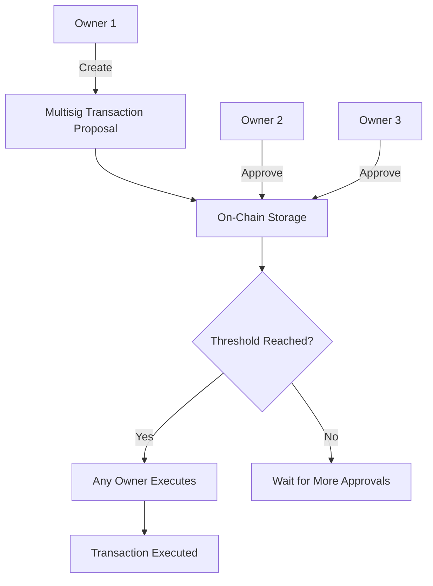
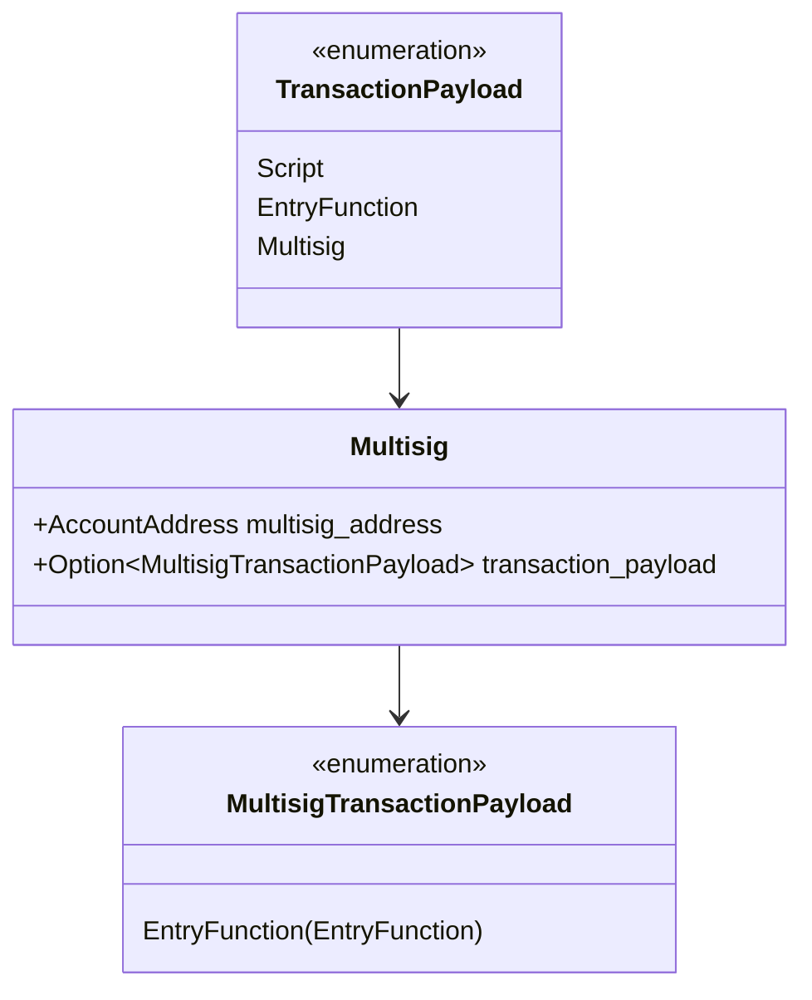
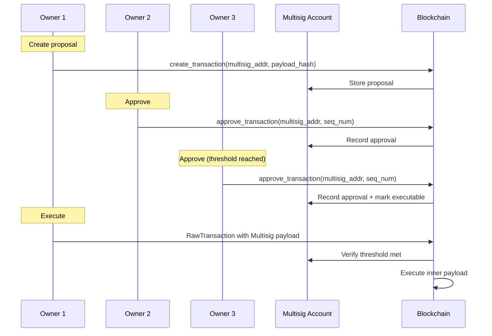
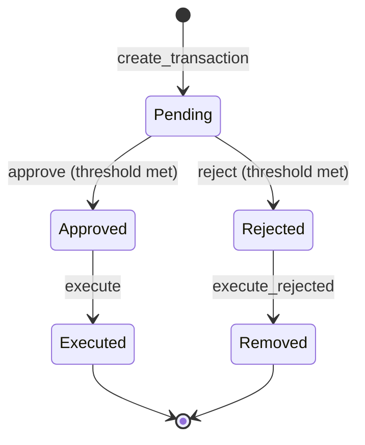

# On-Chain Multisig Transaction Specification

> **Version:** 1.0.0  
> **Status:** Stable  
> **Last Updated:** January 28, 2026

## Overview

On-chain multisig in Aptos allows a multisig account (controlled by multiple owners) to execute transactions once a threshold of approvals is reached. Unlike multi-agent transactions (multiple signers in one transaction), on-chain multisig involves separate approval transactions that are aggregated on-chain.

## Key Differences

| Aspect | Multi-Agent | On-Chain Multisig |
|--------|-------------|-------------------|
| Signing | All sign same message atomically | Separate approval transactions |
| Coordination | Off-chain, synchronous | On-chain, asynchronous |
| Flexibility | Must coordinate timing | Owners approve at their convenience |
| Gas | Single transaction | Multiple transactions |

## Architecture



## Multisig Payload Structure

### TransactionPayload::Multisig



### BCS Layout

```
┌─────────────────────────────────────────────────────────────────┐
│                  TransactionPayload::Multisig                    │
├─────────────────────────────────────────────────────────────────┤
│ Offset │ Size     │ Field                                       │
├────────┼──────────┼─────────────────────────────────────────────┤
│ 0      │ 1        │ payload_variant (3 = Multisig)              │
│ 1      │ 32       │ multisig_address                            │
│ 33     │ 1        │ Option discriminator (0 = None, 1 = Some)   │
│ 34     │ Variable │ MultisigTransactionPayload (if Some)        │
└─────────────────────────────────────────────────────────────────┘
```

## Two Execution Modes

### Mode 1: Payload in Transaction

The executing transaction includes the payload:

```
TransactionPayload::Multisig {
    multisig_address: <address>,
    transaction_payload: Some(EntryFunction { ... })
}
```

Used when the payload is known at execution time.

### Mode 2: Payload from On-Chain

The executing transaction references on-chain stored payload:

```
TransactionPayload::Multisig {
    multisig_address: <address>,
    transaction_payload: None
}
```

The payload is retrieved from the multisig account's pending transactions.

## Workflow



## Code Examples

### Rust

```rust
use aptos_types::{
    account_address::AccountAddress,
    transaction::{
        EntryFunction, Multisig, MultisigTransactionPayload,
        RawTransaction, TransactionPayload,
    },
};

/// Build a multisig execution transaction (Mode 1: payload included)
fn build_multisig_execution_with_payload(
    sender: AccountAddress,  // Any owner
    sequence_number: u64,
    multisig_address: AccountAddress,
    inner_payload: EntryFunction,
    max_gas_amount: u64,
    gas_unit_price: u64,
    expiration_timestamp_secs: u64,
    chain_id: ChainId,
) -> RawTransaction {
    let multisig_payload = Multisig {
        multisig_address,
        transaction_payload: Some(MultisigTransactionPayload::EntryFunction(inner_payload)),
    };
    
    RawTransaction::new(
        sender,
        sequence_number,
        TransactionPayload::Multisig(multisig_payload),
        max_gas_amount,
        gas_unit_price,
        expiration_timestamp_secs,
        chain_id,
    )
}

/// Build a multisig execution transaction (Mode 2: payload from chain)
fn build_multisig_execution_from_chain(
    sender: AccountAddress,
    sequence_number: u64,
    multisig_address: AccountAddress,
    max_gas_amount: u64,
    gas_unit_price: u64,
    expiration_timestamp_secs: u64,
    chain_id: ChainId,
) -> RawTransaction {
    let multisig_payload = Multisig {
        multisig_address,
        transaction_payload: None,  // Payload retrieved from chain
    };
    
    RawTransaction::new(
        sender,
        sequence_number,
        TransactionPayload::Multisig(multisig_payload),
        max_gas_amount,
        gas_unit_price,
        expiration_timestamp_secs,
        chain_id,
    )
}
```

### Python

```python
import hashlib
from dataclasses import dataclass
from typing import Optional, List

@dataclass
class EntryFunctionPayload:
    """An entry function call."""
    module_address: bytes  # 32 bytes
    module_name: str
    function_name: str
    ty_args: List[bytes]
    args: List[bytes]

@dataclass  
class MultisigPayload:
    """Multisig transaction payload."""
    multisig_address: bytes  # 32 bytes
    transaction_payload: Optional[EntryFunctionPayload]


class MultisigBuilder:
    """Builder for on-chain multisig transactions."""
    
    def build_multisig_payload(
        self,
        multisig_address: bytes,
        inner_payload: Optional[EntryFunctionPayload] = None
    ) -> bytes:
        """
        Build BCS-serialized Multisig TransactionPayload.
        """
        result = bytearray()
        
        # TransactionPayload variant (Multisig = 3)
        result.append(0x03)
        
        # multisig_address (32 bytes)
        result.extend(multisig_address)
        
        # Option<MultisigTransactionPayload>
        if inner_payload is None:
            result.append(0x00)  # None
        else:
            result.append(0x01)  # Some
            # MultisigTransactionPayload::EntryFunction (variant 0)
            result.append(0x00)
            result.extend(self._serialize_entry_function(inner_payload))
        
        return bytes(result)
    
    def _serialize_entry_function(self, ef: EntryFunctionPayload) -> bytes:
        """Serialize EntryFunction."""
        result = bytearray()
        
        # ModuleId
        result.extend(ef.module_address)
        result.extend(self._encode_string(ef.module_name))
        
        # Function name
        result.extend(self._encode_string(ef.function_name))
        
        # Type arguments
        result.extend(self._uleb128_encode(len(ef.ty_args)))
        for ty_arg in ef.ty_args:
            result.extend(ty_arg)
        
        # Arguments
        result.extend(self._uleb128_encode(len(ef.args)))
        for arg in ef.args:
            result.extend(self._uleb128_encode(len(arg)))
            result.extend(arg)
        
        return bytes(result)
    
    def _encode_string(self, s: str) -> bytes:
        utf8 = s.encode('utf-8')
        return self._uleb128_encode(len(utf8)) + utf8
    
    def _uleb128_encode(self, value: int) -> bytes:
        result = []
        while value >= 0x80:
            result.append((value & 0x7F) | 0x80)
            value >>= 7
        result.append(value)
        return bytes(result)
    
    def build_raw_transaction(
        self,
        sender: bytes,
        sequence_number: int,
        multisig_payload: bytes,
        max_gas_amount: int,
        gas_unit_price: int,
        expiration_timestamp_secs: int,
        chain_id: int
    ) -> bytes:
        """Build complete RawTransaction with Multisig payload."""
        result = bytearray()
        
        # sender
        result.extend(sender)
        
        # sequence_number
        result.extend(sequence_number.to_bytes(8, 'little'))
        
        # payload (already includes variant)
        result.extend(multisig_payload)
        
        # gas parameters
        result.extend(max_gas_amount.to_bytes(8, 'little'))
        result.extend(gas_unit_price.to_bytes(8, 'little'))
        result.extend(expiration_timestamp_secs.to_bytes(8, 'little'))
        
        # chain_id
        result.append(chain_id)
        
        return bytes(result)


def example_multisig_workflow():
    """
    Example: Creating and executing a multisig transaction.
    
    This shows the transaction format only. The actual workflow involves:
    1. Calling 0x1::multisig_account::create_transaction
    2. Owners calling 0x1::multisig_account::approve_transaction
    3. Any owner submitting the execution transaction
    """
    
    builder = MultisigBuilder()
    
    # Multisig account address
    multisig_addr = bytes.fromhex(
        "0000000000000000000000000000000000000000000000000000000000000123"
    )
    
    # Inner payload: transfer coins from multisig account
    inner_payload = EntryFunctionPayload(
        module_address=bytes(32),  # 0x1
        module_name="aptos_account",
        function_name="transfer",
        ty_args=[],
        args=[
            bytes(32),  # recipient
            (1000).to_bytes(8, 'little'),  # amount
        ]
    )
    
    # Build multisig payload (Mode 1: include payload)
    payload_with_inner = builder.build_multisig_payload(
        multisig_addr,
        inner_payload
    )
    print(f"Payload with inner (Mode 1): {payload_with_inner.hex()}")
    
    # Build multisig payload (Mode 2: from chain)
    payload_from_chain = builder.build_multisig_payload(
        multisig_addr,
        None
    )
    print(f"Payload from chain (Mode 2): {payload_from_chain.hex()}")


if __name__ == "__main__":
    example_multisig_workflow()
```

### TypeScript

```typescript
interface EntryFunctionPayload {
  moduleAddress: Uint8Array;  // 32 bytes
  moduleName: string;
  functionName: string;
  tyArgs: Uint8Array[];
  args: Uint8Array[];
}

class MultisigBuilder {
  /**
   * Build BCS-serialized Multisig TransactionPayload.
   */
  buildMultisigPayload(
    multisigAddress: Uint8Array,
    innerPayload?: EntryFunctionPayload
  ): Uint8Array {
    const parts: Uint8Array[] = [];

    // TransactionPayload variant (Multisig = 3)
    parts.push(new Uint8Array([0x03]));

    // multisig_address (32 bytes)
    parts.push(multisigAddress);

    // Option<MultisigTransactionPayload>
    if (!innerPayload) {
      parts.push(new Uint8Array([0x00])); // None
    } else {
      parts.push(new Uint8Array([0x01])); // Some
      // MultisigTransactionPayload::EntryFunction (variant 0)
      parts.push(new Uint8Array([0x00]));
      parts.push(this.serializeEntryFunction(innerPayload));
    }

    return this.concat(parts);
  }

  private serializeEntryFunction(ef: EntryFunctionPayload): Uint8Array {
    const parts: Uint8Array[] = [];

    // ModuleId
    parts.push(ef.moduleAddress);
    parts.push(this.encodeString(ef.moduleName));

    // Function name
    parts.push(this.encodeString(ef.functionName));

    // Type arguments
    parts.push(this.uleb128Encode(ef.tyArgs.length));
    for (const tyArg of ef.tyArgs) {
      parts.push(tyArg);
    }

    // Arguments
    parts.push(this.uleb128Encode(ef.args.length));
    for (const arg of ef.args) {
      parts.push(this.uleb128Encode(arg.length));
      parts.push(arg);
    }

    return this.concat(parts);
  }

  private encodeString(s: string): Uint8Array {
    const encoder = new TextEncoder();
    const utf8 = encoder.encode(s);
    return this.concat([this.uleb128Encode(utf8.length), utf8]);
  }

  private uleb128Encode(value: number): Uint8Array {
    const result: number[] = [];
    while (value >= 0x80) {
      result.push((value & 0x7f) | 0x80);
      value >>>= 7;
    }
    result.push(value);
    return new Uint8Array(result);
  }

  private concat(arrays: Uint8Array[]): Uint8Array {
    const totalLength = arrays.reduce((sum, arr) => sum + arr.length, 0);
    const result = new Uint8Array(totalLength);
    let offset = 0;
    for (const arr of arrays) {
      result.set(arr, offset);
      offset += arr.length;
    }
    return result;
  }
}

// Example
const builder = new MultisigBuilder();
const multisigAddr = new Uint8Array(32);
multisigAddr[31] = 0x23; // Example address

// Mode 1: With inner payload
const payloadWithInner = builder.buildMultisigPayload(multisigAddr, {
  moduleAddress: new Uint8Array(32).fill(0, 0, 31).fill(1, 31),
  moduleName: 'aptos_account',
  functionName: 'transfer',
  tyArgs: [],
  args: [
    new Uint8Array(32), // recipient
    new Uint8Array([232, 3, 0, 0, 0, 0, 0, 0]), // 1000 as u64 LE
  ],
});

// Mode 2: From chain
const payloadFromChain = builder.buildMultisigPayload(multisigAddr);

export { MultisigBuilder, EntryFunctionPayload };
```

## On-Chain Multisig Module Functions

### Key Functions in `0x1::multisig_account`

| Function | Purpose |
|----------|---------|
| `create_with_owners` | Create multisig account with owners and threshold |
| `create_transaction` | Propose a new transaction |
| `approve_transaction` | Approve a pending transaction |
| `reject_transaction` | Reject a pending transaction |
| `execute_rejected_transaction` | Remove a rejected transaction |

### Transaction Lifecycle



## Validation Rules

1. **Sender Must Be Owner**: Transaction sender must be an owner of the multisig
2. **Threshold Check**: Approval threshold must be met for execution
3. **Sequence Order**: Multisig transactions execute in sequence order
4. **Payload Match**: If payload included, must match approved hash

## Security Considerations

1. **Owner Key Security**: Compromise of threshold owners compromises multisig
2. **Payload Verification**: Verify payload hash before approving
3. **Sequence Gaps**: Cannot skip sequence numbers
4. **Timeout Handling**: Implement approval timeouts in dApp logic

## Comparison with Multi-Agent

| Feature | Multi-Agent | On-Chain Multisig |
|---------|-------------|-------------------|
| Account Type | Multiple accounts | Single multisig account |
| Approval Model | Synchronous | Asynchronous |
| On-chain State | None | Approval tracking |
| Gas Cost | Single tx | Multiple txs |
| Use Case | Atomic swaps | DAO, treasury |

## Related Documents

- [Multi-Agent Transactions](01-multi-agent-transactions.md) - Synchronous multi-party
- [MultiKey Authenticator](../transaction-formats/04-multi-key-authenticator.md) - K-of-N signing
- [RawTransaction Format](../transaction-formats/01-raw-transaction.md) - Base format
