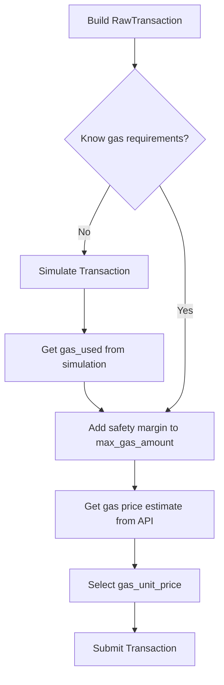
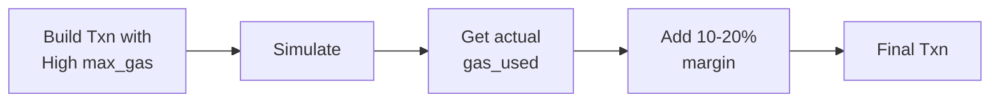

# Gas Estimation and Selection Specification

> **Version:** 1.0.0  
> **Status:** Stable  
> **Last Updated:** January 28, 2026

## Overview

This document specifies how to estimate gas requirements and select appropriate gas parameters for Aptos transactions. Proper gas configuration is crucial for transaction success and cost optimization.

## Gas Parameters

Every transaction requires two gas-related parameters:

| Parameter | Type | Description |
|-----------|------|-------------|
| `max_gas_amount` | u64 | Maximum gas units the transaction can consume |
| `gas_unit_price` | u64 | Price per gas unit in Octas (1 APT = 10^8 Octas) |

**Total maximum cost**: `max_gas_amount × gas_unit_price` Octas

## Gas Estimation Workflow



## API Endpoints

### 1. Gas Price Estimation

**Endpoint**: `GET /v1/estimate_gas_price`

Returns current network gas price recommendations.

**Response Structure**:

```json
{
  "deprioritized_gas_estimate": 100,
  "gas_estimate": 150,
  "prioritized_gas_estimate": 300
}
```

| Field | Description | When to Use |
|-------|-------------|-------------|
| `deprioritized_gas_estimate` | Lower price, may be slower | Cost-sensitive, non-urgent |
| `gas_estimate` | Current market price | Normal transactions |
| `prioritized_gas_estimate` | Higher price, faster inclusion | Time-sensitive transactions |

### 2. Transaction Simulation

**Endpoint**: `POST /v1/transactions/simulate`

Simulates transaction execution without committing to chain.

**Key Query Parameters**:

| Parameter | Type | Description |
|-----------|------|-------------|
| `estimate_gas_unit_price` | bool | If true, uses estimated gas price |
| `estimate_max_gas_amount` | bool | If true, estimates max gas needed |
| `estimate_prioritized_gas_unit_price` | bool | If true, uses prioritized gas price |

**Response**: Returns simulated `UserTransaction` with `gas_used` field.

## Code Examples

### Rust

```rust
use reqwest::Client;
use serde::{Deserialize, Serialize};

#[derive(Debug, Deserialize)]
struct GasEstimation {
    deprioritized_gas_estimate: Option<u64>,
    gas_estimate: u64,
    prioritized_gas_estimate: Option<u64>,
}

#[derive(Debug, Deserialize)]
struct SimulationResult {
    gas_used: String,  // Returned as string in JSON
    success: bool,
    vm_status: String,
}

/// Fetch current gas price estimates
async fn get_gas_price_estimate(
    client: &Client,
    node_url: &str,
) -> Result<GasEstimation, reqwest::Error> {
    let url = format!("{}/v1/estimate_gas_price", node_url);
    client.get(&url).send().await?.json().await
}

/// Simulate a transaction to get gas usage
async fn simulate_transaction(
    client: &Client,
    node_url: &str,
    signed_txn_json: &serde_json::Value,
) -> Result<Vec<SimulationResult>, reqwest::Error> {
    let url = format!(
        "{}/v1/transactions/simulate?estimate_gas_unit_price=true",
        node_url
    );
    client
        .post(&url)
        .json(signed_txn_json)
        .send()
        .await?
        .json()
        .await
}

/// Calculate recommended gas parameters
fn calculate_gas_params(
    simulated_gas_used: u64,
    gas_estimation: &GasEstimation,
    priority: GasPriority,
) -> (u64, u64) {
    // Add 20% safety margin to simulated gas
    let max_gas_amount = (simulated_gas_used as f64 * 1.2).ceil() as u64;
    
    // Select gas price based on priority
    let gas_unit_price = match priority {
        GasPriority::Low => gas_estimation.deprioritized_gas_estimate
            .unwrap_or(gas_estimation.gas_estimate),
        GasPriority::Normal => gas_estimation.gas_estimate,
        GasPriority::High => gas_estimation.prioritized_gas_estimate
            .unwrap_or(gas_estimation.gas_estimate),
    };
    
    (max_gas_amount, gas_unit_price)
}

enum GasPriority {
    Low,
    Normal,
    High,
}
```

### Python

```python
import requests
from typing import Optional, Tuple
from dataclasses import dataclass
from enum import Enum

class GasPriority(Enum):
    LOW = "low"
    NORMAL = "normal"
    HIGH = "high"

@dataclass
class GasEstimation:
    deprioritized_gas_estimate: Optional[int]
    gas_estimate: int
    prioritized_gas_estimate: Optional[int]

def get_gas_price_estimate(node_url: str) -> GasEstimation:
    """Fetch current gas price estimates from the node."""
    response = requests.get(f"{node_url}/v1/estimate_gas_price")
    response.raise_for_status()
    data = response.json()
    
    return GasEstimation(
        deprioritized_gas_estimate=data.get("deprioritized_gas_estimate"),
        gas_estimate=data["gas_estimate"],
        prioritized_gas_estimate=data.get("prioritized_gas_estimate"),
    )

def simulate_transaction(
    node_url: str,
    signed_txn: dict,
    estimate_gas_price: bool = True
) -> dict:
    """
    Simulate a transaction to get gas usage.
    
    Args:
        node_url: Aptos node URL
        signed_txn: Signed transaction in JSON format
        estimate_gas_price: Whether to use estimated gas price
    
    Returns:
        Simulation result with gas_used
    """
    params = {
        "estimate_gas_unit_price": str(estimate_gas_price).lower()
    }
    
    response = requests.post(
        f"{node_url}/v1/transactions/simulate",
        json=signed_txn,
        params=params
    )
    response.raise_for_status()
    
    results = response.json()
    return results[0] if results else {}

def calculate_gas_params(
    simulated_gas_used: int,
    gas_estimation: GasEstimation,
    priority: GasPriority = GasPriority.NORMAL,
    safety_margin: float = 1.2
) -> Tuple[int, int]:
    """
    Calculate recommended gas parameters.
    
    Args:
        simulated_gas_used: Gas used in simulation
        gas_estimation: Current gas price estimates
        priority: Transaction priority level
        safety_margin: Multiplier for max_gas_amount (default 20% buffer)
    
    Returns:
        Tuple of (max_gas_amount, gas_unit_price)
    """
    # Add safety margin to simulated gas
    max_gas_amount = int(simulated_gas_used * safety_margin)
    
    # Select gas price based on priority
    if priority == GasPriority.LOW:
        gas_unit_price = (
            gas_estimation.deprioritized_gas_estimate 
            or gas_estimation.gas_estimate
        )
    elif priority == GasPriority.HIGH:
        gas_unit_price = (
            gas_estimation.prioritized_gas_estimate 
            or gas_estimation.gas_estimate
        )
    else:
        gas_unit_price = gas_estimation.gas_estimate
    
    return max_gas_amount, gas_unit_price


# Complete example workflow
def estimate_and_build_transaction(
    node_url: str,
    sender: str,
    payload: dict,
    sequence_number: int,
    priority: GasPriority = GasPriority.NORMAL
) -> dict:
    """
    Estimate gas and build transaction with optimal parameters.
    """
    # Step 1: Get gas price estimate
    gas_estimation = get_gas_price_estimate(node_url)
    print(f"Gas prices - Low: {gas_estimation.deprioritized_gas_estimate}, "
          f"Market: {gas_estimation.gas_estimate}, "
          f"High: {gas_estimation.prioritized_gas_estimate}")
    
    # Step 2: Build preliminary transaction for simulation
    # Use high max_gas for simulation (will be refined)
    preliminary_txn = {
        "sender": sender,
        "sequence_number": str(sequence_number),
        "payload": payload,
        "max_gas_amount": "2000000",  # High value for simulation
        "gas_unit_price": str(gas_estimation.gas_estimate),
        "expiration_timestamp_secs": str(int(time.time()) + 600),
    }
    
    # Step 3: Simulate to get actual gas usage
    # Note: For simulation, you need to sign with a dummy/invalid signature
    # The API accepts unsigned transactions for simulation
    simulation_result = simulate_transaction(node_url, preliminary_txn)
    
    if not simulation_result.get("success"):
        raise Exception(f"Simulation failed: {simulation_result.get('vm_status')}")
    
    gas_used = int(simulation_result["gas_used"])
    print(f"Simulated gas used: {gas_used}")
    
    # Step 4: Calculate optimal parameters
    max_gas_amount, gas_unit_price = calculate_gas_params(
        gas_used, gas_estimation, priority
    )
    print(f"Selected: max_gas={max_gas_amount}, price={gas_unit_price}")
    
    # Step 5: Build final transaction
    return {
        "sender": sender,
        "sequence_number": str(sequence_number),
        "payload": payload,
        "max_gas_amount": str(max_gas_amount),
        "gas_unit_price": str(gas_unit_price),
        "expiration_timestamp_secs": str(int(time.time()) + 600),
    }
```

### TypeScript

```typescript
interface GasEstimation {
  deprioritized_gas_estimate?: number;
  gas_estimate: number;
  prioritized_gas_estimate?: number;
}

interface SimulationResult {
  gas_used: string;
  success: boolean;
  vm_status: string;
}

enum GasPriority {
  LOW = 'low',
  NORMAL = 'normal',
  HIGH = 'high',
}

/**
 * Fetch current gas price estimates from the node.
 */
async function getGasPriceEstimate(nodeUrl: string): Promise<GasEstimation> {
  const response = await fetch(`${nodeUrl}/v1/estimate_gas_price`);
  if (!response.ok) {
    throw new Error(`Failed to get gas estimate: ${response.statusText}`);
  }
  return response.json();
}

/**
 * Simulate a transaction to get gas usage.
 */
async function simulateTransaction(
  nodeUrl: string,
  signedTxn: object,
  estimateGasPrice: boolean = true
): Promise<SimulationResult[]> {
  const params = new URLSearchParams({
    estimate_gas_unit_price: String(estimateGasPrice),
  });
  
  const response = await fetch(
    `${nodeUrl}/v1/transactions/simulate?${params}`,
    {
      method: 'POST',
      headers: { 'Content-Type': 'application/json' },
      body: JSON.stringify(signedTxn),
    }
  );
  
  if (!response.ok) {
    throw new Error(`Simulation failed: ${response.statusText}`);
  }
  
  return response.json();
}

/**
 * Calculate recommended gas parameters.
 */
function calculateGasParams(
  simulatedGasUsed: number,
  gasEstimation: GasEstimation,
  priority: GasPriority = GasPriority.NORMAL,
  safetyMargin: number = 1.2
): { maxGasAmount: number; gasUnitPrice: number } {
  // Add safety margin
  const maxGasAmount = Math.ceil(simulatedGasUsed * safetyMargin);
  
  // Select gas price based on priority
  let gasUnitPrice: number;
  switch (priority) {
    case GasPriority.LOW:
      gasUnitPrice = gasEstimation.deprioritized_gas_estimate ?? gasEstimation.gas_estimate;
      break;
    case GasPriority.HIGH:
      gasUnitPrice = gasEstimation.prioritized_gas_estimate ?? gasEstimation.gas_estimate;
      break;
    default:
      gasUnitPrice = gasEstimation.gas_estimate;
  }
  
  return { maxGasAmount, gasUnitPrice };
}

/**
 * Complete gas estimation workflow.
 */
async function estimateGasForTransaction(
  nodeUrl: string,
  transaction: object,
  priority: GasPriority = GasPriority.NORMAL
): Promise<{ maxGasAmount: number; gasUnitPrice: number }> {
  // Get gas price estimate
  const gasEstimation = await getGasPriceEstimate(nodeUrl);
  console.log('Gas estimation:', gasEstimation);
  
  // Simulate transaction
  const results = await simulateTransaction(nodeUrl, transaction);
  const result = results[0];
  
  if (!result.success) {
    throw new Error(`Simulation failed: ${result.vm_status}`);
  }
  
  const gasUsed = parseInt(result.gas_used, 10);
  console.log('Simulated gas used:', gasUsed);
  
  // Calculate optimal parameters
  return calculateGasParams(gasUsed, gasEstimation, priority);
}
```

## Gas Estimation Best Practices

### 1. Always Simulate First



### 2. Safety Margins

| Transaction Type | Recommended Margin |
|-----------------|-------------------|
| Simple transfers | 10% |
| Contract calls | 20% |
| Complex operations | 30-50% |
| First-time operations | 50%+ |

### 3. Gas Price Selection

| Scenario | Recommended Price |
|----------|-------------------|
| Non-urgent, cost-sensitive | `deprioritized_gas_estimate` |
| Normal transactions | `gas_estimate` |
| Time-sensitive | `prioritized_gas_estimate` |
| Network congestion | 2-3x `gas_estimate` |

## Common Gas Limits

| Operation | Typical Gas Usage |
|-----------|-------------------|
| APT transfer | ~10-20 |
| Token transfer | ~500-1,000 |
| NFT mint | ~1,000-5,000 |
| Contract deployment | ~10,000-100,000 |
| Complex DeFi operation | ~5,000-50,000 |

**Note**: These are approximate values. Always simulate for accurate estimates.

## Error Handling

### Insufficient Max Gas

```
Error: MAX_GAS_UNITS_BELOW_MIN_TRANSACTION_GAS_UNITS
```

**Solution**: Increase `max_gas_amount` (minimum is typically 600).

### Gas Price Too Low

```
Error: GAS_UNIT_PRICE_BELOW_MIN_BOUND
```

**Solution**: Increase `gas_unit_price` to at least the minimum (typically 100 Octas).

### Out of Gas

```
Error: OUT_OF_GAS
```

**Solution**: Increase `max_gas_amount` based on simulation results.

### Insufficient Balance

```
Error: INSUFFICIENT_BALANCE_FOR_TRANSACTION_FEE
```

**Solution**: Ensure account has enough APT: `balance >= max_gas_amount × gas_unit_price`.

## Network Considerations

### Mainnet vs Testnet

| Network | Chain ID | Typical Min Gas Price |
|---------|----------|----------------------|
| Mainnet | 1 | 100 Octas |
| Testnet | 2 | 100 Octas |
| Devnet | Variable | 100 Octas |

### During Network Congestion

1. Use `prioritized_gas_estimate` or higher
2. Consider retrying with exponential backoff
3. Monitor mempool status via node metrics

## Related Documents

- [RawTransaction Format](../transaction-formats/01-raw-transaction.md) - Transaction structure
- [Transaction Lifecycle](07-transaction-lifecycle.md) - Submission and confirmation
- [Fee Payer Transactions](02-fee-payer-transactions.md) - Sponsored gas
