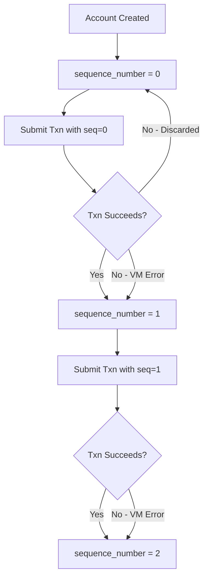
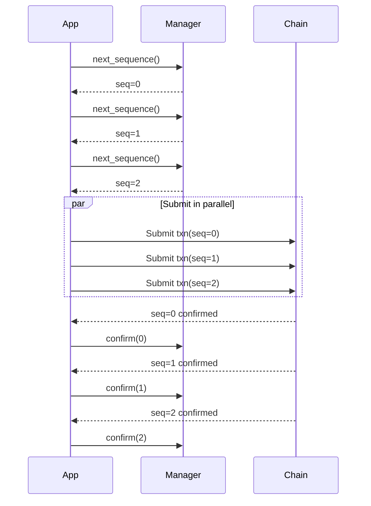

# Sequence Number Specification

> **Version:** 1.0.0  
> **Status:** Stable  
> **Last Updated:** January 28, 2026

## Overview

Sequence numbers are the primary replay protection mechanism in Aptos. Each account maintains a sequence number that must be included in transactions and increments with each successful transaction.

## How Sequence Numbers Work



## Key Properties

| Property | Description |
|----------|-------------|
| Type | `u64` (8 bytes, little-endian in BCS) |
| Initial Value | `0` for new accounts |
| Increment | +1 after each committed transaction |
| Uniqueness | Each sequence number can only be used once per account |

## Sequence Number Rules

### 1. Exact Match Required

The transaction's sequence number must **exactly match** the account's current on-chain sequence number.

```
txn.sequence_number == account.sequence_number  ✓ Valid
txn.sequence_number != account.sequence_number  ✗ Invalid
```

### 2. Increment on Commit

The sequence number increments when a transaction is **committed**, regardless of execution success:

| Outcome | Sequence Increments? |
|---------|---------------------|
| Transaction succeeds | Yes |
| Transaction fails (VM error) | Yes |
| Transaction rejected (mempool) | No |
| Transaction expired | No |

### 3. No Gaps Allowed

Transactions must be submitted in strict sequence order. You cannot skip sequence numbers.

```
seq=0 → seq=1 → seq=2  ✓ Valid
seq=0 → seq=2          ✗ Invalid (gap)
```

## Code Examples

### Rust

```rust
use reqwest::Client;
use serde::Deserialize;

#[derive(Debug, Deserialize)]
struct AccountResource {
    sequence_number: String,
    // ... other fields
}

/// Get the current sequence number for an account
async fn get_sequence_number(
    client: &Client,
    node_url: &str,
    address: &str,
) -> Result<u64, Box<dyn std::error::Error>> {
    let url = format!(
        "{}/v1/accounts/{}/resource/0x1::account::Account",
        node_url, address
    );
    
    let response: serde_json::Value = client
        .get(&url)
        .send()
        .await?
        .json()
        .await?;
    
    let seq_str = response["data"]["sequence_number"]
        .as_str()
        .ok_or("sequence_number not found")?;
    
    Ok(seq_str.parse()?)
}

/// Simple sequence number manager
struct SequenceManager {
    address: String,
    current_sequence: u64,
    pending_count: u64,
}

impl SequenceManager {
    pub async fn new(
        client: &Client,
        node_url: &str,
        address: String,
    ) -> Result<Self, Box<dyn std::error::Error>> {
        let current_sequence = get_sequence_number(client, node_url, &address).await?;
        
        Ok(Self {
            address,
            current_sequence,
            pending_count: 0,
        })
    }
    
    /// Get next sequence number for a new transaction
    pub fn next_sequence(&mut self) -> u64 {
        let seq = self.current_sequence + self.pending_count;
        self.pending_count += 1;
        seq
    }
    
    /// Confirm a transaction was committed
    pub fn confirm(&mut self) {
        if self.pending_count > 0 {
            self.current_sequence += 1;
            self.pending_count -= 1;
        }
    }
    
    /// Reset pending count (e.g., after transaction failure)
    pub fn reset_pending(&mut self) {
        self.pending_count = 0;
    }
    
    /// Refresh from chain
    pub async fn refresh(
        &mut self,
        client: &Client,
        node_url: &str,
    ) -> Result<(), Box<dyn std::error::Error>> {
        self.current_sequence = get_sequence_number(client, node_url, &self.address).await?;
        self.pending_count = 0;
        Ok(())
    }
}
```

### Python

```python
import requests
from threading import Lock
from typing import Optional

def get_sequence_number(node_url: str, address: str) -> int:
    """Fetch current sequence number from chain."""
    url = f"{node_url}/v1/accounts/{address}/resource/0x1::account::Account"
    response = requests.get(url)
    response.raise_for_status()
    
    data = response.json()
    return int(data["data"]["sequence_number"])


class SequenceManager:
    """
    Thread-safe sequence number manager for transaction submission.
    
    Handles concurrent transaction building while maintaining
    correct sequence ordering.
    """
    
    def __init__(self, node_url: str, address: str):
        self.node_url = node_url
        self.address = address
        self._lock = Lock()
        self._current_sequence: Optional[int] = None
        self._pending_sequences: set = set()
    
    def _fetch_sequence(self) -> int:
        """Fetch current sequence from chain."""
        return get_sequence_number(self.node_url, self.address)
    
    def initialize(self):
        """Initialize sequence number from chain."""
        with self._lock:
            self._current_sequence = self._fetch_sequence()
            self._pending_sequences.clear()
    
    def next_sequence(self) -> int:
        """
        Get the next sequence number for a new transaction.
        
        Thread-safe: multiple callers get unique sequence numbers.
        """
        with self._lock:
            if self._current_sequence is None:
                self._current_sequence = self._fetch_sequence()
            
            # Find next available sequence
            next_seq = self._current_sequence
            while next_seq in self._pending_sequences:
                next_seq += 1
            
            self._pending_sequences.add(next_seq)
            return next_seq
    
    def confirm(self, sequence: int):
        """
        Confirm a transaction with given sequence was committed.
        
        Call this after transaction confirmation.
        """
        with self._lock:
            self._pending_sequences.discard(sequence)
            
            # Update current sequence if this was the next expected
            if sequence == self._current_sequence:
                self._current_sequence += 1
                # Also advance past any consecutively confirmed sequences
                while self._current_sequence not in self._pending_sequences:
                    # Check if we've confirmed this one too
                    self._current_sequence += 1
                    # But stop if we've gone past all pending
                    if self._current_sequence > max(self._pending_sequences, default=self._current_sequence - 1):
                        break
    
    def cancel(self, sequence: int):
        """
        Cancel a pending transaction (e.g., it expired or was rejected).
        
        The sequence number becomes available again only if it's
        still the current sequence.
        """
        with self._lock:
            self._pending_sequences.discard(sequence)
    
    def refresh(self):
        """
        Refresh sequence number from chain.
        
        Use this to recover from unknown states.
        """
        with self._lock:
            self._current_sequence = self._fetch_sequence()
            # Keep pending sequences that are >= current
            self._pending_sequences = {
                seq for seq in self._pending_sequences 
                if seq >= self._current_sequence
            }


# Example usage
def example_transaction_flow():
    node_url = "https://fullnode.testnet.aptoslabs.com"
    address = "0x1234..."
    
    manager = SequenceManager(node_url, address)
    manager.initialize()
    
    # Build transaction
    seq = manager.next_sequence()
    print(f"Using sequence number: {seq}")
    
    # Build and submit transaction with seq...
    # txn = build_transaction(..., sequence_number=seq, ...)
    # result = submit_transaction(txn)
    
    # After confirmation
    # if result.success:
    #     manager.confirm(seq)
    # else:
    #     manager.cancel(seq)
```

### TypeScript

```typescript
interface AccountResource {
  sequence_number: string;
}

/**
 * Fetch current sequence number from chain.
 */
async function getSequenceNumber(nodeUrl: string, address: string): Promise<bigint> {
  const response = await fetch(
    `${nodeUrl}/v1/accounts/${address}/resource/0x1::account::Account`
  );
  
  if (!response.ok) {
    throw new Error(`Failed to get account: ${response.statusText}`);
  }
  
  const data = await response.json();
  return BigInt(data.data.sequence_number);
}

/**
 * Sequence number manager for transaction submission.
 */
class SequenceManager {
  private currentSequence: bigint | null = null;
  private pendingSequences: Set<bigint> = new Set();

  constructor(
    private nodeUrl: string,
    private address: string
  ) {}

  /**
   * Initialize sequence number from chain.
   */
  async initialize(): Promise<void> {
    this.currentSequence = await getSequenceNumber(this.nodeUrl, this.address);
    this.pendingSequences.clear();
  }

  /**
   * Get the next sequence number for a new transaction.
   */
  async nextSequence(): Promise<bigint> {
    if (this.currentSequence === null) {
      await this.initialize();
    }

    let nextSeq = this.currentSequence!;
    while (this.pendingSequences.has(nextSeq)) {
      nextSeq++;
    }

    this.pendingSequences.add(nextSeq);
    return nextSeq;
  }

  /**
   * Confirm a transaction was committed.
   */
  confirm(sequence: bigint): void {
    this.pendingSequences.delete(sequence);

    if (this.currentSequence !== null && sequence === this.currentSequence) {
      this.currentSequence++;
    }
  }

  /**
   * Cancel a pending transaction.
   */
  cancel(sequence: bigint): void {
    this.pendingSequences.delete(sequence);
  }

  /**
   * Refresh sequence number from chain.
   */
  async refresh(): Promise<void> {
    this.currentSequence = await getSequenceNumber(this.nodeUrl, this.address);
    
    // Keep only pending sequences >= current
    const current = this.currentSequence;
    this.pendingSequences = new Set(
      [...this.pendingSequences].filter(seq => seq >= current)
    );
  }
}

// Example usage
async function exampleFlow() {
  const nodeUrl = 'https://fullnode.testnet.aptoslabs.com';
  const address = '0x1234...';

  const manager = new SequenceManager(nodeUrl, address);
  await manager.initialize();

  // Get sequence for transaction
  const seq = await manager.nextSequence();
  console.log(`Using sequence number: ${seq}`);

  // Build and submit transaction...
  // After confirmation:
  // manager.confirm(seq);
  // Or on failure:
  // manager.cancel(seq);
}
```

## Handling Concurrent Transactions

### Sequential Submission

For simple cases, submit transactions one at a time:

```
Submit seq=0 → Wait for confirmation → Submit seq=1 → ...
```

### Parallel Submission

For higher throughput, pre-allocate sequence numbers:



**Important**: Transactions must still be **committed** in order. The blockchain enforces this.

## Error Handling

### SEQUENCE_NUMBER_TOO_OLD

```
Error: SEQUENCE_NUMBER_TOO_OLD
```

**Cause**: Transaction sequence < account's current sequence.  
**Solution**: Refresh sequence number from chain.

### SEQUENCE_NUMBER_TOO_NEW

```
Error: SEQUENCE_NUMBER_TOO_NEW
```

**Cause**: Transaction sequence > account's current sequence + mempool limit.  
**Solution**: Wait for pending transactions to commit, or reduce parallelism.

### Recovery Strategy

```python
def submit_with_retry(txn_builder, max_retries=3):
    for attempt in range(max_retries):
        try:
            seq = manager.next_sequence()
            txn = txn_builder(sequence_number=seq)
            result = submit(txn)
            manager.confirm(seq)
            return result
        except SequenceNumberError:
            manager.refresh()  # Sync with chain
            continue
    raise Exception("Max retries exceeded")
```

## Best Practices

1. **Cache Sequence Numbers**: Avoid fetching from chain for every transaction
2. **Handle Failures Gracefully**: Refresh from chain on sequence errors
3. **Limit Parallelism**: Don't exceed mempool's sequence gap limit
4. **Use Expiration**: Set reasonable expiration to avoid stuck sequences
5. **Monitor Confirmations**: Track which sequences have been committed

## Comparison with Orderless Transactions

| Aspect | Sequence Numbers | Orderless (Nonce) |
|--------|------------------|-------------------|
| Ordering | Strict sequential | Any order |
| Replay protection | Sequence increment | Unique nonce |
| Parallelism | Limited by gaps | Unlimited |
| Complexity | Simple | More complex |
| Feature flag | Always available | Requires enablement |

See [Orderless Transactions](06-orderless-transactions.md) for the alternative approach.

## Related Documents

- [RawTransaction Format](../transaction-formats/01-raw-transaction.md) - Transaction structure
- [Orderless Transactions](06-orderless-transactions.md) - Alternative replay protection
- [Transaction Lifecycle](07-transaction-lifecycle.md) - Confirmation handling
