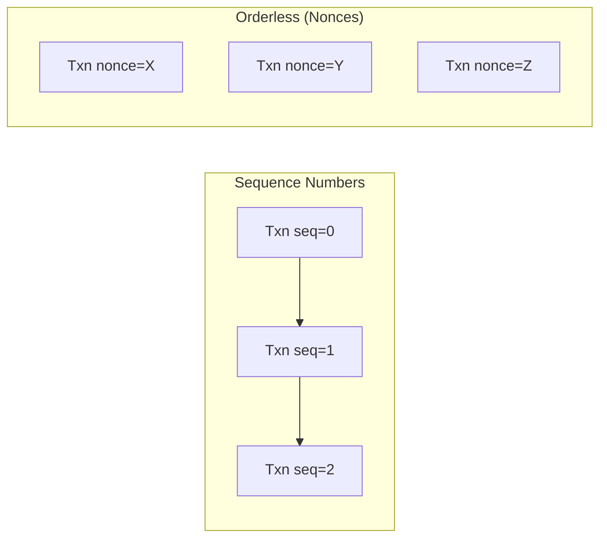
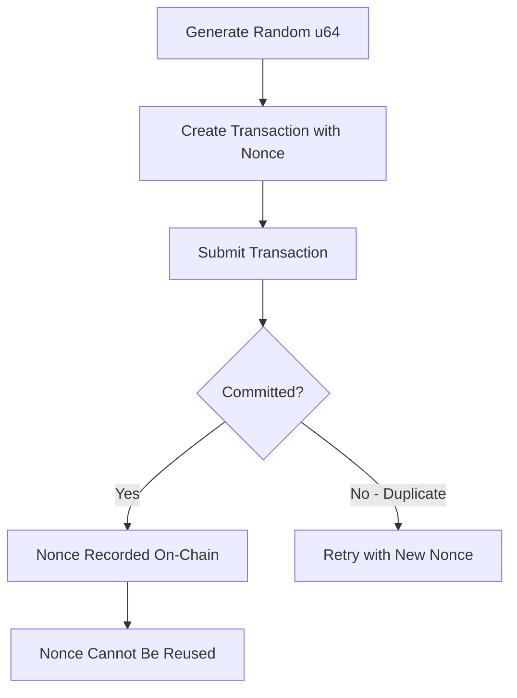

# Orderless Transactions Specification

> **Version:** 1.0.0  
> **Status:** Experimental  
> **Last Updated:** January 28, 2026

## Overview

Orderless transactions provide an alternative replay protection mechanism using random nonces instead of sequential sequence numbers. This enables true parallel transaction submission without ordering constraints.

**Note**: This feature requires the `ORDERLESS_TRANSACTIONS` feature flag to be enabled on the network.

## Comparison: Sequence Numbers vs Orderless



| Aspect | Sequence Numbers | Orderless Nonces |
|--------|------------------|------------------|
| Ordering | Must be sequential | Any order |
| Parallelism | Limited by gaps | Unlimited |
| Replay Protection | Incrementing counter | Unique random nonce |
| State Required | Track current sequence | Track used nonces |
| Mempool Behavior | Orders by sequence | No ordering constraint |

## Transaction Format

### ReplayProtector Enum

Orderless transactions use a different replay protection mechanism:

```rust
pub enum ReplayProtector {
    Nonce(u64),           // Orderless: random nonce
    SequenceNumber(u64),  // Traditional: sequential
}
```

### TransactionExtraConfig

The nonce is stored in the transaction's extra configuration:

```rust
pub enum TransactionExtraConfig {
    V1 {
        multisig_address: Option<AccountAddress>,
        // None for regular transactions
        // Some(nonce) for orderless transactions
        replay_protection_nonce: Option<u64>,
    },
}
```

### BCS Layout

For orderless transactions using the V2 payload format:

```
┌─────────────────────────────────────────────────────────────────┐
│              TransactionPayload::Payload (V1 variant)            │
├─────────────────────────────────────────────────────────────────┤
│ Field                  │ Type                                   │
├────────────────────────┼────────────────────────────────────────┤
│ variant_index          │ ULEB128 (4 = Payload)                  │
│ inner_payload          │ ExecutablePayload                      │
│ extra_config           │ TransactionExtraConfig                 │
└─────────────────────────────────────────────────────────────────┘
```

```
┌─────────────────────────────────────────────────────────────────┐
│                  TransactionExtraConfig::V1                      │
├─────────────────────────────────────────────────────────────────┤
│ Field                     │ Type                                │
├───────────────────────────┼─────────────────────────────────────┤
│ variant_index             │ ULEB128 (0 = V1)                    │
│ multisig_address          │ Option<AccountAddress>              │
│ replay_protection_nonce   │ Option<u64>                         │
└─────────────────────────────────────────────────────────────────┘
```

## How Orderless Works

### Nonce Generation



### On-Chain State

The blockchain maintains a record of used nonces per account to prevent replay:

```
Account State:
  - sequence_number: u64          // For sequential txns
  - used_nonces: Set<u64>         // For orderless txns
```

## Code Examples

### Rust (Conceptual)

```rust
use rand::Rng;

/// Check if orderless transactions are enabled
fn is_orderless_enabled(features: &Features) -> bool {
    features.is_enabled(FeatureFlag::ORDERLESS_TRANSACTIONS)
        && features.is_enabled(FeatureFlag::TRANSACTION_PAYLOAD_V2)
}

/// Generate a random nonce for orderless transaction
fn generate_nonce() -> u64 {
    rand::thread_rng().gen()
}

/// Build an orderless transaction
fn build_orderless_transaction(
    sender: AccountAddress,
    sequence_number: u64,  // Still required but not used for ordering
    payload: ExecutablePayload,
    max_gas_amount: u64,
    gas_unit_price: u64,
    expiration_timestamp_secs: u64,
    chain_id: ChainId,
) -> RawTransaction {
    let nonce = generate_nonce();
    
    // Create V2 payload with orderless nonce
    let extra_config = TransactionExtraConfig::V1 {
        multisig_address: None,
        replay_protection_nonce: Some(nonce),
    };
    
    let txn_payload = TransactionPayload::Payload(PayloadV1 {
        inner: payload,
        extra_config,
    });
    
    RawTransaction::new(
        sender,
        sequence_number,
        txn_payload,
        max_gas_amount,
        gas_unit_price,
        expiration_timestamp_secs,
        chain_id,
    )
}

/// Check if a transaction is orderless
fn is_orderless(txn: &RawTransaction) -> bool {
    txn.replay_protection_nonce().is_some()
}
```

### Python (Conceptual)

```python
import secrets
from dataclasses import dataclass
from typing import Optional

def generate_nonce() -> int:
    """Generate a cryptographically secure random nonce."""
    return secrets.randbelow(2**64)

@dataclass
class TransactionExtraConfigV1:
    """Extra configuration for V2 payload format."""
    multisig_address: Optional[bytes]  # 32 bytes or None
    replay_protection_nonce: Optional[int]  # u64 or None

class OrderlessTransactionBuilder:
    """Builder for orderless transactions."""
    
    def __init__(self, node_url: str, sender: str):
        self.node_url = node_url
        self.sender = sender
    
    def build_orderless_transaction(
        self,
        payload: dict,
        max_gas_amount: int,
        gas_unit_price: int,
        expiration_timestamp_secs: int,
        chain_id: int
    ) -> dict:
        """
        Build an orderless transaction with random nonce.
        
        Note: Requires ORDERLESS_TRANSACTIONS feature to be enabled.
        """
        nonce = generate_nonce()
        
        # The sequence_number field is still required but
        # not used for replay protection in orderless mode
        sequence_number = 0  # Can be any value
        
        return {
            "sender": self.sender,
            "sequence_number": str(sequence_number),
            "payload": {
                "type": "payload_v1",
                "inner": payload,
                "extra_config": {
                    "type": "v1",
                    "multisig_address": None,
                    "replay_protection_nonce": str(nonce),
                }
            },
            "max_gas_amount": str(max_gas_amount),
            "gas_unit_price": str(gas_unit_price),
            "expiration_timestamp_secs": str(expiration_timestamp_secs),
            "chain_id": chain_id,
        }
    
    def serialize_extra_config(self, config: TransactionExtraConfigV1) -> bytes:
        """BCS serialize TransactionExtraConfig::V1."""
        result = bytearray()
        
        # Variant index (V1 = 0)
        result.append(0x00)
        
        # Option<AccountAddress> multisig_address
        if config.multisig_address is None:
            result.append(0x00)  # None
        else:
            result.append(0x01)  # Some
            result.extend(config.multisig_address)
        
        # Option<u64> replay_protection_nonce
        if config.replay_protection_nonce is None:
            result.append(0x00)  # None
        else:
            result.append(0x01)  # Some
            result.extend(config.replay_protection_nonce.to_bytes(8, 'little'))
        
        return bytes(result)


# Example: Parallel submission with orderless transactions
async def submit_parallel_orderless(
    builder: OrderlessTransactionBuilder,
    payloads: list,
    gas_params: tuple
) -> list:
    """
    Submit multiple transactions in parallel using orderless mode.
    
    Each transaction gets a unique nonce, allowing true parallelism.
    """
    import asyncio
    
    max_gas, gas_price = gas_params
    expiration = int(time.time()) + 600
    
    async def submit_one(payload):
        txn = builder.build_orderless_transaction(
            payload=payload,
            max_gas_amount=max_gas,
            gas_unit_price=gas_price,
            expiration_timestamp_secs=expiration,
            chain_id=2  # testnet
        )
        # Sign and submit...
        return await submit_transaction(txn)
    
    # All transactions can be submitted simultaneously
    results = await asyncio.gather(*[
        submit_one(payload) for payload in payloads
    ])
    
    return results
```

### TypeScript (Conceptual)

```typescript
/**
 * Generate a cryptographically secure random nonce.
 */
function generateNonce(): bigint {
  const buffer = new Uint8Array(8);
  crypto.getRandomValues(buffer);
  return new DataView(buffer.buffer).getBigUint64(0, true);
}

interface TransactionExtraConfigV1 {
  type: 'v1';
  multisig_address: string | null;
  replay_protection_nonce: string | null;
}

interface OrderlessTransaction {
  sender: string;
  sequence_number: string;
  payload: {
    type: 'payload_v1';
    inner: object;
    extra_config: TransactionExtraConfigV1;
  };
  max_gas_amount: string;
  gas_unit_price: string;
  expiration_timestamp_secs: string;
  chain_id: number;
}

/**
 * Build an orderless transaction with random nonce.
 */
function buildOrderlessTransaction(
  sender: string,
  payload: object,
  maxGasAmount: bigint,
  gasUnitPrice: bigint,
  expirationTimestampSecs: bigint,
  chainId: number
): OrderlessTransaction {
  const nonce = generateNonce();

  return {
    sender,
    sequence_number: '0', // Not used for replay protection
    payload: {
      type: 'payload_v1',
      inner: payload,
      extra_config: {
        type: 'v1',
        multisig_address: null,
        replay_protection_nonce: nonce.toString(),
      },
    },
    max_gas_amount: maxGasAmount.toString(),
    gas_unit_price: gasUnitPrice.toString(),
    expiration_timestamp_secs: expirationTimestampSecs.toString(),
    chain_id: chainId,
  };
}

/**
 * Submit multiple transactions in parallel using orderless mode.
 */
async function submitParallelOrderless(
  sender: string,
  payloads: object[],
  gasParams: { maxGas: bigint; gasPrice: bigint },
  chainId: number
): Promise<string[]> {
  const expiration = BigInt(Math.floor(Date.now() / 1000) + 600);

  const transactions = payloads.map(payload =>
    buildOrderlessTransaction(
      sender,
      payload,
      gasParams.maxGas,
      gasParams.gasPrice,
      expiration,
      chainId
    )
  );

  // All can be submitted simultaneously - no ordering constraint
  const results = await Promise.all(
    transactions.map(txn => submitTransaction(txn))
  );

  return results;
}
```

## Feature Detection

Before using orderless transactions, check if the feature is enabled:

```python
def is_orderless_enabled(node_url: str) -> bool:
    """Check if orderless transactions are enabled on the network."""
    # Query the on-chain feature flags
    response = requests.get(
        f"{node_url}/v1/accounts/0x1/resource/0x1::features::Features"
    )
    
    if not response.ok:
        return False
    
    features = response.json()
    # Check for ORDERLESS_TRANSACTIONS flag
    # (Flag index may vary - check current definition)
    return check_feature_enabled(features, "ORDERLESS_TRANSACTIONS")
```

## When to Use Orderless Transactions

### Good Use Cases

| Scenario | Why Orderless Helps |
|----------|---------------------|
| High-frequency trading | No sequence coordination needed |
| Batch operations | Submit many txns simultaneously |
| Distributed systems | No central sequence tracker required |
| Retry-heavy workloads | Simpler retry logic |

### When to Avoid

| Scenario | Why Sequential Better |
|----------|----------------------|
| Dependent operations | Need guaranteed order |
| Simple applications | Sequence numbers are simpler |
| Feature not enabled | Won't work without flag |

## Error Handling

### Duplicate Nonce

```
Error: NONCE_ALREADY_USED
```

**Cause**: The random nonce was already used (extremely rare).  
**Solution**: Generate a new nonce and retry.

### Feature Not Enabled

```
Error: FEATURE_NOT_ENABLED
```

**Cause**: Network doesn't have orderless transactions enabled.  
**Solution**: Use sequence numbers instead.

## Security Considerations

1. **Nonce Quality**: Use cryptographically secure random number generator
2. **Collision Probability**: With 64-bit nonces, collision is extremely unlikely
3. **Replay Window**: Nonces are permanent; once used, they're recorded forever
4. **Storage Costs**: Each nonce uses on-chain storage

## Migration Strategy

To migrate from sequence numbers to orderless:

1. Check feature availability on target network
2. Update transaction building to use V2 payload format
3. Replace sequence number management with nonce generation
4. Update error handling for nonce-specific errors
5. Test thoroughly on testnet before mainnet

## Related Documents

- [Sequence Numbers](05-sequence-numbers.md) - Traditional replay protection
- [RawTransaction Format](../transaction-formats/01-raw-transaction.md) - Transaction structure
- [Transaction Lifecycle](07-transaction-lifecycle.md) - Submission and confirmation
