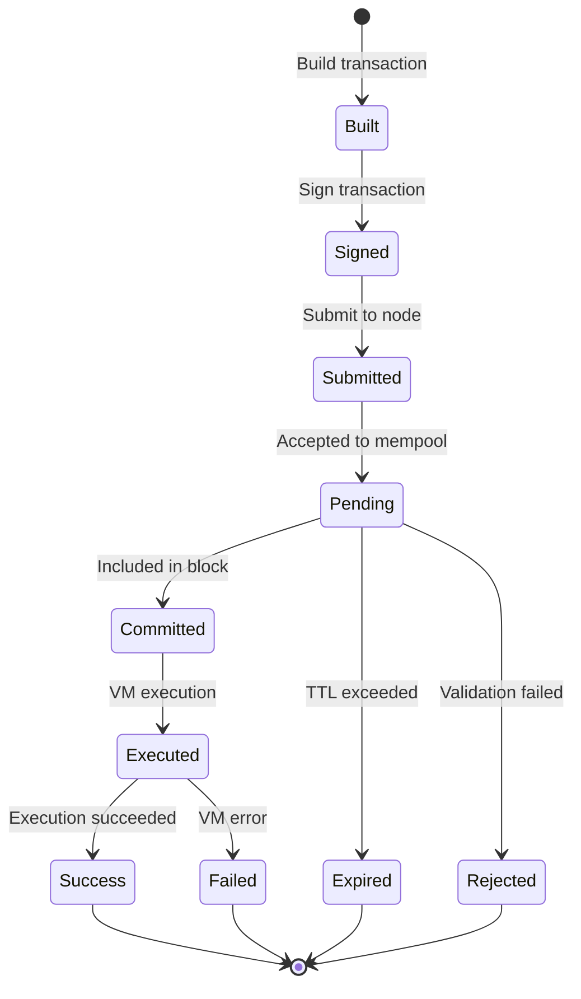
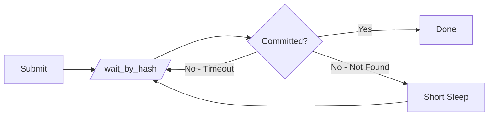

# Transaction Lifecycle Specification

> **Version:** 1.0.0  
> **Status:** Stable  
> **Last Updated:** January 28, 2026

## Overview

This document describes the complete lifecycle of an Aptos transaction from construction to final confirmation, including how to properly wait for and verify transaction completion.

## Transaction States



| State | Description |
|-------|-------------|
| Built | Transaction data constructed |
| Signed | Cryptographic signature added |
| Submitted | Sent to a fullnode |
| Pending | In mempool, awaiting block inclusion |
| Committed | Included in a committed block |
| Executed | VM executed the transaction |
| Success | Execution completed without error |
| Failed | VM returned an error |
| Expired | Transaction TTL exceeded before commit |
| Rejected | Mempool rejected (invalid signature, etc.) |

## API Endpoints for Transaction Status

### 1. Submit Transaction

**Endpoint**: `POST /v1/transactions`

Submits a signed transaction to the mempool.

**Response** (on success):
```json
{
  "hash": "0x...",
  "sender": "0x...",
  "sequence_number": "5",
  "...": "..."
}
```

### 2. Get Transaction by Hash

**Endpoint**: `GET /v1/transactions/by_hash/{txn_hash}`

Retrieves transaction status by hash.

**Response Types**:
- `PendingTransaction`: Still in mempool
- `UserTransaction`: Committed to chain (check `success` field)
- `404`: Transaction not found

### 3. Wait for Transaction (Long Poll)

**Endpoint**: `GET /v1/transactions/wait_by_hash/{txn_hash}`

Same as `by_hash` but waits for pending transactions to commit.

**Behavior**:
- If committed: Returns immediately
- If pending: Waits up to server timeout (typically ~1 second)
- If not found: Returns 404

## Code Examples

### Rust

```rust
use reqwest::Client;
use serde::{Deserialize, Serialize};
use std::time::{Duration, Instant};

#[derive(Debug, Deserialize)]
#[serde(tag = "type")]
enum TransactionResponse {
    #[serde(rename = "pending_transaction")]
    Pending(PendingTransaction),
    #[serde(rename = "user_transaction")]
    User(UserTransaction),
}

#[derive(Debug, Deserialize)]
struct PendingTransaction {
    hash: String,
    sender: String,
    sequence_number: String,
}

#[derive(Debug, Deserialize)]
struct UserTransaction {
    hash: String,
    success: bool,
    vm_status: String,
    version: String,
    gas_used: String,
}

#[derive(Debug)]
pub enum TransactionStatus {
    Pending,
    Success { version: u64, gas_used: u64 },
    Failed { vm_status: String, gas_used: u64 },
    NotFound,
    Expired,
}

/// Submit a signed transaction
async fn submit_transaction(
    client: &Client,
    node_url: &str,
    signed_txn: &SignedTransaction,
) -> Result<String, Box<dyn std::error::Error>> {
    let url = format!("{}/v1/transactions", node_url);
    
    let response = client
        .post(&url)
        .header("Content-Type", "application/json")
        .json(&signed_txn)
        .send()
        .await?;
    
    if !response.status().is_success() {
        let error: serde_json::Value = response.json().await?;
        return Err(format!("Submit failed: {:?}", error).into());
    }
    
    let result: serde_json::Value = response.json().await?;
    Ok(result["hash"].as_str().unwrap().to_string())
}

/// Get transaction status by hash
async fn get_transaction_status(
    client: &Client,
    node_url: &str,
    txn_hash: &str,
) -> Result<TransactionStatus, Box<dyn std::error::Error>> {
    let url = format!("{}/v1/transactions/by_hash/{}", node_url, txn_hash);
    
    let response = client.get(&url).send().await?;
    
    match response.status().as_u16() {
        404 => Ok(TransactionStatus::NotFound),
        200 => {
            let txn: TransactionResponse = response.json().await?;
            match txn {
                TransactionResponse::Pending(_) => Ok(TransactionStatus::Pending),
                TransactionResponse::User(user_txn) => {
                    if user_txn.success {
                        Ok(TransactionStatus::Success {
                            version: user_txn.version.parse()?,
                            gas_used: user_txn.gas_used.parse()?,
                        })
                    } else {
                        Ok(TransactionStatus::Failed {
                            vm_status: user_txn.vm_status,
                            gas_used: user_txn.gas_used.parse()?,
                        })
                    }
                }
            }
        }
        _ => Err(format!("Unexpected status: {}", response.status()).into()),
    }
}

/// Wait for transaction with long polling
async fn wait_for_transaction(
    client: &Client,
    node_url: &str,
    txn_hash: &str,
) -> Result<TransactionStatus, Box<dyn std::error::Error>> {
    let url = format!("{}/v1/transactions/wait_by_hash/{}", node_url, txn_hash);
    
    let response = client.get(&url).send().await?;
    
    // Same parsing as get_transaction_status
    match response.status().as_u16() {
        404 => Ok(TransactionStatus::NotFound),
        200 => {
            let txn: TransactionResponse = response.json().await?;
            // ... parse response
            Ok(TransactionStatus::Pending) // Simplified
        }
        _ => Err(format!("Unexpected status: {}", response.status()).into()),
    }
}

/// Complete wait loop with timeout
async fn wait_for_transaction_with_timeout(
    client: &Client,
    node_url: &str,
    txn_hash: &str,
    timeout: Duration,
) -> Result<TransactionStatus, Box<dyn std::error::Error>> {
    let start = Instant::now();
    
    while start.elapsed() < timeout {
        // Use long-poll endpoint
        let status = wait_for_transaction(client, node_url, txn_hash).await?;
        
        match status {
            TransactionStatus::Pending => {
                // Long poll timed out, retry
                continue;
            }
            TransactionStatus::NotFound => {
                // Transaction might not have propagated yet
                tokio::time::sleep(Duration::from_millis(500)).await;
                continue;
            }
            _ => return Ok(status),
        }
    }
    
    Ok(TransactionStatus::Expired)
}
```

### Python

```python
import requests
import time
from enum import Enum
from dataclasses import dataclass
from typing import Optional, Union

class TransactionState(Enum):
    PENDING = "pending"
    SUCCESS = "success"
    FAILED = "failed"
    NOT_FOUND = "not_found"
    EXPIRED = "expired"

@dataclass
class TransactionResult:
    state: TransactionState
    hash: str
    version: Optional[int] = None
    gas_used: Optional[int] = None
    vm_status: Optional[str] = None
    error_message: Optional[str] = None


def submit_transaction(
    node_url: str,
    signed_txn: dict
) -> str:
    """
    Submit a signed transaction to the network.
    
    Returns:
        Transaction hash
    
    Raises:
        Exception on submission failure
    """
    response = requests.post(
        f"{node_url}/v1/transactions",
        json=signed_txn,
        headers={"Content-Type": "application/json"}
    )
    
    if not response.ok:
        error = response.json()
        raise Exception(f"Submit failed: {error.get('message', response.text)}")
    
    result = response.json()
    return result["hash"]


def get_transaction_status(
    node_url: str,
    txn_hash: str
) -> TransactionResult:
    """
    Get the current status of a transaction.
    """
    response = requests.get(
        f"{node_url}/v1/transactions/by_hash/{txn_hash}"
    )
    
    if response.status_code == 404:
        return TransactionResult(
            state=TransactionState.NOT_FOUND,
            hash=txn_hash
        )
    
    if not response.ok:
        return TransactionResult(
            state=TransactionState.NOT_FOUND,
            hash=txn_hash,
            error_message=response.text
        )
    
    data = response.json()
    
    # Check if pending or committed
    if data.get("type") == "pending_transaction":
        return TransactionResult(
            state=TransactionState.PENDING,
            hash=txn_hash
        )
    
    # Committed transaction
    success = data.get("success", False)
    return TransactionResult(
        state=TransactionState.SUCCESS if success else TransactionState.FAILED,
        hash=txn_hash,
        version=int(data.get("version", 0)),
        gas_used=int(data.get("gas_used", 0)),
        vm_status=data.get("vm_status")
    )


def wait_for_transaction(
    node_url: str,
    txn_hash: str,
    timeout_secs: float = 60.0,
    poll_interval_secs: float = 1.0
) -> TransactionResult:
    """
    Wait for a transaction to be committed.
    
    Uses long-polling when available, with fallback to regular polling.
    
    Args:
        node_url: Aptos fullnode URL
        txn_hash: Transaction hash to wait for
        timeout_secs: Maximum time to wait
        poll_interval_secs: Interval between polls (fallback)
    
    Returns:
        TransactionResult with final state
    """
    start_time = time.time()
    
    while time.time() - start_time < timeout_secs:
        # Try long-poll endpoint first
        try:
            response = requests.get(
                f"{node_url}/v1/transactions/wait_by_hash/{txn_hash}",
                timeout=poll_interval_secs + 5  # Allow server timeout + buffer
            )
            
            if response.status_code == 404:
                # Transaction not found yet, short sleep and retry
                time.sleep(0.5)
                continue
            
            if response.ok:
                data = response.json()
                
                if data.get("type") == "pending_transaction":
                    # Long poll timed out, still pending
                    continue
                
                # Transaction committed
                success = data.get("success", False)
                return TransactionResult(
                    state=TransactionState.SUCCESS if success else TransactionState.FAILED,
                    hash=txn_hash,
                    version=int(data.get("version", 0)),
                    gas_used=int(data.get("gas_used", 0)),
                    vm_status=data.get("vm_status")
                )
                
        except requests.Timeout:
            # Long poll timed out, retry
            continue
        except requests.RequestException as e:
            # Network error, fallback to regular polling
            time.sleep(poll_interval_secs)
            continue
    
    return TransactionResult(
        state=TransactionState.EXPIRED,
        hash=txn_hash,
        error_message="Timeout waiting for transaction"
    )


def submit_and_wait(
    node_url: str,
    signed_txn: dict,
    timeout_secs: float = 60.0
) -> TransactionResult:
    """
    Submit a transaction and wait for it to complete.
    
    This is the recommended high-level function for most use cases.
    """
    # Submit
    try:
        txn_hash = submit_transaction(node_url, signed_txn)
        print(f"Submitted transaction: {txn_hash}")
    except Exception as e:
        return TransactionResult(
            state=TransactionState.FAILED,
            hash="",
            error_message=str(e)
        )
    
    # Wait
    result = wait_for_transaction(node_url, txn_hash, timeout_secs)
    
    if result.state == TransactionState.SUCCESS:
        print(f"Transaction succeeded at version {result.version}")
    elif result.state == TransactionState.FAILED:
        print(f"Transaction failed: {result.vm_status}")
    else:
        print(f"Transaction status: {result.state}")
    
    return result


# Example usage
if __name__ == "__main__":
    node_url = "https://fullnode.testnet.aptoslabs.com"
    
    # Example signed transaction (placeholder)
    signed_txn = {
        "sender": "0x...",
        "sequence_number": "0",
        # ... other fields
    }
    
    result = submit_and_wait(node_url, signed_txn, timeout_secs=30)
    
    if result.state == TransactionState.SUCCESS:
        print(f"Success! Version: {result.version}, Gas: {result.gas_used}")
    else:
        print(f"Failed: {result.state} - {result.error_message or result.vm_status}")
```

### TypeScript

```typescript
enum TransactionState {
  PENDING = 'pending',
  SUCCESS = 'success',
  FAILED = 'failed',
  NOT_FOUND = 'not_found',
  EXPIRED = 'expired',
}

interface TransactionResult {
  state: TransactionState;
  hash: string;
  version?: number;
  gasUsed?: number;
  vmStatus?: string;
  errorMessage?: string;
}

/**
 * Submit a signed transaction to the network.
 */
async function submitTransaction(
  nodeUrl: string,
  signedTxn: object
): Promise<string> {
  const response = await fetch(`${nodeUrl}/v1/transactions`, {
    method: 'POST',
    headers: { 'Content-Type': 'application/json' },
    body: JSON.stringify(signedTxn),
  });

  if (!response.ok) {
    const error = await response.json();
    throw new Error(`Submit failed: ${error.message || response.statusText}`);
  }

  const result = await response.json();
  return result.hash;
}

/**
 * Get the current status of a transaction.
 */
async function getTransactionStatus(
  nodeUrl: string,
  txnHash: string
): Promise<TransactionResult> {
  const response = await fetch(
    `${nodeUrl}/v1/transactions/by_hash/${txnHash}`
  );

  if (response.status === 404) {
    return { state: TransactionState.NOT_FOUND, hash: txnHash };
  }

  if (!response.ok) {
    return {
      state: TransactionState.NOT_FOUND,
      hash: txnHash,
      errorMessage: response.statusText,
    };
  }

  const data = await response.json();

  if (data.type === 'pending_transaction') {
    return { state: TransactionState.PENDING, hash: txnHash };
  }

  return {
    state: data.success ? TransactionState.SUCCESS : TransactionState.FAILED,
    hash: txnHash,
    version: parseInt(data.version, 10),
    gasUsed: parseInt(data.gas_used, 10),
    vmStatus: data.vm_status,
  };
}

/**
 * Wait for a transaction to be committed.
 */
async function waitForTransaction(
  nodeUrl: string,
  txnHash: string,
  timeoutMs: number = 60000,
  pollIntervalMs: number = 1000
): Promise<TransactionResult> {
  const startTime = Date.now();

  while (Date.now() - startTime < timeoutMs) {
    try {
      // Use long-poll endpoint
      const controller = new AbortController();
      const timeoutId = setTimeout(
        () => controller.abort(),
        pollIntervalMs + 5000
      );

      const response = await fetch(
        `${nodeUrl}/v1/transactions/wait_by_hash/${txnHash}`,
        { signal: controller.signal }
      );

      clearTimeout(timeoutId);

      if (response.status === 404) {
        await sleep(500);
        continue;
      }

      if (response.ok) {
        const data = await response.json();

        if (data.type === 'pending_transaction') {
          continue;
        }

        return {
          state: data.success
            ? TransactionState.SUCCESS
            : TransactionState.FAILED,
          hash: txnHash,
          version: parseInt(data.version, 10),
          gasUsed: parseInt(data.gas_used, 10),
          vmStatus: data.vm_status,
        };
      }
    } catch (error) {
      if ((error as Error).name === 'AbortError') {
        continue;
      }
      await sleep(pollIntervalMs);
    }
  }

  return {
    state: TransactionState.EXPIRED,
    hash: txnHash,
    errorMessage: 'Timeout waiting for transaction',
  };
}

/**
 * Submit a transaction and wait for it to complete.
 */
async function submitAndWait(
  nodeUrl: string,
  signedTxn: object,
  timeoutMs: number = 60000
): Promise<TransactionResult> {
  // Submit
  let txnHash: string;
  try {
    txnHash = await submitTransaction(nodeUrl, signedTxn);
    console.log(`Submitted transaction: ${txnHash}`);
  } catch (error) {
    return {
      state: TransactionState.FAILED,
      hash: '',
      errorMessage: (error as Error).message,
    };
  }

  // Wait
  const result = await waitForTransaction(nodeUrl, txnHash, timeoutMs);

  if (result.state === TransactionState.SUCCESS) {
    console.log(`Transaction succeeded at version ${result.version}`);
  } else if (result.state === TransactionState.FAILED) {
    console.log(`Transaction failed: ${result.vmStatus}`);
  }

  return result;
}

function sleep(ms: number): Promise<void> {
  return new Promise(resolve => setTimeout(resolve, ms));
}

export {
  TransactionState,
  TransactionResult,
  submitTransaction,
  getTransactionStatus,
  waitForTransaction,
  submitAndWait,
};
```

## Best Practices

### 1. Always Use Long Polling



Long polling reduces latency compared to repeated short polling.

### 2. Set Appropriate Timeouts

| Scenario | Recommended Timeout |
|----------|---------------------|
| Interactive UI | 30-60 seconds |
| Background job | 120-300 seconds |
| Batch processing | Per-transaction timeout + buffer |

### 3. Handle All States

```python
result = wait_for_transaction(node_url, hash)

match result.state:
    case TransactionState.SUCCESS:
        handle_success(result)
    case TransactionState.FAILED:
        handle_vm_error(result)
    case TransactionState.EXPIRED:
        handle_timeout(result)
    case TransactionState.NOT_FOUND:
        handle_not_found(result)
```

### 4. Implement Idempotency

For critical operations, track transaction hashes to avoid duplicate submissions:

```python
def submit_idempotent(txn_id: str, build_txn_func):
    # Check if we already submitted this
    existing_hash = db.get_txn_hash(txn_id)
    if existing_hash:
        return wait_for_transaction(node_url, existing_hash)
    
    # Build and submit new transaction
    txn = build_txn_func()
    hash = submit_transaction(node_url, txn)
    
    # Store for idempotency
    db.store_txn_hash(txn_id, hash)
    
    return wait_for_transaction(node_url, hash)
```

## Error Recovery

### Transaction Not Found

1. Wait briefly (propagation delay)
2. Retry the lookup
3. If still not found after expiration time, consider resubmitting

### Transaction Expired

1. Check if the transaction actually committed (by sequence number)
2. If not committed, rebuild with new expiration and resubmit

### VM Execution Failed

1. Parse the `vm_status` for error details
2. Fix the underlying issue (insufficient balance, etc.)
3. Resubmit with next sequence number

## Related Documents

- [Gas Estimation](04-gas-estimation.md) - Setting gas parameters
- [Sequence Numbers](05-sequence-numbers.md) - Replay protection
- [RawTransaction Format](../transaction-formats/01-raw-transaction.md) - Transaction structure
