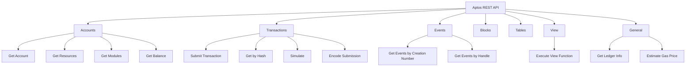

# Aptos REST API Overview

> **Version:** 1.0.0  
> **API Version:** 1.2.0  
> **Last Updated:** January 28, 2026

## Overview

The Aptos Node API is a RESTful API that allows client applications to interact with the Aptos blockchain. This document provides an overview of the API structure, authentication, common patterns, and error handling.

## Base URLs

### Public Networks

| Network | Base URL | Chain ID |
|---------|----------|----------|
| Mainnet | `https://fullnode.mainnet.aptoslabs.com/v1` | 1 |
| Testnet | `https://fullnode.testnet.aptoslabs.com/v1` | 2 |
| Devnet | `https://fullnode.devnet.aptoslabs.com/v1` | Variable |

### Local Development

| Environment | Base URL |
|-------------|----------|
| Local node | `http://localhost:8080/v1` |
| Docker | `http://localhost:8080/v1` |

## API Structure



## Content Types

### Request Content Types

| Content-Type | Usage |
|--------------|-------|
| `application/json` | JSON-encoded request bodies |
| `application/x-bcs` | BCS-encoded request bodies (transactions) |

### Response Content Types

| Accept Header | Response Format |
|---------------|-----------------|
| `application/json` | JSON response (default) |
| `application/x-bcs` | BCS-encoded response |

## Common Response Headers

Every successful response includes these headers:

| Header | Type | Description |
|--------|------|-------------|
| `X-APTOS-CHAIN-ID` | u8 | Chain ID of the network |
| `X-APTOS-LEDGER-VERSION` | u64 | Current ledger version |
| `X-APTOS-LEDGER-OLDEST-VERSION` | u64 | Oldest non-pruned version |
| `X-APTOS-LEDGER-TIMESTAMPUSEC` | u64 | Current ledger timestamp (microseconds) |
| `X-APTOS-EPOCH` | u64 | Current epoch number |
| `X-APTOS-BLOCK-HEIGHT` | u64 | Current block height |
| `X-APTOS-OLDEST-BLOCK-HEIGHT` | u64 | Oldest non-pruned block height |
| `X-APTOS-GAS-USED` | u64 | Gas used for view/simulate calls |
| `X-APTOS-CURSOR` | string | Pagination cursor (when applicable) |

## Common Query Parameters

### Ledger Version

Most read endpoints accept `ledger_version` to query historical state:

```
GET /v1/accounts/{address}?ledger_version=12345678
```

If omitted, the latest ledger version is used.

### Pagination

List endpoints support pagination:

| Parameter | Description |
|-----------|-------------|
| `start` | Starting position (cursor or version) |
| `limit` | Maximum number of items to return |

```
GET /v1/accounts/{address}/resources?start=0&limit=100
```

## HTTP Status Codes

| Code | Meaning | When Used |
|------|---------|-----------|
| 200 | OK | Successful request |
| 202 | Accepted | Transaction submitted to mempool |
| 400 | Bad Request | Invalid parameters or request body |
| 403 | Forbidden | API endpoint disabled |
| 404 | Not Found | Resource doesn't exist |
| 410 | Gone | Data has been pruned |
| 413 | Payload Too Large | Request body exceeds limit |
| 500 | Internal Server Error | Server-side error |
| 503 | Service Unavailable | Node is syncing or overloaded |

## Error Response Format

All errors follow this structure:

```json
{
  "message": "Human-readable error message",
  "error_code": "error_code_string",
  "vm_error_code": 123
}
```

### Common Error Codes

| Error Code | Description |
|------------|-------------|
| `account_not_found` | Account doesn't exist at specified version |
| `resource_not_found` | Resource doesn't exist on account |
| `module_not_found` | Module doesn't exist on account |
| `transaction_not_found` | Transaction hash not found |
| `version_not_found` | Specified version doesn't exist |
| `version_pruned` | Requested version has been pruned |
| `invalid_input` | Malformed request parameters |
| `invalid_transaction` | Transaction validation failed |
| `sequence_number_too_old` | Sequence number already used |
| `sequence_number_too_new` | Sequence number too far ahead |
| `vm_error` | Move VM execution error |
| `mempool_is_full` | Mempool cannot accept more transactions |

## Code Examples

### Rust

```rust
use reqwest::{Client, header};
use serde::Deserialize;

#[derive(Debug, Deserialize)]
struct LedgerInfo {
    chain_id: u8,
    epoch: String,
    ledger_version: String,
    oldest_ledger_version: String,
    ledger_timestamp: String,
    node_role: String,
    oldest_block_height: String,
    block_height: String,
    git_hash: Option<String>,
}

#[derive(Debug, Deserialize)]
struct AptosError {
    message: String,
    error_code: String,
    vm_error_code: Option<u64>,
}

/// Create a configured HTTP client
fn create_client() -> Client {
    Client::builder()
        .default_headers({
            let mut headers = header::HeaderMap::new();
            headers.insert(
                header::ACCEPT,
                header::HeaderValue::from_static("application/json"),
            );
            headers
        })
        .build()
        .expect("Failed to create client")
}

/// Get ledger info
async fn get_ledger_info(
    client: &Client,
    base_url: &str,
) -> Result<LedgerInfo, Box<dyn std::error::Error>> {
    let url = format!("{}", base_url);
    let response = client.get(&url).send().await?;
    
    // Check response headers
    if let Some(chain_id) = response.headers().get("X-APTOS-CHAIN-ID") {
        println!("Chain ID from header: {:?}", chain_id);
    }
    
    if response.status().is_success() {
        Ok(response.json().await?)
    } else {
        let error: AptosError = response.json().await?;
        Err(format!("API Error: {} ({})", error.message, error.error_code).into())
    }
}

#[tokio::main]
async fn main() {
    let client = create_client();
    let base_url = "https://fullnode.testnet.aptoslabs.com/v1";
    
    match get_ledger_info(&client, base_url).await {
        Ok(info) => println!("Ledger info: {:?}", info),
        Err(e) => eprintln!("Error: {}", e),
    }
}
```

### Python

```python
import requests
from typing import Optional, Dict, Any
from dataclasses import dataclass

@dataclass
class AptosClient:
    """Simple Aptos REST API client."""
    
    base_url: str
    
    # Network presets
    MAINNET = "https://fullnode.mainnet.aptoslabs.com/v1"
    TESTNET = "https://fullnode.testnet.aptoslabs.com/v1"
    DEVNET = "https://fullnode.devnet.aptoslabs.com/v1"
    
    def __init__(self, base_url: str = None, network: str = "testnet"):
        if base_url:
            self.base_url = base_url
        elif network == "mainnet":
            self.base_url = self.MAINNET
        elif network == "devnet":
            self.base_url = self.DEVNET
        else:
            self.base_url = self.TESTNET
    
    def _request(
        self,
        method: str,
        path: str,
        params: Dict[str, Any] = None,
        json_data: Dict[str, Any] = None,
        bcs_data: bytes = None,
    ) -> requests.Response:
        """Make an API request."""
        url = f"{self.base_url}{path}"
        
        headers = {"Accept": "application/json"}
        
        if bcs_data:
            headers["Content-Type"] = "application/x-bcs"
            response = requests.request(
                method, url, params=params, data=bcs_data, headers=headers
            )
        else:
            headers["Content-Type"] = "application/json"
            response = requests.request(
                method, url, params=params, json=json_data, headers=headers
            )
        
        return response
    
    def _handle_response(self, response: requests.Response) -> Dict[str, Any]:
        """Handle API response, raising on errors."""
        if response.ok:
            # Extract useful headers
            headers = {
                "chain_id": response.headers.get("X-APTOS-CHAIN-ID"),
                "ledger_version": response.headers.get("X-APTOS-LEDGER-VERSION"),
                "ledger_timestamp": response.headers.get("X-APTOS-LEDGER-TIMESTAMPUSEC"),
            }
            return {"data": response.json(), "headers": headers}
        else:
            error = response.json()
            raise APIError(
                message=error.get("message", "Unknown error"),
                error_code=error.get("error_code", "unknown"),
                status_code=response.status_code,
            )
    
    def get_ledger_info(self) -> Dict[str, Any]:
        """Get current ledger information."""
        response = self._request("GET", "")
        return self._handle_response(response)
    
    def get_account(
        self,
        address: str,
        ledger_version: Optional[int] = None
    ) -> Dict[str, Any]:
        """Get account information."""
        params = {}
        if ledger_version is not None:
            params["ledger_version"] = ledger_version
        
        response = self._request("GET", f"/accounts/{address}", params=params)
        return self._handle_response(response)
    
    def get_account_resources(
        self,
        address: str,
        ledger_version: Optional[int] = None,
        start: Optional[str] = None,
        limit: Optional[int] = None,
    ) -> Dict[str, Any]:
        """Get all resources for an account."""
        params = {}
        if ledger_version is not None:
            params["ledger_version"] = ledger_version
        if start is not None:
            params["start"] = start
        if limit is not None:
            params["limit"] = limit
        
        response = self._request(
            "GET", f"/accounts/{address}/resources", params=params
        )
        return self._handle_response(response)


class APIError(Exception):
    """Aptos API error."""
    
    def __init__(self, message: str, error_code: str, status_code: int):
        self.message = message
        self.error_code = error_code
        self.status_code = status_code
        super().__init__(f"{error_code}: {message} (HTTP {status_code})")


# Example usage
if __name__ == "__main__":
    client = AptosClient(network="testnet")
    
    # Get ledger info
    info = client.get_ledger_info()
    print(f"Chain ID: {info['data']['chain_id']}")
    print(f"Ledger Version: {info['headers']['ledger_version']}")
    
    # Get account
    try:
        account = client.get_account("0x1")
        print(f"Account sequence: {account['data']['sequence_number']}")
    except APIError as e:
        print(f"Error: {e}")
```

### TypeScript

```typescript
interface LedgerInfo {
  chain_id: number;
  epoch: string;
  ledger_version: string;
  oldest_ledger_version: string;
  ledger_timestamp: string;
  node_role: string;
  oldest_block_height: string;
  block_height: string;
  git_hash?: string;
}

interface AptosError {
  message: string;
  error_code: string;
  vm_error_code?: number;
}

interface ResponseHeaders {
  chainId?: string;
  ledgerVersion?: string;
  ledgerTimestamp?: string;
}

class APIError extends Error {
  constructor(
    public message: string,
    public errorCode: string,
    public statusCode: number
  ) {
    super(`${errorCode}: ${message} (HTTP ${statusCode})`);
  }
}

class AptosClient {
  static MAINNET = 'https://fullnode.mainnet.aptoslabs.com/v1';
  static TESTNET = 'https://fullnode.testnet.aptoslabs.com/v1';
  static DEVNET = 'https://fullnode.devnet.aptoslabs.com/v1';

  private baseUrl: string;

  constructor(baseUrl?: string, network: 'mainnet' | 'testnet' | 'devnet' = 'testnet') {
    if (baseUrl) {
      this.baseUrl = baseUrl;
    } else {
      this.baseUrl = {
        mainnet: AptosClient.MAINNET,
        testnet: AptosClient.TESTNET,
        devnet: AptosClient.DEVNET,
      }[network];
    }
  }

  private async request<T>(
    method: string,
    path: string,
    options: {
      params?: Record<string, string | number>;
      json?: object;
      bcs?: Uint8Array;
    } = {}
  ): Promise<{ data: T; headers: ResponseHeaders }> {
    const url = new URL(`${this.baseUrl}${path}`);
    
    if (options.params) {
      Object.entries(options.params).forEach(([key, value]) => {
        url.searchParams.set(key, String(value));
      });
    }

    const headers: Record<string, string> = {
      Accept: 'application/json',
    };

    let body: string | Uint8Array | undefined;
    
    if (options.bcs) {
      headers['Content-Type'] = 'application/x-bcs';
      body = options.bcs;
    } else if (options.json) {
      headers['Content-Type'] = 'application/json';
      body = JSON.stringify(options.json);
    }

    const response = await fetch(url.toString(), {
      method,
      headers,
      body,
    });

    const responseHeaders: ResponseHeaders = {
      chainId: response.headers.get('X-APTOS-CHAIN-ID') || undefined,
      ledgerVersion: response.headers.get('X-APTOS-LEDGER-VERSION') || undefined,
      ledgerTimestamp: response.headers.get('X-APTOS-LEDGER-TIMESTAMPUSEC') || undefined,
    };

    if (!response.ok) {
      const error: AptosError = await response.json();
      throw new APIError(error.message, error.error_code, response.status);
    }

    const data: T = await response.json();
    return { data, headers: responseHeaders };
  }

  async getLedgerInfo(): Promise<{ data: LedgerInfo; headers: ResponseHeaders }> {
    return this.request<LedgerInfo>('GET', '');
  }

  async getAccount(
    address: string,
    ledgerVersion?: number
  ): Promise<{ data: AccountData; headers: ResponseHeaders }> {
    const params: Record<string, string | number> = {};
    if (ledgerVersion !== undefined) {
      params.ledger_version = ledgerVersion;
    }
    return this.request<AccountData>('GET', `/accounts/${address}`, { params });
  }

  async getAccountResources(
    address: string,
    options?: {
      ledgerVersion?: number;
      start?: string;
      limit?: number;
    }
  ): Promise<{ data: MoveResource[]; headers: ResponseHeaders }> {
    const params: Record<string, string | number> = {};
    if (options?.ledgerVersion !== undefined) {
      params.ledger_version = options.ledgerVersion;
    }
    if (options?.start !== undefined) {
      params.start = options.start;
    }
    if (options?.limit !== undefined) {
      params.limit = options.limit;
    }
    return this.request<MoveResource[]>('GET', `/accounts/${address}/resources`, { params });
  }
}

interface AccountData {
  sequence_number: string;
  authentication_key: string;
}

interface MoveResource {
  type: string;
  data: Record<string, unknown>;
}

// Example usage
async function main() {
  const client = new AptosClient(undefined, 'testnet');

  try {
    const info = await client.getLedgerInfo();
    console.log('Chain ID:', info.data.chain_id);
    console.log('Ledger Version:', info.headers.ledgerVersion);

    const account = await client.getAccount('0x1');
    console.log('Sequence Number:', account.data.sequence_number);
  } catch (error) {
    if (error instanceof APIError) {
      console.error('API Error:', error.message);
    } else {
      throw error;
    }
  }
}

export { AptosClient, APIError };
```

## Rate Limiting

Public endpoints may implement rate limiting:

- **Default limit**: Varies by endpoint and provider
- **Headers**: Check `X-RateLimit-*` headers when present
- **Best practice**: Implement exponential backoff on 429 responses

## Versioning

The API version is in the URL path (`/v1/`). Breaking changes will increment the version number.

## Related Documents

- [Accounts API](02-accounts-api.md) - Account, resource, and module endpoints
- [Transactions API](03-transactions-api.md) - Transaction submission and querying
- [Events API](04-events-api.md) - Event querying
- [View Functions](05-view-functions.md) - View function execution
