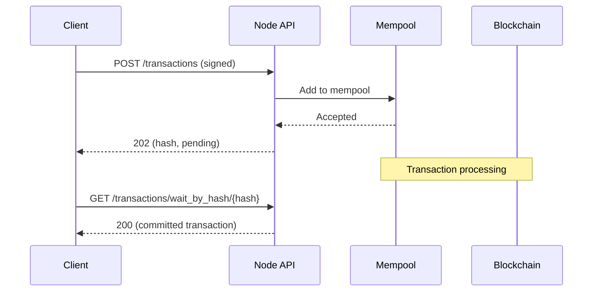

# Transactions API Specification

> **Version:** 1.0.0  
> **Last Updated:** January 28, 2026

## Overview

The Transactions API provides endpoints for submitting, querying, and simulating transactions on the Aptos blockchain.

## Endpoints Summary

| Method | Endpoint | Description |
|--------|----------|-------------|
| POST | `/transactions` | Submit a signed transaction |
| POST | `/transactions/batch` | Submit multiple transactions |
| POST | `/transactions/simulate` | Simulate transaction execution |
| POST | `/transactions/encode_submission` | Encode transaction for signing |
| GET | `/transactions` | List transactions |
| GET | `/transactions/by_hash/{hash}` | Get transaction by hash |
| GET | `/transactions/wait_by_hash/{hash}` | Wait for transaction (long-poll) |
| GET | `/transactions/by_version/{version}` | Get transaction by version |
| GET | `/estimate_gas_price` | Get recommended gas price |

## Transaction Lifecycle



---

## Submit Transaction

Submits a signed transaction to the mempool.

```
POST /v1/transactions
```

### Request Formats

#### JSON Format

```http
POST /v1/transactions
Content-Type: application/json

{
  "sender": "0x1234...",
  "sequence_number": "42",
  "max_gas_amount": "2000",
  "gas_unit_price": "100",
  "expiration_timestamp_secs": "1735689600",
  "payload": {
    "type": "entry_function_payload",
    "function": "0x1::aptos_account::transfer",
    "type_arguments": [],
    "arguments": ["0x5678...", "1000000"]
  },
  "signature": {
    "type": "ed25519_signature",
    "public_key": "0xabcd...",
    "signature": "0xef01..."
  }
}
```

#### BCS Format (Recommended)

```http
POST /v1/transactions
Content-Type: application/x-bcs

<BCS-encoded SignedTransaction bytes>
```

### Response (202 Accepted)

```json
{
  "hash": "0x1234567890abcdef...",
  "sender": "0x1234...",
  "sequence_number": "42",
  "max_gas_amount": "2000",
  "gas_unit_price": "100",
  "expiration_timestamp_secs": "1735689600",
  "payload": {...},
  "signature": {...}
}
```

### Code Examples

#### Rust

```rust
use aptos_types::transaction::SignedTransaction;

async fn submit_transaction(
    client: &Client,
    base_url: &str,
    txn: &SignedTransaction,
) -> Result<String, Box<dyn std::error::Error>> {
    let url = format!("{}/transactions", base_url);
    
    // BCS encode the transaction
    let bcs_bytes = bcs::to_bytes(txn)?;
    
    let response = client
        .post(&url)
        .header("Content-Type", "application/x-bcs")
        .header("Accept", "application/json")
        .body(bcs_bytes)
        .send()
        .await?;
    
    if response.status() == 202 {
        let pending: PendingTransaction = response.json().await?;
        Ok(pending.hash)
    } else {
        let error: AptosError = response.json().await?;
        Err(format!("Submission failed: {}", error.message).into())
    }
}
```

#### Python

```python
def submit_transaction(
    client: AptosClient,
    signed_txn: bytes  # BCS-encoded SignedTransaction
) -> str:
    """Submit a signed transaction and return the hash."""
    response = requests.post(
        f"{client.base_url}/transactions",
        headers={
            "Content-Type": "application/x-bcs",
            "Accept": "application/json",
        },
        data=signed_txn,
    )
    
    if response.status_code == 202:
        return response.json()["hash"]
    else:
        error = response.json()
        raise APIError(
            message=error["message"],
            error_code=error["error_code"],
            status_code=response.status_code,
        )
```

#### TypeScript

```typescript
async function submitTransaction(
  client: AptosClient,
  signedTxn: Uint8Array  // BCS-encoded SignedTransaction
): Promise<string> {
  const response = await fetch(`${client.baseUrl}/transactions`, {
    method: 'POST',
    headers: {
      'Content-Type': 'application/x-bcs',
      'Accept': 'application/json',
    },
    body: signedTxn,
  });

  const data = await response.json();
  
  if (response.status === 202) {
    return data.hash;
  } else {
    throw new APIError(data.message, data.error_code, response.status);
  }
}
```

---

## Submit Batch Transactions

Submit multiple signed transactions in one request.

```
POST /v1/transactions/batch
```

### Request

```http
POST /v1/transactions/batch
Content-Type: application/json

[
  { /* signed transaction 1 */ },
  { /* signed transaction 2 */ }
]
```

### Response

```json
{
  "transaction_failures": [
    {
      "error": {
        "message": "...",
        "error_code": "...",
        "vm_error_code": null
      },
      "transaction_index": 1
    }
  ]
}
```

---

## Simulate Transaction

Simulates a transaction without submitting it. Useful for:
- Estimating gas usage
- Validating transaction logic
- Debugging execution

```
POST /v1/transactions/simulate
```

### Query Parameters

| Name | Type | Default | Description |
|------|------|---------|-------------|
| `estimate_gas_unit_price` | bool | false | Override gas_unit_price with estimate |
| `estimate_max_gas_amount` | bool | false | Estimate required gas |
| `estimate_prioritized_gas_unit_price` | bool | false | Use prioritized (higher) gas price |

### Request

Can be JSON or BCS. Signature does not need to be valid for simulation.

```http
POST /v1/transactions/simulate?estimate_max_gas_amount=true
Content-Type: application/json

{
  "sender": "0x1234...",
  "sequence_number": "42",
  "max_gas_amount": "100000",
  "gas_unit_price": "100",
  "expiration_timestamp_secs": "1735689600",
  "payload": {
    "type": "entry_function_payload",
    "function": "0x1::aptos_account::transfer",
    "type_arguments": [],
    "arguments": ["0x5678...", "1000000"]
  },
  "signature": {
    "type": "ed25519_signature",
    "public_key": "0x...",
    "signature": "0x..."
  }
}
```

### Response

```json
[
  {
    "version": "0",
    "hash": "0x...",
    "state_change_hash": "0x...",
    "event_root_hash": "0x...",
    "state_checkpoint_hash": null,
    "gas_used": "500",
    "success": true,
    "vm_status": "Executed successfully",
    "accumulator_root_hash": "0x...",
    "changes": [...],
    "sender": "0x1234...",
    "sequence_number": "42",
    "max_gas_amount": "100000",
    "gas_unit_price": "100",
    "expiration_timestamp_secs": "1735689600",
    "payload": {...},
    "signature": {...},
    "events": [...],
    "timestamp": "0"
  }
]
```

### Code Examples

```python
def simulate_transaction(
    client: AptosClient,
    txn: dict,
    estimate_gas: bool = True
) -> dict:
    """Simulate a transaction and get gas estimate."""
    params = {}
    if estimate_gas:
        params["estimate_max_gas_amount"] = "true"
        params["estimate_gas_unit_price"] = "true"
    
    response = requests.post(
        f"{client.base_url}/transactions/simulate",
        params=params,
        json=txn,
        headers={"Accept": "application/json"},
    )
    
    results = response.json()
    
    if isinstance(results, list) and len(results) > 0:
        result = results[0]
        if result.get("success"):
            return {
                "success": True,
                "gas_used": int(result["gas_used"]),
                "gas_unit_price": int(result["gas_unit_price"]),
                "events": result.get("events", []),
            }
        else:
            return {
                "success": False,
                "vm_status": result["vm_status"],
            }
    
    raise APIError("Unexpected simulation response", "simulation_error", response.status_code)
```

---

## Encode Submission

Encodes a transaction for signing. Returns the signing message that should be signed.

```
POST /v1/transactions/encode_submission
```

### Request

```json
{
  "sender": "0x1234...",
  "sequence_number": "42",
  "max_gas_amount": "2000",
  "gas_unit_price": "100",
  "expiration_timestamp_secs": "1735689600",
  "payload": {
    "type": "entry_function_payload",
    "function": "0x1::aptos_account::transfer",
    "type_arguments": [],
    "arguments": ["0x5678...", "1000000"]
  }
}
```

### Response

Returns hex-encoded bytes to sign:

```
"0xb5e97db07fa0bd0e5598aa3643a9bc6f6693bddc1a9fec9e674a461eaa00b193..."
```

---

## Get Transaction by Hash

Retrieves a transaction by its hash.

```
GET /v1/transactions/by_hash/{txn_hash}
```

### Parameters

| Name | In | Type | Required | Description |
|------|-----|------|----------|-------------|
| `txn_hash` | path | string | Yes | Transaction hash (hex, with 0x prefix) |

### Response

Transaction object varies by type:

```json
{
  "type": "user_transaction",
  "version": "123456789",
  "hash": "0x...",
  "state_change_hash": "0x...",
  "event_root_hash": "0x...",
  "state_checkpoint_hash": null,
  "gas_used": "500",
  "success": true,
  "vm_status": "Executed successfully",
  "accumulator_root_hash": "0x...",
  "changes": [...],
  "sender": "0x...",
  "sequence_number": "42",
  "max_gas_amount": "2000",
  "gas_unit_price": "100",
  "expiration_timestamp_secs": "1735689600",
  "payload": {...},
  "signature": {...},
  "events": [...],
  "timestamp": "1735689500000000"
}
```

### Transaction Types

| Type | Description |
|------|-------------|
| `pending_transaction` | Submitted but not yet committed |
| `user_transaction` | User-initiated transaction |
| `genesis_transaction` | Genesis block transaction |
| `block_metadata_transaction` | Block metadata |
| `state_checkpoint_transaction` | State checkpoint |
| `validator_transaction` | Validator operation |

---

## Wait for Transaction

Long-polls until a transaction is committed or timeout.

```
GET /v1/transactions/wait_by_hash/{txn_hash}
```

### Query Parameters

| Name | Type | Default | Description |
|------|------|---------|-------------|
| `timeout_secs` | u64 | 60 | Maximum wait time (max: 60) |

### Response

Returns the committed transaction, or 404 if not found within timeout.

### Code Example

```python
def wait_for_transaction(
    client: AptosClient,
    txn_hash: str,
    timeout_secs: int = 30
) -> dict:
    """Wait for a transaction to be committed."""
    response = requests.get(
        f"{client.base_url}/transactions/wait_by_hash/{txn_hash}",
        params={"timeout_secs": timeout_secs},
    )
    
    if response.status_code == 200:
        return response.json()
    elif response.status_code == 404:
        raise TransactionNotFoundError(f"Transaction {txn_hash} not found")
    else:
        error = response.json()
        raise APIError(error["message"], error["error_code"], response.status_code)
```

```typescript
async function waitForTransaction(
  client: AptosClient,
  txnHash: string,
  timeoutSecs: number = 30
): Promise<Transaction> {
  const response = await fetch(
    `${client.baseUrl}/transactions/wait_by_hash/${txnHash}?timeout_secs=${timeoutSecs}`
  );

  if (response.status === 200) {
    return response.json();
  } else if (response.status === 404) {
    throw new Error(`Transaction ${txnHash} not found or expired`);
  } else {
    const error = await response.json();
    throw new APIError(error.message, error.error_code, response.status);
  }
}
```

---

## Get Transaction by Version

Retrieves a transaction by its committed version number.

```
GET /v1/transactions/by_version/{txn_version}
```

### Parameters

| Name | In | Type | Required | Description |
|------|-----|------|----------|-------------|
| `txn_version` | path | u64 | Yes | Transaction version number |

---

## List Transactions

Lists transactions in descending order by version.

```
GET /v1/transactions
```

### Parameters

| Name | In | Type | Required | Description |
|------|-----|------|----------|-------------|
| `start` | query | u64 | No | Starting version |
| `limit` | query | u16 | No | Max transactions (default: 25) |

---

## Estimate Gas Price

Returns the recommended gas unit price.

```
GET /v1/estimate_gas_price
```

### Response

```json
{
  "gas_estimate": 100,
  "deprioritized_gas_estimate": 100,
  "prioritized_gas_estimate": 150
}
```

### Field Descriptions

| Field | Description |
|-------|-------------|
| `gas_estimate` | Recommended gas price for normal priority |
| `deprioritized_gas_estimate` | Minimum gas price (may be slow) |
| `prioritized_gas_estimate` | Higher gas price for faster inclusion |

---

## Transaction Payload Types

### Entry Function Payload

```json
{
  "type": "entry_function_payload",
  "function": "0x1::aptos_account::transfer",
  "type_arguments": ["0x1::aptos_coin::AptosCoin"],
  "arguments": ["0x5678...", "1000000"]
}
```

### Script Payload

```json
{
  "type": "script_payload",
  "code": {
    "bytecode": "0xa11ceb0b...",
    "abi": {...}
  },
  "type_arguments": [],
  "arguments": []
}
```

### Multisig Payload

```json
{
  "type": "multisig_payload",
  "multisig_address": "0xabcd...",
  "transaction_payload": {
    "type": "entry_function_payload",
    "function": "0x1::aptos_account::transfer",
    "type_arguments": [],
    "arguments": ["0x5678...", "1000000"]
  }
}
```

---

## Signature Types

### Ed25519 Signature

```json
{
  "type": "ed25519_signature",
  "public_key": "0x...",
  "signature": "0x..."
}
```

### Multi-Ed25519 Signature

```json
{
  "type": "multi_ed25519_signature",
  "public_keys": ["0x...", "0x...", "0x..."],
  "signatures": ["0x...", "0x..."],
  "threshold": 2,
  "bitmap": "0xc0000000"
}
```

### Single Sender Signature

```json
{
  "type": "single_sender",
  "sender": {
    "type": "single_key_signature",
    "public_key": {
      "type": "ed25519",
      "value": "0x..."
    },
    "signature": {
      "type": "ed25519",
      "value": "0x..."
    }
  }
}
```

### Multi-Agent Signature

```json
{
  "type": "multi_agent_signature",
  "sender": {...},
  "secondary_signer_addresses": ["0x...", "0x..."],
  "secondary_signers": [{...}, {...}]
}
```

### Fee Payer Signature

```json
{
  "type": "fee_payer_signature",
  "sender": {...},
  "secondary_signer_addresses": [],
  "secondary_signers": [],
  "fee_payer_address": "0x...",
  "fee_payer_signer": {...}
}
```

---

## Error Responses

### Invalid Transaction (400)

```json
{
  "message": "Transaction validation failed",
  "error_code": "invalid_transaction",
  "vm_error_code": null
}
```

### Sequence Number Errors

```json
{
  "message": "Transaction sequence number 10 is too old...",
  "error_code": "sequence_number_too_old",
  "vm_error_code": null
}
```

### VM Error (400)

```json
{
  "message": "Transaction execution failed",
  "error_code": "vm_error",
  "vm_error_code": 4016
}
```

### Mempool Full (503)

```json
{
  "message": "Mempool is full",
  "error_code": "mempool_is_full",
  "vm_error_code": null
}
```

---

## Complete Transaction Flow Example

```python
import time
import hashlib
from typing import Optional

class TransactionSubmitter:
    def __init__(self, client: AptosClient, account: Account):
        self.client = client
        self.account = account
    
    def submit_and_wait(
        self,
        payload: dict,
        max_gas: int = 10000,
        timeout_secs: int = 30
    ) -> dict:
        """Submit a transaction and wait for confirmation."""
        
        # 1. Get sequence number
        account_info = self.client.get_account(self.account.address)
        seq_num = int(account_info["data"]["sequence_number"])
        
        # 2. Get gas estimate
        gas_estimate = self.client.get_gas_estimate()
        gas_price = gas_estimate["gas_estimate"]
        
        # 3. Build transaction
        expiration = int(time.time()) + 60
        txn = {
            "sender": self.account.address,
            "sequence_number": str(seq_num),
            "max_gas_amount": str(max_gas),
            "gas_unit_price": str(gas_price),
            "expiration_timestamp_secs": str(expiration),
            "payload": payload,
        }
        
        # 4. Simulate to verify
        sim_result = self.client.simulate(txn)
        if not sim_result["success"]:
            raise TransactionError(f"Simulation failed: {sim_result['vm_status']}")
        
        # 5. Sign transaction
        signing_message = self.client.encode_submission(txn)
        signature = self.account.sign(bytes.fromhex(signing_message[2:]))
        
        txn["signature"] = {
            "type": "ed25519_signature",
            "public_key": self.account.public_key_hex,
            "signature": signature.hex(),
        }
        
        # 6. Submit
        txn_hash = self.client.submit_transaction(txn)
        
        # 7. Wait for confirmation
        result = self.client.wait_for_transaction(txn_hash, timeout_secs)
        
        if not result.get("success"):
            raise TransactionError(f"Transaction failed: {result.get('vm_status')}")
        
        return result
```

```typescript
class TransactionSubmitter {
  constructor(
    private client: AptosClient,
    private account: Account
  ) {}

  async submitAndWait(
    payload: EntryFunctionPayload,
    maxGas: number = 10000,
    timeoutSecs: number = 30
  ): Promise<Transaction> {
    // 1. Get sequence number
    const accountInfo = await this.client.getAccount(this.account.address);
    const seqNum = BigInt(accountInfo.data.sequence_number);

    // 2. Get gas estimate
    const gasEstimate = await this.client.getGasEstimate();
    const gasPrice = gasEstimate.gas_estimate;

    // 3. Build transaction
    const expiration = Math.floor(Date.now() / 1000) + 60;
    const txn = {
      sender: this.account.address,
      sequence_number: seqNum.toString(),
      max_gas_amount: maxGas.toString(),
      gas_unit_price: gasPrice.toString(),
      expiration_timestamp_secs: expiration.toString(),
      payload,
    };

    // 4. Simulate to verify
    const simResult = await this.client.simulate(txn);
    if (!simResult.success) {
      throw new Error(`Simulation failed: ${simResult.vm_status}`);
    }

    // 5. Sign transaction
    const signingMessage = await this.client.encodeSubmission(txn);
    const signature = this.account.sign(hexToBytes(signingMessage));

    const signedTxn = {
      ...txn,
      signature: {
        type: 'ed25519_signature',
        public_key: this.account.publicKeyHex,
        signature: bytesToHex(signature),
      },
    };

    // 6. Submit
    const txnHash = await this.client.submitTransaction(signedTxn);

    // 7. Wait for confirmation
    const result = await this.client.waitForTransaction(txnHash, timeoutSecs);

    if (!result.success) {
      throw new Error(`Transaction failed: ${result.vm_status}`);
    }

    return result;
  }
}
```

## Related Documents

- [API Overview](01-api-overview.md) - Base URLs and common patterns
- [Gas Estimation](../advanced/04-gas-estimation.md) - Detailed gas estimation
- [Sequence Numbers](../advanced/05-sequence-numbers.md) - Sequence number management
- [Transaction Lifecycle](../advanced/07-transaction-lifecycle.md) - Detailed lifecycle
