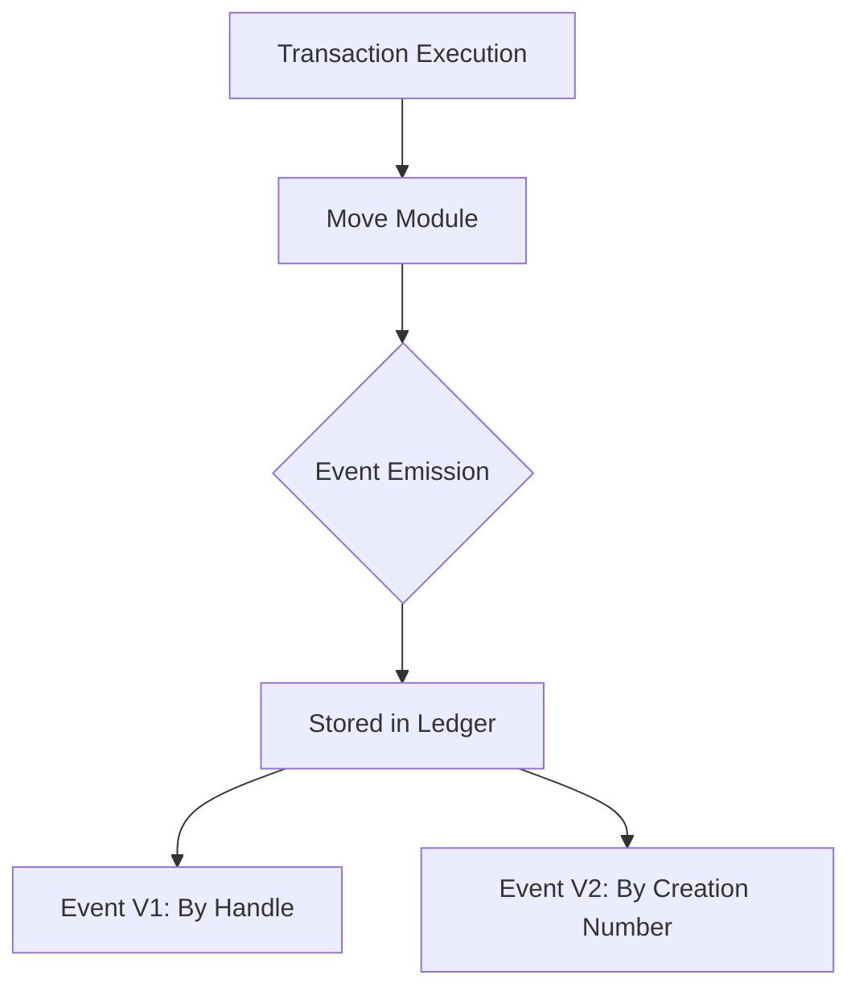

# Events API Specification

> **Version:** 1.0.0  
> **Last Updated:** January 28, 2026

## Overview

The Events API provides endpoints for querying events emitted by Move modules during transaction execution. Events are an important mechanism for tracking on-chain activity and state changes.

## Event Model



### Event V1 (Legacy)

Events are stored in `EventHandle` structures on resources:

```rust
struct EventHandle<T: store + drop> has store {
    counter: u64,      // Number of events emitted
    guid: GUID,        // Unique identifier
}
```

### Event V2 (Current)

Events are stored with creation numbers on accounts:

```rust
// Event identified by account address + creation_number
struct Event {
    type: TypeTag,
    data: Vec<u8>,
    sequence_number: u64,
}
```

## Endpoints Summary

| Method | Endpoint | Description |
|--------|----------|-------------|
| GET | `/accounts/{address}/events/{creation_number}` | Get events by creation number (v2) |
| GET | `/accounts/{address}/events/{event_handle}/{field_name}` | Get events by handle (v1) |

---

## Get Events by Creation Number

Retrieves events using the event creation number (Event V2).

```
GET /v1/accounts/{address}/events/{creation_number}
```

### Parameters

| Name | In | Type | Required | Description |
|------|-----|------|----------|-------------|
| `address` | path | Address | Yes | Account address that emitted events |
| `creation_number` | path | u64 | Yes | Event creation number |
| `start` | query | u64 | No | Starting sequence number |
| `limit` | query | u16 | No | Maximum events to return |

### Response

```json
[
  {
    "version": "123456789",
    "guid": {
      "creation_number": "0",
      "account_address": "0x1234..."
    },
    "sequence_number": "0",
    "type": "0x1::coin::DepositEvent",
    "data": {
      "amount": "1000000"
    }
  },
  {
    "version": "123456790",
    "guid": {
      "creation_number": "0",
      "account_address": "0x1234..."
    },
    "sequence_number": "1",
    "type": "0x1::coin::DepositEvent",
    "data": {
      "amount": "2000000"
    }
  }
]
```

### Example

```bash
# Get deposit events for account
curl "https://fullnode.testnet.aptoslabs.com/v1/accounts/0x1234.../events/0?limit=10"
```

---

## Get Events by Handle (Legacy)

Retrieves events using the event handle field path (Event V1).

```
GET /v1/accounts/{address}/events/{event_handle}/{field_name}
```

### Parameters

| Name | In | Type | Required | Description |
|------|-----|------|----------|-------------|
| `address` | path | Address | Yes | Account address with the resource |
| `event_handle` | path | string | Yes | Resource type containing the handle (URL encoded) |
| `field_name` | path | string | Yes | Field name of the event handle |
| `start` | query | u64 | No | Starting sequence number |
| `limit` | query | u16 | No | Maximum events to return |

### Response

Same format as creation number endpoint.

### Example

```bash
# Get coin deposit events using handle
curl "https://fullnode.testnet.aptoslabs.com/v1/accounts/0x1234.../events/0x1::coin::CoinStore%3C0x1::aptos_coin::AptosCoin%3E/deposit_events"
```

---

## Common Event Types

### Coin Events

| Event Type | Description |
|------------|-------------|
| `0x1::coin::DepositEvent` | Tokens deposited to account |
| `0x1::coin::WithdrawEvent` | Tokens withdrawn from account |
| `0x1::coin::RegisterCoinEvent` | New coin type registered |

**DepositEvent/WithdrawEvent structure:**
```json
{
  "type": "0x1::coin::DepositEvent",
  "data": {
    "amount": "1000000"
  }
}
```

### Account Events

| Event Type | Description |
|------------|-------------|
| `0x1::account::KeyRotationEvent` | Authentication key changed |
| `0x1::account::CoinRegisterEvent` | Coin store registered |

### Staking Events

| Event Type | Description |
|------------|-------------|
| `0x1::stake::AddStakeEvent` | Stake added |
| `0x1::stake::UnlockStakeEvent` | Stake unlocked |
| `0x1::stake::WithdrawStakeEvent` | Stake withdrawn |
| `0x1::stake::DistributeRewardsEvent` | Rewards distributed |

### Token Events (NFT v1)

| Event Type | Description |
|------------|-------------|
| `0x3::token::DepositEvent` | Token deposited |
| `0x3::token::WithdrawEvent` | Token withdrawn |
| `0x3::token::MintTokenEvent` | Token minted |
| `0x3::token::BurnTokenEvent` | Token burned |

### Token Events (NFT v2)

| Event Type | Description |
|------------|-------------|
| `0x4::collection::MintEvent` | Collection item minted |
| `0x4::collection::BurnEvent` | Collection item burned |
| `0x1::object::TransferEvent` | Object transferred |

---

## Code Examples

### Python

```python
from typing import List, Optional, Dict, Any
from urllib.parse import quote

def get_events_by_creation_number(
    client: AptosClient,
    address: str,
    creation_number: int,
    start: Optional[int] = None,
    limit: Optional[int] = None,
) -> List[Dict[str, Any]]:
    """Get events by creation number (Event V2)."""
    params = {}
    if start is not None:
        params["start"] = start
    if limit is not None:
        params["limit"] = limit
    
    response = client.get(
        f"/accounts/{address}/events/{creation_number}",
        params=params
    )
    return response["data"]


def get_events_by_handle(
    client: AptosClient,
    address: str,
    event_handle: str,
    field_name: str,
    start: Optional[int] = None,
    limit: Optional[int] = None,
) -> List[Dict[str, Any]]:
    """Get events by handle (Event V1)."""
    encoded_handle = quote(event_handle, safe="")
    
    params = {}
    if start is not None:
        params["start"] = start
    if limit is not None:
        params["limit"] = limit
    
    response = client.get(
        f"/accounts/{address}/events/{encoded_handle}/{field_name}",
        params=params
    )
    return response["data"]


def get_coin_deposit_events(
    client: AptosClient,
    address: str,
    coin_type: str = "0x1::aptos_coin::AptosCoin",
    limit: int = 25,
) -> List[Dict[str, Any]]:
    """Get deposit events for a specific coin type."""
    handle = f"0x1::coin::CoinStore<{coin_type}>"
    return get_events_by_handle(
        client,
        address,
        event_handle=handle,
        field_name="deposit_events",
        limit=limit
    )


def get_all_events(
    client: AptosClient,
    address: str,
    creation_number: int,
) -> List[Dict[str, Any]]:
    """Get all events with pagination."""
    all_events = []
    start = 0
    batch_size = 100
    
    while True:
        events = get_events_by_creation_number(
            client,
            address,
            creation_number,
            start=start,
            limit=batch_size
        )
        
        if not events:
            break
        
        all_events.extend(events)
        
        if len(events) < batch_size:
            break
        
        start += batch_size
    
    return all_events


class EventSubscriber:
    """Poll for new events."""
    
    def __init__(
        self,
        client: AptosClient,
        address: str,
        creation_number: int,
    ):
        self.client = client
        self.address = address
        self.creation_number = creation_number
        self.last_sequence = -1
    
    def poll(self) -> List[Dict[str, Any]]:
        """Get new events since last poll."""
        events = get_events_by_creation_number(
            self.client,
            self.address,
            self.creation_number,
            start=self.last_sequence + 1,
            limit=100
        )
        
        if events:
            self.last_sequence = int(events[-1]["sequence_number"])
        
        return events


# Example usage
if __name__ == "__main__":
    client = AptosClient(network="testnet")
    
    # Get deposit events using handle
    deposits = get_coin_deposit_events(
        client,
        address="0x1",
        limit=10
    )
    
    for event in deposits:
        print(f"Deposit: {event['data']['amount']} at version {event['version']}")
```

### TypeScript

```typescript
interface Event {
  version: string;
  guid: {
    creation_number: string;
    account_address: string;
  };
  sequence_number: string;
  type: string;
  data: Record<string, unknown>;
}

interface DepositEventData {
  amount: string;
}

interface WithdrawEventData {
  amount: string;
}

async function getEventsByCreationNumber(
  client: AptosClient,
  address: string,
  creationNumber: number,
  options?: { start?: number; limit?: number }
): Promise<Event[]> {
  const params: Record<string, string | number> = {};
  if (options?.start !== undefined) params.start = options.start;
  if (options?.limit !== undefined) params.limit = options.limit;

  const response = await client.get(`/accounts/${address}/events/${creationNumber}`, { params });
  return response.data as Event[];
}

async function getEventsByHandle(
  client: AptosClient,
  address: string,
  eventHandle: string,
  fieldName: string,
  options?: { start?: number; limit?: number }
): Promise<Event[]> {
  const encodedHandle = encodeURIComponent(eventHandle);
  const params: Record<string, string | number> = {};
  if (options?.start !== undefined) params.start = options.start;
  if (options?.limit !== undefined) params.limit = options.limit;

  const response = await client.get(
    `/accounts/${address}/events/${encodedHandle}/${fieldName}`,
    { params }
  );
  return response.data as Event[];
}

async function getCoinDepositEvents(
  client: AptosClient,
  address: string,
  coinType: string = '0x1::aptos_coin::AptosCoin',
  limit: number = 25
): Promise<Event[]> {
  const handle = `0x1::coin::CoinStore<${coinType}>`;
  return getEventsByHandle(client, address, handle, 'deposit_events', { limit });
}

async function getAllEvents(
  client: AptosClient,
  address: string,
  creationNumber: number
): Promise<Event[]> {
  const allEvents: Event[] = [];
  let start = 0;
  const batchSize = 100;

  while (true) {
    const events = await getEventsByCreationNumber(
      client,
      address,
      creationNumber,
      { start, limit: batchSize }
    );

    if (events.length === 0) break;

    allEvents.push(...events);

    if (events.length < batchSize) break;

    start += batchSize;
  }

  return allEvents;
}

class EventSubscriber {
  private lastSequence = -1;

  constructor(
    private client: AptosClient,
    private address: string,
    private creationNumber: number
  ) {}

  async poll(): Promise<Event[]> {
    const events = await getEventsByCreationNumber(
      this.client,
      this.address,
      this.creationNumber,
      { start: this.lastSequence + 1, limit: 100 }
    );

    if (events.length > 0) {
      this.lastSequence = parseInt(events[events.length - 1].sequence_number);
    }

    return events;
  }

  async startPolling(
    callback: (events: Event[]) => void | Promise<void>,
    intervalMs: number = 1000
  ): Promise<() => void> {
    let running = true;

    const poll = async () => {
      while (running) {
        try {
          const events = await this.poll();
          if (events.length > 0) {
            await callback(events);
          }
        } catch (error) {
          console.error('Error polling events:', error);
        }
        await new Promise(resolve => setTimeout(resolve, intervalMs));
      }
    };

    poll();

    return () => {
      running = false;
    };
  }
}

// Example usage
async function main() {
  const client = new AptosClient(undefined, 'testnet');

  // Get deposit events
  const deposits = await getCoinDepositEvents(client, '0x1', undefined, 10);

  for (const event of deposits) {
    const data = event.data as DepositEventData;
    console.log(`Deposit: ${data.amount} at version ${event.version}`);
  }

  // Subscribe to events
  const subscriber = new EventSubscriber(client, '0x1', 0);
  
  const stopPolling = await subscriber.startPolling(events => {
    for (const event of events) {
      console.log(`New event: ${event.type}`);
    }
  }, 5000);

  // Stop after 30 seconds
  setTimeout(stopPolling, 30000);
}

export { getEventsByCreationNumber, getEventsByHandle, EventSubscriber };
```

### Rust

```rust
use serde::{Deserialize, Serialize};

#[derive(Debug, Deserialize)]
pub struct Event {
    pub version: String,
    pub guid: EventGuid,
    pub sequence_number: String,
    #[serde(rename = "type")]
    pub event_type: String,
    pub data: serde_json::Value,
}

#[derive(Debug, Deserialize)]
pub struct EventGuid {
    pub creation_number: String,
    pub account_address: String,
}

#[derive(Debug, Deserialize)]
pub struct DepositEventData {
    pub amount: String,
}

async fn get_events_by_creation_number(
    client: &Client,
    base_url: &str,
    address: &str,
    creation_number: u64,
    start: Option<u64>,
    limit: Option<u16>,
) -> Result<Vec<Event>, Box<dyn std::error::Error>> {
    let mut url = format!(
        "{}/accounts/{}/events/{}",
        base_url, address, creation_number
    );
    
    let mut params = Vec::new();
    if let Some(s) = start {
        params.push(format!("start={}", s));
    }
    if let Some(l) = limit {
        params.push(format!("limit={}", l));
    }
    
    if !params.is_empty() {
        url = format!("{}?{}", url, params.join("&"));
    }
    
    let response = client.get(&url).send().await?;
    Ok(response.json().await?)
}

async fn get_events_by_handle(
    client: &Client,
    base_url: &str,
    address: &str,
    event_handle: &str,
    field_name: &str,
    start: Option<u64>,
    limit: Option<u16>,
) -> Result<Vec<Event>, Box<dyn std::error::Error>> {
    let encoded_handle = urlencoding::encode(event_handle);
    let mut url = format!(
        "{}/accounts/{}/events/{}/{}",
        base_url, address, encoded_handle, field_name
    );
    
    let mut params = Vec::new();
    if let Some(s) = start {
        params.push(format!("start={}", s));
    }
    if let Some(l) = limit {
        params.push(format!("limit={}", l));
    }
    
    if !params.is_empty() {
        url = format!("{}?{}", url, params.join("&"));
    }
    
    let response = client.get(&url).send().await?;
    Ok(response.json().await?)
}
```

---

## Finding Event Creation Numbers

To find the creation number for an account's events:

1. **Get account resources** and look for `guid.id.creation_num` in event handles
2. **Check transaction events** - events include their creation number

### Example: Find APT Deposit Event Creation Number

```python
def find_deposit_event_creation_number(
    client: AptosClient,
    address: str
) -> int:
    """Find the creation number for APT deposit events."""
    resource = client.get_resource(
        address,
        "0x1::coin::CoinStore<0x1::aptos_coin::AptosCoin>"
    )
    
    deposit_handle = resource["data"]["deposit_events"]
    creation_number = int(deposit_handle["guid"]["id"]["creation_num"])
    
    return creation_number
```

---

## Error Responses

### Events Not Found (404)

```json
{
  "message": "Event not found by key {creation_number}",
  "error_code": "event_not_found",
  "vm_error_code": null
}
```

### Resource Not Found (404)

When using handle-based queries:

```json
{
  "message": "Resource not found",
  "error_code": "resource_not_found",
  "vm_error_code": null
}
```

---

## Best Practices

1. **Use creation numbers** (Event V2) for new integrations
2. **Paginate** when fetching large event histories
3. **Track sequence numbers** for reliable polling
4. **Handle pruning** - old events may be unavailable
5. **Batch requests** when monitoring multiple event streams

## Related Documents

- [API Overview](01-api-overview.md) - Base URLs and common patterns
- [Accounts API](02-accounts-api.md) - Finding event handles in resources
- [Transactions API](03-transactions-api.md) - Events in transaction responses
