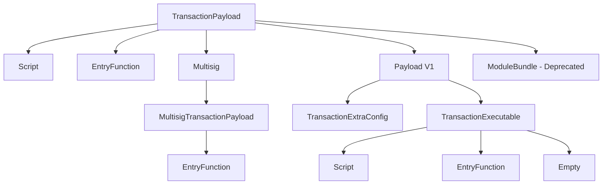

# Transaction Payload Overview

> **Version:** 1.0.0  
> **Last Updated:** January 28, 2026

## Overview

Transaction payloads define what a transaction does when executed. The payload contains the executable code or function reference along with its arguments and type parameters.

## Payload Types



## TransactionPayload Enum

The `TransactionPayload` enum defines all possible payload types:

```rust
pub enum TransactionPayload {
    Script(Script),                    // Variant 0
    ModuleBundle(DeprecatedPayload),   // Variant 1 (deprecated)
    EntryFunction(EntryFunction),      // Variant 2
    Multisig(Multisig),               // Variant 3
    Payload(TransactionPayloadInner),  // Variant 4 (new format)
}
```

### BCS Layout

| Offset | Size | Field | Description |
|--------|------|-------|-------------|
| 0 | 1 | variant_index | Payload type (0-4) |
| 1 | variable | payload_data | Variant-specific data |

## Payload Type Comparison

| Payload Type | Use Case | Gas Efficiency | Deployment Required |
|--------------|----------|----------------|---------------------|
| EntryFunction | Call existing module function | Best | Yes (module must exist) |
| Script | One-time custom logic | Medium | No (code in transaction) |
| Multisig | Execute as multisig account | Best | Yes (module must exist) |
| Payload V1 | Orderless transactions | Best | Depends on executable |

## When to Use Each Type

### Entry Function (Most Common)

Use when:
- Calling an existing published module function
- Standard operations (transfers, swaps, minting)
- Gas efficiency is important
- Function is marked as `entry` in Move

```rust
// Example: Transfer APT
TransactionPayload::EntryFunction(EntryFunction::new(
    ModuleId::new(address, "aptos_account"),
    "transfer",
    vec![],  // type arguments
    vec![bcs::to_bytes(&recipient)?, bcs::to_bytes(&amount)?],
))
```

### Script

Use when:
- One-time custom logic
- Combining multiple operations atomically
- Testing/prototyping
- No published module available

```rust
// Example: Custom script
TransactionPayload::Script(Script::new(
    compiled_script_bytecode,
    vec![],  // type arguments
    vec![TransactionArgument::Address(recipient)],
))
```

### Multisig

Use when:
- Executing transactions as a multisig account
- The transaction was pre-approved by K-of-N owners

```rust
// Example: Multisig execution
TransactionPayload::Multisig(Multisig {
    multisig_address,
    transaction_payload: Some(MultisigTransactionPayload::EntryFunction(entry_fn)),
})
```

### Payload V1 (New Format)

Use when:
- Using orderless transactions (nonce-based replay protection)
- Future extensibility is needed

```rust
// Example: Orderless transaction
TransactionPayload::Payload(TransactionPayloadInner::V1 {
    executable: TransactionExecutable::EntryFunction(entry_fn),
    extra_config: TransactionExtraConfig::V1 {
        multisig_address: None,
        replay_protection_nonce: Some(random_nonce),
    },
})
```

## Common Patterns

### Simple Transfer

```python
# Python: Build APT transfer payload
def build_transfer_payload(recipient: str, amount: int) -> dict:
    """Build an APT transfer entry function payload."""
    return {
        "type": "entry_function_payload",
        "function": "0x1::aptos_account::transfer",
        "type_arguments": [],
        "arguments": [recipient, str(amount)],
    }
```

```typescript
// TypeScript: Build APT transfer payload
function buildTransferPayload(recipient: string, amount: bigint): EntryFunctionPayload {
  return {
    type: 'entry_function_payload',
    function: '0x1::aptos_account::transfer',
    type_arguments: [],
    arguments: [recipient, amount.toString()],
  };
}
```

### Coin Transfer with Type Argument

```python
# Python: Transfer custom coin
def build_coin_transfer_payload(
    coin_type: str,
    recipient: str,
    amount: int
) -> dict:
    """Build a coin transfer entry function payload."""
    return {
        "type": "entry_function_payload",
        "function": "0x1::aptos_account::transfer_coins",
        "type_arguments": [coin_type],
        "arguments": [recipient, str(amount)],
    }
```

### NFT Minting

```python
# Python: Mint NFT (Token V2)
def build_mint_nft_payload(
    collection_address: str,
    description: str,
    name: str,
    uri: str
) -> dict:
    """Build an NFT minting payload."""
    return {
        "type": "entry_function_payload",
        "function": "0x4::aptos_token::mint",
        "type_arguments": [],
        "arguments": [
            collection_address,
            description,
            name,
            uri,
            [],  # property_keys
            [],  # property_types
            [],  # property_values
        ],
    }
```

## Payload Validation Rules

### Entry Function

1. Module must exist at the specified address
2. Function must be marked as `entry`
3. Function must be public or `public(friend)`
4. Type arguments must match function signature
5. Arguments must match parameter types

### Script

1. Bytecode must be valid Move bytecode
2. Script must be a valid script (not a module)
3. Type arguments must satisfy constraints
4. Arguments must match script parameters

### Multisig

1. Multisig account must exist
2. If payload provided, must be a valid EntryFunction
3. Sender must be an owner of the multisig account
4. Transaction must be pre-approved if required

## Gas Considerations

| Payload Type | Base Cost | Execution Cost |
|--------------|-----------|----------------|
| EntryFunction | Low | Depends on function |
| Script | Higher (includes bytecode) | Depends on script |
| Multisig | Low + verification | Depends on inner payload |

Scripts have higher base costs because:
1. Bytecode must be transmitted in the transaction
2. Bytecode must be verified/deserialized
3. No caching benefits of published modules

## Related Documents

- [Entry Function Payload](02-entry-function.md) - Detailed EntryFunction specification
- [Script Payload](03-script-payload.md) - Detailed Script specification
- [Move Types](04-move-types.md) - TypeTag, ModuleId, and argument encoding
- [Multisig Transactions](../advanced/03-multisig-transactions.md) - On-chain multisig workflow
