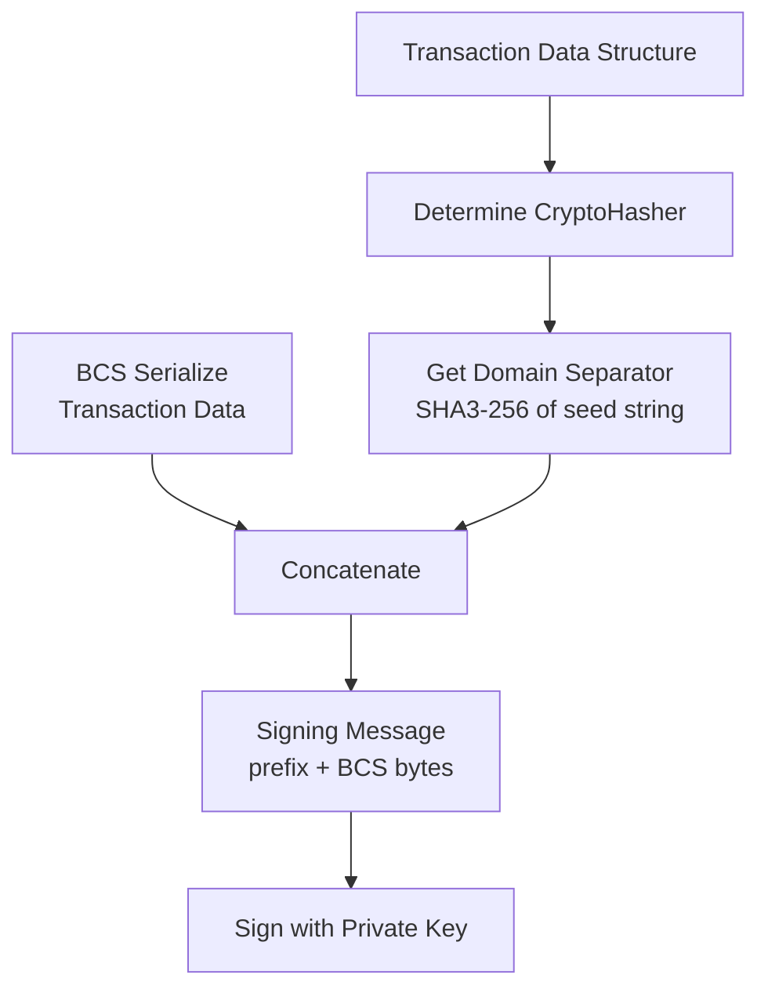
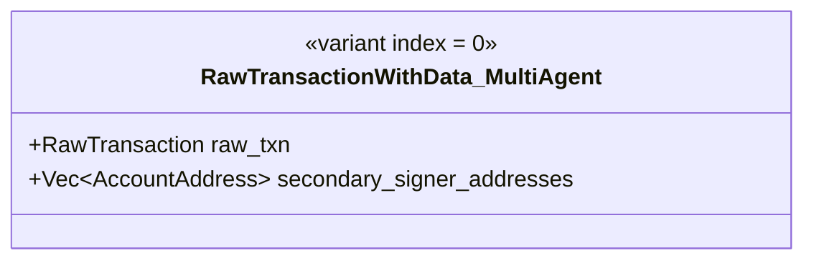
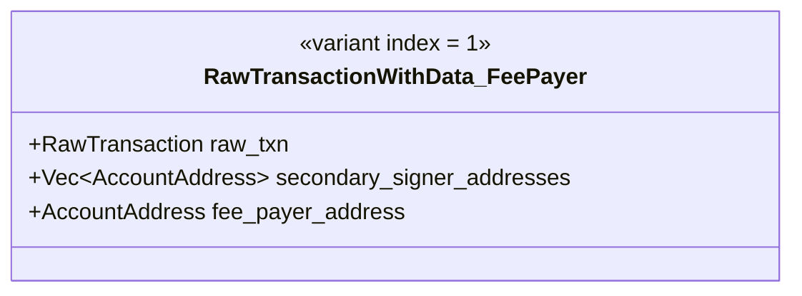
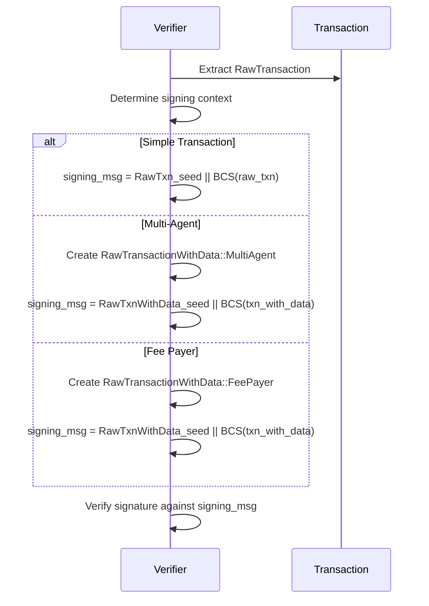

# Transaction Hashing Specification

> **Version:** 1.0.0  
> **Status:** Stable  
> **Last Updated:** January 28, 2026

## Overview

This document specifies how Aptos transactions are prepared for signing. The process involves creating a "signing message" that includes a domain separation prefix followed by the BCS-serialized transaction data.

## Signing Message Construction

The signing message is constructed as:

```
signing_message = domain_separator || BCS(transaction_data)
```

Where:
- `domain_separator` is a 32-byte SHA3-256 hash derived from the type being signed
- `transaction_data` is the BCS-serialized transaction structure



## Domain Separation

### What is Domain Separation?

Domain separation ensures that signatures for different types of messages cannot be confused or reused. Each type of data that can be signed has a unique "hasher" with a deterministic seed.

### Hasher Seed Generation

The seed is generated from the fully-qualified type name:

```
seed = SHA3-256(SHA3-256("<fully_qualified_type_name>") || "APTOS::") 
```

For `RawTransaction`:
```
fully_qualified_type = "APTOS::RawTransaction"
inner_hash = SHA3-256(b"APTOS::RawTransaction")
seed = SHA3-256(inner_hash || b"APTOS::")
```

### Aptos Type Seeds

| Type | Fully Qualified Name | Seed (32 bytes hex) |
|------|---------------------|---------------------|
| RawTransaction | `APTOS::RawTransaction` | `b5e97db07fa0bd0e5598aa3643a9bc6f6693bddc1a9fec9e674a461eaa00b193` |
| RawTransactionWithData | `APTOS::RawTransactionWithData` | `cf2784f5b1e8d490ab8d5e7c2f3c9c2c2a6a8c8e7b5d3f1a9e7c5b3d1f9a8c7e` |

## Signing Different Transaction Types

### Simple Transaction (RawTransaction)

For simple single-signer transactions:

```
signing_message = RawTransaction_seed || BCS(RawTransaction)
```

### Multi-Agent Transaction

For transactions with secondary signers:

```
signing_message = RawTransactionWithData_seed || BCS(RawTransactionWithData::MultiAgent)
```

### Fee Payer Transaction

For sponsored transactions:

```
signing_message = RawTransactionWithData_seed || BCS(RawTransactionWithData::MultiAgentWithFeePayer)
```

## Code Examples

### Rust

```rust
use aptos_crypto::{
    hash::{CryptoHash, CryptoHasher},
    traits::signing_message,
    HashValue,
};
use aptos_types::transaction::{RawTransaction, RawTransactionWithData};

// The signing_message function handles all the domain separation automatically
fn get_signing_message(raw_txn: &RawTransaction) -> Vec<u8> {
    signing_message(raw_txn).expect("Failed to create signing message")
}

// For multi-agent or fee-payer transactions
fn get_signing_message_multi_agent(
    raw_txn: RawTransaction,
    secondary_signers: Vec<AccountAddress>,
) -> Vec<u8> {
    let txn_with_data = RawTransactionWithData::new_multi_agent(raw_txn, secondary_signers);
    signing_message(&txn_with_data).expect("Failed to create signing message")
}

fn get_signing_message_fee_payer(
    raw_txn: RawTransaction,
    secondary_signers: Vec<AccountAddress>,
    fee_payer_address: AccountAddress,
) -> Vec<u8> {
    let txn_with_data = RawTransactionWithData::new_fee_payer(
        raw_txn,
        secondary_signers,
        fee_payer_address,
    );
    signing_message(&txn_with_data).expect("Failed to create signing message")
}

// Manual implementation for reference
fn manual_signing_message(raw_txn: &RawTransaction) -> Vec<u8> {
    // Get the hasher seed (this is precomputed for RawTransaction)
    let seed = <RawTransaction as CryptoHash>::Hasher::seed();
    
    // BCS serialize the transaction
    let bcs_bytes = bcs::to_bytes(raw_txn).expect("BCS serialization failed");
    
    // Concatenate seed + BCS bytes
    let mut signing_message = seed.to_vec();
    signing_message.extend(bcs_bytes);
    
    signing_message
}
```

### Python

```python
import hashlib
from typing import List

def sha3_256(data: bytes) -> bytes:
    """Compute SHA3-256 hash."""
    return hashlib.sha3_256(data).digest()

def compute_hasher_seed(type_name: str) -> bytes:
    """
    Compute the domain separator seed for a given type.
    
    seed = SHA3-256(SHA3-256(type_name) || "APTOS::")
    """
    # Inner hash of type name
    inner_hash = sha3_256(type_name.encode('utf-8'))
    
    # Outer hash with APTOS:: suffix
    seed = sha3_256(inner_hash + b"APTOS::")
    
    return seed

# Precomputed seeds
RAW_TRANSACTION_SEED = compute_hasher_seed("APTOS::RawTransaction")
RAW_TRANSACTION_WITH_DATA_SEED = compute_hasher_seed("APTOS::RawTransactionWithData")

def create_signing_message(bcs_serialized_txn: bytes, is_multi_agent: bool = False) -> bytes:
    """
    Create the signing message for a transaction.
    
    Args:
        bcs_serialized_txn: BCS-serialized transaction data
        is_multi_agent: True if using RawTransactionWithData (multi-agent/fee-payer)
    
    Returns:
        The signing message: seed || bcs_bytes
    """
    if is_multi_agent:
        seed = RAW_TRANSACTION_WITH_DATA_SEED
    else:
        seed = RAW_TRANSACTION_SEED
    
    return seed + bcs_serialized_txn

def hash_signing_message(signing_message: bytes) -> bytes:
    """
    Hash the signing message for algorithms that require a pre-hash.
    WebAuthn/Secp256r1 uses SHA3-256 of the signing message as the challenge.
    """
    return sha3_256(signing_message)

# Example usage
def example_simple_transaction():
    # Assume we have BCS-serialized RawTransaction
    raw_txn_bcs = bytes.fromhex("...")  # Your BCS bytes here
    
    # Create signing message
    signing_message = create_signing_message(raw_txn_bcs, is_multi_agent=False)
    
    print(f"Seed (32 bytes): {RAW_TRANSACTION_SEED.hex()}")
    print(f"BCS length: {len(raw_txn_bcs)} bytes")
    print(f"Signing message length: {len(signing_message)} bytes")
    
    return signing_message

def example_multi_agent_transaction():
    """
    For multi-agent transactions, the signing message includes
    secondary signer addresses.
    """
    # BCS serialize RawTransactionWithData::MultiAgent
    # This includes:
    # - variant index (0 for MultiAgent)
    # - RawTransaction
    # - Vec<AccountAddress> secondary_signer_addresses
    
    raw_txn_with_data_bcs = bytes.fromhex("...")  # Your BCS bytes
    
    signing_message = create_signing_message(raw_txn_with_data_bcs, is_multi_agent=True)
    
    return signing_message

# Verify seed computation
if __name__ == "__main__":
    seed = compute_hasher_seed("APTOS::RawTransaction")
    print(f"RawTransaction seed: {seed.hex()}")
    
    seed = compute_hasher_seed("APTOS::RawTransactionWithData")
    print(f"RawTransactionWithData seed: {seed.hex()}")
```

### TypeScript

```typescript
import { sha3_256 } from '@noble/hashes/sha3';

/**
 * Compute the domain separator seed for a given type.
 * seed = SHA3-256(SHA3-256(type_name) || "APTOS::")
 */
function computeHasherSeed(typeName: string): Uint8Array {
  const encoder = new TextEncoder();
  
  // Inner hash of type name
  const innerHash = sha3_256(encoder.encode(typeName));
  
  // Concatenate with "APTOS::"
  const suffix = encoder.encode('APTOS::');
  const combined = new Uint8Array(innerHash.length + suffix.length);
  combined.set(innerHash);
  combined.set(suffix, innerHash.length);
  
  // Outer hash
  return sha3_256(combined);
}

// Precomputed seeds
const RAW_TRANSACTION_SEED = computeHasherSeed('APTOS::RawTransaction');
const RAW_TRANSACTION_WITH_DATA_SEED = computeHasherSeed('APTOS::RawTransactionWithData');

/**
 * Create the signing message for a transaction.
 * 
 * @param bcsSerializedTxn BCS-serialized transaction data
 * @param isMultiAgent True if using RawTransactionWithData (multi-agent/fee-payer)
 * @returns The signing message: seed || bcs_bytes
 */
function createSigningMessage(
  bcsSerializedTxn: Uint8Array,
  isMultiAgent: boolean = false
): Uint8Array {
  const seed = isMultiAgent ? RAW_TRANSACTION_WITH_DATA_SEED : RAW_TRANSACTION_SEED;
  
  const result = new Uint8Array(seed.length + bcsSerializedTxn.length);
  result.set(seed);
  result.set(bcsSerializedTxn, seed.length);
  
  return result;
}

/**
 * Hash the signing message for algorithms that require a pre-hash.
 * WebAuthn/Secp256r1 uses SHA3-256 of the signing message as the challenge.
 */
function hashSigningMessage(signingMessage: Uint8Array): Uint8Array {
  return sha3_256(signingMessage);
}

// Example usage
function exampleSimpleTransaction() {
  // Assume we have BCS-serialized RawTransaction
  const rawTxnBcs = new Uint8Array([/* your BCS bytes */]);
  
  // Create signing message
  const signingMessage = createSigningMessage(rawTxnBcs, false);
  
  console.log('Seed (32 bytes):', Buffer.from(RAW_TRANSACTION_SEED).toString('hex'));
  console.log('BCS length:', rawTxnBcs.length, 'bytes');
  console.log('Signing message length:', signingMessage.length, 'bytes');
  
  return signingMessage;
}

/**
 * For multi-agent transactions, the signing message includes
 * secondary signer addresses.
 */
function exampleMultiAgentTransaction() {
  // BCS serialize RawTransactionWithData::MultiAgent
  const rawTxnWithDataBcs = new Uint8Array([/* your BCS bytes */]);
  
  const signingMessage = createSigningMessage(rawTxnWithDataBcs, true);
  
  return signingMessage;
}

// Verify seed computation
console.log('RawTransaction seed:', Buffer.from(RAW_TRANSACTION_SEED).toString('hex'));
console.log('RawTransactionWithData seed:', Buffer.from(RAW_TRANSACTION_WITH_DATA_SEED).toString('hex'));

export {
  computeHasherSeed,
  createSigningMessage,
  hashSigningMessage,
  RAW_TRANSACTION_SEED,
  RAW_TRANSACTION_WITH_DATA_SEED,
};
```

## RawTransactionWithData Structures

### MultiAgent Variant



BCS Layout:
```
┌──────────────────────────────────────────────────────────────────┐
│ Offset │ Size     │ Field                                        │
├────────┼──────────┼──────────────────────────────────────────────┤
│ 0      │ 1        │ variant_index (0 = MultiAgent)               │
│ 1      │ Variable │ RawTransaction (BCS)                         │
│ ...    │ Variable │ Vec<AccountAddress> secondary_signer_addresses│
└──────────────────────────────────────────────────────────────────┘
```

### MultiAgentWithFeePayer Variant



BCS Layout:
```
┌──────────────────────────────────────────────────────────────────┐
│ Offset │ Size     │ Field                                        │
├────────┼──────────┼──────────────────────────────────────────────┤
│ 0      │ 1        │ variant_index (1 = MultiAgentWithFeePayer)   │
│ 1      │ Variable │ RawTransaction (BCS)                         │
│ ...    │ Variable │ Vec<AccountAddress> secondary_signer_addresses│
│ ...    │ 32       │ fee_payer_address                            │
└──────────────────────────────────────────────────────────────────┘
```

## Test Vector

### Simple RawTransaction Signing Message

**Input RawTransaction (abbreviated):**
- sender: `0x0000000000000000000000000000000000000000000000000000000000000001`
- sequence_number: `0`
- payload: Script (empty)
- max_gas_amount: `1000000`
- gas_unit_price: `100`
- expiration_timestamp_secs: `1735689600`
- chain_id: `4` (testing)

**BCS of RawTransaction:**
```
00000000000000000000000000000000000000000000000000000000000000010000000000000000
000000004086010000000000006400000000000000009a686700000000000004
```

**Domain Separator Seed:**
```
b5e97db07fa0bd0e5598aa3643a9bc6f6693bddc1a9fec9e674a461eaa00b193
```

**Signing Message:**
```
b5e97db07fa0bd0e5598aa3643a9bc6f6693bddc1a9fec9e674a461eaa00b193  # seed (32 bytes)
00000000000000000000000000000000000000000000000000000000000000010000000000000000
000000004086010000000000006400000000000000009a686700000000000004  # BCS bytes
```

## Important Notes

### 1. Different Signing Contexts

| Signer Role | Signs Over | Type |
|-------------|-----------|------|
| Single signer | `RawTransaction` | `RawTransaction` |
| Primary signer (multi-agent) | `RawTransactionWithData::MultiAgent` | `RawTransactionWithData` |
| Secondary signer | `RawTransactionWithData::MultiAgent` | `RawTransactionWithData` |
| Fee payer | `RawTransactionWithData::MultiAgentWithFeePayer` | `RawTransactionWithData` |

### 2. Fee Payer Address Handling

For fee payer transactions, there are two signing modes:

1. **With fee payer address**: All signers sign over the actual fee payer address
2. **Without fee payer address (modern)**: Signers sign over `AccountAddress::ZERO` (except the fee payer)

The verifier checks both modes for backward compatibility.

### 3. WebAuthn/Secp256r1 Challenge

For WebAuthn signatures, the challenge is:

```
challenge = SHA3-256(signing_message)
```

This is because WebAuthn expects a challenge as input, not a raw message to sign.

## Verification Process



## Security Considerations

1. **Domain Separation**: Always use the correct hasher for the transaction type
2. **Consistent Serialization**: BCS serialization must be deterministic
3. **Pre-Image Resistance**: The SHA3-256 hash in the seed provides security
4. **No Message Truncation**: Always sign the complete signing message

## Related Documents

- [Ed25519 Signing](02-ed25519-signing.md) - Ed25519 signature process
- [Multi-Agent Transactions](../advanced/01-multi-agent-transactions.md) - Multi-signer transactions
- [Fee Payer Transactions](../advanced/02-fee-payer-transactions.md) - Sponsored transactions
