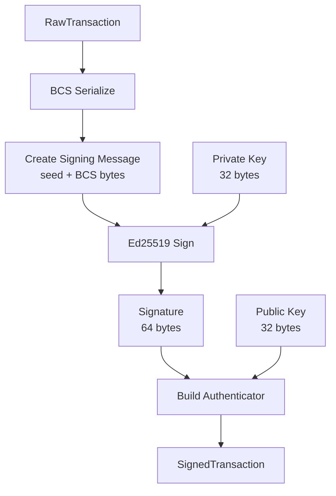

# Ed25519 Signing Specification

> **Version:** 1.0.0  
> **Status:** Stable  
> **Last Updated:** January 28, 2026

## Overview

This document specifies the complete process for signing Aptos transactions using Ed25519 (EdDSA over Curve25519). Ed25519 is the most common signature scheme in Aptos.

## Ed25519 Parameters

| Parameter | Value |
|-----------|-------|
| Curve | Curve25519 (Edwards form) |
| Hash | SHA-512 |
| Private Key Size | 32 bytes (seed) |
| Public Key Size | 32 bytes (compressed point) |
| Signature Size | 64 bytes (R || S) |
| Security Level | ~128 bits |

## Signing Process



## Step-by-Step Process

### Step 1: Prepare the Signing Message

```
signing_message = SHA3-256(SHA3-256("APTOS::RawTransaction") || "APTOS::") || BCS(raw_txn)
               = domain_separator || BCS(raw_txn)
```

### Step 2: Sign with Ed25519

Ed25519 signing (RFC 8032):

```
signature = Ed25519_Sign(private_key, signing_message)
          = (R, S)
```

Where:
- R is a curve point (32 bytes, compressed)
- S is a scalar (32 bytes)

### Step 3: Build Authenticator

```
authenticator = TransactionAuthenticator::Ed25519 {
    public_key: Ed25519PublicKey,
    signature: Ed25519Signature
}
```

### Step 4: Assemble SignedTransaction

```
signed_txn = SignedTransaction {
    raw_txn: RawTransaction,
    authenticator: TransactionAuthenticator
}
```

## Code Examples

### Rust

```rust
use aptos_crypto::{
    ed25519::{Ed25519PrivateKey, Ed25519PublicKey, Ed25519Signature},
    traits::{SigningKey, ValidCryptoMaterial},
    Uniform,
};
use aptos_types::transaction::{
    RawTransaction, SignedTransaction, TransactionAuthenticator,
};

/// Generate a new Ed25519 key pair
fn generate_key_pair() -> (Ed25519PrivateKey, Ed25519PublicKey) {
    let private_key = Ed25519PrivateKey::generate_for_testing();
    let public_key = Ed25519PublicKey::from(&private_key);
    (private_key, public_key)
}

/// Sign a raw transaction with Ed25519
fn sign_transaction(
    raw_txn: RawTransaction,
    private_key: &Ed25519PrivateKey,
) -> SignedTransaction {
    let public_key = Ed25519PublicKey::from(private_key);
    
    // Sign the raw transaction
    // The sign method internally:
    // 1. Gets the hasher seed for RawTransaction
    // 2. BCS serializes the transaction
    // 3. Creates signing_message = seed || bcs_bytes
    // 4. Computes Ed25519 signature
    let signature: Ed25519Signature = private_key.sign(&raw_txn)
        .expect("Signing should not fail");
    
    // Build authenticator
    let authenticator = TransactionAuthenticator::ed25519(public_key, signature);
    
    // Create signed transaction
    SignedTransaction::new_signed_transaction(raw_txn, authenticator)
}

/// Sign for SingleKey authenticator (modern format)
fn sign_transaction_single_key(
    raw_txn: RawTransaction,
    private_key: &Ed25519PrivateKey,
) -> SignedTransaction {
    use aptos_types::transaction::authenticator::{
        AccountAuthenticator, AnyPublicKey, AnySignature,
        SingleKeyAuthenticator, TransactionAuthenticator,
    };
    
    let public_key = Ed25519PublicKey::from(private_key);
    let signature = private_key.sign(&raw_txn).unwrap();
    
    // Wrap in SingleKey format
    let any_public_key = AnyPublicKey::ed25519(public_key);
    let any_signature = AnySignature::ed25519(signature);
    
    let single_key_auth = SingleKeyAuthenticator::new(any_public_key, any_signature);
    let account_auth = AccountAuthenticator::single_key(single_key_auth);
    let authenticator = TransactionAuthenticator::single_sender(account_auth);
    
    SignedTransaction::new_signed_transaction(raw_txn, authenticator)
}

/// Manual signing for demonstration
fn manual_sign(
    raw_txn: &RawTransaction,
    private_key: &Ed25519PrivateKey,
) -> Ed25519Signature {
    use aptos_crypto::{hash::CryptoHasher, traits::signing_message};
    
    // Step 1: Create signing message
    let signing_msg = signing_message(raw_txn)
        .expect("Serialization should not fail");
    
    // Step 2: Sign
    // Note: sign_arbitrary_message is only available in test/fuzzing builds
    // In production, use private_key.sign(&raw_txn)
    #[cfg(any(test, feature = "fuzzing"))]
    {
        private_key.sign_arbitrary_message(&signing_msg)
    }
    #[cfg(not(any(test, feature = "fuzzing")))]
    {
        private_key.sign(raw_txn).unwrap()
    }
}
```

### Python

```python
from nacl.signing import SigningKey, VerifyKey
from nacl.encoding import RawEncoder
import hashlib

class Ed25519Signer:
    """Ed25519 transaction signer for Aptos."""
    
    def __init__(self, private_key_bytes: bytes = None):
        """
        Initialize signer with optional private key.
        
        Args:
            private_key_bytes: 32-byte Ed25519 seed. If None, generates new key.
        """
        if private_key_bytes:
            if len(private_key_bytes) != 32:
                raise ValueError("Private key must be 32 bytes")
            self.signing_key = SigningKey(private_key_bytes)
        else:
            self.signing_key = SigningKey.generate()
        
        self.verify_key = self.signing_key.verify_key
    
    @property
    def private_key_bytes(self) -> bytes:
        """Get 32-byte private key seed."""
        return bytes(self.signing_key)
    
    @property
    def public_key_bytes(self) -> bytes:
        """Get 32-byte public key."""
        return bytes(self.verify_key)
    
    def sign_message(self, message: bytes) -> bytes:
        """
        Sign an arbitrary message.
        
        Args:
            message: The message to sign
        
        Returns:
            64-byte Ed25519 signature (R || S)
        """
        signed = self.signing_key.sign(message, encoder=RawEncoder)
        return signed.signature
    
    def sign_transaction(self, raw_txn_bcs: bytes) -> bytes:
        """
        Sign a BCS-serialized RawTransaction.
        
        Args:
            raw_txn_bcs: BCS-serialized RawTransaction bytes
        
        Returns:
            64-byte Ed25519 signature
        """
        # Create signing message
        signing_message = self._create_signing_message(raw_txn_bcs)
        
        # Sign
        return self.sign_message(signing_message)
    
    def _create_signing_message(self, raw_txn_bcs: bytes) -> bytes:
        """Create the signing message: domain_separator || bcs_bytes"""
        seed = compute_hasher_seed("APTOS::RawTransaction")
        return seed + raw_txn_bcs
    
    def build_authenticator(self, signature: bytes) -> bytes:
        """
        Build Ed25519 TransactionAuthenticator.
        
        Returns:
            BCS-serialized TransactionAuthenticator::Ed25519
        """
        result = bytearray()
        
        # Variant index (Ed25519 = 0)
        result.append(0x00)
        
        # Public key (32 bytes)
        result.extend(self.public_key_bytes)
        
        # Signature (64 bytes)
        result.extend(signature)
        
        return bytes(result)
    
    def build_single_key_authenticator(self, signature: bytes) -> bytes:
        """
        Build SingleKey TransactionAuthenticator for Ed25519.
        
        Returns:
            BCS-serialized TransactionAuthenticator::SingleSender
        """
        result = bytearray()
        
        # TransactionAuthenticator::SingleSender (variant 4)
        result.append(0x04)
        
        # AccountAuthenticator::SingleKey (variant 2)
        result.append(0x02)
        
        # AnyPublicKey::Ed25519 (variant 0)
        result.append(0x00)
        result.extend(self.public_key_bytes)
        
        # AnySignature::Ed25519 (variant 0)
        result.append(0x00)
        result.extend(signature)
        
        return bytes(result)


def compute_hasher_seed(type_name: str) -> bytes:
    """Compute SHA3-256(SHA3-256(type_name) || "APTOS::")"""
    inner = hashlib.sha3_256(type_name.encode()).digest()
    return hashlib.sha3_256(inner + b"APTOS::").digest()


def verify_signature(
    public_key: bytes,
    message: bytes,
    signature: bytes
) -> bool:
    """
    Verify an Ed25519 signature.
    
    Args:
        public_key: 32-byte public key
        message: The signed message
        signature: 64-byte signature
    
    Returns:
        True if valid, False otherwise
    """
    from nacl.signing import VerifyKey
    from nacl.exceptions import BadSignature
    
    try:
        verify_key = VerifyKey(public_key)
        verify_key.verify(message, signature)
        return True
    except BadSignature:
        return False


# Example usage
if __name__ == "__main__":
    # Create signer
    signer = Ed25519Signer()
    print(f"Public Key: {signer.public_key_bytes.hex()}")
    
    # Example BCS-serialized RawTransaction (placeholder)
    raw_txn_bcs = bytes.fromhex(
        "00000000000000000000000000000000000000000000000000000000000000010"
        "000000000000000000000004086010000000000006400000000000000009a686"
        "700000000000004"
    )
    
    # Sign
    signature = signer.sign_transaction(raw_txn_bcs)
    print(f"Signature: {signature.hex()}")
    
    # Build authenticator
    auth = signer.build_authenticator(signature)
    print(f"Authenticator ({len(auth)} bytes): {auth.hex()}")
    
    # Build SingleKey authenticator
    single_key_auth = signer.build_single_key_authenticator(signature)
    print(f"SingleKey Auth ({len(single_key_auth)} bytes): {single_key_auth.hex()}")
```

### TypeScript

```typescript
import * as nacl from 'tweetnacl';
import { sha3_256 } from '@noble/hashes/sha3';

/**
 * Ed25519 transaction signer for Aptos.
 */
class Ed25519Signer {
  private keyPair: nacl.SignKeyPair;

  constructor(privateKeyBytes?: Uint8Array) {
    if (privateKeyBytes) {
      if (privateKeyBytes.length !== 32) {
        throw new Error('Private key must be 32 bytes');
      }
      // nacl expects 64-byte secret key (seed + public key)
      // Generate full keypair from seed
      this.keyPair = nacl.sign.keyPair.fromSeed(privateKeyBytes);
    } else {
      this.keyPair = nacl.sign.keyPair();
    }
  }

  get privateKeyBytes(): Uint8Array {
    // Return just the 32-byte seed
    return this.keyPair.secretKey.slice(0, 32);
  }

  get publicKeyBytes(): Uint8Array {
    return this.keyPair.publicKey;
  }

  /**
   * Sign an arbitrary message.
   * @returns 64-byte Ed25519 signature (R || S)
   */
  signMessage(message: Uint8Array): Uint8Array {
    const signedMessage = nacl.sign(message, this.keyPair.secretKey);
    // nacl.sign returns signature + message, extract just signature
    return signedMessage.slice(0, 64);
  }

  /**
   * Sign a BCS-serialized RawTransaction.
   */
  signTransaction(rawTxnBcs: Uint8Array): Uint8Array {
    const signingMessage = this.createSigningMessage(rawTxnBcs);
    return this.signMessage(signingMessage);
  }

  private createSigningMessage(rawTxnBcs: Uint8Array): Uint8Array {
    const seed = computeHasherSeed('APTOS::RawTransaction');
    const result = new Uint8Array(seed.length + rawTxnBcs.length);
    result.set(seed);
    result.set(rawTxnBcs, seed.length);
    return result;
  }

  /**
   * Build Ed25519 TransactionAuthenticator.
   */
  buildAuthenticator(signature: Uint8Array): Uint8Array {
    // Total: 1 (variant) + 32 (pk) + 64 (sig) = 97 bytes
    const result = new Uint8Array(97);
    
    result[0] = 0x00; // Ed25519 variant
    result.set(this.publicKeyBytes, 1);
    result.set(signature, 33);
    
    return result;
  }

  /**
   * Build SingleKey TransactionAuthenticator for Ed25519.
   */
  buildSingleKeyAuthenticator(signature: Uint8Array): Uint8Array {
    // Total: 4 (variants) + 32 (pk) + 64 (sig) = 100 bytes
    const result = new Uint8Array(100);
    let offset = 0;
    
    result[offset++] = 0x04; // TransactionAuthenticator::SingleSender
    result[offset++] = 0x02; // AccountAuthenticator::SingleKey
    result[offset++] = 0x00; // AnyPublicKey::Ed25519
    result.set(this.publicKeyBytes, offset);
    offset += 32;
    result[offset++] = 0x00; // AnySignature::Ed25519
    result.set(signature, offset);
    
    return result;
  }
}

/**
 * Compute SHA3-256(SHA3-256(type_name) || "APTOS::")
 */
function computeHasherSeed(typeName: string): Uint8Array {
  const encoder = new TextEncoder();
  const inner = sha3_256(encoder.encode(typeName));
  const suffix = encoder.encode('APTOS::');
  const combined = new Uint8Array(inner.length + suffix.length);
  combined.set(inner);
  combined.set(suffix, inner.length);
  return sha3_256(combined);
}

/**
 * Verify an Ed25519 signature.
 */
function verifySignature(
  publicKey: Uint8Array,
  message: Uint8Array,
  signature: Uint8Array
): boolean {
  // nacl.sign.detached.verify expects signature and message separately
  return nacl.sign.detached.verify(message, signature, publicKey);
}

// Example usage
const signer = new Ed25519Signer();
console.log('Public Key:', Buffer.from(signer.publicKeyBytes).toString('hex'));

// Example BCS-serialized RawTransaction
const rawTxnBcs = new Uint8Array(Buffer.from(
  '00000000000000000000000000000000000000000000000000000000000000010' +
  '000000000000000000000004086010000000000006400000000000000009a686' +
  '700000000000004',
  'hex'
));

const signature = signer.signTransaction(rawTxnBcs);
console.log('Signature:', Buffer.from(signature).toString('hex'));

const auth = signer.buildAuthenticator(signature);
console.log(`Authenticator (${auth.length} bytes):`, Buffer.from(auth).toString('hex'));

export { Ed25519Signer, computeHasherSeed, verifySignature };
```

## Test Vector

### Key Material

| Field | Value (Hex) |
|-------|-------------|
| Private Key Seed (32 bytes) | `9bf49a6a0755f953811fce125f2683d50429c3bb49e074147e0089a52eae155f` |
| Public Key (32 bytes) | `de19e5d1880cac87d57484ce9ed2e84cf0f9c1a9436a30593a9a23a1768a6105` |

### Signing Example

**RawTransaction (BCS):**
```
0000000000000000000000000000000000000000000000000000000000000001  # sender
0000000000000000                                                  # sequence_number
00                                                                # payload variant (Script)
00                                                                # script code length
00                                                                # ty_args count
00                                                                # args count
40420f0000000000                                                  # max_gas_amount
6400000000000000                                                  # gas_unit_price
009a686700000000                                                  # expiration
04                                                                # chain_id
```

**Domain Separator:**
```
b5e97db07fa0bd0e5598aa3643a9bc6f6693bddc1a9fec9e674a461eaa00b193
```

**Signing Message:**
```
b5e97db07fa0bd0e5598aa3643a9bc6f6693bddc1a9fec9e674a461eaa00b193
<BCS bytes>
```

**Signature (example - depends on exact input):**
```
<64-byte signature>
```

## Security Considerations

1. **Private Key Protection**
   - Never expose private keys in logs, errors, or client-side code
   - Use secure random number generators for key generation
   - Consider hardware security modules (HSMs) for production

2. **Signature Malleability**
   - Ed25519 signatures must use canonical S values (S < L)
   - Aptos verifies signature canonicity

3. **Replay Protection**
   - Sequence numbers prevent transaction replay
   - Chain ID prevents cross-chain replay

4. **Side-Channel Attacks**
   - Use constant-time implementations
   - Avoid timing variations based on secret data

## Validation Rules

1. **Private Key**: Must be 32 bytes, not all zeros
2. **Public Key**: Must be a valid point on Curve25519
3. **Signature**: Must be 64 bytes, canonical form (S < L)
4. **Verification**: `Ed25519_Verify(public_key, signing_message, signature) == true`

## Related Documents

- [Transaction Hashing](01-transaction-hashing.md) - Signing message construction
- [Ed25519 Authenticator](../transaction-formats/02-ed25519-authenticator.md) - BCS format
- [SingleKey Authenticator](../transaction-formats/03-single-key-authenticator.md) - Modern format
