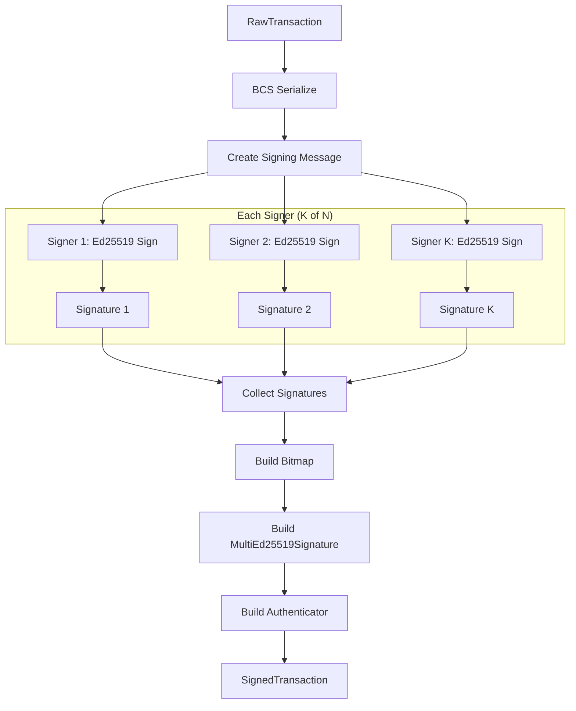
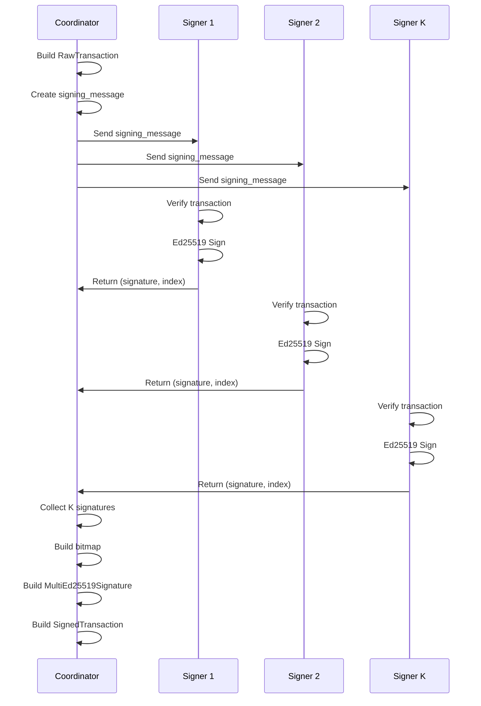

# MultiEd25519 Signing Specification

> **Version:** 1.0.0  
> **Status:** Stable (Legacy)  
> **Last Updated:** January 28, 2026

## Overview

This document specifies the process for K-of-N multi-signature signing using the legacy MultiEd25519 scheme. All signers use Ed25519 keys, and the threshold K must be met for a valid transaction.

## Signing Process Overview



## Multi-Signature Coordination

### Coordination Flow



## Code Examples

### Rust

```rust
use aptos_crypto::{
    ed25519::{Ed25519PrivateKey, Ed25519PublicKey, Ed25519Signature},
    multi_ed25519::{MultiEd25519PublicKey, MultiEd25519Signature},
    traits::SigningKey,
};
use aptos_types::transaction::{
    RawTransaction, SignedTransaction, TransactionAuthenticator,
};

/// Create a 2-of-3 multi-sig public key
fn create_multi_key(
    pk0: Ed25519PublicKey,
    pk1: Ed25519PublicKey,
    pk2: Ed25519PublicKey,
) -> MultiEd25519PublicKey {
    MultiEd25519PublicKey::new(vec![pk0, pk1, pk2], 2).unwrap()
}

/// Sign with specific signers (by index)
fn multi_sign(
    raw_txn: &RawTransaction,
    signers: &[(u8, &Ed25519PrivateKey)],  // (index, private_key)
) -> Vec<(Ed25519Signature, u8)> {
    signers.iter().map(|(idx, sk)| {
        let sig = sk.sign(raw_txn).unwrap();
        (sig, *idx)
    }).collect()
}

/// Build complete signed transaction
fn build_multi_ed25519_signed_txn(
    raw_txn: RawTransaction,
    public_key: MultiEd25519PublicKey,
    signatures: Vec<(Ed25519Signature, u8)>,
) -> SignedTransaction {
    let multi_sig = MultiEd25519Signature::new(signatures).unwrap();
    let authenticator = TransactionAuthenticator::multi_ed25519(public_key, multi_sig);
    SignedTransaction::new_signed_transaction(raw_txn, authenticator)
}

/// Example: Complete 2-of-3 signing flow
fn example_2_of_3_signing(
    raw_txn: RawTransaction,
    sk0: &Ed25519PrivateKey,
    sk1: &Ed25519PrivateKey,
    sk2: &Ed25519PrivateKey,
) -> SignedTransaction {
    // Create public keys
    let pk0 = Ed25519PublicKey::from(sk0);
    let pk1 = Ed25519PublicKey::from(sk1);
    let pk2 = Ed25519PublicKey::from(sk2);
    
    // Create multi-sig public key
    let multi_key = create_multi_key(pk0, pk1, pk2);
    
    // Sign with signers 0 and 2 (meeting 2-of-3 threshold)
    let signatures = multi_sign(&raw_txn, &[(0, sk0), (2, sk2)]);
    
    // Build signed transaction
    build_multi_ed25519_signed_txn(raw_txn, multi_key, signatures)
}
```

### Python

```python
from nacl.signing import SigningKey, VerifyKey
from nacl.encoding import RawEncoder
import hashlib
from typing import List, Tuple

BITMAP_NUM_OF_BYTES = 4
ED25519_SIGNATURE_LENGTH = 64

class MultiEd25519Signer:
    """Coordinator for MultiEd25519 signing."""
    
    def __init__(self, public_keys: List[bytes], threshold: int):
        """
        Initialize with the multi-sig public key configuration.
        
        Args:
            public_keys: List of 32-byte Ed25519 public keys
            threshold: Minimum signatures required
        """
        if threshold <= 0 or threshold > len(public_keys):
            raise ValueError("Invalid threshold")
        if len(public_keys) > 32:
            raise ValueError("Too many public keys")
        
        self.public_keys = public_keys
        self.threshold = threshold
    
    def create_signing_message(self, raw_txn_bcs: bytes) -> bytes:
        """Create the signing message for all signers."""
        seed = self._compute_seed("APTOS::RawTransaction")
        return seed + raw_txn_bcs
    
    def _compute_seed(self, type_name: str) -> bytes:
        inner = hashlib.sha3_256(type_name.encode()).digest()
        return hashlib.sha3_256(inner + b"APTOS::").digest()
    
    def sign_with_key(
        self,
        signing_message: bytes,
        private_key: bytes,
        key_index: int
    ) -> Tuple[bytes, int]:
        """
        Sign with a single key.
        
        Args:
            signing_message: The message to sign
            private_key: 32-byte Ed25519 private key
            key_index: Index of this key in the public_keys list
        
        Returns:
            (signature, index) tuple
        """
        if key_index >= len(self.public_keys):
            raise ValueError(f"Key index {key_index} out of range")
        
        signing_key = SigningKey(private_key)
        signed = signing_key.sign(signing_message, encoder=RawEncoder)
        return (signed.signature, key_index)
    
    def build_multi_signature(
        self,
        signatures: List[Tuple[bytes, int]]
    ) -> bytes:
        """
        Build MultiEd25519Signature from collected signatures.
        
        Args:
            signatures: List of (signature, index) tuples
        
        Returns:
            Serialized MultiEd25519Signature
        """
        if len(signatures) < self.threshold:
            raise ValueError(f"Need at least {self.threshold} signatures")
        
        # Check for duplicates
        indices = set()
        for _, idx in signatures:
            if idx in indices:
                raise ValueError(f"Duplicate signature index: {idx}")
            indices.add(idx)
        
        # Sort by index
        sorted_sigs = sorted(signatures, key=lambda x: x[1])
        
        # Build result: signatures || bitmap
        result = bytearray()
        bitmap = [0, 0, 0, 0]
        
        for sig, idx in sorted_sigs:
            result.extend(sig)
            # Set bit in bitmap (MSB first within each byte)
            byte_idx = idx // 8
            bit_idx = 7 - (idx % 8)
            bitmap[byte_idx] |= (1 << bit_idx)
        
        result.extend(bitmap)
        return bytes(result)
    
    def serialize_public_key(self) -> bytes:
        """Serialize the MultiEd25519PublicKey."""
        result = bytearray()
        for pk in self.public_keys:
            result.extend(pk)
        result.append(self.threshold)
        return bytes(result)
    
    def build_authenticator(
        self,
        multi_signature: bytes
    ) -> bytes:
        """
        Build TransactionAuthenticator::MultiEd25519.
        
        Returns:
            Serialized authenticator
        """
        result = bytearray()
        
        # Variant index (MultiEd25519 = 1)
        result.append(0x01)
        
        # Public key
        result.extend(self.serialize_public_key())
        
        # Signature
        result.extend(multi_signature)
        
        return bytes(result)


def example_2_of_3_flow():
    """Example: Complete 2-of-3 signing flow."""
    
    # Generate 3 key pairs (in real usage, these would be from different parties)
    from nacl.signing import SigningKey
    
    sk0 = SigningKey.generate()
    sk1 = SigningKey.generate()
    sk2 = SigningKey.generate()
    
    pk0 = bytes(sk0.verify_key)
    pk1 = bytes(sk1.verify_key)
    pk2 = bytes(sk2.verify_key)
    
    # Create coordinator
    coordinator = MultiEd25519Signer(
        public_keys=[pk0, pk1, pk2],
        threshold=2
    )
    
    # Example raw transaction BCS (placeholder)
    raw_txn_bcs = bytes(100)
    
    # Create signing message
    signing_message = coordinator.create_signing_message(raw_txn_bcs)
    
    # Collect signatures from signers 0 and 2
    sig0 = coordinator.sign_with_key(signing_message, bytes(sk0), 0)
    sig2 = coordinator.sign_with_key(signing_message, bytes(sk2), 2)
    
    # Build multi-signature
    multi_sig = coordinator.build_multi_signature([sig0, sig2])
    
    # Build authenticator
    authenticator = coordinator.build_authenticator(multi_sig)
    
    print(f"Authenticator ({len(authenticator)} bytes): {authenticator.hex()}")
    
    return authenticator


if __name__ == "__main__":
    example_2_of_3_flow()
```

### TypeScript

```typescript
import * as nacl from 'tweetnacl';
import { sha3_256 } from '@noble/hashes/sha3';

const BITMAP_NUM_OF_BYTES = 4;
const ED25519_PUBLIC_KEY_LENGTH = 32;
const ED25519_SIGNATURE_LENGTH = 64;

interface SignatureWithIndex {
  signature: Uint8Array;
  index: number;
}

class MultiEd25519Signer {
  private publicKeys: Uint8Array[];
  private threshold: number;

  constructor(publicKeys: Uint8Array[], threshold: number) {
    if (threshold <= 0 || threshold > publicKeys.length) {
      throw new Error('Invalid threshold');
    }
    if (publicKeys.length > 32) {
      throw new Error('Too many public keys');
    }

    this.publicKeys = publicKeys;
    this.threshold = threshold;
  }

  /**
   * Create the signing message for all signers.
   */
  createSigningMessage(rawTxnBcs: Uint8Array): Uint8Array {
    const seed = this.computeSeed('APTOS::RawTransaction');
    const result = new Uint8Array(seed.length + rawTxnBcs.length);
    result.set(seed);
    result.set(rawTxnBcs, seed.length);
    return result;
  }

  private computeSeed(typeName: string): Uint8Array {
    const encoder = new TextEncoder();
    const inner = sha3_256(encoder.encode(typeName));
    const suffix = encoder.encode('APTOS::');
    const combined = new Uint8Array(inner.length + suffix.length);
    combined.set(inner);
    combined.set(suffix, inner.length);
    return sha3_256(combined);
  }

  /**
   * Sign with a single key.
   */
  signWithKey(
    signingMessage: Uint8Array,
    secretKey: Uint8Array,  // 64-byte nacl secret key
    keyIndex: number
  ): SignatureWithIndex {
    if (keyIndex >= this.publicKeys.length) {
      throw new Error(`Key index ${keyIndex} out of range`);
    }

    const signedMessage = nacl.sign(signingMessage, secretKey);
    const signature = signedMessage.slice(0, ED25519_SIGNATURE_LENGTH);

    return { signature, index: keyIndex };
  }

  /**
   * Build MultiEd25519Signature from collected signatures.
   */
  buildMultiSignature(signatures: SignatureWithIndex[]): Uint8Array {
    if (signatures.length < this.threshold) {
      throw new Error(`Need at least ${this.threshold} signatures`);
    }

    // Check for duplicates
    const indices = new Set<number>();
    for (const sig of signatures) {
      if (indices.has(sig.index)) {
        throw new Error(`Duplicate signature index: ${sig.index}`);
      }
      indices.add(sig.index);
    }

    // Sort by index
    const sortedSigs = [...signatures].sort((a, b) => a.index - b.index);

    // Build result
    const totalSize = sortedSigs.length * ED25519_SIGNATURE_LENGTH + BITMAP_NUM_OF_BYTES;
    const result = new Uint8Array(totalSize);
    const bitmap = new Uint8Array(BITMAP_NUM_OF_BYTES);

    let offset = 0;
    for (const sig of sortedSigs) {
      result.set(sig.signature, offset);
      offset += ED25519_SIGNATURE_LENGTH;

      // Set bit in bitmap
      const byteIdx = Math.floor(sig.index / 8);
      const bitIdx = 7 - (sig.index % 8);
      bitmap[byteIdx] |= 1 << bitIdx;
    }

    result.set(bitmap, offset);
    return result;
  }

  /**
   * Serialize the MultiEd25519PublicKey.
   */
  serializePublicKey(): Uint8Array {
    const size = this.publicKeys.length * ED25519_PUBLIC_KEY_LENGTH + 1;
    const result = new Uint8Array(size);

    let offset = 0;
    for (const pk of this.publicKeys) {
      result.set(pk, offset);
      offset += ED25519_PUBLIC_KEY_LENGTH;
    }
    result[offset] = this.threshold;

    return result;
  }

  /**
   * Build TransactionAuthenticator::MultiEd25519.
   */
  buildAuthenticator(multiSignature: Uint8Array): Uint8Array {
    const pkBytes = this.serializePublicKey();
    const result = new Uint8Array(1 + pkBytes.length + multiSignature.length);

    result[0] = 0x01; // MultiEd25519 variant
    result.set(pkBytes, 1);
    result.set(multiSignature, 1 + pkBytes.length);

    return result;
  }
}

// Example usage
function example2of3Flow(): Uint8Array {
  // Generate 3 key pairs
  const keyPair0 = nacl.sign.keyPair();
  const keyPair1 = nacl.sign.keyPair();
  const keyPair2 = nacl.sign.keyPair();

  // Create coordinator
  const coordinator = new MultiEd25519Signer(
    [keyPair0.publicKey, keyPair1.publicKey, keyPair2.publicKey],
    2
  );

  // Example raw transaction BCS
  const rawTxnBcs = new Uint8Array(100);

  // Create signing message
  const signingMessage = coordinator.createSigningMessage(rawTxnBcs);

  // Collect signatures from signers 0 and 2
  const sig0 = coordinator.signWithKey(signingMessage, keyPair0.secretKey, 0);
  const sig2 = coordinator.signWithKey(signingMessage, keyPair2.secretKey, 2);

  // Build multi-signature
  const multiSig = coordinator.buildMultiSignature([sig0, sig2]);

  // Build authenticator
  const authenticator = coordinator.buildAuthenticator(multiSig);

  console.log(`Authenticator (${authenticator.length} bytes):`, 
    Buffer.from(authenticator).toString('hex'));

  return authenticator;
}

example2of3Flow();

export { MultiEd25519Signer, SignatureWithIndex };
```

## Bitmap Operations

### Setting a Bit

```python
def bitmap_set_bit(bitmap: bytearray, index: int):
    """Set bit at index (0-31) in 4-byte bitmap."""
    byte_idx = index // 8
    bit_idx = 7 - (index % 8)  # MSB first
    bitmap[byte_idx] |= (1 << bit_idx)
```

### Checking a Bit

```python
def bitmap_get_bit(bitmap: bytes, index: int) -> bool:
    """Check if bit at index is set."""
    byte_idx = index // 8
    bit_idx = 7 - (index % 8)
    return bool(bitmap[byte_idx] & (1 << bit_idx))
```

### Counting Set Bits

```python
def bitmap_count_ones(bitmap: bytes) -> int:
    """Count number of set bits."""
    return sum(bin(b).count('1') for b in bitmap)
```

## Validation Rules

1. **Threshold**: `1 <= threshold <= num_keys <= 32`
2. **Signature Count**: `num_signatures >= threshold`
3. **Bitmap Match**: `bitmap.count_ones() == num_signatures`
4. **Index Range**: All signature indices < `num_keys`
5. **No Duplicates**: Each key can sign at most once
6. **Signature Order**: Signatures must be ordered by their key indices

## Security Considerations

1. **Independent Signing**: Each signer should independently verify the transaction
2. **Secure Communication**: Use secure channels when coordinating
3. **Key Diversity**: Store keys separately to prevent single point of failure
4. **Threshold Selection**: Choose threshold based on security/availability tradeoff

## Related Documents

- [MultiEd25519 Authenticator](../transaction-formats/05-multi-ed25519-authenticator.md) - BCS format
- [MultiKey Authenticator](../transaction-formats/04-multi-key-authenticator.md) - Modern alternative
- [Ed25519 Signing](02-ed25519-signing.md) - Single-key signing
