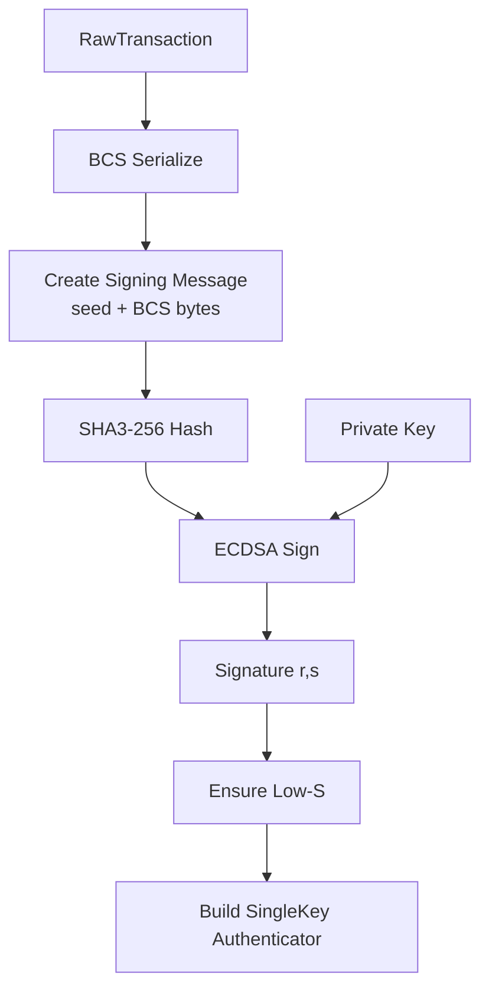

# Secp256k1 ECDSA Signing Specification

> **Version:** 1.0.0  
> **Status:** Stable  
> **Last Updated:** January 28, 2026

## Overview

This document specifies transaction signing using the secp256k1 elliptic curve with ECDSA. This is the same curve used by Bitcoin and Ethereum, making it useful for cross-chain compatibility.

## Secp256k1 Parameters

| Parameter | Value |
|-----------|-------|
| Curve | secp256k1 |
| Field Size | 256 bits |
| Hash | SHA3-256 (for Aptos message hashing) |
| Private Key Size | 32 bytes |
| Public Key Size | 65 bytes (uncompressed: `04 || x || y`) |
| Signature Size | 64 bytes (`r || s`, no recovery ID) |
| Security Level | ~128 bits |

## Key Format

### Private Key
- 32 bytes
- Must be in range `[1, n-1]` where `n` is the curve order

### Public Key (Uncompressed)
```
┌─────────────────────────────────────────────────────────────────┐
│                 Secp256k1 Public Key (65 bytes)                  │
├─────────────────────────────────────────────────────────────────┤
│ Byte 0  │ 0x04 (uncompressed point indicator)                   │
│ Bytes 1-32 │ X coordinate (32 bytes, big-endian)                │
│ Bytes 33-64 │ Y coordinate (32 bytes, big-endian)               │
└─────────────────────────────────────────────────────────────────┘
```

### Signature Format
```
┌─────────────────────────────────────────────────────────────────┐
│                  Secp256k1 Signature (64 bytes)                  │
├─────────────────────────────────────────────────────────────────┤
│ Bytes 0-31  │ r component (32 bytes, big-endian)                │
│ Bytes 32-63 │ s component (32 bytes, big-endian)                │
└─────────────────────────────────────────────────────────────────┘
```

**Note**: Aptos uses "low-S" canonical signatures where `s <= n/2`.

## Signing Process



## Code Examples

### Rust

```rust
use aptos_crypto::{
    secp256k1_ecdsa::{PrivateKey, PublicKey, Signature},
    traits::SigningKey,
};
use aptos_types::transaction::authenticator::{
    AccountAuthenticator, AnyPublicKey, AnySignature,
    SingleKeyAuthenticator, TransactionAuthenticator,
};

/// Sign with Secp256k1
fn sign_with_secp256k1(
    raw_txn: &RawTransaction,
    private_key: &PrivateKey,
) -> TransactionAuthenticator {
    let public_key = private_key.public_key();
    
    // Sign the transaction
    // Internally: hash = SHA3-256(domain_separator || BCS(raw_txn))
    // Then ECDSA sign the hash
    let signature = private_key.sign(raw_txn).unwrap();
    
    // Wrap in SingleKey format
    let any_public_key = AnyPublicKey::secp256k1_ecdsa(public_key);
    let any_signature = AnySignature::secp256k1_ecdsa(signature);
    
    let single_key_auth = SingleKeyAuthenticator::new(any_public_key, any_signature);
    let account_auth = AccountAuthenticator::single_key(single_key_auth);
    
    TransactionAuthenticator::single_sender(account_auth)
}

/// Derive address from Secp256k1 public key
fn derive_address(public_key: &PublicKey) -> AccountAddress {
    use aptos_types::transaction::authenticator::AuthenticationKey;
    
    let any_public_key = AnyPublicKey::secp256k1_ecdsa(public_key.clone());
    AuthenticationKey::any_key(any_public_key).account_address()
}
```

### Python

```python
from ecdsa import SigningKey, VerifyingKey, SECP256k1, BadSignatureError
from ecdsa.util import sigencode_string, sigdecode_string
import hashlib

class Secp256k1Signer:
    """Secp256k1 ECDSA signer for Aptos transactions."""
    
    CURVE = SECP256k1
    CURVE_ORDER = SECP256k1.order
    
    def __init__(self, private_key_bytes: bytes = None):
        """
        Initialize signer with optional private key.
        
        Args:
            private_key_bytes: 32-byte private key. If None, generates new key.
        """
        if private_key_bytes:
            if len(private_key_bytes) != 32:
                raise ValueError("Private key must be 32 bytes")
            self.signing_key = SigningKey.from_string(
                private_key_bytes, 
                curve=self.CURVE
            )
        else:
            self.signing_key = SigningKey.generate(curve=self.CURVE)
        
        self.verifying_key = self.signing_key.verifying_key
    
    @property
    def private_key_bytes(self) -> bytes:
        """Get 32-byte private key."""
        return self.signing_key.to_string()
    
    @property
    def public_key_bytes(self) -> bytes:
        """Get 65-byte uncompressed public key (04 || x || y)."""
        # ecdsa library returns 64 bytes (x || y), we need to prepend 0x04
        point_bytes = self.verifying_key.to_string()
        return b'\x04' + point_bytes
    
    def sign_message(self, message: bytes) -> bytes:
        """
        Sign a message using ECDSA with low-S normalization.
        
        Args:
            message: The message to sign (will be hashed)
        
        Returns:
            64-byte signature (r || s) with low-S
        """
        # Hash the message with SHA3-256
        message_hash = hashlib.sha3_256(message).digest()
        
        # Sign (ecdsa library uses SHA-1 by default, we pass pre-hashed data)
        signature = self.signing_key.sign_digest(
            message_hash,
            sigencode=sigencode_string
        )
        
        # Extract r and s
        r = int.from_bytes(signature[:32], 'big')
        s = int.from_bytes(signature[32:], 'big')
        
        # Ensure low-S (canonical form)
        if s > self.CURVE_ORDER // 2:
            s = self.CURVE_ORDER - s
        
        # Return r || s (64 bytes)
        return r.to_bytes(32, 'big') + s.to_bytes(32, 'big')
    
    def sign_transaction(self, raw_txn_bcs: bytes) -> bytes:
        """
        Sign a BCS-serialized RawTransaction.
        
        Args:
            raw_txn_bcs: BCS-serialized RawTransaction
        
        Returns:
            64-byte ECDSA signature
        """
        # Create signing message
        signing_message = self._create_signing_message(raw_txn_bcs)
        
        # Sign (message will be hashed internally)
        return self.sign_message(signing_message)
    
    def _create_signing_message(self, raw_txn_bcs: bytes) -> bytes:
        """Create signing message: domain_separator || bcs_bytes"""
        seed = self._compute_seed("APTOS::RawTransaction")
        return seed + raw_txn_bcs
    
    def _compute_seed(self, type_name: str) -> bytes:
        inner = hashlib.sha3_256(type_name.encode()).digest()
        return hashlib.sha3_256(inner + b"APTOS::").digest()
    
    def derive_authentication_key(self) -> bytes:
        """
        Derive authentication key.
        auth_key = SHA3-256(BCS(AnyPublicKey::Secp256k1) || scheme_id)
        """
        # BCS(AnyPublicKey::Secp256k1Ecdsa) = variant(1) || public_key(65)
        any_pk_bytes = bytes([0x01]) + self.public_key_bytes
        
        # Scheme ID for SingleKey = 2
        return hashlib.sha3_256(any_pk_bytes + bytes([0x02])).digest()
    
    def derive_address(self) -> str:
        """Derive account address."""
        return "0x" + self.derive_authentication_key().hex()
    
    def build_authenticator(self, signature: bytes) -> bytes:
        """
        Build SingleKey TransactionAuthenticator for Secp256k1.
        
        Returns:
            BCS-serialized TransactionAuthenticator::SingleSender
        """
        result = bytearray()
        
        # TransactionAuthenticator::SingleSender (variant 4)
        result.append(0x04)
        
        # AccountAuthenticator::SingleKey (variant 2)
        result.append(0x02)
        
        # AnyPublicKey::Secp256k1Ecdsa (variant 1)
        result.append(0x01)
        result.extend(self.public_key_bytes)
        
        # AnySignature::Secp256k1Ecdsa (variant 1)
        result.append(0x01)
        result.extend(signature)
        
        return bytes(result)


def verify_signature(
    public_key: bytes,  # 65 bytes (04 || x || y)
    message: bytes,
    signature: bytes    # 64 bytes (r || s)
) -> bool:
    """Verify a Secp256k1 ECDSA signature."""
    try:
        # Remove 0x04 prefix for ecdsa library
        if public_key[0] == 0x04:
            point_bytes = public_key[1:]
        else:
            point_bytes = public_key
        
        verifying_key = VerifyingKey.from_string(point_bytes, curve=SECP256k1)
        
        # Hash the message
        message_hash = hashlib.sha3_256(message).digest()
        
        # Verify
        return verifying_key.verify_digest(
            signature,
            message_hash,
            sigdecode=sigdecode_string
        )
    except BadSignatureError:
        return False


# Example usage
if __name__ == "__main__":
    signer = Secp256k1Signer()
    
    print(f"Private Key: {signer.private_key_bytes.hex()}")
    print(f"Public Key: {signer.public_key_bytes.hex()}")
    print(f"Address: {signer.derive_address()}")
    
    # Example transaction signing
    raw_txn_bcs = bytes(100)  # Placeholder
    signature = signer.sign_transaction(raw_txn_bcs)
    print(f"Signature: {signature.hex()}")
    
    # Build authenticator
    auth = signer.build_authenticator(signature)
    print(f"Authenticator ({len(auth)} bytes): {auth.hex()}")
```

### TypeScript

```typescript
import { secp256k1 } from '@noble/curves/secp256k1';
import { sha3_256 } from '@noble/hashes/sha3';

const CURVE_ORDER = secp256k1.CURVE.n;

class Secp256k1Signer {
  private privateKey: Uint8Array;
  private publicKey: Uint8Array;

  constructor(privateKeyBytes?: Uint8Array) {
    if (privateKeyBytes) {
      if (privateKeyBytes.length !== 32) {
        throw new Error('Private key must be 32 bytes');
      }
      this.privateKey = privateKeyBytes;
    } else {
      this.privateKey = secp256k1.utils.randomPrivateKey();
    }

    // Get uncompressed public key (65 bytes: 04 || x || y)
    this.publicKey = secp256k1.getPublicKey(this.privateKey, false);
  }

  get privateKeyBytes(): Uint8Array {
    return this.privateKey;
  }

  get publicKeyBytes(): Uint8Array {
    return this.publicKey;
  }

  /**
   * Sign a message with low-S normalization.
   */
  signMessage(message: Uint8Array): Uint8Array {
    // Hash the message
    const messageHash = sha3_256(message);

    // Sign
    const sig = secp256k1.sign(messageHash, this.privateKey, {
      lowS: true, // Ensure canonical low-S
    });

    // Return r || s (64 bytes)
    return sig.toCompactRawBytes();
  }

  /**
   * Sign a BCS-serialized RawTransaction.
   */
  signTransaction(rawTxnBcs: Uint8Array): Uint8Array {
    const signingMessage = this.createSigningMessage(rawTxnBcs);
    return this.signMessage(signingMessage);
  }

  private createSigningMessage(rawTxnBcs: Uint8Array): Uint8Array {
    const seed = this.computeSeed('APTOS::RawTransaction');
    const result = new Uint8Array(seed.length + rawTxnBcs.length);
    result.set(seed);
    result.set(rawTxnBcs, seed.length);
    return result;
  }

  private computeSeed(typeName: string): Uint8Array {
    const encoder = new TextEncoder();
    const inner = sha3_256(encoder.encode(typeName));
    const suffix = encoder.encode('APTOS::');
    const combined = new Uint8Array(inner.length + suffix.length);
    combined.set(inner);
    combined.set(suffix, inner.length);
    return sha3_256(combined);
  }

  /**
   * Derive authentication key.
   */
  deriveAuthenticationKey(): Uint8Array {
    // BCS(AnyPublicKey::Secp256k1Ecdsa) = variant(1) || public_key(65)
    const anyPkBytes = new Uint8Array(1 + this.publicKey.length);
    anyPkBytes[0] = 0x01; // Secp256k1Ecdsa variant
    anyPkBytes.set(this.publicKey, 1);

    // Append scheme ID (SingleKey = 2)
    const data = new Uint8Array(anyPkBytes.length + 1);
    data.set(anyPkBytes);
    data[anyPkBytes.length] = 0x02;

    return sha3_256(data);
  }

  /**
   * Derive account address.
   */
  deriveAddress(): string {
    const authKey = this.deriveAuthenticationKey();
    return '0x' + Buffer.from(authKey).toString('hex');
  }

  /**
   * Build SingleKey TransactionAuthenticator.
   */
  buildAuthenticator(signature: Uint8Array): Uint8Array {
    // Total: 4 (variants) + 65 (pk) + 64 (sig) = 133 bytes
    const result = new Uint8Array(133);
    let offset = 0;

    result[offset++] = 0x04; // TransactionAuthenticator::SingleSender
    result[offset++] = 0x02; // AccountAuthenticator::SingleKey
    result[offset++] = 0x01; // AnyPublicKey::Secp256k1Ecdsa
    result.set(this.publicKey, offset);
    offset += 65;
    result[offset++] = 0x01; // AnySignature::Secp256k1Ecdsa
    result.set(signature, offset);

    return result;
  }
}

/**
 * Verify a Secp256k1 signature.
 */
function verifySignature(
  publicKey: Uint8Array, // 65 bytes
  message: Uint8Array,
  signature: Uint8Array  // 64 bytes
): boolean {
  try {
    const messageHash = sha3_256(message);
    return secp256k1.verify(signature, messageHash, publicKey);
  } catch {
    return false;
  }
}

// Example usage
const signer = new Secp256k1Signer();
console.log('Public Key:', Buffer.from(signer.publicKeyBytes).toString('hex'));
console.log('Address:', signer.deriveAddress());

const rawTxnBcs = new Uint8Array(100); // Placeholder
const signature = signer.signTransaction(rawTxnBcs);
console.log('Signature:', Buffer.from(signature).toString('hex'));

const auth = signer.buildAuthenticator(signature);
console.log(`Authenticator (${auth.length} bytes):`, Buffer.from(auth).toString('hex'));

export { Secp256k1Signer, verifySignature };
```

## Low-S Normalization

ECDSA signatures have a malleability issue: both `(r, s)` and `(r, n - s)` are valid signatures for the same message. Aptos requires "low-S" signatures where `s <= n/2`.

```python
def normalize_s(s: int, curve_order: int) -> int:
    """Ensure s is in the lower half of the curve order."""
    if s > curve_order // 2:
        return curve_order - s
    return s
```

## Test Vector

### Key Material

| Field | Value (Hex) |
|-------|-------------|
| Private Key (32 bytes) | `deadbeefdeadbeefdeadbeefdeadbeefdeadbeefdeadbeefdeadbeefdeadbeef` |
| Public Key (65 bytes) | `04...` (computed from private key) |

### Authenticator Layout

```
04                     # TransactionAuthenticator::SingleSender
02                     # AccountAuthenticator::SingleKey
01                     # AnyPublicKey::Secp256k1Ecdsa
04<x32><y32>           # Public key (65 bytes)
01                     # AnySignature::Secp256k1Ecdsa
<r32><s32>             # Signature (64 bytes)
```

## Security Considerations

1. **Low-S Requirement**: Always use canonical low-S signatures
2. **Private Key Security**: Same as Ed25519 - protect keys carefully
3. **Deterministic Signing**: Use RFC 6979 for deterministic k values
4. **Cross-Chain Usage**: Different address derivation than Ethereum

## Comparison with Ethereum

| Aspect | Aptos Secp256k1 | Ethereum |
|--------|-----------------|----------|
| Message Hash | SHA3-256(signing_message) | Keccak256(message) |
| Signature Format | r \|\| s (64 bytes) | r \|\| s \|\| v (65 bytes) |
| Public Key in Auth | Full 65 bytes | Recovered from signature |
| Address Derivation | SHA3-256(BCS(AnyPK) \|\| scheme) | Keccak256(pk)[12:] |

## Related Documents

- [SingleKey Authenticator](../transaction-formats/03-single-key-authenticator.md) - BCS format
- [Transaction Hashing](01-transaction-hashing.md) - Signing message construction
- [Ed25519 Signing](02-ed25519-signing.md) - Alternative signature scheme
