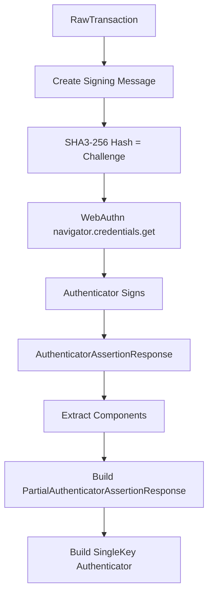
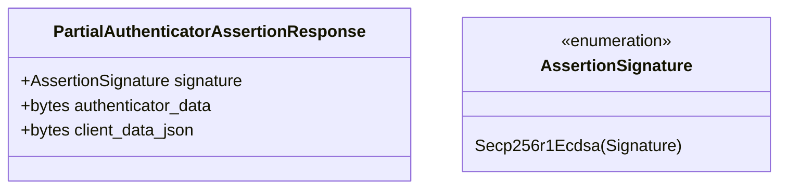
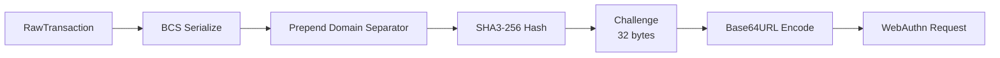
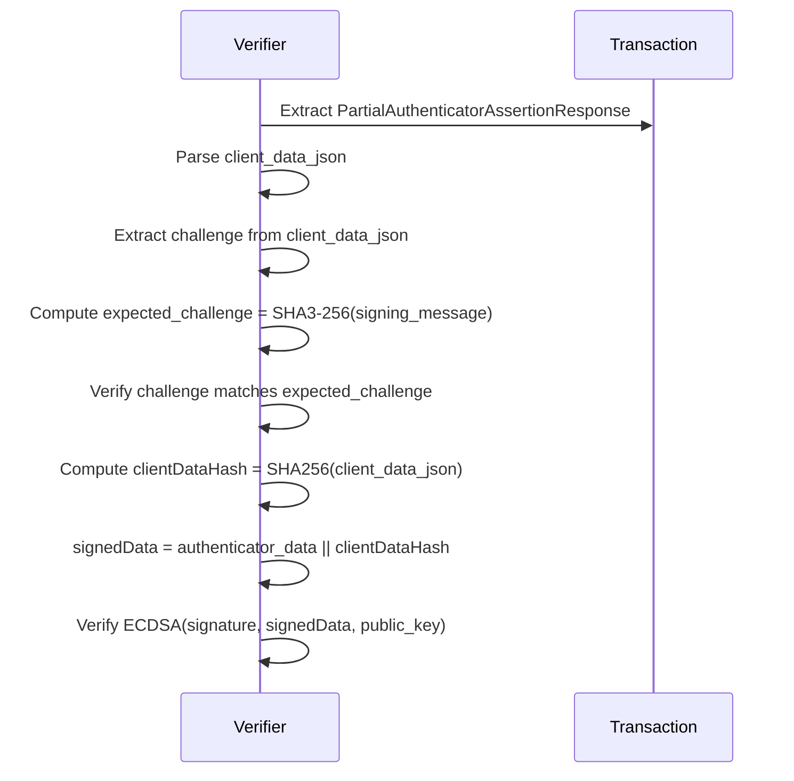

# Secp256r1 / WebAuthn Signing Specification

> **Version:** 1.0.0  
> **Status:** Stable  
> **Last Updated:** January 28, 2026

## Overview

This document specifies transaction signing using the secp256r1 (P-256/prime256v1) elliptic curve, primarily used with WebAuthn/Passkeys. This enables hardware-backed authentication using device biometrics (Face ID, Touch ID, Windows Hello).

## WebAuthn Integration



## Secp256r1 Parameters

| Parameter | Value |
|-----------|-------|
| Curve | secp256r1 (P-256/prime256v1) |
| Field Size | 256 bits |
| Private Key Size | 32 bytes |
| Public Key Size | 65 bytes (uncompressed) |
| Signature Size | 64 bytes (r \|\| s) |

## WebAuthn Assertion Structure

### PartialAuthenticatorAssertionResponse



### BCS Layout

```
┌─────────────────────────────────────────────────────────────────┐
│              PartialAuthenticatorAssertionResponse               │
├─────────────────────────────────────────────────────────────────┤
│ Field             │ Type              │ Description             │
├───────────────────┼───────────────────┼─────────────────────────┤
│ signature         │ AssertionSignature│ The ECDSA signature     │
│ authenticator_data│ Vec<u8>           │ WebAuthn authenticator  │
│ client_data_json  │ Vec<u8>           │ Client data JSON bytes  │
└─────────────────────────────────────────────────────────────────┘
```

## Challenge Computation

The WebAuthn challenge is the SHA3-256 hash of the signing message:

```
signing_message = domain_separator || BCS(RawTransaction)
challenge = SHA3-256(signing_message)
```



## Code Examples

### Rust

```rust
use aptos_crypto::{
    secp256r1_ecdsa::{PublicKey, Signature},
    HashValue,
};
use aptos_types::transaction::{
    authenticator::{
        AccountAuthenticator, AnyPublicKey, AnySignature,
        SingleKeyAuthenticator, TransactionAuthenticator,
    },
    webauthn::{AssertionSignature, PartialAuthenticatorAssertionResponse},
    RawTransaction,
};

/// Build WebAuthn authenticator from assertion response
fn build_webauthn_authenticator(
    public_key: PublicKey,
    signature: Signature,
    authenticator_data: Vec<u8>,
    client_data_json: Vec<u8>,
) -> TransactionAuthenticator {
    // Build PartialAuthenticatorAssertionResponse
    let paar = PartialAuthenticatorAssertionResponse::new(
        AssertionSignature::Secp256r1Ecdsa { signature },
        authenticator_data,
        client_data_json,
    );
    
    // Wrap in AnySignature::WebAuthn
    let any_signature = AnySignature::webauthn(paar);
    let any_public_key = AnyPublicKey::secp256r1_ecdsa(public_key);
    
    let single_key_auth = SingleKeyAuthenticator::new(any_public_key, any_signature);
    let account_auth = AccountAuthenticator::single_key(single_key_auth);
    
    TransactionAuthenticator::single_sender(account_auth)
}

/// Compute the challenge from a raw transaction
fn compute_challenge(raw_txn: &RawTransaction) -> [u8; 32] {
    use aptos_crypto::traits::signing_message;
    
    let signing_msg = signing_message(raw_txn)
        .expect("Signing message creation failed");
    
    *HashValue::sha3_256_of(&signing_msg).as_ref()
}
```

### Python

```python
import hashlib
import base64
import json
from dataclasses import dataclass
from typing import Optional

@dataclass
class WebAuthnComponents:
    """Components extracted from WebAuthn assertion response."""
    signature: bytes           # 64 bytes (r || s)
    authenticator_data: bytes  # Variable length
    client_data_json: bytes    # UTF-8 JSON bytes


class Secp256r1WebAuthnSigner:
    """
    Handles Secp256r1/WebAuthn signing for Aptos.
    
    Note: Actual WebAuthn signing happens in the browser/OS.
    This class handles the Aptos-specific parts.
    """
    
    def __init__(self, public_key: bytes):
        """
        Initialize with the public key from WebAuthn registration.
        
        Args:
            public_key: 65-byte uncompressed secp256r1 public key
        """
        if len(public_key) != 65 or public_key[0] != 0x04:
            raise ValueError("Invalid uncompressed secp256r1 public key")
        self.public_key = public_key
    
    def compute_challenge(self, raw_txn_bcs: bytes) -> bytes:
        """
        Compute the WebAuthn challenge from a raw transaction.
        
        The challenge is SHA3-256 of the signing message.
        
        Args:
            raw_txn_bcs: BCS-serialized RawTransaction
        
        Returns:
            32-byte challenge
        """
        signing_message = self._create_signing_message(raw_txn_bcs)
        return hashlib.sha3_256(signing_message).digest()
    
    def _create_signing_message(self, raw_txn_bcs: bytes) -> bytes:
        seed = self._compute_seed("APTOS::RawTransaction")
        return seed + raw_txn_bcs
    
    def _compute_seed(self, type_name: str) -> bytes:
        inner = hashlib.sha3_256(type_name.encode()).digest()
        return hashlib.sha3_256(inner + b"APTOS::").digest()
    
    def create_webauthn_request(self, challenge: bytes) -> dict:
        """
        Create the WebAuthn credential request options.
        
        This would be passed to navigator.credentials.get() in a browser.
        
        Args:
            challenge: 32-byte challenge
        
        Returns:
            PublicKeyCredentialRequestOptions dict
        """
        return {
            "challenge": base64.urlsafe_b64encode(challenge).rstrip(b'=').decode(),
            "timeout": 60000,
            "userVerification": "preferred",
            # rpId and allowCredentials would be set by the application
        }
    
    def parse_webauthn_response(
        self,
        authenticator_data: bytes,
        client_data_json: bytes,
        signature_der: bytes
    ) -> WebAuthnComponents:
        """
        Parse WebAuthn assertion response components.
        
        Args:
            authenticator_data: Raw authenticator data bytes
            client_data_json: Client data JSON as UTF-8 bytes
            signature_der: DER-encoded ECDSA signature from WebAuthn
        
        Returns:
            WebAuthnComponents with parsed signature
        """
        # Convert DER signature to raw r||s format
        signature = self._der_to_raw_signature(signature_der)
        
        return WebAuthnComponents(
            signature=signature,
            authenticator_data=authenticator_data,
            client_data_json=client_data_json
        )
    
    def _der_to_raw_signature(self, der_sig: bytes) -> bytes:
        """
        Convert DER-encoded signature to raw (r || s) format.
        
        DER format: 0x30 <len> 0x02 <r_len> <r> 0x02 <s_len> <s>
        """
        # Skip SEQUENCE tag and length
        idx = 2
        
        # Parse r
        if der_sig[idx] != 0x02:
            raise ValueError("Expected INTEGER tag for r")
        r_len = der_sig[idx + 1]
        idx += 2
        r = der_sig[idx:idx + r_len]
        idx += r_len
        
        # Parse s
        if der_sig[idx] != 0x02:
            raise ValueError("Expected INTEGER tag for s")
        s_len = der_sig[idx + 1]
        idx += 2
        s = der_sig[idx:idx + s_len]
        
        # Remove leading zeros and pad to 32 bytes
        r = r.lstrip(b'\x00').rjust(32, b'\x00')
        s = s.lstrip(b'\x00').rjust(32, b'\x00')
        
        return r + s
    
    def derive_authentication_key(self) -> bytes:
        """
        Derive authentication key for Secp256r1.
        """
        # BCS(AnyPublicKey::Secp256r1Ecdsa) = variant(2) || public_key(65)
        any_pk_bytes = bytes([0x02]) + self.public_key
        return hashlib.sha3_256(any_pk_bytes + bytes([0x02])).digest()
    
    def derive_address(self) -> str:
        return "0x" + self.derive_authentication_key().hex()
    
    def build_authenticator(self, components: WebAuthnComponents) -> bytes:
        """
        Build SingleKey TransactionAuthenticator with WebAuthn signature.
        """
        result = bytearray()
        
        # TransactionAuthenticator::SingleSender (variant 4)
        result.append(0x04)
        
        # AccountAuthenticator::SingleKey (variant 2)
        result.append(0x02)
        
        # AnyPublicKey::Secp256r1Ecdsa (variant 2)
        result.append(0x02)
        result.extend(self.public_key)
        
        # AnySignature::WebAuthn (variant 2)
        result.append(0x02)
        
        # PartialAuthenticatorAssertionResponse
        # AssertionSignature::Secp256r1Ecdsa (variant 0)
        result.append(0x00)
        result.extend(components.signature)
        
        # authenticator_data (Vec<u8>)
        result.extend(self._encode_vec(components.authenticator_data))
        
        # client_data_json (Vec<u8>)
        result.extend(self._encode_vec(components.client_data_json))
        
        return bytes(result)
    
    def _encode_vec(self, data: bytes) -> bytes:
        """Encode bytes as BCS Vec<u8>."""
        return self._uleb128_encode(len(data)) + data
    
    def _uleb128_encode(self, value: int) -> bytes:
        result = []
        while value >= 0x80:
            result.append((value & 0x7F) | 0x80)
            value >>= 7
        result.append(value)
        return bytes(result)


# Example browser-side code (JavaScript would be needed in actual browser)
def example_webauthn_flow():
    """
    Demonstrates the WebAuthn signing flow.
    
    In practice:
    1. Backend computes challenge and sends to frontend
    2. Frontend calls navigator.credentials.get()
    3. Frontend sends response back to backend
    4. Backend builds the authenticator
    """
    # Example public key (from WebAuthn registration)
    public_key = bytes([0x04] + [0] * 64)  # Placeholder
    
    signer = Secp256r1WebAuthnSigner(public_key)
    
    # 1. Compute challenge for a transaction
    raw_txn_bcs = bytes(100)  # Placeholder BCS
    challenge = signer.compute_challenge(raw_txn_bcs)
    print(f"Challenge: {challenge.hex()}")
    
    # 2. Create WebAuthn request
    request = signer.create_webauthn_request(challenge)
    print(f"WebAuthn request: {json.dumps(request, indent=2)}")
    
    # 3. (Browser would call navigator.credentials.get() here)
    
    # 4. Parse response (example data)
    authenticator_data = bytes(37)  # Minimum authenticator data
    client_data_json = json.dumps({
        "type": "webauthn.get",
        "challenge": base64.urlsafe_b64encode(challenge).rstrip(b'=').decode(),
        "origin": "https://example.com",
        "crossOrigin": False
    }).encode()
    signature_der = bytes(70)  # Placeholder DER signature
    
    # Would normally call:
    # components = signer.parse_webauthn_response(
    #     authenticator_data, client_data_json, signature_der
    # )
    
    print(f"Address: {signer.derive_address()}")


if __name__ == "__main__":
    example_webauthn_flow()
```

### TypeScript (Browser)

```typescript
import { sha3_256 } from '@noble/hashes/sha3';

/**
 * WebAuthn signer for Aptos transactions.
 */
class WebAuthnSigner {
  private publicKey: Uint8Array;

  constructor(publicKey: Uint8Array) {
    if (publicKey.length !== 65 || publicKey[0] !== 0x04) {
      throw new Error('Invalid uncompressed secp256r1 public key');
    }
    this.publicKey = publicKey;
  }

  /**
   * Compute the WebAuthn challenge from a raw transaction.
   */
  computeChallenge(rawTxnBcs: Uint8Array): Uint8Array {
    const signingMessage = this.createSigningMessage(rawTxnBcs);
    return sha3_256(signingMessage);
  }

  private createSigningMessage(rawTxnBcs: Uint8Array): Uint8Array {
    const seed = this.computeSeed('APTOS::RawTransaction');
    const result = new Uint8Array(seed.length + rawTxnBcs.length);
    result.set(seed);
    result.set(rawTxnBcs, seed.length);
    return result;
  }

  private computeSeed(typeName: string): Uint8Array {
    const encoder = new TextEncoder();
    const inner = sha3_256(encoder.encode(typeName));
    const suffix = encoder.encode('APTOS::');
    const combined = new Uint8Array(inner.length + suffix.length);
    combined.set(inner);
    combined.set(suffix, inner.length);
    return sha3_256(combined);
  }

  /**
   * Request WebAuthn signature from the browser.
   */
  async sign(rawTxnBcs: Uint8Array, credentialId: Uint8Array): Promise<{
    signature: Uint8Array;
    authenticatorData: Uint8Array;
    clientDataJSON: Uint8Array;
  }> {
    const challenge = this.computeChallenge(rawTxnBcs);

    const assertion = await navigator.credentials.get({
      publicKey: {
        challenge,
        timeout: 60000,
        userVerification: 'preferred',
        allowCredentials: [{
          type: 'public-key',
          id: credentialId,
        }],
      },
    }) as PublicKeyCredential;

    const response = assertion.response as AuthenticatorAssertionResponse;

    // Convert DER signature to raw format
    const signature = this.derToRawSignature(
      new Uint8Array(response.signature)
    );

    return {
      signature,
      authenticatorData: new Uint8Array(response.authenticatorData),
      clientDataJSON: new Uint8Array(response.clientDataJSON),
    };
  }

  /**
   * Convert DER-encoded signature to raw (r || s) format.
   */
  private derToRawSignature(derSig: Uint8Array): Uint8Array {
    // DER format: 0x30 <len> 0x02 <r_len> <r> 0x02 <s_len> <s>
    let idx = 2; // Skip SEQUENCE tag and length

    // Parse r
    if (derSig[idx] !== 0x02) throw new Error('Expected INTEGER tag for r');
    const rLen = derSig[idx + 1];
    idx += 2;
    let r = derSig.slice(idx, idx + rLen);
    idx += rLen;

    // Parse s
    if (derSig[idx] !== 0x02) throw new Error('Expected INTEGER tag for s');
    const sLen = derSig[idx + 1];
    idx += 2;
    let s = derSig.slice(idx, idx + sLen);

    // Remove leading zeros and pad to 32 bytes
    r = this.padTo32Bytes(this.stripLeadingZeros(r));
    s = this.padTo32Bytes(this.stripLeadingZeros(s));

    const result = new Uint8Array(64);
    result.set(r);
    result.set(s, 32);
    return result;
  }

  private stripLeadingZeros(arr: Uint8Array): Uint8Array {
    let i = 0;
    while (i < arr.length - 1 && arr[i] === 0) i++;
    return arr.slice(i);
  }

  private padTo32Bytes(arr: Uint8Array): Uint8Array {
    if (arr.length >= 32) return arr.slice(arr.length - 32);
    const result = new Uint8Array(32);
    result.set(arr, 32 - arr.length);
    return result;
  }

  /**
   * Derive authentication key.
   */
  deriveAuthenticationKey(): Uint8Array {
    const anyPkBytes = new Uint8Array(1 + this.publicKey.length);
    anyPkBytes[0] = 0x02; // Secp256r1Ecdsa variant
    anyPkBytes.set(this.publicKey, 1);

    const data = new Uint8Array(anyPkBytes.length + 1);
    data.set(anyPkBytes);
    data[anyPkBytes.length] = 0x02; // SingleKey scheme

    return sha3_256(data);
  }

  /**
   * Derive account address.
   */
  deriveAddress(): string {
    const authKey = this.deriveAuthenticationKey();
    return '0x' + Buffer.from(authKey).toString('hex');
  }

  /**
   * Build the authenticator bytes.
   */
  buildAuthenticator(
    signature: Uint8Array,
    authenticatorData: Uint8Array,
    clientDataJSON: Uint8Array
  ): Uint8Array {
    const parts: Uint8Array[] = [];

    // TransactionAuthenticator::SingleSender
    parts.push(new Uint8Array([0x04]));

    // AccountAuthenticator::SingleKey
    parts.push(new Uint8Array([0x02]));

    // AnyPublicKey::Secp256r1Ecdsa
    parts.push(new Uint8Array([0x02]));
    parts.push(this.publicKey);

    // AnySignature::WebAuthn
    parts.push(new Uint8Array([0x02]));

    // PartialAuthenticatorAssertionResponse
    // AssertionSignature::Secp256r1Ecdsa
    parts.push(new Uint8Array([0x00]));
    parts.push(signature);

    // authenticator_data (Vec<u8>)
    parts.push(this.encodeVec(authenticatorData));

    // client_data_json (Vec<u8>)
    parts.push(this.encodeVec(clientDataJSON));

    // Concatenate all parts
    const totalLength = parts.reduce((sum, p) => sum + p.length, 0);
    const result = new Uint8Array(totalLength);
    let offset = 0;
    for (const part of parts) {
      result.set(part, offset);
      offset += part.length;
    }

    return result;
  }

  private encodeVec(data: Uint8Array): Uint8Array {
    const lenBytes = this.uleb128Encode(data.length);
    const result = new Uint8Array(lenBytes.length + data.length);
    result.set(lenBytes);
    result.set(data, lenBytes.length);
    return result;
  }

  private uleb128Encode(value: number): Uint8Array {
    const result: number[] = [];
    while (value >= 0x80) {
      result.push((value & 0x7f) | 0x80);
      value >>>= 7;
    }
    result.push(value);
    return new Uint8Array(result);
  }
}

// Example usage (in browser context)
async function exampleWebAuthnFlow() {
  // Public key from WebAuthn registration
  const publicKey = new Uint8Array(65);
  publicKey[0] = 0x04;
  // ... fill with actual public key coordinates

  const signer = new WebAuthnSigner(publicKey);
  console.log('Address:', signer.deriveAddress());

  // Example transaction BCS
  const rawTxnBcs = new Uint8Array(100);

  // Get WebAuthn assertion
  const credentialId = new Uint8Array(32); // From registration
  
  try {
    const { signature, authenticatorData, clientDataJSON } = 
      await signer.sign(rawTxnBcs, credentialId);

    const auth = signer.buildAuthenticator(
      signature,
      authenticatorData,
      clientDataJSON
    );

    console.log('Authenticator:', Buffer.from(auth).toString('hex'));
  } catch (error) {
    console.error('WebAuthn signing failed:', error);
  }
}

export { WebAuthnSigner };
```

## Client Data JSON Structure

The `client_data_json` from WebAuthn contains:

```json
{
  "type": "webauthn.get",
  "challenge": "<base64url-encoded-challenge>",
  "origin": "https://your-domain.com",
  "crossOrigin": false
}
```

## Verification Process



## Security Considerations

1. **Origin Validation**: Verify the `origin` in client_data_json matches your domain
2. **Challenge Freshness**: Use unique challenges per transaction
3. **User Presence**: Check user presence flag in authenticator_data
4. **Counter Validation**: Track and validate signature counter to detect cloning

## Related Documents

- [SingleKey Authenticator](../transaction-formats/03-single-key-authenticator.md) - BCS format
- [Secp256k1 Signing](04-secp256k1-signing.md) - Related ECDSA scheme
- [Transaction Hashing](01-transaction-hashing.md) - Challenge computation
