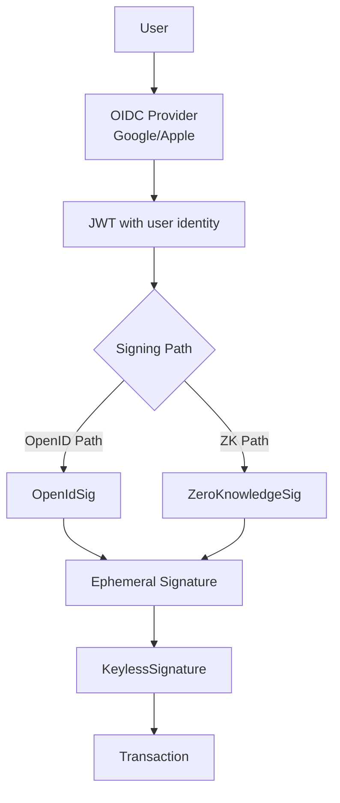
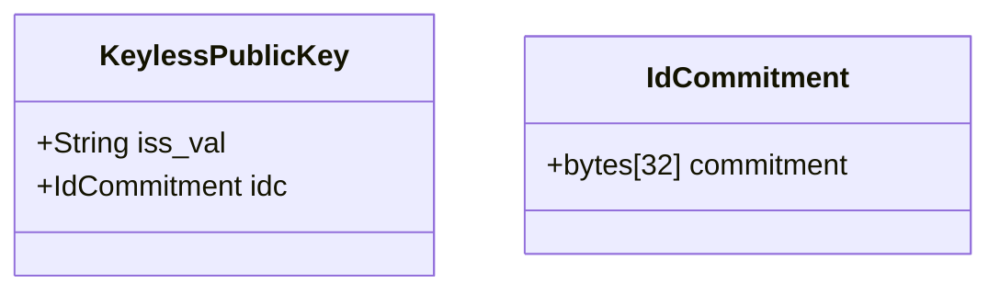
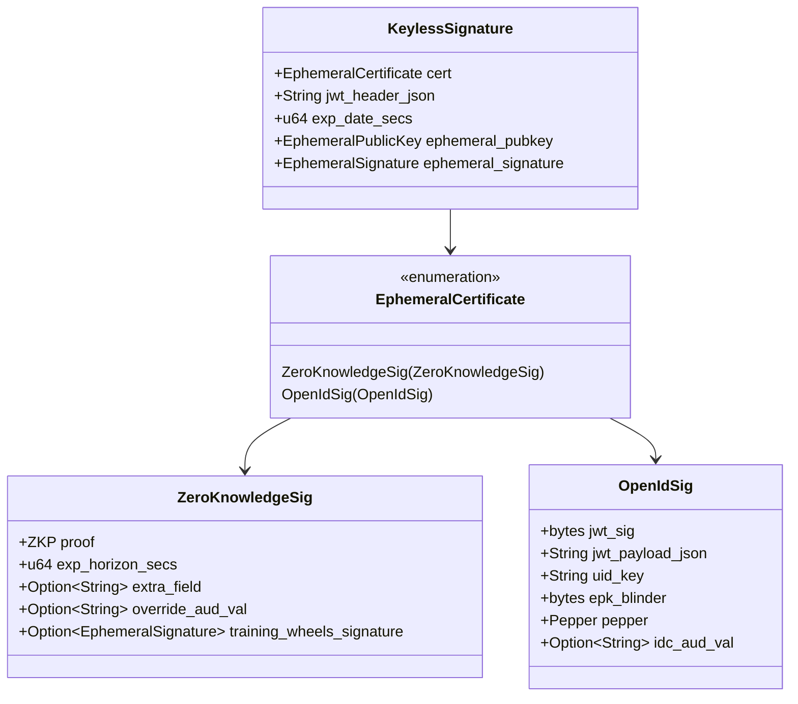
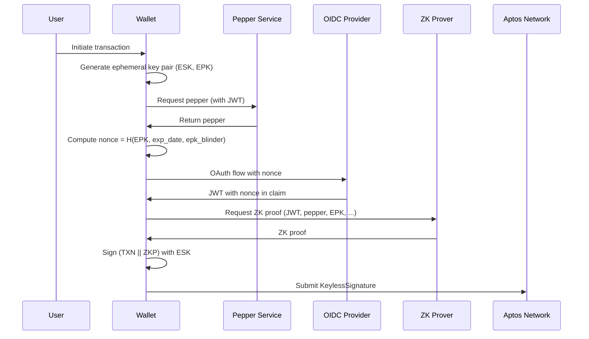
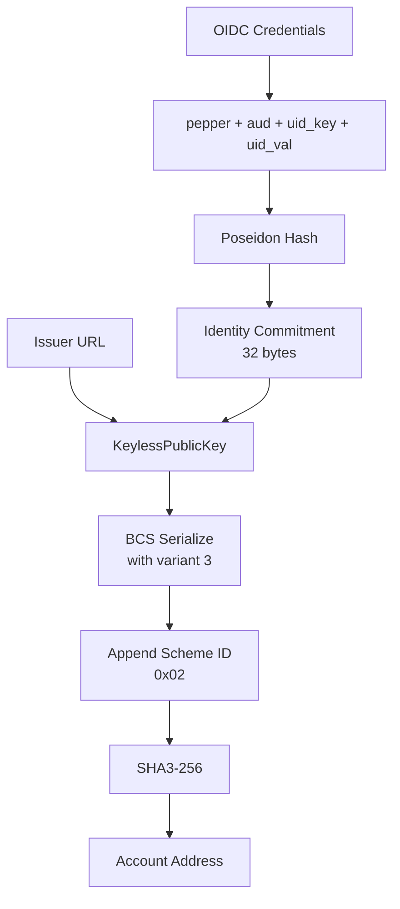

# Keyless (OIDC) Signing Specification

> **Version:** 1.0.0  
> **Status:** Stable  
> **Last Updated:** January 28, 2026

## Overview

Keyless authentication enables users to sign Aptos transactions using their OpenID Connect (OIDC) identity (e.g., Google, Apple Sign-In) without managing traditional cryptographic keys. This is achieved through a combination of OIDC signatures and zero-knowledge proofs.

## Architecture Overview



## Two Signing Paths

### 1. OpenID Signature Path (OpenIdSig)
- Full JWT is included in the transaction
- Simpler but reveals more user information on-chain
- Used for testing and specific use cases

### 2. Zero-Knowledge Path (ZeroKnowledgeSig)
- Uses ZK proofs to hide JWT details
- Privacy-preserving: only proves identity without revealing JWT
- **Recommended for production**

## Key Components

### KeylessPublicKey



The public key consists of:
- `iss_val`: OIDC issuer URL (e.g., `https://accounts.google.com`)
- `idc`: Identity commitment hiding the user's ID

### Identity Commitment (IDC)

```
IDC = Poseidon(pepper, aud_hash, uid_val_hash, uid_key_hash)

where:
  pepper = random 31-byte value (from pepper service)
  aud_hash = Poseidon(pad(aud_val))        # OAuth client ID
  uid_val_hash = Poseidon(pad(uid_val))    # e.g., "sub" claim value  
  uid_key_hash = Poseidon(pad(uid_key))    # e.g., "sub"
```

### KeylessSignature Structure



## Signing Process (ZK Path)



## Code Examples

### Rust (Conceptual)

```rust
use aptos_types::{
    keyless::{
        EphemeralCertificate, KeylessPublicKey, KeylessSignature,
        OpenIdSig, Pepper, TransactionAndProof, ZeroKnowledgeSig,
    },
    transaction::authenticator::{
        AccountAuthenticator, AnyPublicKey, AnySignature,
        EphemeralPublicKey, EphemeralSignature, SingleKeyAuthenticator,
    },
};

/// Build a keyless signature with ZK proof
fn build_zk_keyless_signature(
    ephemeral_private_key: &Ed25519PrivateKey,
    raw_txn: &RawTransaction,
    zk_sig: ZeroKnowledgeSig,
    jwt_header_json: String,
    exp_date_secs: u64,
) -> KeylessSignature {
    let ephemeral_pubkey = EphemeralPublicKey::ed25519(
        ephemeral_private_key.public_key()
    );
    
    // Create TransactionAndProof for signing
    let txn_and_proof = TransactionAndProof {
        message: raw_txn.clone(),
        proof: Some(zk_sig.proof.clone()),
    };
    
    // Sign with ephemeral key
    let ephemeral_signature = EphemeralSignature::ed25519(
        ephemeral_private_key.sign(&txn_and_proof).unwrap()
    );
    
    KeylessSignature {
        cert: EphemeralCertificate::ZeroKnowledgeSig(zk_sig),
        jwt_header_json,
        exp_date_secs,
        ephemeral_pubkey,
        ephemeral_signature,
    }
}

/// Build authenticator from keyless components
fn build_keyless_authenticator(
    keyless_pk: KeylessPublicKey,
    keyless_sig: KeylessSignature,
) -> TransactionAuthenticator {
    let any_pk = AnyPublicKey::keyless(keyless_pk);
    let any_sig = AnySignature::keyless(keyless_sig);
    
    let single_key_auth = SingleKeyAuthenticator::new(any_pk, any_sig);
    let account_auth = AccountAuthenticator::single_key(single_key_auth);
    
    TransactionAuthenticator::single_sender(account_auth)
}

/// Derive address from keyless public key
fn derive_keyless_address(
    iss: &str,
    pepper: &Pepper,
    aud: &str,
    uid_key: &str,
    uid_val: &str,
) -> AccountAddress {
    use aptos_types::keyless::IdCommitment;
    use aptos_types::transaction::authenticator::AuthenticationKey;
    
    let idc = IdCommitment::new_from_preimage(pepper, aud, uid_key, uid_val)
        .expect("IDC computation failed");
    
    let keyless_pk = KeylessPublicKey {
        iss_val: iss.to_string(),
        idc,
    };
    
    AuthenticationKey::any_key(AnyPublicKey::keyless(keyless_pk)).account_address()
}
```

### Python (Conceptual)

```python
import hashlib
import json
import time
from dataclasses import dataclass
from typing import Optional
from nacl.signing import SigningKey

@dataclass
class Pepper:
    """31-byte pepper from pepper service."""
    value: bytes  # 31 bytes
    
    def __post_init__(self):
        if len(self.value) != 31:
            raise ValueError("Pepper must be 31 bytes")

@dataclass
class KeylessPublicKey:
    """Keyless public key containing issuer and identity commitment."""
    iss_val: str      # e.g., "https://accounts.google.com"
    idc: bytes        # 32-byte identity commitment

@dataclass
class EphemeralKeyPair:
    """Short-lived key pair for signing."""
    private_key: bytes  # 32 bytes (Ed25519)
    public_key: bytes   # 32 bytes

@dataclass
class ZeroKnowledgeSig:
    """ZK proof path signature."""
    proof: bytes                    # Groth16 proof
    exp_horizon_secs: int          # Maximum lifetime
    extra_field: Optional[str]     # Optional JWT field
    override_aud_val: Optional[str]
    training_wheels_signature: Optional[bytes]

@dataclass
class OpenIdSig:
    """OpenID signature path."""
    jwt_sig: bytes          # RSA signature from OIDC provider
    jwt_payload_json: str   # Full JWT payload
    uid_key: str           # e.g., "sub"
    epk_blinder: bytes     # Blinding factor
    pepper: Pepper
    idc_aud_val: Optional[str]

@dataclass
class KeylessSignature:
    """Complete keyless signature."""
    cert: object  # ZeroKnowledgeSig or OpenIdSig
    jwt_header_json: str
    exp_date_secs: int
    ephemeral_pubkey: bytes
    ephemeral_signature: bytes


class KeylessSigner:
    """
    Handles keyless transaction signing.
    
    Note: Actual implementation requires integration with:
    - OIDC provider (Google, Apple, etc.)
    - Pepper service
    - ZK prover service
    """
    
    def __init__(
        self,
        iss: str,
        pepper: Pepper,
        aud: str,
        uid_key: str,
        uid_val: str
    ):
        self.iss = iss
        self.pepper = pepper
        self.aud = aud
        self.uid_key = uid_key
        self.uid_val = uid_val
        
        # Compute identity commitment
        self.idc = self._compute_idc()
        
        # Generate ephemeral key pair
        self.ephemeral_key = self._generate_ephemeral_key()
    
    def _compute_idc(self) -> bytes:
        """
        Compute identity commitment using Poseidon hash.
        
        In practice, this uses the Poseidon hash function over BN254.
        This is a simplified placeholder.
        """
        # Simplified - actual implementation uses Poseidon
        preimage = (
            self.pepper.value +
            self.aud.encode() +
            self.uid_key.encode() +
            self.uid_val.encode()
        )
        return hashlib.sha3_256(preimage).digest()
    
    def _generate_ephemeral_key(self) -> EphemeralKeyPair:
        """Generate a short-lived Ed25519 key pair."""
        sk = SigningKey.generate()
        return EphemeralKeyPair(
            private_key=bytes(sk),
            public_key=bytes(sk.verify_key)
        )
    
    @property
    def public_key(self) -> KeylessPublicKey:
        return KeylessPublicKey(
            iss_val=self.iss,
            idc=self.idc
        )
    
    def compute_nonce(
        self,
        exp_date_secs: int,
        epk_blinder: bytes
    ) -> str:
        """
        Compute the nonce to include in the OIDC request.
        
        nonce = Base64URL(H(EPK, exp_date, epk_blinder, config))
        """
        # Simplified - actual implementation is more complex
        data = (
            self.ephemeral_key.public_key +
            exp_date_secs.to_bytes(8, 'little') +
            epk_blinder
        )
        nonce_hash = hashlib.sha3_256(data).digest()
        import base64
        return base64.urlsafe_b64encode(nonce_hash).rstrip(b'=').decode()
    
    def derive_authentication_key(self) -> bytes:
        """
        Derive authentication key from keyless public key.
        """
        # BCS serialize AnyPublicKey::Keyless
        pk_bytes = self._serialize_keyless_public_key()
        
        # SingleKey scheme ID = 2
        return hashlib.sha3_256(pk_bytes + bytes([0x02])).digest()
    
    def _serialize_keyless_public_key(self) -> bytes:
        """BCS serialize the keyless public key."""
        result = bytearray()
        
        # AnyPublicKey::Keyless variant = 3
        result.append(0x03)
        
        # iss_val as string
        iss_bytes = self.iss.encode()
        result.extend(self._uleb128_encode(len(iss_bytes)))
        result.extend(iss_bytes)
        
        # idc (32 bytes wrapped in IdCommitment)
        result.extend(self._uleb128_encode(len(self.idc)))
        result.extend(self.idc)
        
        return bytes(result)
    
    def derive_address(self) -> str:
        return "0x" + self.derive_authentication_key().hex()
    
    def sign_transaction(
        self,
        raw_txn_bcs: bytes,
        zk_proof: bytes,
        jwt_header_json: str,
        exp_date_secs: int
    ) -> KeylessSignature:
        """
        Sign a transaction with keyless signature (ZK path).
        
        Args:
            raw_txn_bcs: BCS-serialized RawTransaction
            zk_proof: Groth16 proof from prover service
            jwt_header_json: JWT header (decoded JSON string)
            exp_date_secs: Expiration timestamp
        
        Returns:
            Complete KeylessSignature
        """
        # Create signing message for ephemeral signature
        # This includes both the transaction and the ZK proof
        signing_message = self._create_txn_and_proof_message(raw_txn_bcs, zk_proof)
        
        # Sign with ephemeral key
        from nacl.signing import SigningKey as NaClSigningKey
        signing_key = NaClSigningKey(self.ephemeral_key.private_key)
        signed = signing_key.sign(signing_message)
        ephemeral_sig = signed.signature
        
        return KeylessSignature(
            cert=ZeroKnowledgeSig(
                proof=zk_proof,
                exp_horizon_secs=86400,  # 24 hours
                extra_field=None,
                override_aud_val=None,
                training_wheels_signature=None
            ),
            jwt_header_json=jwt_header_json,
            exp_date_secs=exp_date_secs,
            ephemeral_pubkey=self.ephemeral_key.public_key,
            ephemeral_signature=ephemeral_sig
        )
    
    def _create_txn_and_proof_message(
        self,
        raw_txn_bcs: bytes,
        zk_proof: bytes
    ) -> bytes:
        """
        Create the message that the ephemeral key signs.
        
        For ZK path: TransactionAndProof { message: RawTxn, proof: Some(ZKP) }
        """
        # This is a simplified version
        # Actual implementation uses BCS serialization of TransactionAndProof
        seed = self._compute_seed("APTOS::TransactionAndProof")
        return seed + raw_txn_bcs + zk_proof
    
    def _compute_seed(self, type_name: str) -> bytes:
        inner = hashlib.sha3_256(type_name.encode()).digest()
        return hashlib.sha3_256(inner + b"APTOS::").digest()
    
    def _uleb128_encode(self, value: int) -> bytes:
        result = []
        while value >= 0x80:
            result.append((value & 0x7F) | 0x80)
            value >>= 7
        result.append(value)
        return bytes(result)


# Example flow
def example_keyless_flow():
    """
    Demonstrates the keyless signing flow.
    
    In practice, this requires:
    1. OIDC authentication with provider
    2. Pepper retrieval from pepper service
    3. ZK proof generation from prover service
    """
    # Configuration (from OIDC provider registration)
    iss = "https://accounts.google.com"
    aud = "your-oauth-client-id.apps.googleusercontent.com"
    
    # User's unique identifier from JWT (the "sub" claim)
    uid_key = "sub"
    uid_val = "1234567890"  # From JWT
    
    # Pepper (obtained from pepper service)
    pepper = Pepper(bytes(31))  # Placeholder
    
    # Create signer
    signer = KeylessSigner(iss, pepper, aud, uid_key, uid_val)
    
    print(f"Address: {signer.derive_address()}")
    
    # The actual signing flow would involve:
    # 1. OIDC login to get JWT
    # 2. ZK proof generation
    # 3. Transaction signing


if __name__ == "__main__":
    example_keyless_flow()
```

## Address Derivation



## Security Considerations

1. **Ephemeral Key Lifetime**: Keys should be short-lived (hours, not days)
2. **Pepper Security**: Pepper must be kept secret; compromise allows impersonation
3. **JWT Validation**: Verify JWT signature, issuer, audience, and expiration
4. **Nonce Binding**: Nonce must bind the ephemeral key to the JWT
5. **ZK Proof Security**: Proofs must be generated by trusted prover

## Supported OIDC Providers

| Provider | Issuer URL | Status |
|----------|-----------|--------|
| Google | `https://accounts.google.com` | Supported |
| Apple | `https://appleid.apple.com` | Supported |
| Custom | Configurable | Via Federated Keyless |

## Related Documents

- [SingleKey Authenticator](../transaction-formats/03-single-key-authenticator.md) - BCS format
- [Transaction Hashing](01-transaction-hashing.md) - Signing message construction
- [Ed25519 Signing](02-ed25519-signing.md) - Ephemeral key signing
