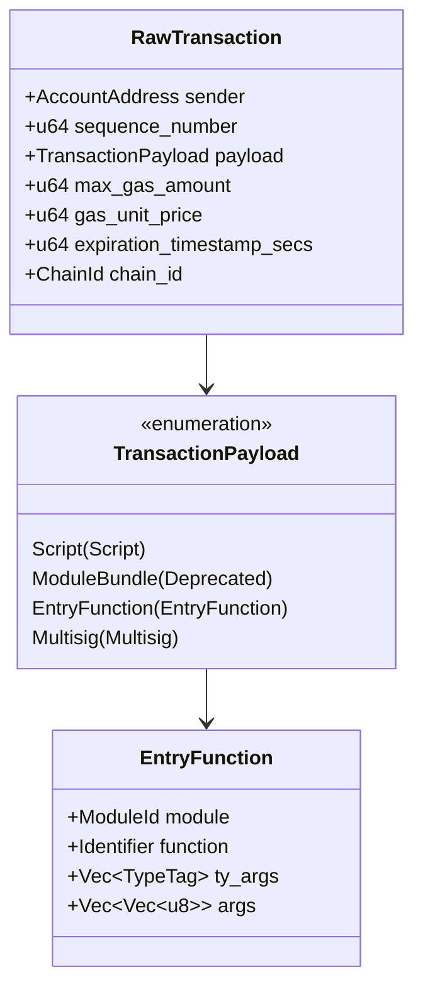

# RawTransaction Format Specification

> **Version:** 1.0.0  
> **Status:** Stable  
> **Last Updated:** January 28, 2026

## Overview

The `RawTransaction` is the core transaction structure that contains all transaction data that a user signs. It represents the unsigned portion of a transaction before authentication is added.

## Structure Definition



## BCS Serialization Layout

### RawTransaction

| Field | Type | Size | Description |
|-------|------|------|-------------|
| sender | AccountAddress | 32 bytes | Sender's account address |
| sequence_number | u64 | 8 bytes | Account sequence number (little-endian) |
| payload | TransactionPayload | Variable | Transaction payload (enum) |
| max_gas_amount | u64 | 8 bytes | Maximum gas units (little-endian) |
| gas_unit_price | u64 | 8 bytes | Gas price in Octas (little-endian) |
| expiration_timestamp_secs | u64 | 8 bytes | Expiration Unix timestamp (little-endian) |
| chain_id | ChainId | 1 byte | Network chain ID |

### Byte Layout Diagram

```
┌─────────────────────────────────────────────────────────────────┐
│                      RawTransaction                              │
├─────────────────────────────────────────────────────────────────┤
│ Offset │ Size    │ Field                                        │
├────────┼─────────┼──────────────────────────────────────────────┤
│ 0      │ 32      │ sender (AccountAddress)                      │
│ 32     │ 8       │ sequence_number (u64 LE)                     │
│ 40     │ Variable│ payload (TransactionPayload enum)            │
│ ...    │ 8       │ max_gas_amount (u64 LE)                      │
│ ...    │ 8       │ gas_unit_price (u64 LE)                      │
│ ...    │ 8       │ expiration_timestamp_secs (u64 LE)           │
│ ...    │ 1       │ chain_id (u8)                                │
└─────────────────────────────────────────────────────────────────┘
```

## TransactionPayload Enum

BCS encodes enums with a ULEB128 variant index followed by the variant data.

| Variant | Index | Description |
|---------|-------|-------------|
| Script | 0 | Execute a Move script |
| ModuleBundle | 1 | **Deprecated** - Do not use |
| EntryFunction | 2 | Call an entry function |
| Multisig | 3 | Execute via multisig account |

### EntryFunction Payload (Most Common)

```
┌─────────────────────────────────────────────────────────────────┐
│                      EntryFunction                               │
├─────────────────────────────────────────────────────────────────┤
│ Field           │ Type              │ Description               │
├─────────────────┼───────────────────┼───────────────────────────┤
│ module          │ ModuleId          │ Target module             │
│ function        │ Identifier        │ Function name             │
│ ty_args         │ Vec<TypeTag>      │ Type arguments            │
│ args            │ Vec<Vec<u8>>      │ BCS-encoded arguments     │
└─────────────────────────────────────────────────────────────────┘
```

### ModuleId

```
┌─────────────────────────────────────────────────────────────────┐
│                        ModuleId                                  │
├─────────────────────────────────────────────────────────────────┤
│ Field      │ Type              │ Size     │ Description         │
├────────────┼───────────────────┼──────────┼─────────────────────┤
│ address    │ AccountAddress    │ 32 bytes │ Module address      │
│ name       │ Identifier        │ Variable │ Module name string  │
└─────────────────────────────────────────────────────────────────┘
```

### Identifier (String)

BCS strings are encoded as:
- ULEB128 length prefix
- UTF-8 bytes (no null terminator)

## Code Examples

### Rust

```rust
use aptos_types::{
    account_address::AccountAddress,
    chain_id::ChainId,
    transaction::{EntryFunction, RawTransaction, TransactionPayload},
};
use move_core_types::{
    identifier::Identifier,
    language_storage::ModuleId,
};

fn build_raw_transaction() -> RawTransaction {
    // Sender address (32 bytes)
    let sender = AccountAddress::from_hex_literal(
        "0x1234567890abcdef1234567890abcdef1234567890abcdef1234567890abcdef"
    ).unwrap();
    
    // Build entry function payload
    let module_id = ModuleId::new(
        AccountAddress::ONE,  // 0x1
        Identifier::new("aptos_account").unwrap(),
    );
    
    let entry_function = EntryFunction::new(
        module_id,
        Identifier::new("transfer").unwrap(),
        vec![],  // No type arguments
        vec![
            bcs::to_bytes(&AccountAddress::TWO).unwrap(),  // recipient
            bcs::to_bytes(&1000u64).unwrap(),              // amount
        ],
    );
    
    RawTransaction::new(
        sender,
        0,                                          // sequence_number
        TransactionPayload::EntryFunction(entry_function),
        100_000,                                    // max_gas_amount
        100,                                        // gas_unit_price
        1735689600,                                 // expiration_timestamp_secs
        ChainId::new(1),                           // mainnet
    )
}

// Serialize to BCS
let raw_txn = build_raw_transaction();
let serialized: Vec<u8> = bcs::to_bytes(&raw_txn).unwrap();
```

### Python

```python
from typing import List
import struct

def uleb128_encode(value: int) -> bytes:
    """Encode an integer as ULEB128."""
    result = []
    while value >= 0x80:
        result.append((value & 0x7F) | 0x80)
        value >>= 7
    result.append(value)
    return bytes(result)

def encode_string(s: str) -> bytes:
    """BCS encode a string (length-prefixed UTF-8)."""
    utf8_bytes = s.encode('utf-8')
    return uleb128_encode(len(utf8_bytes)) + utf8_bytes

def encode_address(addr_hex: str) -> bytes:
    """Encode a 32-byte account address."""
    # Remove '0x' prefix if present
    addr_hex = addr_hex.replace('0x', '')
    return bytes.fromhex(addr_hex.zfill(64))

def encode_u64(value: int) -> bytes:
    """Encode u64 as little-endian bytes."""
    return struct.pack('<Q', value)

def encode_entry_function(
    module_address: str,
    module_name: str,
    function_name: str,
    ty_args: List[bytes],
    args: List[bytes]
) -> bytes:
    """Encode an EntryFunction payload."""
    result = bytearray()
    
    # ModuleId
    result.extend(encode_address(module_address))
    result.extend(encode_string(module_name))
    
    # Function name
    result.extend(encode_string(function_name))
    
    # Type arguments (Vec<TypeTag>)
    result.extend(uleb128_encode(len(ty_args)))
    for ty_arg in ty_args:
        result.extend(ty_arg)
    
    # Arguments (Vec<Vec<u8>>)
    result.extend(uleb128_encode(len(args)))
    for arg in args:
        result.extend(uleb128_encode(len(arg)))
        result.extend(arg)
    
    return bytes(result)

def build_raw_transaction(
    sender: str,
    sequence_number: int,
    payload: bytes,
    payload_variant: int,
    max_gas_amount: int,
    gas_unit_price: int,
    expiration_timestamp_secs: int,
    chain_id: int
) -> bytes:
    """Build and serialize a RawTransaction."""
    result = bytearray()
    
    # Sender (32 bytes)
    result.extend(encode_address(sender))
    
    # Sequence number (u64)
    result.extend(encode_u64(sequence_number))
    
    # Payload (enum variant index + data)
    result.extend(uleb128_encode(payload_variant))
    result.extend(payload)
    
    # Gas parameters
    result.extend(encode_u64(max_gas_amount))
    result.extend(encode_u64(gas_unit_price))
    result.extend(encode_u64(expiration_timestamp_secs))
    
    # Chain ID (single byte)
    result.append(chain_id)
    
    return bytes(result)

# Example usage
entry_function = encode_entry_function(
    module_address="0x1",
    module_name="aptos_account",
    function_name="transfer",
    ty_args=[],
    args=[
        encode_address("0x2"),  # recipient
        encode_u64(1000),       # amount
    ]
)

raw_txn = build_raw_transaction(
    sender="0x1234567890abcdef1234567890abcdef1234567890abcdef1234567890abcdef",
    sequence_number=0,
    payload=entry_function,
    payload_variant=2,  # EntryFunction
    max_gas_amount=100_000,
    gas_unit_price=100,
    expiration_timestamp_secs=1735689600,
    chain_id=1  # mainnet
)

print("Raw Transaction (hex):", raw_txn.hex())
```

### TypeScript

```typescript
function uleb128Encode(value: number): Uint8Array {
  const result: number[] = [];
  while (value >= 0x80) {
    result.push((value & 0x7f) | 0x80);
    value >>>= 7;
  }
  result.push(value);
  return new Uint8Array(result);
}

function encodeString(s: string): Uint8Array {
  const encoder = new TextEncoder();
  const utf8Bytes = encoder.encode(s);
  const lengthPrefix = uleb128Encode(utf8Bytes.length);
  const result = new Uint8Array(lengthPrefix.length + utf8Bytes.length);
  result.set(lengthPrefix);
  result.set(utf8Bytes, lengthPrefix.length);
  return result;
}

function encodeAddress(addrHex: string): Uint8Array {
  // Remove '0x' prefix and pad to 64 hex chars (32 bytes)
  const cleanHex = addrHex.replace(/^0x/, '').padStart(64, '0');
  const bytes = new Uint8Array(32);
  for (let i = 0; i < 32; i++) {
    bytes[i] = parseInt(cleanHex.slice(i * 2, i * 2 + 2), 16);
  }
  return bytes;
}

function encodeU64(value: bigint): Uint8Array {
  const buffer = new ArrayBuffer(8);
  const view = new DataView(buffer);
  view.setBigUint64(0, value, true); // little-endian
  return new Uint8Array(buffer);
}

function encodeEntryFunction(
  moduleAddress: string,
  moduleName: string,
  functionName: string,
  tyArgs: Uint8Array[],
  args: Uint8Array[]
): Uint8Array {
  const parts: Uint8Array[] = [];
  
  // ModuleId
  parts.push(encodeAddress(moduleAddress));
  parts.push(encodeString(moduleName));
  
  // Function name
  parts.push(encodeString(functionName));
  
  // Type arguments
  parts.push(uleb128Encode(tyArgs.length));
  tyArgs.forEach(arg => parts.push(arg));
  
  // Arguments
  parts.push(uleb128Encode(args.length));
  args.forEach(arg => {
    parts.push(uleb128Encode(arg.length));
    parts.push(arg);
  });
  
  // Concatenate all parts
  const totalLength = parts.reduce((sum, p) => sum + p.length, 0);
  const result = new Uint8Array(totalLength);
  let offset = 0;
  for (const part of parts) {
    result.set(part, offset);
    offset += part.length;
  }
  return result;
}

interface RawTransactionParams {
  sender: string;
  sequenceNumber: bigint;
  payload: Uint8Array;
  payloadVariant: number;
  maxGasAmount: bigint;
  gasUnitPrice: bigint;
  expirationTimestampSecs: bigint;
  chainId: number;
}

function buildRawTransaction(params: RawTransactionParams): Uint8Array {
  const parts: Uint8Array[] = [];
  
  // Sender (32 bytes)
  parts.push(encodeAddress(params.sender));
  
  // Sequence number (u64)
  parts.push(encodeU64(params.sequenceNumber));
  
  // Payload (enum variant + data)
  parts.push(uleb128Encode(params.payloadVariant));
  parts.push(params.payload);
  
  // Gas parameters
  parts.push(encodeU64(params.maxGasAmount));
  parts.push(encodeU64(params.gasUnitPrice));
  parts.push(encodeU64(params.expirationTimestampSecs));
  
  // Chain ID
  parts.push(new Uint8Array([params.chainId]));
  
  // Concatenate
  const totalLength = parts.reduce((sum, p) => sum + p.length, 0);
  const result = new Uint8Array(totalLength);
  let offset = 0;
  for (const part of parts) {
    result.set(part, offset);
    offset += part.length;
  }
  return result;
}

// Example usage
const entryFunction = encodeEntryFunction(
  "0x1",
  "aptos_account",
  "transfer",
  [],
  [
    encodeAddress("0x2"),      // recipient
    encodeU64(BigInt(1000)),   // amount
  ]
);

const rawTxn = buildRawTransaction({
  sender: "0x1234567890abcdef1234567890abcdef1234567890abcdef1234567890abcdef",
  sequenceNumber: BigInt(0),
  payload: entryFunction,
  payloadVariant: 2, // EntryFunction
  maxGasAmount: BigInt(100_000),
  gasUnitPrice: BigInt(100),
  expirationTimestampSecs: BigInt(1735689600),
  chainId: 1, // mainnet
});

console.log("Raw Transaction (hex):", Buffer.from(rawTxn).toString('hex'));
```

## Test Vector

### Input Parameters

| Parameter | Value |
|-----------|-------|
| sender | `0x0000000000000000000000000000000000000000000000000000000000000001` |
| sequence_number | `0` |
| payload | EntryFunction calling `0x1::aptos_account::transfer` |
| recipient (arg 0) | `0x0000000000000000000000000000000000000000000000000000000000000002` |
| amount (arg 1) | `1000` |
| max_gas_amount | `100000` |
| gas_unit_price | `100` |
| expiration_timestamp_secs | `1735689600` (2025-01-01 00:00:00 UTC) |
| chain_id | `1` (mainnet) |

### Expected BCS Output

```
0000000000000000000000000000000000000000000000000000000000000001  # sender (32 bytes)
0000000000000000                                                  # sequence_number (u64 LE)
02                                                                # payload variant (EntryFunction = 2)
0000000000000000000000000000000000000000000000000000000000000001  # module address
0d6170746f735f6163636f756e74                                      # module name "aptos_account" (len=13)
087472616e73666572                                                # function "transfer" (len=8)
00                                                                # ty_args count (0)
02                                                                # args count (2)
20                                                                # arg[0] length (32)
0000000000000000000000000000000000000000000000000000000000000002  # arg[0] recipient address
08                                                                # arg[1] length (8)
e803000000000000                                                  # arg[1] amount 1000 (u64 LE)
a086010000000000                                                  # max_gas_amount (100000)
6400000000000000                                                  # gas_unit_price (100)
00f9686700000000                                                  # expiration_timestamp_secs
01                                                                # chain_id (1)
```

### Full Serialized Hex (Concatenated)

```
0000000000000000000000000000000000000000000000000000000000000001000000000000000002000000000000000000000000000000000000000000000000000000000000000001 0d6170746f735f6163636f756e74087472616e736665720002200000000000000000000000000000000000000000000000000000000000000002 08e803000000000000a0860100000000006400000000000000 00f9686700000000 01
```

## Validation Rules

1. **sender**: Must be a valid 32-byte address
2. **sequence_number**: Must match the on-chain account sequence number
3. **max_gas_amount**: Must be > 0 and ≤ maximum allowed (typically 2,000,000)
4. **gas_unit_price**: Must be ≥ minimum gas price (typically 100 Octas)
5. **expiration_timestamp_secs**: Must be in the future but within maximum horizon (typically 3600 seconds)
6. **chain_id**: Must match the target network's chain ID

## Error Cases

| Error | Cause |
|-------|-------|
| `SEQUENCE_NUMBER_TOO_OLD` | sequence_number < on-chain sequence |
| `SEQUENCE_NUMBER_TOO_NEW` | sequence_number > on-chain sequence |
| `TRANSACTION_EXPIRED` | Current time ≥ expiration_timestamp_secs |
| `MAX_GAS_AMOUNT_EXCEEDED` | max_gas_amount exceeds limit |
| `GAS_UNIT_PRICE_BELOW_MIN` | gas_unit_price below network minimum |
| `INVALID_CHAIN_ID` | chain_id doesn't match network |

## Related Documents

- [Transaction Hashing](../signing/01-transaction-hashing.md) - How to create the signing message
- [Ed25519 Authenticator](02-ed25519-authenticator.md) - Simple signature format
- [SingleKey Authenticator](03-single-key-authenticator.md) - Unified authentication format
