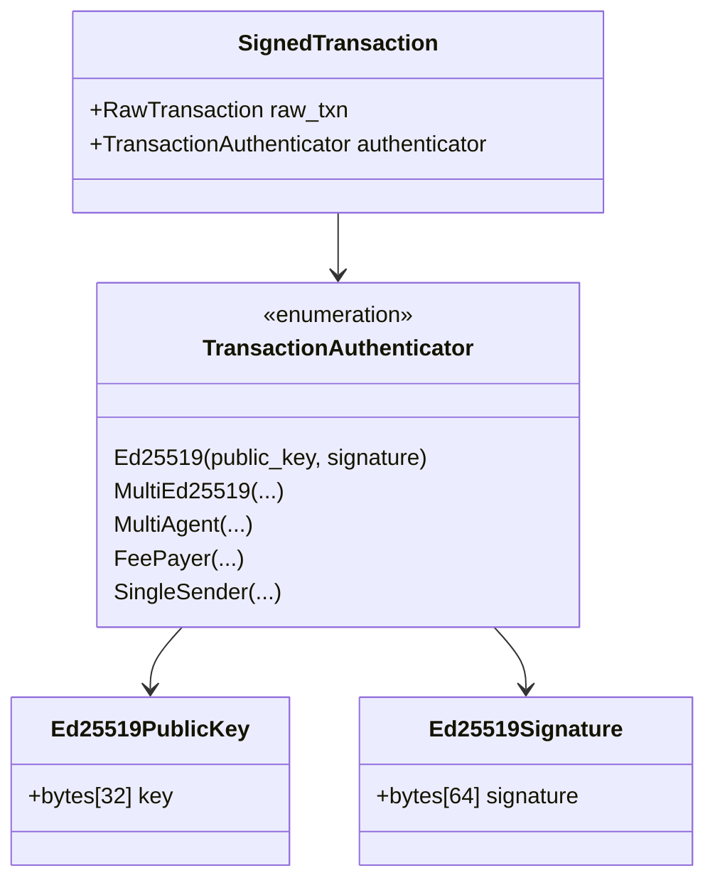
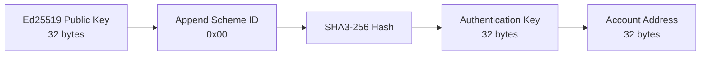
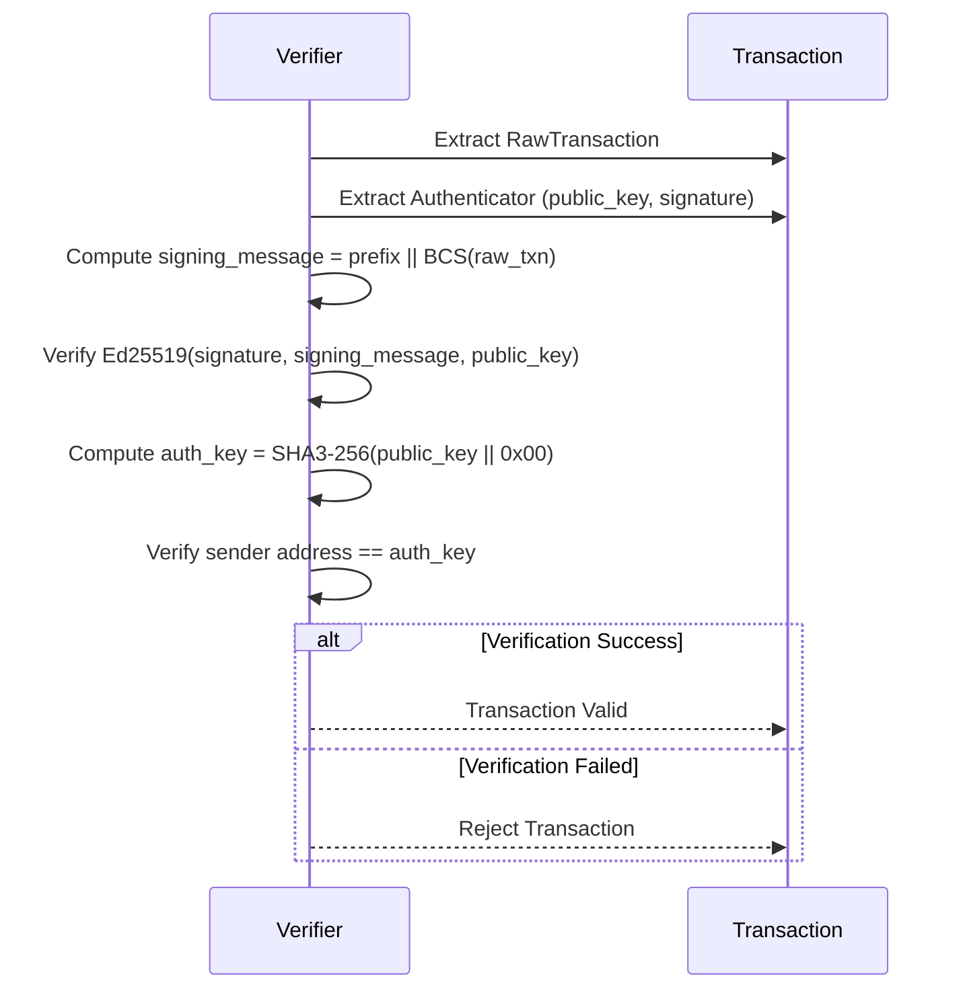

# Ed25519 Authenticator Format Specification

> **Version:** 1.0.0  
> **Status:** Stable  
> **Last Updated:** January 28, 2026

## Overview

The Ed25519 authenticator is the simplest and most widely used authentication method in Aptos. It uses the Ed25519 signature scheme (EdDSA over Curve25519) to authenticate transactions.

## Structure Definition



## TransactionAuthenticator Enum

| Variant | Index | Description |
|---------|-------|-------------|
| Ed25519 | 0 | Single Ed25519 signature |
| MultiEd25519 | 1 | K-of-N Ed25519 multisig |
| MultiAgent | 2 | Multiple signers |
| FeePayer | 3 | Sponsored transaction |
| SingleSender | 4 | Modern unified format |

## Ed25519 Variant Structure

### BCS Layout

```
┌─────────────────────────────────────────────────────────────────┐
│              TransactionAuthenticator::Ed25519                   │
├─────────────────────────────────────────────────────────────────┤
│ Offset │ Size    │ Field                                        │
├────────┼─────────┼──────────────────────────────────────────────┤
│ 0      │ 1       │ variant_index (0 = Ed25519)                  │
│ 1      │ 32      │ public_key (Ed25519PublicKey)                │
│ 33     │ 64      │ signature (Ed25519Signature)                 │
└─────────────────────────────────────────────────────────────────┘
Total: 97 bytes
```

### Field Details

| Field | Type | Size | Description |
|-------|------|------|-------------|
| variant_index | ULEB128 | 1 byte | Always `0` for Ed25519 |
| public_key | Ed25519PublicKey | 32 bytes | Compressed Edwards point |
| signature | Ed25519Signature | 64 bytes | EdDSA signature (R \|\| S) |

## SignedTransaction Structure

```
┌─────────────────────────────────────────────────────────────────┐
│                      SignedTransaction                           │
├─────────────────────────────────────────────────────────────────┤
│ Field              │ Size                │ Description          │
├────────────────────┼─────────────────────┼──────────────────────┤
│ raw_txn            │ Variable            │ BCS(RawTransaction)  │
│ authenticator      │ 97 bytes (Ed25519)  │ TransactionAuth      │
└─────────────────────────────────────────────────────────────────┘
```

## Authentication Key Derivation

The authentication key is used to derive the account address:

```
authentication_key = SHA3-256(public_key || scheme_id)
                   = SHA3-256(public_key || 0x00)

account_address = authentication_key  // Last 32 bytes (entire key for Aptos)
```



## Code Examples

### Rust

```rust
use aptos_crypto::{
    ed25519::{Ed25519PrivateKey, Ed25519PublicKey, Ed25519Signature},
    traits::SigningKey,
    HashValue,
};
use aptos_types::transaction::{
    authenticator::AuthenticationKey,
    RawTransaction, SignedTransaction, TransactionAuthenticator,
};

// Generate or load a private key
let private_key = Ed25519PrivateKey::generate_for_testing();
let public_key: Ed25519PublicKey = (&private_key).into();

// Derive address from public key
let auth_key = AuthenticationKey::ed25519(&public_key);
let address = auth_key.account_address();

// Sign a raw transaction
fn sign_transaction(
    raw_txn: RawTransaction,
    private_key: &Ed25519PrivateKey,
) -> SignedTransaction {
    let public_key = Ed25519PublicKey::from(private_key);
    
    // Sign the raw transaction directly (signing message computed internally)
    let signature: Ed25519Signature = private_key.sign(&raw_txn).unwrap();
    
    // Create the signed transaction with Ed25519 authenticator
    SignedTransaction::new(raw_txn, public_key, signature)
}

// Manual BCS serialization of authenticator
fn serialize_ed25519_authenticator(
    public_key: &Ed25519PublicKey,
    signature: &Ed25519Signature,
) -> Vec<u8> {
    let mut bytes = Vec::with_capacity(97);
    
    // Variant index (Ed25519 = 0)
    bytes.push(0x00);
    
    // Public key (32 bytes)
    bytes.extend_from_slice(&public_key.to_bytes());
    
    // Signature (64 bytes)
    bytes.extend_from_slice(&signature.to_bytes());
    
    bytes
}
```

### Python

```python
import hashlib
from nacl.signing import SigningKey, VerifyKey
from nacl.encoding import RawEncoder

class Ed25519Authenticator:
    SCHEME_ID = 0x00
    PUBLIC_KEY_LENGTH = 32
    SIGNATURE_LENGTH = 64
    
    def __init__(self, private_key_bytes: bytes = None):
        if private_key_bytes:
            self.signing_key = SigningKey(private_key_bytes)
        else:
            self.signing_key = SigningKey.generate()
        
        self.public_key = self.signing_key.verify_key
    
    @property
    def public_key_bytes(self) -> bytes:
        return bytes(self.public_key)
    
    def derive_authentication_key(self) -> bytes:
        """Derive authentication key: SHA3-256(public_key || scheme_id)"""
        data = self.public_key_bytes + bytes([self.SCHEME_ID])
        return hashlib.sha3_256(data).digest()
    
    def derive_address(self) -> str:
        """Derive account address from public key."""
        auth_key = self.derive_authentication_key()
        return "0x" + auth_key.hex()
    
    def sign(self, message: bytes) -> bytes:
        """Sign a message with Ed25519."""
        signed = self.signing_key.sign(message, encoder=RawEncoder)
        return signed.signature  # 64 bytes
    
    def serialize_authenticator(self, signature: bytes) -> bytes:
        """
        Serialize the Ed25519 TransactionAuthenticator.
        
        Layout:
        - 1 byte: variant index (0x00 for Ed25519)
        - 32 bytes: public key
        - 64 bytes: signature
        """
        assert len(signature) == self.SIGNATURE_LENGTH
        
        result = bytearray()
        result.append(0x00)  # Ed25519 variant
        result.extend(self.public_key_bytes)
        result.extend(signature)
        
        return bytes(result)


def build_signed_transaction(
    raw_txn_bytes: bytes,
    signing_message: bytes,
    authenticator: Ed25519Authenticator
) -> bytes:
    """
    Build a complete signed transaction.
    
    Args:
        raw_txn_bytes: BCS-serialized RawTransaction
        signing_message: The message to sign (prefix + raw_txn_bytes)
        authenticator: Ed25519Authenticator instance
    
    Returns:
        BCS-serialized SignedTransaction
    """
    # Sign the signing message
    signature = authenticator.sign(signing_message)
    
    # Build authenticator bytes
    auth_bytes = authenticator.serialize_authenticator(signature)
    
    # Concatenate raw_txn + authenticator
    return raw_txn_bytes + auth_bytes


# Example usage
auth = Ed25519Authenticator()
print(f"Public Key: {auth.public_key_bytes.hex()}")
print(f"Address: {auth.derive_address()}")

# Sign a message
message = b"test message"
signature = auth.sign(message)
print(f"Signature: {signature.hex()}")

# Serialize authenticator
auth_bytes = auth.serialize_authenticator(signature)
print(f"Authenticator ({len(auth_bytes)} bytes): {auth_bytes.hex()}")
```

### TypeScript

```typescript
import * as nacl from 'tweetnacl';
import { sha3_256 } from '@noble/hashes/sha3';

const ED25519_SCHEME_ID = 0x00;
const PUBLIC_KEY_LENGTH = 32;
const SIGNATURE_LENGTH = 64;

interface Ed25519KeyPair {
  publicKey: Uint8Array;
  secretKey: Uint8Array;
}

class Ed25519Authenticator {
  private keyPair: Ed25519KeyPair;

  constructor(secretKey?: Uint8Array) {
    if (secretKey) {
      this.keyPair = nacl.sign.keyPair.fromSecretKey(secretKey);
    } else {
      this.keyPair = nacl.sign.keyPair();
    }
  }

  get publicKey(): Uint8Array {
    return this.keyPair.publicKey;
  }

  get secretKey(): Uint8Array {
    return this.keyPair.secretKey;
  }

  /**
   * Derive authentication key: SHA3-256(public_key || scheme_id)
   */
  deriveAuthenticationKey(): Uint8Array {
    const data = new Uint8Array(PUBLIC_KEY_LENGTH + 1);
    data.set(this.publicKey);
    data[PUBLIC_KEY_LENGTH] = ED25519_SCHEME_ID;
    return sha3_256(data);
  }

  /**
   * Derive account address from public key.
   */
  deriveAddress(): string {
    const authKey = this.deriveAuthenticationKey();
    return '0x' + Buffer.from(authKey).toString('hex');
  }

  /**
   * Sign a message with Ed25519.
   */
  sign(message: Uint8Array): Uint8Array {
    const signedMessage = nacl.sign(message, this.secretKey);
    // nacl.sign returns signature + message, extract just signature
    return signedMessage.slice(0, SIGNATURE_LENGTH);
  }

  /**
   * Serialize the Ed25519 TransactionAuthenticator.
   * 
   * Layout:
   * - 1 byte: variant index (0x00 for Ed25519)
   * - 32 bytes: public key
   * - 64 bytes: signature
   */
  serializeAuthenticator(signature: Uint8Array): Uint8Array {
    if (signature.length !== SIGNATURE_LENGTH) {
      throw new Error(`Invalid signature length: ${signature.length}`);
    }

    const result = new Uint8Array(1 + PUBLIC_KEY_LENGTH + SIGNATURE_LENGTH);
    result[0] = 0x00; // Ed25519 variant
    result.set(this.publicKey, 1);
    result.set(signature, 1 + PUBLIC_KEY_LENGTH);

    return result;
  }
}

/**
 * Build a complete signed transaction.
 */
function buildSignedTransaction(
  rawTxnBytes: Uint8Array,
  signingMessage: Uint8Array,
  authenticator: Ed25519Authenticator
): Uint8Array {
  // Sign the signing message
  const signature = authenticator.sign(signingMessage);

  // Build authenticator bytes
  const authBytes = authenticator.serializeAuthenticator(signature);

  // Concatenate raw_txn + authenticator
  const result = new Uint8Array(rawTxnBytes.length + authBytes.length);
  result.set(rawTxnBytes);
  result.set(authBytes, rawTxnBytes.length);

  return result;
}

// Example usage
const auth = new Ed25519Authenticator();
console.log('Public Key:', Buffer.from(auth.publicKey).toString('hex'));
console.log('Address:', auth.deriveAddress());

const message = new TextEncoder().encode('test message');
const signature = auth.sign(message);
console.log('Signature:', Buffer.from(signature).toString('hex'));

const authBytes = auth.serializeAuthenticator(signature);
console.log(`Authenticator (${authBytes.length} bytes):`, Buffer.from(authBytes).toString('hex'));
```

## Test Vector

### Key Material

| Parameter | Value (Hex) |
|-----------|-------------|
| Private Key Seed | `9bf49a6a0755f953811fce125f2683d50429c3bb49e074147e0089a52eae155f` |
| Private Key (64 bytes) | `9bf49a6a0755f953811fce125f2683d50429c3bb49e074147e0089a52eae155f de19e5d1880cac87d57484ce9ed2e84cf0f9c1a9436a30593a9a23a1768a6105` |
| Public Key (32 bytes) | `de19e5d1880cac87d57484ce9ed2e84cf0f9c1a9436a30593a9a23a1768a6105` |

### Authentication Key Derivation

```
Input:  de19e5d1880cac87d57484ce9ed2e84cf0f9c1a9436a30593a9a23a1768a6105 || 00
        (public_key || scheme_id)

SHA3-256 Hash = Authentication Key = Account Address:
        9a71a74d7c5c5a4c2e0e5f2e3c1b0a9f8e7d6c5b4a3928271605143322110000
```

### Transaction Signing

| Parameter | Value |
|-----------|-------|
| RawTransaction (see previous doc) | Sender: `0x9a71...0000`, Seq: 0 |
| Signing Message Prefix | `b5e97db07fa0bd0e5598aa3643a9bc6f6693bddc1a9fec9e674a461eaa00b193` |
| Signing Message | `<prefix>` \|\| `<BCS(RawTransaction)>` |

### Expected Authenticator Output

```
00                                                              # variant (Ed25519 = 0)
de19e5d1880cac87d57484ce9ed2e84cf0f9c1a9436a30593a9a23a1768a6105  # public_key (32 bytes)
<64-byte signature depends on actual signing message>           # signature (64 bytes)
```

## Verification Process



## Security Considerations

1. **Private Key Protection**: Never expose private keys in logs or error messages
2. **Non-Replayability**: The sequence number ensures transactions cannot be replayed
3. **Canonical Signatures**: Ed25519 signatures must be in canonical form (S < L where L is the curve order)
4. **Public Key Validation**: Verify the public key is a valid point on the curve before use

## Validation Rules

1. **Public Key Length**: Must be exactly 32 bytes
2. **Signature Length**: Must be exactly 64 bytes
3. **Signature Validity**: Must verify against the signing message and public key
4. **Address Match**: Derived address from public key must match transaction sender

## Error Cases

| Error | Cause |
|-------|-------|
| `INVALID_SIGNATURE` | Signature doesn't verify |
| `INVALID_AUTH_KEY` | Derived address doesn't match sender |
| `ED25519_PUBLIC_KEY_VALIDATION_FAILURE` | Invalid public key bytes |
| `ED25519_SIGNATURE_VALIDATION_FAILURE` | Malformed signature |

## Related Documents

- [Transaction Hashing](../signing/01-transaction-hashing.md) - Signing message construction
- [Ed25519 Signing](../signing/02-ed25519-signing.md) - Detailed signing process
- [SingleKey Authenticator](03-single-key-authenticator.md) - Modern alternative format
