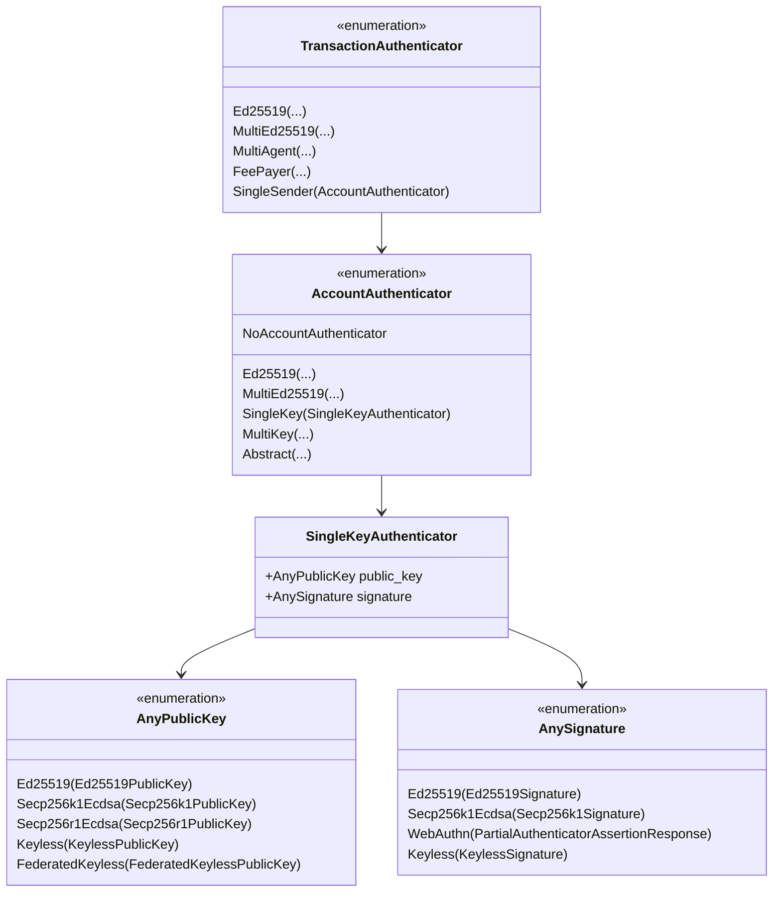
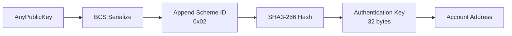

# SingleKey Authenticator Format Specification

> **Version:** 1.0.0  
> **Status:** Stable  
> **Last Updated:** January 28, 2026

## Overview

The SingleKey authenticator is a unified authentication format that supports multiple cryptographic algorithms within a single framework. It uses the `SingleSender` transaction authenticator variant and wraps different key types (Ed25519, Secp256k1, Secp256r1, Keyless) in a consistent structure.

This is the **recommended** format for new implementations as it provides flexibility and future-proofing.

## Structure Definition



## Enum Variant Indices

### TransactionAuthenticator

| Variant | Index |
|---------|-------|
| Ed25519 | 0 |
| MultiEd25519 | 1 |
| MultiAgent | 2 |
| FeePayer | 3 |
| **SingleSender** | **4** |

### AccountAuthenticator

| Variant | Index |
|---------|-------|
| Ed25519 | 0 |
| MultiEd25519 | 1 |
| **SingleKey** | **2** |
| MultiKey | 3 |
| NoAccountAuthenticator | 4 |
| Abstract | 5 |

### AnyPublicKey

| Variant | Index | Key Size |
|---------|-------|----------|
| Ed25519 | 0 | 32 bytes |
| Secp256k1Ecdsa | 1 | 65 bytes (uncompressed) |
| Secp256r1Ecdsa | 2 | 65 bytes (uncompressed) |
| Keyless | 3 | Variable |
| FederatedKeyless | 4 | Variable |
| SlhDsaSha2_128s | 5 | Variable (post-quantum) |

### AnySignature

| Variant | Index | Signature Size |
|---------|-------|----------------|
| Ed25519 | 0 | 64 bytes |
| Secp256k1Ecdsa | 1 | 64 bytes |
| WebAuthn | 2 | Variable |
| Keyless | 3 | Variable |
| SlhDsaSha2_128s | 4 | Variable |

## BCS Serialization Layout

### Complete SingleSender Path

```
┌─────────────────────────────────────────────────────────────────┐
│           TransactionAuthenticator::SingleSender                 │
├─────────────────────────────────────────────────────────────────┤
│ Offset │ Size    │ Field                                        │
├────────┼─────────┼──────────────────────────────────────────────┤
│ 0      │ 1       │ TransactionAuthenticator variant (4)         │
│ 1      │ 1       │ AccountAuthenticator variant (2 = SingleKey) │
│ 2      │ Variable│ SingleKeyAuthenticator                       │
└─────────────────────────────────────────────────────────────────┘
```

### SingleKeyAuthenticator

```
┌─────────────────────────────────────────────────────────────────┐
│                    SingleKeyAuthenticator                        │
├─────────────────────────────────────────────────────────────────┤
│ Offset │ Size    │ Field                                        │
├────────┼─────────┼──────────────────────────────────────────────┤
│ 0      │ Variable│ AnyPublicKey (enum)                          │
│ ...    │ Variable│ AnySignature (enum)                          │
└─────────────────────────────────────────────────────────────────┘
```

### AnyPublicKey Variants

#### Ed25519 (variant 0)
```
┌─────────────────────────────────────────────────────────────────┐
│ Offset │ Size    │ Field                                        │
├────────┼─────────┼──────────────────────────────────────────────┤
│ 0      │ 1       │ variant_index (0)                            │
│ 1      │ 32      │ Ed25519PublicKey                             │
└─────────────────────────────────────────────────────────────────┘
Total: 33 bytes
```

#### Secp256k1Ecdsa (variant 1)
```
┌─────────────────────────────────────────────────────────────────┐
│ Offset │ Size    │ Field                                        │
├────────┼─────────┼──────────────────────────────────────────────┤
│ 0      │ 1       │ variant_index (1)                            │
│ 1      │ 65      │ Secp256k1PublicKey (uncompressed)            │
└─────────────────────────────────────────────────────────────────┘
Total: 66 bytes
```

#### Secp256r1Ecdsa (variant 2)
```
┌─────────────────────────────────────────────────────────────────┐
│ Offset │ Size    │ Field                                        │
├────────┼─────────┼──────────────────────────────────────────────┤
│ 0      │ 1       │ variant_index (2)                            │
│ 1      │ 65      │ Secp256r1PublicKey (uncompressed)            │
└─────────────────────────────────────────────────────────────────┘
Total: 66 bytes
```

### AnySignature Variants

#### Ed25519 (variant 0)
```
┌─────────────────────────────────────────────────────────────────┐
│ Offset │ Size    │ Field                                        │
├────────┼─────────┼──────────────────────────────────────────────┤
│ 0      │ 1       │ variant_index (0)                            │
│ 1      │ 64      │ Ed25519Signature                             │
└─────────────────────────────────────────────────────────────────┘
Total: 65 bytes
```

#### Secp256k1Ecdsa (variant 1)
```
┌─────────────────────────────────────────────────────────────────┐
│ Offset │ Size    │ Field                                        │
├────────┼─────────┼──────────────────────────────────────────────┤
│ 0      │ 1       │ variant_index (1)                            │
│ 1      │ 64      │ Secp256k1Signature (r || s)                  │
└─────────────────────────────────────────────────────────────────┘
Total: 65 bytes
```

## Authentication Key Derivation

For SingleKey authentication, the scheme ID is `2`:

```
authentication_key = SHA3-256(BCS(AnyPublicKey) || 0x02)
account_address = authentication_key
```



**Important**: The BCS serialization of `AnyPublicKey` includes the variant index, so:
- For Ed25519: `0x00 || public_key_bytes`
- For Secp256k1: `0x01 || public_key_bytes`
- etc.

## Code Examples

### Rust

```rust
use aptos_crypto::{
    ed25519::{Ed25519PrivateKey, Ed25519PublicKey, Ed25519Signature},
    secp256k1_ecdsa,
    traits::SigningKey,
    HashValue,
};
use aptos_types::transaction::{
    authenticator::{
        AccountAuthenticator, AnyPublicKey, AnySignature,
        AuthenticationKey, SingleKeyAuthenticator, TransactionAuthenticator,
    },
    RawTransaction, SignedTransaction,
};

// Create SingleKey authenticator with Ed25519
fn create_ed25519_single_key_auth(
    private_key: &Ed25519PrivateKey,
    raw_txn: &RawTransaction,
) -> TransactionAuthenticator {
    let public_key = Ed25519PublicKey::from(private_key);
    let signature = private_key.sign(raw_txn).unwrap();
    
    let any_public_key = AnyPublicKey::ed25519(public_key);
    let any_signature = AnySignature::ed25519(signature);
    
    let single_key_auth = SingleKeyAuthenticator::new(any_public_key, any_signature);
    let account_auth = AccountAuthenticator::single_key(single_key_auth);
    
    TransactionAuthenticator::single_sender(account_auth)
}

// Create SingleKey authenticator with Secp256k1
fn create_secp256k1_single_key_auth(
    private_key: &secp256k1_ecdsa::PrivateKey,
    raw_txn: &RawTransaction,
) -> TransactionAuthenticator {
    let public_key = private_key.public_key();
    let signature = private_key.sign(raw_txn).unwrap();
    
    let any_public_key = AnyPublicKey::secp256k1_ecdsa(public_key);
    let any_signature = AnySignature::secp256k1_ecdsa(signature);
    
    let single_key_auth = SingleKeyAuthenticator::new(any_public_key, any_signature);
    let account_auth = AccountAuthenticator::single_key(single_key_auth);
    
    TransactionAuthenticator::single_sender(account_auth)
}

// Derive address for SingleKey
fn derive_single_key_address(public_key: AnyPublicKey) -> AccountAddress {
    AuthenticationKey::any_key(public_key).account_address()
}

// Build signed transaction
fn build_signed_transaction(
    raw_txn: RawTransaction,
    authenticator: TransactionAuthenticator,
) -> SignedTransaction {
    SignedTransaction::new_signed_transaction(raw_txn, authenticator)
}
```

### Python

```python
import hashlib
from typing import Union
from dataclasses import dataclass
from enum import IntEnum

class AnyPublicKeyVariant(IntEnum):
    ED25519 = 0
    SECP256K1_ECDSA = 1
    SECP256R1_ECDSA = 2
    KEYLESS = 3
    FEDERATED_KEYLESS = 4

class AnySignatureVariant(IntEnum):
    ED25519 = 0
    SECP256K1_ECDSA = 1
    WEBAUTHN = 2
    KEYLESS = 3

class AccountAuthenticatorVariant(IntEnum):
    ED25519 = 0
    MULTI_ED25519 = 1
    SINGLE_KEY = 2
    MULTI_KEY = 3

class TransactionAuthenticatorVariant(IntEnum):
    ED25519 = 0
    MULTI_ED25519 = 1
    MULTI_AGENT = 2
    FEE_PAYER = 3
    SINGLE_SENDER = 4

SINGLE_KEY_SCHEME_ID = 0x02

@dataclass
class AnyPublicKey:
    variant: AnyPublicKeyVariant
    key_bytes: bytes
    
    def serialize(self) -> bytes:
        """BCS serialize the AnyPublicKey."""
        return bytes([self.variant]) + self.key_bytes
    
    @classmethod
    def ed25519(cls, public_key: bytes) -> 'AnyPublicKey':
        assert len(public_key) == 32
        return cls(AnyPublicKeyVariant.ED25519, public_key)
    
    @classmethod
    def secp256k1(cls, public_key: bytes) -> 'AnyPublicKey':
        assert len(public_key) == 65  # Uncompressed
        return cls(AnyPublicKeyVariant.SECP256K1_ECDSA, public_key)
    
    @classmethod
    def secp256r1(cls, public_key: bytes) -> 'AnyPublicKey':
        assert len(public_key) == 65  # Uncompressed
        return cls(AnyPublicKeyVariant.SECP256R1_ECDSA, public_key)

@dataclass
class AnySignature:
    variant: AnySignatureVariant
    signature_bytes: bytes
    
    def serialize(self) -> bytes:
        """BCS serialize the AnySignature."""
        return bytes([self.variant]) + self.signature_bytes
    
    @classmethod
    def ed25519(cls, signature: bytes) -> 'AnySignature':
        assert len(signature) == 64
        return cls(AnySignatureVariant.ED25519, signature)
    
    @classmethod
    def secp256k1(cls, signature: bytes) -> 'AnySignature':
        assert len(signature) == 64
        return cls(AnySignatureVariant.SECP256K1_ECDSA, signature)

class SingleKeyAuthenticator:
    def __init__(self, public_key: AnyPublicKey, signature: AnySignature):
        self.public_key = public_key
        self.signature = signature
    
    def derive_authentication_key(self) -> bytes:
        """
        Derive authentication key: SHA3-256(BCS(AnyPublicKey) || scheme_id)
        """
        data = self.public_key.serialize() + bytes([SINGLE_KEY_SCHEME_ID])
        return hashlib.sha3_256(data).digest()
    
    def derive_address(self) -> str:
        """Derive account address."""
        return "0x" + self.derive_authentication_key().hex()
    
    def serialize_authenticator(self) -> bytes:
        """
        Serialize complete TransactionAuthenticator::SingleSender
        
        Layout:
        - 1 byte: TransactionAuthenticator variant (4 = SingleSender)
        - 1 byte: AccountAuthenticator variant (2 = SingleKey)
        - Variable: AnyPublicKey
        - Variable: AnySignature
        """
        result = bytearray()
        
        # TransactionAuthenticator::SingleSender
        result.append(TransactionAuthenticatorVariant.SINGLE_SENDER)
        
        # AccountAuthenticator::SingleKey
        result.append(AccountAuthenticatorVariant.SINGLE_KEY)
        
        # SingleKeyAuthenticator fields
        result.extend(self.public_key.serialize())
        result.extend(self.signature.serialize())
        
        return bytes(result)


# Example: Ed25519 SingleKey
def create_ed25519_single_key(
    public_key: bytes,  # 32 bytes
    signature: bytes    # 64 bytes
) -> SingleKeyAuthenticator:
    any_pk = AnyPublicKey.ed25519(public_key)
    any_sig = AnySignature.ed25519(signature)
    return SingleKeyAuthenticator(any_pk, any_sig)


# Example: Secp256k1 SingleKey
def create_secp256k1_single_key(
    public_key: bytes,  # 65 bytes (uncompressed)
    signature: bytes    # 64 bytes
) -> SingleKeyAuthenticator:
    any_pk = AnyPublicKey.secp256k1(public_key)
    any_sig = AnySignature.secp256k1(signature)
    return SingleKeyAuthenticator(any_pk, any_sig)


# Example usage
if __name__ == "__main__":
    # Example Ed25519 public key and signature (replace with real values)
    ed25519_pk = bytes.fromhex(
        "de19e5d1880cac87d57484ce9ed2e84cf0f9c1a9436a30593a9a23a1768a6105"
    )
    ed25519_sig = bytes(64)  # Placeholder
    
    auth = create_ed25519_single_key(ed25519_pk, ed25519_sig)
    
    print(f"Address: {auth.derive_address()}")
    print(f"Serialized: {auth.serialize_authenticator().hex()}")
```

### TypeScript

```typescript
import { sha3_256 } from '@noble/hashes/sha3';

enum AnyPublicKeyVariant {
  Ed25519 = 0,
  Secp256k1Ecdsa = 1,
  Secp256r1Ecdsa = 2,
  Keyless = 3,
  FederatedKeyless = 4,
}

enum AnySignatureVariant {
  Ed25519 = 0,
  Secp256k1Ecdsa = 1,
  WebAuthn = 2,
  Keyless = 3,
}

enum AccountAuthenticatorVariant {
  Ed25519 = 0,
  MultiEd25519 = 1,
  SingleKey = 2,
  MultiKey = 3,
}

enum TransactionAuthenticatorVariant {
  Ed25519 = 0,
  MultiEd25519 = 1,
  MultiAgent = 2,
  FeePayer = 3,
  SingleSender = 4,
}

const SINGLE_KEY_SCHEME_ID = 0x02;

interface AnyPublicKey {
  variant: AnyPublicKeyVariant;
  keyBytes: Uint8Array;
}

interface AnySignature {
  variant: AnySignatureVariant;
  signatureBytes: Uint8Array;
}

function serializeAnyPublicKey(pk: AnyPublicKey): Uint8Array {
  const result = new Uint8Array(1 + pk.keyBytes.length);
  result[0] = pk.variant;
  result.set(pk.keyBytes, 1);
  return result;
}

function serializeAnySignature(sig: AnySignature): Uint8Array {
  const result = new Uint8Array(1 + sig.signatureBytes.length);
  result[0] = sig.variant;
  result.set(sig.signatureBytes, 1);
  return result;
}

class SingleKeyAuthenticator {
  constructor(
    public readonly publicKey: AnyPublicKey,
    public readonly signature: AnySignature
  ) {}

  /**
   * Derive authentication key: SHA3-256(BCS(AnyPublicKey) || scheme_id)
   */
  deriveAuthenticationKey(): Uint8Array {
    const pkBytes = serializeAnyPublicKey(this.publicKey);
    const data = new Uint8Array(pkBytes.length + 1);
    data.set(pkBytes);
    data[pkBytes.length] = SINGLE_KEY_SCHEME_ID;
    return sha3_256(data);
  }

  /**
   * Derive account address.
   */
  deriveAddress(): string {
    const authKey = this.deriveAuthenticationKey();
    return '0x' + Buffer.from(authKey).toString('hex');
  }

  /**
   * Serialize complete TransactionAuthenticator::SingleSender
   */
  serializeAuthenticator(): Uint8Array {
    const pkBytes = serializeAnyPublicKey(this.publicKey);
    const sigBytes = serializeAnySignature(this.signature);

    // Total size: 2 (variants) + pk + sig
    const result = new Uint8Array(2 + pkBytes.length + sigBytes.length);
    let offset = 0;

    // TransactionAuthenticator::SingleSender
    result[offset++] = TransactionAuthenticatorVariant.SingleSender;

    // AccountAuthenticator::SingleKey
    result[offset++] = AccountAuthenticatorVariant.SingleKey;

    // SingleKeyAuthenticator fields
    result.set(pkBytes, offset);
    offset += pkBytes.length;
    result.set(sigBytes, offset);

    return result;
  }
}

// Helper functions
function createEd25519SingleKey(
  publicKey: Uint8Array, // 32 bytes
  signature: Uint8Array  // 64 bytes
): SingleKeyAuthenticator {
  if (publicKey.length !== 32) throw new Error('Ed25519 public key must be 32 bytes');
  if (signature.length !== 64) throw new Error('Ed25519 signature must be 64 bytes');

  return new SingleKeyAuthenticator(
    { variant: AnyPublicKeyVariant.Ed25519, keyBytes: publicKey },
    { variant: AnySignatureVariant.Ed25519, signatureBytes: signature }
  );
}

function createSecp256k1SingleKey(
  publicKey: Uint8Array, // 65 bytes (uncompressed)
  signature: Uint8Array  // 64 bytes
): SingleKeyAuthenticator {
  if (publicKey.length !== 65) throw new Error('Secp256k1 public key must be 65 bytes');
  if (signature.length !== 64) throw new Error('Secp256k1 signature must be 64 bytes');

  return new SingleKeyAuthenticator(
    { variant: AnyPublicKeyVariant.Secp256k1Ecdsa, keyBytes: publicKey },
    { variant: AnySignatureVariant.Secp256k1Ecdsa, signatureBytes: signature }
  );
}

// Example usage
const ed25519Pk = new Uint8Array(Buffer.from(
  'de19e5d1880cac87d57484ce9ed2e84cf0f9c1a9436a30593a9a23a1768a6105',
  'hex'
));
const ed25519Sig = new Uint8Array(64); // Placeholder

const auth = createEd25519SingleKey(ed25519Pk, ed25519Sig);

console.log('Address:', auth.deriveAddress());
console.log('Serialized:', Buffer.from(auth.serializeAuthenticator()).toString('hex'));
```

## Test Vector: Ed25519 SingleKey

### Input

| Parameter | Value |
|-----------|-------|
| Ed25519 Public Key | `de19e5d1880cac87d57484ce9ed2e84cf0f9c1a9436a30593a9a23a1768a6105` |
| Ed25519 Signature | `<64-byte placeholder>` |

### Serialization Steps

1. **AnyPublicKey serialization**:
   ```
   00                                                              # variant (Ed25519 = 0)
   de19e5d1880cac87d57484ce9ed2e84cf0f9c1a9436a30593a9a23a1768a6105  # public key
   ```

2. **Authentication Key derivation**:
   ```
   Input:  00de19e5d1880cac87d57484ce9ed2e84cf0f9c1a9436a30593a9a23a1768a6105 || 02
           (BCS(AnyPublicKey) || SingleKey scheme_id)
   
   SHA3-256 = <computed_auth_key>
   ```

3. **Full authenticator**:
   ```
   04                                                              # TransactionAuth variant (SingleSender)
   02                                                              # AccountAuth variant (SingleKey)
   00                                                              # AnyPublicKey variant (Ed25519)
   de19e5d1880cac87d57484ce9ed2e84cf0f9c1a9436a30593a9a23a1768a6105  # public key
   00                                                              # AnySignature variant (Ed25519)
   <64-byte signature>                                             # signature
   ```

## Test Vector: Secp256k1 SingleKey

### Input

| Parameter | Value |
|-----------|-------|
| Secp256k1 Public Key (uncompressed) | `04` + `<64-byte x,y coordinates>` |
| Secp256k1 Signature | `<64-byte r,s>` |

### Serialization

```
04                                                              # TransactionAuth variant
02                                                              # AccountAuth variant (SingleKey)
01                                                              # AnyPublicKey variant (Secp256k1)
04<32-byte x><32-byte y>                                        # public key (65 bytes)
01                                                              # AnySignature variant (Secp256k1)
<32-byte r><32-byte s>                                          # signature (64 bytes)
```

## Comparison: Ed25519 vs SingleKey(Ed25519)

| Aspect | Ed25519 Authenticator | SingleKey(Ed25519) |
|--------|----------------------|-------------------|
| TransactionAuth variant | 0 | 4 |
| AccountAuth variant | N/A | 2 |
| Scheme ID | 0x00 | 0x02 |
| Total size | 97 bytes | 100 bytes |
| **Address** | **Different** | **Different** |

**Important**: The same Ed25519 key will produce **different addresses** depending on which authenticator format is used.

## Validation Rules

1. **Key Type Consistency**: AnyPublicKey and AnySignature variants must be compatible
2. **Key Size**: Must match expected size for the variant
3. **Signature Validity**: Must verify against the signing message
4. **Address Match**: Derived address from SingleKey must match sender

### Valid Key/Signature Combinations

| AnyPublicKey | AnySignature |
|--------------|--------------|
| Ed25519 | Ed25519 |
| Secp256k1Ecdsa | Secp256k1Ecdsa |
| Secp256r1Ecdsa | WebAuthn |
| Keyless | Keyless |
| FederatedKeyless | Keyless |

## Error Cases

| Error | Cause |
|-------|-------|
| `INVALID_SIGNATURE` | Signature doesn't verify |
| `INVALID_AUTH_KEY` | Derived address doesn't match sender |
| `UNKNOWN_PUBLIC_KEY_TYPE` | Unrecognized AnyPublicKey variant |
| `MISMATCHED_KEY_AND_SIGNATURE` | Incompatible key/signature types |

## Related Documents

- [Ed25519 Authenticator](02-ed25519-authenticator.md) - Legacy Ed25519 format
- [MultiKey Authenticator](04-multi-key-authenticator.md) - Multi-signature variant
- [Secp256k1 Signing](../signing/04-secp256k1-signing.md) - Secp256k1 signing process
- [Secp256r1/WebAuthn Signing](../signing/05-secp256r1-signing.md) - WebAuthn signing
