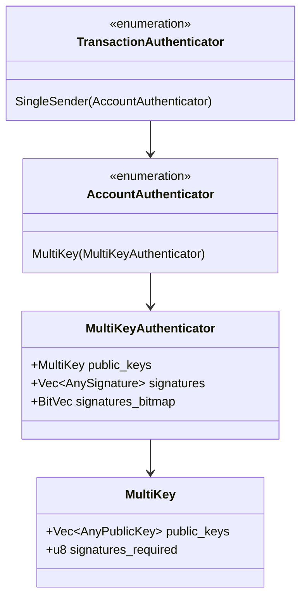
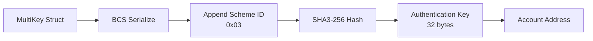

# MultiKey Authenticator Format Specification

> **Version:** 1.0.0  
> **Status:** Stable  
> **Last Updated:** January 28, 2026

## Overview

The MultiKey authenticator enables K-of-N multi-signature authentication using a heterogeneous set of public keys. Unlike the legacy MultiEd25519, MultiKey supports mixing different key types (Ed25519, Secp256k1, Secp256r1, Keyless) within a single multi-signature scheme.

## Structure Definition



## Enum Variant Indices

### AccountAuthenticator

| Variant | Index |
|---------|-------|
| Ed25519 | 0 |
| MultiEd25519 | 1 |
| SingleKey | 2 |
| **MultiKey** | **3** |

## BCS Serialization Layout

### MultiKeyAuthenticator

```
┌─────────────────────────────────────────────────────────────────┐
│                    MultiKeyAuthenticator                         │
├─────────────────────────────────────────────────────────────────┤
│ Field              │ Type              │ Description            │
├────────────────────┼───────────────────┼────────────────────────┤
│ public_keys        │ MultiKey          │ Public key collection  │
│ signatures         │ Vec<AnySignature> │ Collected signatures   │
│ signatures_bitmap  │ BitVec            │ Which keys signed      │
└─────────────────────────────────────────────────────────────────┘
```

### MultiKey Structure

```
┌─────────────────────────────────────────────────────────────────┐
│                         MultiKey                                 │
├─────────────────────────────────────────────────────────────────┤
│ Field               │ Type              │ Description           │
├─────────────────────┼───────────────────┼───────────────────────┤
│ public_keys         │ Vec<AnyPublicKey> │ List of public keys   │
│ signatures_required │ u8                │ Threshold (K)         │
└─────────────────────────────────────────────────────────────────┘
```

### BitVec (Signatures Bitmap)

The bitmap indicates which public keys (by index) have provided signatures.

```
┌─────────────────────────────────────────────────────────────────┐
│                         BitVec                                   │
├─────────────────────────────────────────────────────────────────┤
│ Field      │ Type       │ Description                           │
├────────────┼────────────┼───────────────────────────────────────┤
│ num_bits   │ u16 (LE)   │ Total number of bits                  │
│ bytes      │ Vec<u8>    │ Packed bits (ceil(num_bits/8) bytes)  │
└─────────────────────────────────────────────────────────────────┘

Bit ordering: Bit 0 is the MSB of the first byte.
Example: For keys at indices 0, 2, and 5:
  Binary: 10100100 (bits 0, 2, 5 set)
  Hex: 0xA4
```

### Complete BCS Layout

```
┌─────────────────────────────────────────────────────────────────┐
│           TransactionAuthenticator::SingleSender                 │
│                 with MultiKey AccountAuthenticator               │
├─────────────────────────────────────────────────────────────────┤
│ Offset │ Size    │ Field                                        │
├────────┼─────────┼──────────────────────────────────────────────┤
│ 0      │ 1       │ TransactionAuthenticator variant (4)         │
│ 1      │ 1       │ AccountAuthenticator variant (3 = MultiKey)  │
│ 2      │ Variable│ MultiKey (public_keys struct)                │
│ ...    │ Variable│ Vec<AnySignature> (signatures)               │
│ ...    │ Variable│ BitVec (signatures_bitmap)                   │
└─────────────────────────────────────────────────────────────────┘
```

### MultiKey BCS Layout Detail

```
┌─────────────────────────────────────────────────────────────────┐
│ Field                        │ Encoding                         │
├──────────────────────────────┼──────────────────────────────────┤
│ public_keys count            │ ULEB128                          │
│ public_keys[0]               │ AnyPublicKey (variant + data)    │
│ public_keys[1]               │ AnyPublicKey (variant + data)    │
│ ...                          │ ...                              │
│ signatures_required          │ u8                               │
└─────────────────────────────────────────────────────────────────┘
```

## Authentication Key Derivation

For MultiKey authentication, the scheme ID is `3`:

```
authentication_key = SHA3-256(BCS(MultiKey) || 0x03)
account_address = authentication_key
```



## Code Examples

### Rust

```rust
use aptos_crypto::{
    ed25519::{Ed25519PrivateKey, Ed25519PublicKey},
    secp256k1_ecdsa,
    traits::SigningKey,
};
use aptos_types::transaction::authenticator::{
    AccountAuthenticator, AnyPublicKey, AnySignature, AuthenticationKey,
    MultiKey, MultiKeyAuthenticator, TransactionAuthenticator,
};

// Create a 2-of-3 MultiKey with mixed key types
fn create_multi_key_2_of_3(
    ed25519_pk: Ed25519PublicKey,
    secp256k1_pk_1: secp256k1_ecdsa::PublicKey,
    secp256k1_pk_2: secp256k1_ecdsa::PublicKey,
) -> MultiKey {
    let public_keys = vec![
        AnyPublicKey::ed25519(ed25519_pk),
        AnyPublicKey::secp256k1_ecdsa(secp256k1_pk_1),
        AnyPublicKey::secp256k1_ecdsa(secp256k1_pk_2),
    ];
    
    MultiKey::new(public_keys, 2).unwrap()
}

// Create MultiKey authenticator with signatures
fn create_multi_key_authenticator(
    multi_key: MultiKey,
    signatures: Vec<(u8, AnySignature)>,  // (index, signature) pairs
) -> Result<TransactionAuthenticator, anyhow::Error> {
    let mk_auth = MultiKeyAuthenticator::new(multi_key, signatures)?;
    let account_auth = AccountAuthenticator::multi_key(mk_auth);
    Ok(TransactionAuthenticator::single_sender(account_auth))
}

// Derive address
fn derive_multi_key_address(multi_key: MultiKey) -> AccountAddress {
    AuthenticationKey::multi_key(multi_key).account_address()
}

// Example: Sign with keys at indices 0 and 2
fn sign_with_multi_key(
    raw_txn: &RawTransaction,
    multi_key: MultiKey,
    ed25519_private: &Ed25519PrivateKey,  // index 0
    secp256k1_private_2: &secp256k1_ecdsa::PrivateKey,  // index 2
) -> Result<TransactionAuthenticator, anyhow::Error> {
    // Sign with Ed25519 key (index 0)
    let sig_0 = AnySignature::ed25519(ed25519_private.sign(raw_txn)?);
    
    // Sign with Secp256k1 key (index 2)
    let sig_2 = AnySignature::secp256k1_ecdsa(secp256k1_private_2.sign(raw_txn)?);
    
    // Signatures must be provided in order of their indices
    let signatures = vec![(0, sig_0), (2, sig_2)];
    
    create_multi_key_authenticator(multi_key, signatures)
}
```

### Python

```python
import hashlib
from dataclasses import dataclass
from typing import List, Tuple
from enum import IntEnum

MULTI_KEY_SCHEME_ID = 0x03
MAX_NUM_OF_SIGS = 32

class AnyPublicKeyVariant(IntEnum):
    ED25519 = 0
    SECP256K1_ECDSA = 1
    SECP256R1_ECDSA = 2
    KEYLESS = 3

class AnySignatureVariant(IntEnum):
    ED25519 = 0
    SECP256K1_ECDSA = 1
    WEBAUTHN = 2
    KEYLESS = 3

@dataclass
class AnyPublicKey:
    variant: AnyPublicKeyVariant
    key_bytes: bytes
    
    def serialize(self) -> bytes:
        return bytes([self.variant]) + self.key_bytes

@dataclass
class AnySignature:
    variant: AnySignatureVariant
    signature_bytes: bytes
    
    def serialize(self) -> bytes:
        return bytes([self.variant]) + self.signature_bytes

@dataclass
class MultiKey:
    public_keys: List[AnyPublicKey]
    signatures_required: int
    
    def __post_init__(self):
        if self.signatures_required == 0:
            raise ValueError("signatures_required must be > 0")
        if len(self.public_keys) > MAX_NUM_OF_SIGS:
            raise ValueError(f"Too many public keys (max {MAX_NUM_OF_SIGS})")
        if len(self.public_keys) < self.signatures_required:
            raise ValueError("Not enough public keys for threshold")
    
    def serialize(self) -> bytes:
        """BCS serialize MultiKey."""
        result = bytearray()
        
        # Vec<AnyPublicKey> length
        result.extend(uleb128_encode(len(self.public_keys)))
        
        # Each public key
        for pk in self.public_keys:
            result.extend(pk.serialize())
        
        # signatures_required (u8)
        result.append(self.signatures_required)
        
        return bytes(result)
    
    def derive_authentication_key(self) -> bytes:
        """SHA3-256(BCS(MultiKey) || scheme_id)"""
        data = self.serialize() + bytes([MULTI_KEY_SCHEME_ID])
        return hashlib.sha3_256(data).digest()
    
    def derive_address(self) -> str:
        return "0x" + self.derive_authentication_key().hex()

class BitVec:
    """Bitmap for tracking which keys have signed."""
    
    def __init__(self, num_bits: int):
        self.num_bits = num_bits
        self.bytes = bytearray((num_bits + 7) // 8)
    
    def set(self, index: int):
        """Set bit at index (0-indexed)."""
        if index >= self.num_bits:
            raise ValueError(f"Index {index} out of range")
        byte_idx = index // 8
        bit_idx = 7 - (index % 8)  # MSB first
        self.bytes[byte_idx] |= (1 << bit_idx)
    
    def is_set(self, index: int) -> bool:
        """Check if bit at index is set."""
        byte_idx = index // 8
        bit_idx = 7 - (index % 8)
        return bool(self.bytes[byte_idx] & (1 << bit_idx))
    
    def count_ones(self) -> int:
        """Count number of set bits."""
        return sum(bin(b).count('1') for b in self.bytes)
    
    def serialize(self) -> bytes:
        """BCS serialize BitVec."""
        result = bytearray()
        # num_bits as u16 little-endian
        result.extend(self.num_bits.to_bytes(2, 'little'))
        # bytes as Vec<u8>
        result.extend(uleb128_encode(len(self.bytes)))
        result.extend(self.bytes)
        return bytes(result)

@dataclass
class MultiKeyAuthenticator:
    multi_key: MultiKey
    signatures: List[Tuple[int, AnySignature]]  # (index, signature) pairs
    
    def __post_init__(self):
        # Validate signatures
        indices = set()
        for idx, _ in self.signatures:
            if idx >= len(self.multi_key.public_keys):
                raise ValueError(f"Signature index {idx} out of range")
            if idx in indices:
                raise ValueError(f"Duplicate signature index {idx}")
            indices.add(idx)
        
        if len(self.signatures) < self.multi_key.signatures_required:
            raise ValueError("Not enough signatures for threshold")
    
    def serialize_authenticator(self) -> bytes:
        """
        Serialize complete TransactionAuthenticator::SingleSender
        with MultiKey AccountAuthenticator.
        """
        result = bytearray()
        
        # TransactionAuthenticator::SingleSender (variant 4)
        result.append(4)
        
        # AccountAuthenticator::MultiKey (variant 3)
        result.append(3)
        
        # MultiKey (public_keys struct)
        result.extend(self.multi_key.serialize())
        
        # Vec<AnySignature> - sorted by index
        sorted_sigs = sorted(self.signatures, key=lambda x: x[0])
        result.extend(uleb128_encode(len(sorted_sigs)))
        for _, sig in sorted_sigs:
            result.extend(sig.serialize())
        
        # BitVec (signatures_bitmap)
        bitmap = BitVec(len(self.multi_key.public_keys))
        for idx, _ in self.signatures:
            bitmap.set(idx)
        result.extend(bitmap.serialize())
        
        return bytes(result)

def uleb128_encode(value: int) -> bytes:
    result = []
    while value >= 0x80:
        result.append((value & 0x7F) | 0x80)
        value >>= 7
    result.append(value)
    return bytes(result)

# Example: Create 2-of-3 MultiKey with mixed key types
def example_2_of_3_multi_key():
    # Ed25519 public key (32 bytes)
    ed25519_pk = AnyPublicKey(
        AnyPublicKeyVariant.ED25519,
        bytes.fromhex("de19e5d1880cac87d57484ce9ed2e84cf0f9c1a9436a30593a9a23a1768a6105")
    )
    
    # Secp256k1 public keys (65 bytes each, uncompressed)
    secp256k1_pk_1 = AnyPublicKey(
        AnyPublicKeyVariant.SECP256K1_ECDSA,
        bytes(65)  # Placeholder
    )
    secp256k1_pk_2 = AnyPublicKey(
        AnyPublicKeyVariant.SECP256K1_ECDSA,
        bytes(65)  # Placeholder
    )
    
    multi_key = MultiKey(
        public_keys=[ed25519_pk, secp256k1_pk_1, secp256k1_pk_2],
        signatures_required=2
    )
    
    print(f"MultiKey Address: {multi_key.derive_address()}")
    
    # Create authenticator with signatures from keys 0 and 2
    sig_0 = AnySignature(AnySignatureVariant.ED25519, bytes(64))
    sig_2 = AnySignature(AnySignatureVariant.SECP256K1_ECDSA, bytes(64))
    
    auth = MultiKeyAuthenticator(
        multi_key=multi_key,
        signatures=[(0, sig_0), (2, sig_2)]
    )
    
    serialized = auth.serialize_authenticator()
    print(f"Serialized ({len(serialized)} bytes): {serialized.hex()}")

if __name__ == "__main__":
    example_2_of_3_multi_key()
```

### TypeScript

```typescript
import { sha3_256 } from '@noble/hashes/sha3';

const MULTI_KEY_SCHEME_ID = 0x03;
const MAX_NUM_OF_SIGS = 32;

interface AnyPublicKey {
  variant: number;
  keyBytes: Uint8Array;
}

interface AnySignature {
  variant: number;
  signatureBytes: Uint8Array;
}

interface MultiKey {
  publicKeys: AnyPublicKey[];
  signaturesRequired: number;
}

class BitVec {
  private numBits: number;
  private bytes: Uint8Array;

  constructor(numBits: number) {
    this.numBits = numBits;
    this.bytes = new Uint8Array(Math.ceil(numBits / 8));
  }

  set(index: number): void {
    if (index >= this.numBits) throw new Error(`Index ${index} out of range`);
    const byteIdx = Math.floor(index / 8);
    const bitIdx = 7 - (index % 8); // MSB first
    this.bytes[byteIdx] |= 1 << bitIdx;
  }

  serialize(): Uint8Array {
    // numBits (u16 LE) + Vec<u8> length + bytes
    const result = new Uint8Array(2 + 1 + this.bytes.length);
    // u16 little-endian
    result[0] = this.numBits & 0xff;
    result[1] = (this.numBits >> 8) & 0xff;
    // Vec length (ULEB128, simplified for small values)
    result[2] = this.bytes.length;
    result.set(this.bytes, 3);
    return result;
  }
}

function uleb128Encode(value: number): Uint8Array {
  const result: number[] = [];
  while (value >= 0x80) {
    result.push((value & 0x7f) | 0x80);
    value >>>= 7;
  }
  result.push(value);
  return new Uint8Array(result);
}

function serializeAnyPublicKey(pk: AnyPublicKey): Uint8Array {
  const result = new Uint8Array(1 + pk.keyBytes.length);
  result[0] = pk.variant;
  result.set(pk.keyBytes, 1);
  return result;
}

function serializeAnySignature(sig: AnySignature): Uint8Array {
  const result = new Uint8Array(1 + sig.signatureBytes.length);
  result[0] = sig.variant;
  result.set(sig.signatureBytes, 1);
  return result;
}

function serializeMultiKey(multiKey: MultiKey): Uint8Array {
  const parts: Uint8Array[] = [];

  // Vec<AnyPublicKey> length
  parts.push(uleb128Encode(multiKey.publicKeys.length));

  // Each public key
  for (const pk of multiKey.publicKeys) {
    parts.push(serializeAnyPublicKey(pk));
  }

  // signatures_required (u8)
  parts.push(new Uint8Array([multiKey.signaturesRequired]));

  // Concatenate
  const totalLength = parts.reduce((sum, p) => sum + p.length, 0);
  const result = new Uint8Array(totalLength);
  let offset = 0;
  for (const part of parts) {
    result.set(part, offset);
    offset += part.length;
  }
  return result;
}

function deriveMultiKeyAddress(multiKey: MultiKey): string {
  const mkBytes = serializeMultiKey(multiKey);
  const data = new Uint8Array(mkBytes.length + 1);
  data.set(mkBytes);
  data[mkBytes.length] = MULTI_KEY_SCHEME_ID;
  const authKey = sha3_256(data);
  return '0x' + Buffer.from(authKey).toString('hex');
}

function serializeMultiKeyAuthenticator(
  multiKey: MultiKey,
  signatures: Array<[number, AnySignature]>  // [index, signature] pairs
): Uint8Array {
  const parts: Uint8Array[] = [];

  // TransactionAuthenticator::SingleSender (variant 4)
  parts.push(new Uint8Array([4]));

  // AccountAuthenticator::MultiKey (variant 3)
  parts.push(new Uint8Array([3]));

  // MultiKey
  parts.push(serializeMultiKey(multiKey));

  // Vec<AnySignature> - sorted by index
  const sortedSigs = [...signatures].sort((a, b) => a[0] - b[0]);
  parts.push(uleb128Encode(sortedSigs.length));
  for (const [, sig] of sortedSigs) {
    parts.push(serializeAnySignature(sig));
  }

  // BitVec
  const bitmap = new BitVec(multiKey.publicKeys.length);
  for (const [idx] of signatures) {
    bitmap.set(idx);
  }
  parts.push(bitmap.serialize());

  // Concatenate
  const totalLength = parts.reduce((sum, p) => sum + p.length, 0);
  const result = new Uint8Array(totalLength);
  let offset = 0;
  for (const part of parts) {
    result.set(part, offset);
    offset += part.length;
  }
  return result;
}

// Example usage
const multiKey: MultiKey = {
  publicKeys: [
    { variant: 0, keyBytes: new Uint8Array(32) },  // Ed25519
    { variant: 1, keyBytes: new Uint8Array(65) },  // Secp256k1
    { variant: 1, keyBytes: new Uint8Array(65) },  // Secp256k1
  ],
  signaturesRequired: 2,
};

console.log('MultiKey Address:', deriveMultiKeyAddress(multiKey));

const signatures: Array<[number, AnySignature]> = [
  [0, { variant: 0, signatureBytes: new Uint8Array(64) }],  // Ed25519 sig
  [2, { variant: 1, signatureBytes: new Uint8Array(64) }],  // Secp256k1 sig
];

const authBytes = serializeMultiKeyAuthenticator(multiKey, signatures);
console.log(`Authenticator (${authBytes.length} bytes):`, Buffer.from(authBytes).toString('hex'));
```

## Test Vector: 2-of-3 MultiKey

### Input

| Parameter | Value |
|-----------|-------|
| Key 0 (Ed25519) | `de19e5d1880cac87d57484ce9ed2e84cf0f9c1a9436a30593a9a23a1768a6105` |
| Key 1 (Secp256k1) | `04<64-byte coordinates>` |
| Key 2 (Secp256k1) | `04<64-byte coordinates>` |
| signatures_required | `2` |
| Signatures from | Indices 0 and 2 |

### Serialization Breakdown

```
04                      # TransactionAuthenticator::SingleSender
03                      # AccountAuthenticator::MultiKey

# MultiKey struct
03                      # public_keys count (3)
00                      # AnyPublicKey variant (Ed25519)
<32-byte ed25519 pk>    # Ed25519 public key
01                      # AnyPublicKey variant (Secp256k1)
<65-byte secp256k1 pk>  # Secp256k1 public key #1
01                      # AnyPublicKey variant (Secp256k1)
<65-byte secp256k1 pk>  # Secp256k1 public key #2
02                      # signatures_required

# Vec<AnySignature> (2 signatures, sorted by index)
02                      # signatures count
00                      # AnySignature variant (Ed25519)
<64-byte ed25519 sig>   # signature from key 0
01                      # AnySignature variant (Secp256k1)
<64-byte secp256k1 sig> # signature from key 2

# BitVec (indices 0 and 2 set)
0300                    # num_bits = 3 (u16 LE)
01                      # bytes count
a0                      # bitmap: 10100000 (bits 0 and 2 set)
```

### Bitmap Explanation

For a 3-key MultiKey with signatures at indices 0 and 2:

```
Index:    0   1   2
Bit:      1   0   1   0   0   0   0   0
          ↑       ↑
          Key 0   Key 2

Byte value: 0b10100000 = 0xA0
```

## Validation Rules

1. **Threshold**: `signatures_required > 0`
2. **Key Count**: `public_keys.len() <= MAX_NUM_OF_SIGS` (32)
3. **Threshold vs Keys**: `public_keys.len() >= signatures_required`
4. **Signature Count**: Must have at least `signatures_required` signatures
5. **Unique Indices**: No duplicate signature indices
6. **Index Range**: All signature indices < `public_keys.len()`
7. **Bitmap Match**: Bitmap set bits must equal number of signatures
8. **Type Compatibility**: Each signature must be compatible with its corresponding public key type

## Error Cases

| Error | Cause |
|-------|-------|
| `INVALID_SIGNATURE` | Signature doesn't verify |
| `NOT_ENOUGH_SIGNATURES` | Fewer signatures than threshold |
| `DUPLICATE_SIGNATURE_INDEX` | Same key signed twice |
| `SIGNATURE_INDEX_OUT_OF_RANGE` | Index >= number of keys |
| `TOO_MANY_PUBLIC_KEYS` | More than 32 public keys |
| `BITMAP_MISMATCH` | Bitmap doesn't match signatures |

## Security Considerations

1. **Key Ordering**: Keys should be in a deterministic order for address stability
2. **Threshold Selection**: Higher thresholds increase security but require more coordination
3. **Key Diversity**: Using multiple key types can provide defense in depth
4. **Replay Protection**: Each signer should sign the same transaction independently

## Related Documents

- [SingleKey Authenticator](03-single-key-authenticator.md) - Single-signer variant
- [MultiEd25519 Authenticator](05-multi-ed25519-authenticator.md) - Legacy multi-sig
- [Multi-Agent Transactions](../advanced/01-multi-agent-transactions.md) - Multiple independent signers
