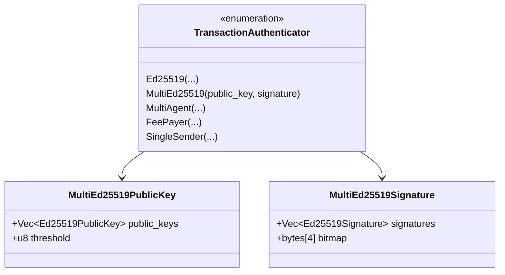
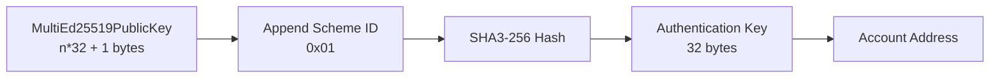

# MultiEd25519 Authenticator Format Specification

> **Version:** 1.0.0  
> **Status:** Stable (Legacy)  
> **Last Updated:** January 28, 2026

## Overview

The MultiEd25519 authenticator is a **legacy** K-of-N multi-signature scheme that uses only Ed25519 keys. While still supported, new implementations should prefer the [MultiKey authenticator](04-multi-key-authenticator.md) which offers more flexibility.

## Structure Definition



## Constants

```
MAX_NUM_OF_KEYS = 32              // Maximum number of Ed25519 keys
ED25519_PUBLIC_KEY_LENGTH = 32    // Each public key is 32 bytes
ED25519_SIGNATURE_LENGTH = 64     // Each signature is 64 bytes
BITMAP_NUM_OF_BYTES = 4           // 32-bit bitmap (4 bytes)
```

## BCS Serialization Layout

### TransactionAuthenticator::MultiEd25519

```
┌─────────────────────────────────────────────────────────────────┐
│           TransactionAuthenticator::MultiEd25519                 │
├─────────────────────────────────────────────────────────────────┤
│ Offset │ Size    │ Field                                        │
├────────┼─────────┼──────────────────────────────────────────────┤
│ 0      │ 1       │ variant_index (1 = MultiEd25519)             │
│ 1      │ Variable│ MultiEd25519PublicKey                        │
│ ...    │ Variable│ MultiEd25519Signature                        │
└─────────────────────────────────────────────────────────────────┘
```

### MultiEd25519PublicKey

The public key is serialized as concatenated Ed25519 public keys followed by the threshold:

```
┌─────────────────────────────────────────────────────────────────┐
│                   MultiEd25519PublicKey                          │
├─────────────────────────────────────────────────────────────────┤
│ Bytes         │ Content                                         │
├───────────────┼─────────────────────────────────────────────────┤
│ 0-31          │ Ed25519 Public Key #0 (32 bytes)                │
│ 32-63         │ Ed25519 Public Key #1 (32 bytes)                │
│ ...           │ ...                                             │
│ (n-1)*32      │ Ed25519 Public Key #(n-1)                       │
│ n*32          │ threshold (1 byte)                              │
└─────────────────────────────────────────────────────────────────┘
Total: n * 32 + 1 bytes
```

**Important**: Unlike BCS vectors, this format does NOT include a length prefix. The number of keys is determined by `(total_bytes - 1) / 32`.

### MultiEd25519Signature

The signature is serialized as concatenated Ed25519 signatures followed by a 4-byte bitmap:

```
┌─────────────────────────────────────────────────────────────────┐
│                   MultiEd25519Signature                          │
├─────────────────────────────────────────────────────────────────┤
│ Bytes         │ Content                                         │
├───────────────┼─────────────────────────────────────────────────┤
│ 0-63          │ Ed25519 Signature #0 (64 bytes)                 │
│ 64-127        │ Ed25519 Signature #1 (64 bytes)                 │
│ ...           │ ...                                             │
│ (m-1)*64      │ Ed25519 Signature #(m-1)                        │
│ m*64          │ bitmap (4 bytes)                                │
└─────────────────────────────────────────────────────────────────┘
Total: m * 64 + 4 bytes
```

### Bitmap Format

The 4-byte bitmap indicates which public keys have corresponding signatures:

```
┌──────────────────────────────────────────────────────────────────────┐
│                         Bitmap (4 bytes)                              │
├────────┬────────┬────────┬────────┬────────┬────────┬────────┬───────┤
│ Byte 0 │ Bit 7  │ Bit 6  │ Bit 5  │ Bit 4  │ Bit 3  │ Bit 2  │ Bit 1 │ Bit 0 │
│        │ Key 0  │ Key 1  │ Key 2  │ Key 3  │ Key 4  │ Key 5  │ Key 6 │ Key 7 │
├────────┼────────┴────────┴────────┴────────┴────────┴────────┴───────┴───────┤
│ Byte 1 │ Keys 8-15                                                    │
│ Byte 2 │ Keys 16-23                                                   │
│ Byte 3 │ Keys 24-31                                                   │
└────────┴──────────────────────────────────────────────────────────────┘

Bit ordering: MSB (bit 7) corresponds to the lowest-indexed key in each byte.
```

## Authentication Key Derivation

For MultiEd25519, the scheme ID is `1`:

```
authentication_key = SHA3-256(public_key_bytes || 0x01)
account_address = authentication_key
```

Where `public_key_bytes` is the full serialized MultiEd25519PublicKey (all keys + threshold).



## Code Examples

### Rust

```rust
use aptos_crypto::{
    ed25519::{Ed25519PrivateKey, Ed25519PublicKey, Ed25519Signature},
    multi_ed25519::{MultiEd25519PublicKey, MultiEd25519Signature},
    traits::SigningKey,
};
use aptos_types::transaction::{
    authenticator::AuthenticationKey,
    RawTransaction, SignedTransaction, TransactionAuthenticator,
};

// Create a 2-of-3 MultiEd25519 public key
fn create_multi_ed25519_public_key(
    pk0: Ed25519PublicKey,
    pk1: Ed25519PublicKey,
    pk2: Ed25519PublicKey,
    threshold: u8,
) -> MultiEd25519PublicKey {
    MultiEd25519PublicKey::new(vec![pk0, pk1, pk2], threshold).unwrap()
}

// Sign with MultiEd25519 (specific keys)
fn sign_multi_ed25519(
    raw_txn: &RawTransaction,
    public_key: &MultiEd25519PublicKey,
    private_key_0: &Ed25519PrivateKey,  // Index 0
    private_key_2: &Ed25519PrivateKey,  // Index 2
) -> TransactionAuthenticator {
    // Sign with each private key
    let sig0 = private_key_0.sign(raw_txn).unwrap();
    let sig2 = private_key_2.sign(raw_txn).unwrap();
    
    // Create MultiEd25519Signature with (signature, index) pairs
    let signatures = vec![
        (sig0, 0u8),
        (sig2, 2u8),
    ];
    
    let multi_sig = MultiEd25519Signature::new(signatures).unwrap();
    
    TransactionAuthenticator::multi_ed25519(public_key.clone(), multi_sig)
}

// Derive address
fn derive_multi_ed25519_address(public_key: &MultiEd25519PublicKey) -> AccountAddress {
    AuthenticationKey::multi_ed25519(public_key).account_address()
}

// Manual serialization of MultiEd25519PublicKey
fn serialize_multi_ed25519_public_key(
    public_keys: &[Ed25519PublicKey],
    threshold: u8,
) -> Vec<u8> {
    let mut bytes = Vec::with_capacity(public_keys.len() * 32 + 1);
    
    for pk in public_keys {
        bytes.extend_from_slice(&pk.to_bytes());
    }
    bytes.push(threshold);
    
    bytes
}

// Manual serialization of MultiEd25519Signature
fn serialize_multi_ed25519_signature(
    signatures: &[(Ed25519Signature, u8)],  // (signature, index)
) -> Vec<u8> {
    let mut bytes = Vec::new();
    let mut bitmap = [0u8; 4];
    
    // Sort by index
    let mut sorted_sigs: Vec<_> = signatures.iter().collect();
    sorted_sigs.sort_by_key(|(_, idx)| *idx);
    
    // Add signatures and set bitmap bits
    for (sig, idx) in sorted_sigs {
        bytes.extend_from_slice(&sig.to_bytes());
        
        // Set bit in bitmap (MSB first within each byte)
        let byte_idx = (*idx / 8) as usize;
        let bit_idx = 7 - (*idx % 8);
        bitmap[byte_idx] |= 1 << bit_idx;
    }
    
    // Append bitmap
    bytes.extend_from_slice(&bitmap);
    
    bytes
}
```

### Python

```python
import hashlib
from typing import List, Tuple

MULTI_ED25519_SCHEME_ID = 0x01
ED25519_PUBLIC_KEY_LENGTH = 32
ED25519_SIGNATURE_LENGTH = 64
BITMAP_NUM_OF_BYTES = 4
MAX_NUM_OF_KEYS = 32

class MultiEd25519PublicKey:
    def __init__(self, public_keys: List[bytes], threshold: int):
        if threshold == 0:
            raise ValueError("Threshold must be > 0")
        if len(public_keys) > MAX_NUM_OF_KEYS:
            raise ValueError(f"Too many keys (max {MAX_NUM_OF_KEYS})")
        if len(public_keys) < threshold:
            raise ValueError("Not enough keys for threshold")
        
        for pk in public_keys:
            if len(pk) != ED25519_PUBLIC_KEY_LENGTH:
                raise ValueError(f"Invalid public key length: {len(pk)}")
        
        self.public_keys = public_keys
        self.threshold = threshold
    
    def serialize(self) -> bytes:
        """
        Serialize MultiEd25519PublicKey.
        Format: pk0 || pk1 || ... || pkN || threshold
        """
        result = bytearray()
        for pk in self.public_keys:
            result.extend(pk)
        result.append(self.threshold)
        return bytes(result)
    
    def derive_authentication_key(self) -> bytes:
        """SHA3-256(serialized_public_key || scheme_id)"""
        data = self.serialize() + bytes([MULTI_ED25519_SCHEME_ID])
        return hashlib.sha3_256(data).digest()
    
    def derive_address(self) -> str:
        return "0x" + self.derive_authentication_key().hex()


class MultiEd25519Signature:
    def __init__(self, signatures: List[Tuple[bytes, int]]):
        """
        Args:
            signatures: List of (signature_bytes, key_index) tuples
        """
        indices = set()
        for sig, idx in signatures:
            if len(sig) != ED25519_SIGNATURE_LENGTH:
                raise ValueError(f"Invalid signature length: {len(sig)}")
            if idx >= MAX_NUM_OF_KEYS:
                raise ValueError(f"Index out of range: {idx}")
            if idx in indices:
                raise ValueError(f"Duplicate index: {idx}")
            indices.add(idx)
        
        self.signatures = signatures
    
    def serialize(self) -> bytes:
        """
        Serialize MultiEd25519Signature.
        Format: sig0 || sig1 || ... || sigM || bitmap (4 bytes)
        
        Signatures are ordered by their key index.
        """
        # Sort signatures by index
        sorted_sigs = sorted(self.signatures, key=lambda x: x[1])
        
        result = bytearray()
        bitmap = [0, 0, 0, 0]
        
        for sig, idx in sorted_sigs:
            result.extend(sig)
            
            # Set bit in bitmap (MSB first within each byte)
            byte_idx = idx // 8
            bit_idx = 7 - (idx % 8)
            bitmap[byte_idx] |= (1 << bit_idx)
        
        result.extend(bitmap)
        return bytes(result)


class MultiEd25519Authenticator:
    def __init__(self, public_key: MultiEd25519PublicKey, signature: MultiEd25519Signature):
        self.public_key = public_key
        self.signature = signature
    
    def serialize_authenticator(self) -> bytes:
        """
        Serialize TransactionAuthenticator::MultiEd25519.
        
        Layout:
        - 1 byte: variant (1 = MultiEd25519)
        - Variable: MultiEd25519PublicKey
        - Variable: MultiEd25519Signature
        """
        result = bytearray()
        
        # Variant index
        result.append(0x01)
        
        # Public key
        result.extend(self.public_key.serialize())
        
        # Signature
        result.extend(self.signature.serialize())
        
        return bytes(result)


def bitmap_get_bit(bitmap: bytes, index: int) -> bool:
    """Get bit at index from 4-byte bitmap."""
    byte_idx = index // 8
    bit_idx = 7 - (index % 8)
    return bool(bitmap[byte_idx] & (1 << bit_idx))


def bitmap_set_bit(bitmap: bytearray, index: int):
    """Set bit at index in 4-byte bitmap."""
    byte_idx = index // 8
    bit_idx = 7 - (index % 8)
    bitmap[byte_idx] |= (1 << bit_idx)


# Example usage
def example_2_of_3_multi_ed25519():
    # Example public keys (32 bytes each)
    pk0 = bytes.fromhex("de19e5d1880cac87d57484ce9ed2e84cf0f9c1a9436a30593a9a23a1768a6105")
    pk1 = bytes.fromhex("ab19e5d1880cac87d57484ce9ed2e84cf0f9c1a9436a30593a9a23a1768a6105")
    pk2 = bytes.fromhex("cd19e5d1880cac87d57484ce9ed2e84cf0f9c1a9436a30593a9a23a1768a6105")
    
    public_key = MultiEd25519PublicKey([pk0, pk1, pk2], threshold=2)
    
    print(f"Public Key Bytes ({len(public_key.serialize())} bytes): {public_key.serialize().hex()}")
    print(f"Address: {public_key.derive_address()}")
    
    # Example signatures from keys 0 and 2
    sig0 = bytes(64)  # Placeholder
    sig2 = bytes(64)  # Placeholder
    
    signature = MultiEd25519Signature([(sig0, 0), (sig2, 2)])
    
    print(f"Signature Bytes ({len(signature.serialize())} bytes): {signature.serialize().hex()}")
    
    # Full authenticator
    auth = MultiEd25519Authenticator(public_key, signature)
    serialized = auth.serialize_authenticator()
    print(f"Authenticator ({len(serialized)} bytes): {serialized.hex()}")


if __name__ == "__main__":
    example_2_of_3_multi_ed25519()
```

### TypeScript

```typescript
import { sha3_256 } from '@noble/hashes/sha3';

const MULTI_ED25519_SCHEME_ID = 0x01;
const ED25519_PUBLIC_KEY_LENGTH = 32;
const ED25519_SIGNATURE_LENGTH = 64;
const BITMAP_NUM_OF_BYTES = 4;
const MAX_NUM_OF_KEYS = 32;

class MultiEd25519PublicKey {
  constructor(
    public readonly publicKeys: Uint8Array[],
    public readonly threshold: number
  ) {
    if (threshold === 0) throw new Error('Threshold must be > 0');
    if (publicKeys.length > MAX_NUM_OF_KEYS) throw new Error('Too many keys');
    if (publicKeys.length < threshold) throw new Error('Not enough keys for threshold');

    for (const pk of publicKeys) {
      if (pk.length !== ED25519_PUBLIC_KEY_LENGTH) {
        throw new Error(`Invalid public key length: ${pk.length}`);
      }
    }
  }

  serialize(): Uint8Array {
    const totalSize = this.publicKeys.length * ED25519_PUBLIC_KEY_LENGTH + 1;
    const result = new Uint8Array(totalSize);

    let offset = 0;
    for (const pk of this.publicKeys) {
      result.set(pk, offset);
      offset += ED25519_PUBLIC_KEY_LENGTH;
    }
    result[offset] = this.threshold;

    return result;
  }

  deriveAuthenticationKey(): Uint8Array {
    const pkBytes = this.serialize();
    const data = new Uint8Array(pkBytes.length + 1);
    data.set(pkBytes);
    data[pkBytes.length] = MULTI_ED25519_SCHEME_ID;
    return sha3_256(data);
  }

  deriveAddress(): string {
    const authKey = this.deriveAuthenticationKey();
    return '0x' + Buffer.from(authKey).toString('hex');
  }
}

class MultiEd25519Signature {
  constructor(
    public readonly signatures: Array<[Uint8Array, number]> // [signature, keyIndex]
  ) {
    const indices = new Set<number>();
    for (const [sig, idx] of signatures) {
      if (sig.length !== ED25519_SIGNATURE_LENGTH) {
        throw new Error(`Invalid signature length: ${sig.length}`);
      }
      if (idx >= MAX_NUM_OF_KEYS) throw new Error(`Index out of range: ${idx}`);
      if (indices.has(idx)) throw new Error(`Duplicate index: ${idx}`);
      indices.add(idx);
    }
  }

  serialize(): Uint8Array {
    // Sort by index
    const sortedSigs = [...this.signatures].sort((a, b) => a[1] - b[1]);

    const totalSize = sortedSigs.length * ED25519_SIGNATURE_LENGTH + BITMAP_NUM_OF_BYTES;
    const result = new Uint8Array(totalSize);
    const bitmap = new Uint8Array(BITMAP_NUM_OF_BYTES);

    let offset = 0;
    for (const [sig, idx] of sortedSigs) {
      result.set(sig, offset);
      offset += ED25519_SIGNATURE_LENGTH;

      // Set bit in bitmap (MSB first within each byte)
      const byteIdx = Math.floor(idx / 8);
      const bitIdx = 7 - (idx % 8);
      bitmap[byteIdx] |= 1 << bitIdx;
    }

    result.set(bitmap, offset);
    return result;
  }
}

class MultiEd25519Authenticator {
  constructor(
    public readonly publicKey: MultiEd25519PublicKey,
    public readonly signature: MultiEd25519Signature
  ) {}

  serializeAuthenticator(): Uint8Array {
    const pkBytes = this.publicKey.serialize();
    const sigBytes = this.signature.serialize();

    const result = new Uint8Array(1 + pkBytes.length + sigBytes.length);
    result[0] = 0x01; // MultiEd25519 variant
    result.set(pkBytes, 1);
    result.set(sigBytes, 1 + pkBytes.length);

    return result;
  }
}

// Example usage
const pk0 = new Uint8Array(Buffer.from(
  'de19e5d1880cac87d57484ce9ed2e84cf0f9c1a9436a30593a9a23a1768a6105',
  'hex'
));
const pk1 = new Uint8Array(Buffer.from(
  'ab19e5d1880cac87d57484ce9ed2e84cf0f9c1a9436a30593a9a23a1768a6105',
  'hex'
));
const pk2 = new Uint8Array(Buffer.from(
  'cd19e5d1880cac87d57484ce9ed2e84cf0f9c1a9436a30593a9a23a1768a6105',
  'hex'
));

const publicKey = new MultiEd25519PublicKey([pk0, pk1, pk2], 2);
console.log('Address:', publicKey.deriveAddress());

const sig0 = new Uint8Array(64); // Placeholder
const sig2 = new Uint8Array(64); // Placeholder

const signature = new MultiEd25519Signature([[sig0, 0], [sig2, 2]]);

const auth = new MultiEd25519Authenticator(publicKey, signature);
const serialized = auth.serializeAuthenticator();
console.log(`Authenticator (${serialized.length} bytes):`, Buffer.from(serialized).toString('hex'));
```

## Test Vector: 2-of-3 MultiEd25519

### Input

| Parameter | Value |
|-----------|-------|
| Public Key 0 | `de19e5d1880cac87d57484ce9ed2e84cf0f9c1a9436a30593a9a23a1768a6105` |
| Public Key 1 | `ab19e5d1880cac87d57484ce9ed2e84cf0f9c1a9436a30593a9a23a1768a6105` |
| Public Key 2 | `cd19e5d1880cac87d57484ce9ed2e84cf0f9c1a9436a30593a9a23a1768a6105` |
| Threshold | `2` |
| Signatures from | Indices 0 and 2 |

### MultiEd25519PublicKey Serialization

```
de19e5d1880cac87d57484ce9ed2e84cf0f9c1a9436a30593a9a23a1768a6105  # pk[0]
ab19e5d1880cac87d57484ce9ed2e84cf0f9c1a9436a30593a9a23a1768a6105  # pk[1]
cd19e5d1880cac87d57484ce9ed2e84cf0f9c1a9436a30593a9a23a1768a6105  # pk[2]
02                                                                  # threshold
```

**Total: 97 bytes** (3 × 32 + 1)

### MultiEd25519Signature Serialization

```
<64-byte signature from key 0>    # sig[0]
<64-byte signature from key 2>    # sig[2]
a0000000                          # bitmap (bits 0 and 2 set: 10100000 00000000 00000000 00000000)
```

**Total: 132 bytes** (2 × 64 + 4)

### Bitmap Calculation

For signatures at indices 0 and 2:

```
Byte 0:  Bits for keys 0-7
         Index 0: bit 7 = 1
         Index 2: bit 5 = 1
         Binary: 10100000 = 0xA0

Byte 1:  Bits for keys 8-15 = 0x00
Byte 2:  Bits for keys 16-23 = 0x00
Byte 3:  Bits for keys 24-31 = 0x00

Full bitmap: A0 00 00 00
```

### Full Authenticator

```
01                                # TransactionAuthenticator variant (MultiEd25519)
<97-byte MultiEd25519PublicKey>   # public key struct
<132-byte MultiEd25519Signature>  # signature struct

Total: 230 bytes
```

## Validation Rules

1. **Threshold**: `threshold > 0`
2. **Key Count**: `1 <= num_keys <= 32`
3. **Threshold vs Keys**: `num_keys >= threshold`
4. **Signature Count**: `bitmap.count_ones() >= threshold`
5. **Bitmap vs Signatures**: `bitmap.count_ones() == num_signatures`
6. **Index Range**: All set bits in bitmap must be < `num_keys`

## Comparison: MultiEd25519 vs MultiKey

| Aspect | MultiEd25519 | MultiKey |
|--------|--------------|----------|
| Scheme ID | 0x01 | 0x03 |
| Key Types | Ed25519 only | Multiple (Ed25519, Secp256k1, etc.) |
| Max Keys | 32 | 32 |
| Bitmap Format | Fixed 4 bytes | Variable BitVec |
| BCS Format | Custom (no length prefix) | Standard BCS |
| Recommended | Legacy | **Yes** |

## Error Cases

| Error | Cause |
|-------|-------|
| `INVALID_SIGNATURE` | Signature doesn't verify |
| `NOT_ENOUGH_SIGNATURES` | Fewer signatures than threshold |
| `BITMAP_MISMATCH` | Bitmap doesn't match signatures |
| `THRESHOLD_TOO_HIGH` | Threshold > number of keys |
| `TOO_MANY_KEYS` | More than 32 keys |

## Migration Guide

To migrate from MultiEd25519 to MultiKey:

1. Create `AnyPublicKey::Ed25519` for each Ed25519 key
2. Use `MultiKey::new()` with the same threshold
3. Create `AnySignature::Ed25519` for each signature
4. Use `MultiKeyAuthenticator::new()` with (index, signature) pairs

**Note**: The resulting address will be **different** due to different scheme IDs (0x01 vs 0x03).

## Related Documents

- [MultiKey Authenticator](04-multi-key-authenticator.md) - Modern multi-sig format
- [Ed25519 Authenticator](02-ed25519-authenticator.md) - Single Ed25519 signature
- [MultiEd25519 Signing](../signing/03-multi-ed25519-signing.md) - Signing process
