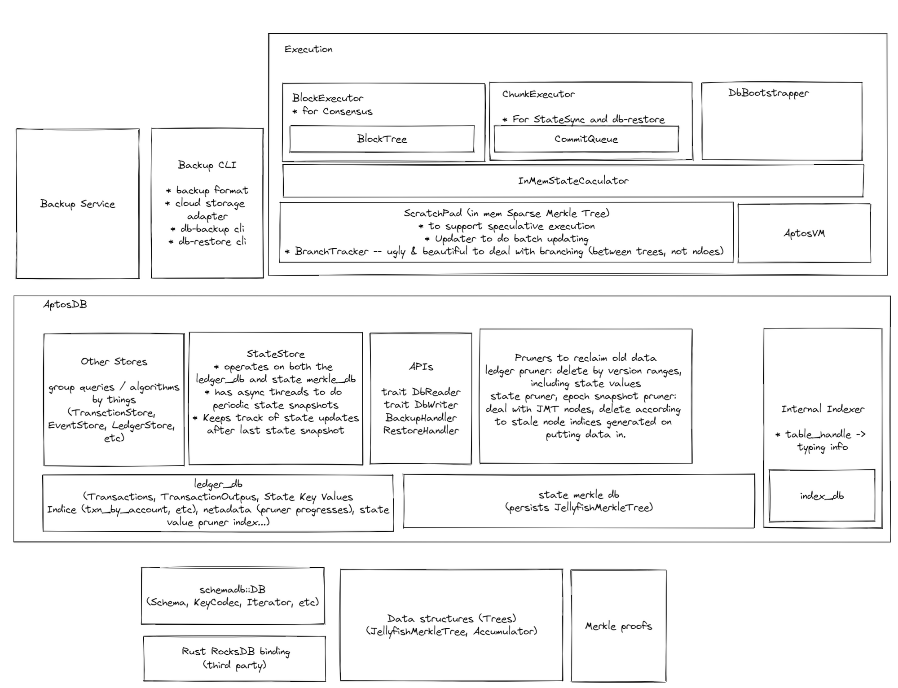

## Overview

The storage modules implement:
* the VelorDB which holds the authenticated blockchain data structure within a
Velor Node. It serves the current "state" readable by Move contracts being
executed, as well as a configurable length of the blockchain history to fellow
Velor Nodes and the Rest API. It takes in new data from either the consensus or
the state sync components to grow the history.
* the backup system which persists the entire history of transactions. The
backups are not required for running the blockchain in normal situations, but
can be critical when emergency happens were an VelorDB needs to be recreated
a. without the help of widely available healthy running Velor Nodes b. to
recover a historical state back in time. c. specifically, to do b. in order to
create an alternative ledger and redistribute the result to overcome
unforeseeable catastrophic situations (to hard fork)

More to read:
* To understand the authenticated blockchain data structure, see
https://github.com/velor-chain/velor-core/tree/main/documentation/specifications/common
* To know more about the state authentication data structure, see
https://github.com/velor-chain/velor-core/developer-docs-site/static/papers/jellyfish-merkle-tree/2021-01-14.pdf
* To learn more about the backup system including the backup data format, see
https://github.com/velor-chain/velor-core/blob/main/documentation/specifications/db_backup/spec.md

## System Architecture

Here's a sketch of how components stack on top of each other.
Notice that the whole "Execution" block is outside of this folder but highly related.




##  Configs

As part of the Velor Node config, these are specific for the storage components.
Notice that to use the default configs one doesn't need to put in anything in
the config file. Only when one needs to overwrite a certain config value she
needs put in something. For example, to enable the internal indexer, one can
put in this piece into the node config file:

```yaml
storage:
    enable_indexer: true
```

Now here's the full set of configs, with their default values and explanations.
The default values should work in most cases and generally speaking don't need
to be changed. Another reason to not overriding them is the developers of Velor
can tune the default configs with new software releases and a override will
make your node miss it.
If you do have a reason to change them, probably read the more
detailed comments in
https://github.com/velor-chain/velor-core/blob/main/config/src/config/storage_config.rs
to understand it better.

```yaml
storage: 
  # Address the backup service listens on. By default the port is open to only
  # the localhost, so the backup cli tool can only access data in the same host.
  backup_service_address: "127.0.0.1:6186"
  # Sub directory under the `data_dir` config under `base` to hold the RocksDB
  # instances.
  # For example, if in the top level config we have
  # ``` yaml
  # base:
  #   data_dir: /opt/velor/data
  # ```
  # and this config has the default value (`db`), the DBs will be at
  # `/opt/velor/data/db/ledger_db` and  `/opt/velor/data/db/state_merkle_db`
  dir: db
  # VelorDB persists the state authentication structure off the critical path
  # of transaction execution and batch up recent changes for performance. Once
  # the number of buffered state updates exceeds this config, a dump of all
  # buffered values into a snapshot is triggered. (Alternatively, if too many
  # transactions have been processed since last dump, a new dump is processed
  # as well.)
  buffered_state_target_items: 100000
  # Determines the maximum memory consumption by the JMT node cache. Larger cache
  # helps with performance but consumes a lot of memory and can compete with
  # the filesystem cache.
  max_num_nodes_per_lru_cache_shard: 8192
  # VelorDB keeps recent history of the blockchain ledger and recent versions
  # of the state trees. And a pruner is responsible for pruning old data. The
  # default values makes sure the network is in good health in terms of
  # data availability and won't occupy too much space on recommended hardware
  # specs.
  storage_pruner_config:
    # This configures the ledger pruner. The ledger data includes
    # transactions, transaction outputs, including events, write sets, and
    # relevant authentication data structures. Most notably, the state key
    # values are part of the ledger, while the state authentication data
    # structure (the state trees) is pruned separately.
    ledger_pruner_config:
      enable: true
      prune_window: 150000000
      batch_size: 500
      user_pruning_window_offset: 200000
    # This configures the inner-epoch state tree pruner. If a state tree node is
    # overwritten by a later transaction within the same epoch, it's gonna be
    # pruned later by this pruner according to these configs.
    state_merkle_pruner_config:
      enable: true
      prune_window: 100000
      batch_size: 1000
    # This configures the inter-epoch state tree pruner. If a state tree node is
    # overwritten by a later transaction that's in a later epoch, it's gonna be
    # pruned later by this pruner according to these configs. The prune window
    # looks large (the unit is number of transactions) but at each position in
    # the tree only the last node in its epoch among all updates to the same
    # position is kept (or pruned) by this pruner. Effectively these configs
    # guarantees complete state trees (or "epoch snapshots") at the end of
    # each recent epochs are available for peers to access, which is important
    # for the health of the chain.
    epoch_snapshot_pruner_config:
      enable: true
      prune_window: 80000000
      batch_size: 1000
  # These are performance parameters tunable for each RocksDB instance
  # controlled by the storage components. One should not touch them unless
  # familiar with RockDB performance tuning.
  rocksdb_configs:
    ledger_db_config:
      max_open_files: 5000
      max_total_wal_size: 1073741824
      max_background_jobs: 16
      block_cache_size: 8388608
      block_size: 4096
      cache_index_and_filter_blocks: false
    state_merkle_db_config:
      max_open_files: 5000
      max_total_wal_size: 1073741824
      max_background_jobs: 16
      block_cache_size: 8388608
      block_size: 4096
      cache_index_and_filter_blocks: false
    index_db_config:
      max_open_files: 1000
      max_total_wal_size: 1073741824
      max_background_jobs: 16
      block_cache_size: 8388608
      block_size: 4096
      cache_index_and_filter_blocks: false
  # The internal indexer is experimental, and should be kept disabled.
  enable_indexer: false
```

## Internal Indexer

Internal indexer is used to provide data for the following node APIs after DB sharding.

Account based event APIs
* /accounts/{address}/events/{event_handle}/{field_name}
* /accounts/{address}/events/{creation_number}

Account based transaction API
* /accounts/{address}/transactions

Account based resource APIs
* /accounts/{address}/modules
* /accounts/{address}/resources

The internal indexer is configured as below.
The batch size is used to chunk the transactions to smaller batches before writting to internal indexer DB.
```
indexer_db_config:
    enable_transaction: true // this is required for account based transaction API
    enable_event: true // this is required for account based event APIs
    enable_statekeys: true // this is required for account based resource APIs
    batch_size: 10000
```


## Backup and Restore CLI tools

The DB backup is a concise format to preserve the raw data of the blockchain. It
 means a lot for the data security of the blockchain overall, and provides a way
to batch process the blockchain data off chain. But it's not the preferred way
to boot up a VelorDB instance on an empty disk. Use State Sync (it's Fast Sync
mode). Read more about state sync here:
https://github.com/velor-chain/velor-core/blob/main/state-sync/README.md


### Continuously backing up to a cloud storage

The backup coordinator runs continuously, talks to the backup service embedded
inside a Velor Node and writes backup data automatically to a configured cloud
storage.

One can make a config file for a specific cloud storage position by updating
one of the examples here
https://github.com/velor-chain/velor-core/tree/main/storage/backup/backup-cli/src/storage/command_adapter/sample_configs/


```bash
$ cargo run -p velor-debugger velor-db backup continuously --help
    Finished dev [unoptimized + debuginfo] target(s) in 1.06s
     Running `target/debug/velor-debugger velor-db backup continuously --help`
velor-db-tool-backup-continuously 0.1.0
Run the backup coordinator which backs up blockchain data continuously off a Velor Node.

USAGE:
    velor-debugger velor-db backup continuously [OPTIONS] <--local-fs-dir <LOCAL_FS_DIR>|--command-adapter-config <COMMAND_ADAPTER_CONFIG>>

OPTIONS:
        --backup-service-address <ADDRESS>
            Backup service address. By default a Velor Node runs the backup service serving on tcp
            port 6186 to localhost only. [default: http://localhost:6186]

        --command-adapter-config <COMMAND_ADAPTER_CONFIG>
            Select the CommandAdapter backup storage type, which reads shell commands with which it
            communicates with either a local file system or a remote cloud storage. Compression or
            other filters can be added as part of the commands. See a sample config here:
            https://github.com/velor-chain/velor-networks/tree/main/testnet/backups

        --concurrent-downloads <CONCURRENT_DOWNLOADS>
            Number of concurrent downloads from the backup storage. This covers the initial metadata
            downloads as well. Speeds up remote backup access. [Defaults to number of CPUs]

    -h, --help
            Print help information

        --local-fs-dir <LOCAL_FS_DIR>
            Select the LocalFs backup storage type, which is used mainly for tests.

        --max-chunk-size <MAX_CHUNK_SIZE>
            Maximum chunk file size in bytes. [default: 134217728]

        --metadata-cache-dir <DIR>
            Metadata cache dir. If specified and shared across runs, metadata files in cache won't
            be downloaded again from backup source, speeding up tool boot up significantly. Cache
            content can be messed up if used across the devnet, the testnet and the mainnet, hence
            it [Defaults to temporary dir].

        --state-snapshot-interval-epochs <STATE_SNAPSHOT_INTERVAL_EPOCHS>
            Frequency (in number of epochs) to take state snapshots at epoch ending versions.
            Adjacent epochs share much of the state, so it's inefficient storage-wise and
            bandwidth-wise to take it too frequently. However, a recent snapshot is obviously
            desirable if one intends to recover a snapshot and catch up with the chain by replaying
            transactions on top of it. Notice: If, while a snapshot is being taken, the chain
            advanced several epoch, past several new points where a snapshot is eligible according
            to this setting, we will skip those in the middle and take only at the newest epoch
            among them. For example, if the setting is 5, then the snapshots will be at at 0, 5, 10
            ... If when the snapshot at 5 ends the chain is already at 19, then snapshot at 15 will
            be taken instead of at 10 (not at 18). [default: 1]

        --transaction-batch-size <TRANSACTION_BATCH_SIZE>
            The frequency (in transaction versions) to take an incremental transaction backup.
            Making a transaction backup every 10 Million versions will result in the latest
            transaction to appear in the backup potentially 10 Million versions later. If the net
            work is running at 1 thousand transactions per second, that is roughly 3 hours. On the
            other hand, if backups are too frequent and hence small, it slows down loading the
            backup metadata by too many small files.  [default: 1000000]

    -V, --version
            Print version information
```

Example command:
```
$ cargo run -p velor-debugger velor-db backup continuously \
    --metadata-cache-dir ./mc \
    --state-snapshot-interval-epochs 1 \
    --concurrent-downloads 4 \
    --command-adapter-config s3.yaml
```

There are other subcommands of the velor-debugger velor-db, all of which are experimental
and can mess up with the backup storage, use only at your own risk.

### Creating an VelorDB with minimal data at the latest epoch ending in a backup

It's part of the Velor API functionality to bootstrap a VelorDB with a backup.
When emergency happens and the need to do the somewhat manual bootstrapping is
high, Velor will provide a backup source in the form of a yaml config file. Otherwise
one can play with a config created by herself (probably the same one used in the
backup process described in the previous section.).

```bash
velor-node-bootstrap-db-from-backup 0.3.5
Tool to bootstrap DB from backup

USAGE:
    velor node bootstrap-db-from-backup [OPTIONS] --config-path <CONFIG_PATH> --target-db-dir <DB_DIR>

OPTIONS:
        --concurrent-downloads <CONCURRENT_DOWNLOADS>
            Number of concurrent downloads from the backup storage. This covers the initial metadata
            downloads as well. Speeds up remote backup access. [Defaults to number of CPUs]

        --config-path <CONFIG_PATH>
            Config file for the source backup, pointing to local files or cloud storage and commands
            needed to access them.

    -h, --help
            Print help information

        --metadata-cache-dir <DIR>
            Metadata cache dir. If specified and shared across runs, metadata files in cache won't
            be downloaded again from backup source, speeding up tool boot up significantly. Cache
            content can be messed up if used across the devnet, the testnet and the mainnet, hence
            it [Defaults to temporary dir].

        --replay-concurrency-level <REPLAY_CONCURRENCY_LEVEL>
            concurrency_level used by the transaction executor, applicable when replaying
            transactions after a state snapshot. [Defaults to number of CPUs]

        --target-db-dir <DB_DIR>
            Target dir where the tool recreates a VelorDB with snapshots and transactions provided
            in the backup. The data folder can later be used to start an Velor node. e.g. /opt/
            velor/data/db

    -V, --version
            Print version information
```

Example command:

```bash
RUST_LOG=info ./velor \
	node bootstrap-db-from-backup \
  --metadata-cache-dir ./mc \
  --config-path s3.yaml \
  --target-db-dir data/db
```

This is basically the same functionality with
the "auto" mode of `cargo run -p velor-debugger velor-db restore`, but with more
limited options. The `restore` tool mentioned has the ability to manually
hack a local DB and is highly experimental. It's not recommended is be used if
you are not 100% aware of what you are doing.
