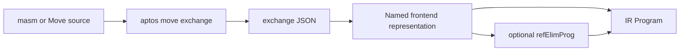

# Move frontend bridge

This directory connects embedded masm or Move source to the
[Move IR framework](../IR/README.md).  Elaboration invokes the Aptos CLI's
`move exchange` command, decodes its JSON representation, and splices a
first-order IR term into Lean.  The core `Move` library does not require the
CLI; only frontend-backed examples and tests do.

## Data flow



The JSON schema is defined by the serde-annotated Rust types in
`third_party/move/move-model/exchange`.  The CLI uses the production assembler
or compiler, bytecode verifier, and `StacklessBytecodeGenerator` before
exporting basic-block CFGs, contracts, and loop metadata.

## Module index

| Module | Purpose |
|---|---|
| [`XIR.lean`](XIR.lean) | Named, first-order exchange IR and conversion to semantic IR declarations. |
| [`Decode.lean`](Decode.lean) | Decoder for the exchange JSON format. |
| [`Elim.lean`](Elim.lean) | Whole-module reference elimination while retaining frontend names. |
| [`Elab.lean`](Elab.lean) | CLI invocation, caching, error reporting, and embedded-source elaborators. |

## Elaborators

| Form | Result |
|---|---|
| `masm% "..."` | Assemble embedded masm and produce an IR `Program`. |
| `masmM% "..."` | Assemble masm and retain the named `MProgram`. |
| `move% "..."` | Compile a self-contained Move module and produce an IR `Program`. |
| `moveM% "..."` | Compile Move source and retain the named `MProgram`. |
| `masmElim% "..."` | Assemble masm, run whole-program reference elimination, and produce an IR `Program`. |
| `moveElim% "..."` | Compile Move source, run whole-program reference elimination, and produce an IR `Program`. |

The `*Elim%` forms run the executable interprocedural pipeline with computed
cross-call summaries, and subsequent theorems verify the transformed
`Program`.  The current `refElim_correct` theorem covers the isolated,
summary-free `refElimFun` pipeline; it does not yet prove that these
interprocedural elaborators preserve the source program.

For example:

```lean
def prog : Program := move% "
module 0x42::count_down {
  fun count_down(x: u64): u64 { /* ... */ }
  spec count_down { ensures result == 0; }
}
"
```

Masm accepts specification clauses after function headers and loop invariants
at labels.  Move source uses compiler-v2 `spec` blocks and inline loop
invariants.  `SpecExp` supports arithmetic and logic, saved-state access,
resources, fields, results, and typed quantifiers.

## Setup

Build the lightweight exchange frontend and select it explicitly with
`APTOS_MOVE_EXCHANGE`:

```bash
cargo build -p aptos-move-cli --bin aptos-move-exchange
APTOS_MOVE_EXCHANGE=<path-to-aptos-move-exchange> lake test
```

`APTOS_CLI=<path-to-aptos>` remains a backward-compatible fallback for the
full `aptos move exchange` command.

Frontend dumps are written to a private temporary directory and removed after
elaboration.  Positioned assembler, compiler, verifier, and decoding errors
are reported as Lean elaboration errors.

The CLI also supports package export:

```bash
aptos move exchange --package-dir <pkg>
```

It emits one `<module>.exchange.json` per supported target module.  The
single-file `--masm-file` and `--move-file` modes are what the Lean elaborators
use.

## Completeness and limitations

The translated fragment currently covers u64, bool, address, struct, enum, and
vector values; true user-defined generics (type parameters, ability constraints,
phantom parameters, and concrete operation instantiations); arithmetic and
logical operations; control flow and calls; resource instructions; references;
contracts; and natural-loop metadata.
Enum construction, destruction, and tag tests are preserved. Vector literals,
length, element borrowing, `push_back`, and `pop_back` are translated into the
IR's value operations plus explicit reference reads and write-backs. Reference
instructions execute directly in the interpreter and can be eliminated before
verification with the `*Elim%` forms.

Closures and other higher-order function values, vector `swap`/destructuring,
variant-field borrows produced by nested source patterns, other integer widths,
casts, and dependency-bearing Move modules are outside the current fragment and
are rejected explicitly.

Source-level data invariants and module/global invariants are also outside the
exchange schema and are rejected explicitly rather than omitted from the
exported model.

Production verification gives `aborts_if` two contexts: definition exit checks
use current exit memory, while opaque calls use entry memory.  The Lean
contract semantics preserves both views and its verification condition checks
both, so exported `global` and `exists` expressions are not forced into one
state interpretation.

Function and resource identifiers in `Program` are positional.  Retain an
`MProgram` with `moveM%` or `masmM%` and use `MProgram.funId` or
`MProgram.resourceId` when tests or examples should resolve declarations by
name.

Frontend-backed verification examples live under
[`Tests/Prover`](../Tests/Prover/) and interpreter tests under
[`Tests/Interp`](../Tests/Interp/); `Tests/Common.lean` provides the `#test`
command and expected-outcome helpers.
