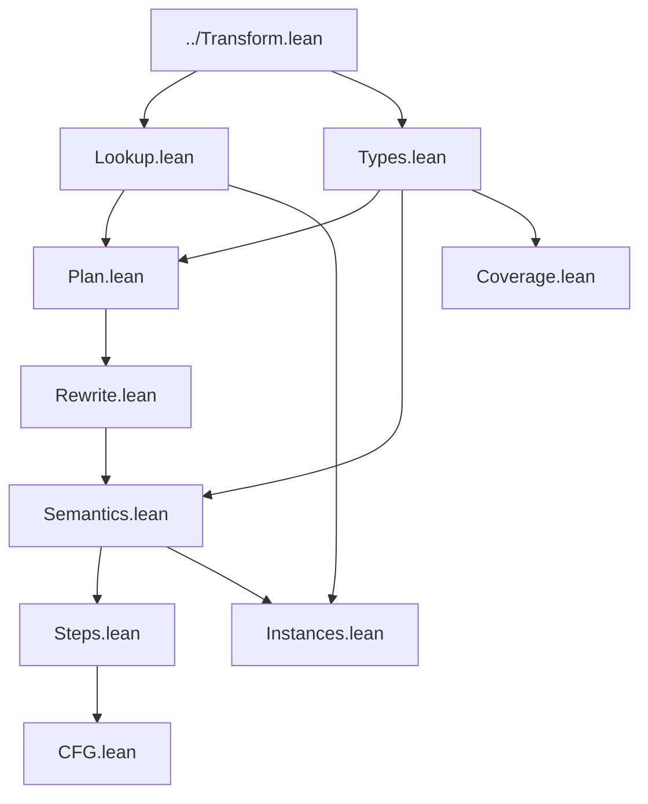

# Monomorphization correctness proof

This directory contains the correctness development for verification
monomorphization in [`../Transform.lean`](../Transform.lean). The proof is
split so that executable plan lookup, type-tag reasoning, local operational
semantics, and the finite-coverage argument can evolve independently.

The current development proves the structural and exact-runtime-tag layers.
It does **not yet** prove the final theorem transferring verification of all
generated representatives to every closed source instantiation. The last
section describes that remaining bridge precisely.

## What the transformation does

A `MonoPlan` is a finite list of `MonoKey`s:

```text
MonoKey = (source function id, source type arguments)
```

The position of a key in the list becomes its generated function id. For
each entry the pass:

1. looks up the source declaration;
2. substitutes the entry's type arguments;
3. removes the declaration's type binders;
4. rewrites source function calls to generated function ids; and
5. installs the resulting declaration at the entry's list position.

The intended semantic statement has two layers:

1. **Exact runtime-tag correctness.** Executing a generated entry agrees
   with executing the corresponding source instance when their type
   arguments have the same runtime tags.
2. **Finite representative correctness.** Every closed source instantiation
   is represented by a generated entry having the same equality pattern
   among observable resource tags. Its execution is related through a
   renaming of global resource keys.

The distinction matters. Two substitutions can have the same relevant
aliasing pattern without having equal resource keys. The first layer can use
ordinary equality of memory; the second needs a memory-renaming relation.

## Proof dependency graph



There is intentionally no aggregate import wrapper. Transformation-only
clients import [`../Transform.lean`](../Transform.lean); proof clients import
the specific correctness layers they consume. Importing `CFG`, `Instances`,
and `Coverage` brings in every currently proved layer through their ordinary
dependencies.

## The two type-argument relations

### Runtime-tag equality

[`Types.lean`](Types.lean) defines:

```lean
TypeArgsTagEq lhs rhs := lhs.map Ty.toTag = rhs.map Ty.toTag
```

This relation says that corresponding type arguments have exactly the same
runtime encoding. It is strong enough to prove:

- substitution produces the same runtime type tags;
- instantiated generic resources produce equal `ResourceKey`s;
- `MonoKey.beq` decides `MonoKey.RuntimeEq`;
- a call instantiated under runtime-equivalent callers produces
  runtime-equivalent callee keys; and
- looking up a generated id returns a runtime-equivalent plan entry.

`MonoKey` equality deliberately uses runtime tags instead of syntactic `Ty`
equality. Thus syntactic aliases such as `struct r` and `structInst r []`
select the same generated function.

### Equality of tag interactions

[`Coverage.lean`](Coverage.lean) develops the weaker relation
`SameTagInteractions`. Given the effects observed by a declaration, it says
that every pair of resource expressions is equal under the concrete
substitution exactly when the corresponding pair is equal under the
representative substitution.

In symbols, for observed effects `e₁` and `e₂`:

```text
key(concrete, e₁) = key(concrete, e₂)
    iff
key(representative, e₁) = key(representative, e₂)
```

The keys need not be equal across the two executions. Only their collision
structure must agree. `ObservedKeyRel` pairs each concrete observed key with
its representative key. The uniqueness theorems prove this correspondence
is functional and injective. `ObservedMemoryEq` then relates memories at all
paired observed keys.

`TypeArgsTagEq.sameTagInteractions` connects the two layers: exact tag
equality always implies equal interaction patterns.

## How the proved layers compose

### 1. Recover generated declarations

[`Lookup.lean`](Lookup.lean) characterizes bounded source lookup,
`specializeFun?`, and generated program lookup. In particular, every
generated declaration comes from a plan entry and is binder-free.

[`Instances.lean`](Instances.lean) packages the lookup chain in the form
needed by simulation proofs:

```text
requested key
  -> generated id
  -> runtime-equivalent plan entry
  -> source declaration
  -> instantiated and call-rewritten generated declaration
```

It also proves that materialization preserves the runtime parameter count.

### 2. Resolve generated calls

[`Plan.lean`](Plan.lean) consumes `MonoPlan.Certificate.callClosure`. For a
call occurring in a planned caller it produces:

- a generated callee id;
- the plan entry stored at that id; and
- proof that the entry is runtime-equivalent to the instantiated source
  call target.

The certificate uses `MonoKey.RuntimeEq`, matching the executable plan's
runtime-tag-based deduplication.

[`Rewrite.lean`](Rewrite.lean) then proves that `rewriteOper`,
`rewriteInstr`, and `rewriteCfg` install precisely those generated targets
while preserving operands, CFG entry, CFG size, and terminators.

### 3. Preserve primitive semantics

[`Semantics.lean`](Semantics.lean) proves the central local equation:

```lean
(op.instantiate lhs).sem ... = (op.instantiate rhs).sem ...
```

under `TypeArgsTagEq lhs rhs`.

Most operations erase type arguments entirely. Generic global operations
are the interesting cases: their result follows from equality of the
instantiated `ResourceKey`. Function calls and reference operations are
handled relationally by `RunFrom`, rather than by `Oper.sem`.

### 4. Lift to execution steps and paths

[`Steps.lean`](Steps.lean) lifts primitive equality to the structured
execution judgments in `IR/Execution.lean`:

- `InstrNext` for continuing instructions;
- `InstrStop` for aborting instructions; and
- `InstrPath` for finite continuing straight-line paths.

The generic `borrow_global` rules require special treatment because they
construct references containing a resource key. Runtime-tag equality makes
the resulting reference targets equal.

[`CFG.lean`](CFG.lean) provides the complementary structural facts: it
recovers a source block from a successful instantiated-block lookup and
records that instantiation preserves CFG entry, size, and terminators while
mapping only the instruction list.

Together, `Steps.lean` and `CFG.lean` are the local ingredients for induction
over `RunFrom`/`RunFrom.inductGrouped`.

## Relationship to IVL soundness

`MoveModel.Prover.Translate.Mono.MonoVerification.specializedSound` already
feeds every generated declaration through the existing monomorphic IVL
adequacy theorem. It establishes:

```text
each generated representative satisfies its generated contract
```

That theorem intentionally does not yet claim:

```text
every closed generic source instance satisfies its source contract
```

The latter requires connecting an arbitrary closed instance to its finite
representative, including renamed global storage and specification
environments.

## Remaining end-to-end obligations

The final correctness theorem requires the following additions:

1. **Discovery coverage.** Prove that `discoverCollisionArgs`, closure under
   compatible substitutions, and call closure discharge
   `MonoPlan.Certificate.tagCoverage` for every closed substitution.
2. **Transitive effects.** Close a caller's observable effects over its
   reachable callees. `FunDecl.tagEffects` currently records direct effects;
   whole-call memory simulation needs the transitive set.
3. **State and reference renaming.** Lift `ObservedKeyRel` from resource keys
   to global reference roots, values, memories, `MoveState`, and
   `FrameOutcome`, and prove that reads, writes, removal, borrowing, and
   call/return preserve the relation.
4. **Whole-execution simulation.** Induct over `RunFrom.inductGrouped`, using
   `Steps.lean` for ordinary instructions, `CFG.lean` for control-flow edges,
   and `Plan.lean`/`Instances.lean` for ordinary, generic, recursive, and
   mutually recursive calls.
5. **Specification transport.** Relate pre/post specification environments,
   quantifier domains, footprints, and generic resource selectors under the
   same key renaming.
6. **Contract transfer.** Combine execution and specification transport with
   `MonoVerification.specializedSound` to derive contract satisfaction for
   every covered closed source instantiation.

These are stated as explicit proof obligations rather than hidden
assumptions. In particular, `MonoPlan.Certificate` separates executable plan
validation from the semantic coverage theorem so an incomplete plan cannot
be justified merely because materialization succeeded.

## Checking the development

Build the terminal proof modules with:

```bash
lake build \
  MoveModel.IR.Mono.Correctness.CFG \
  MoveModel.IR.Mono.Correctness.Instances \
  MoveModel.IR.Mono.Correctness.Coverage
```

Build the whole Lean model and its tests with:

```bash
lake build
APTOS_MOVE_EXCHANGE=/path/to/aptos-move-exchange lake test
```

The correctness directory contains no admitted theorems: `sorry`, `admit`,
and proof axioms are not used.
