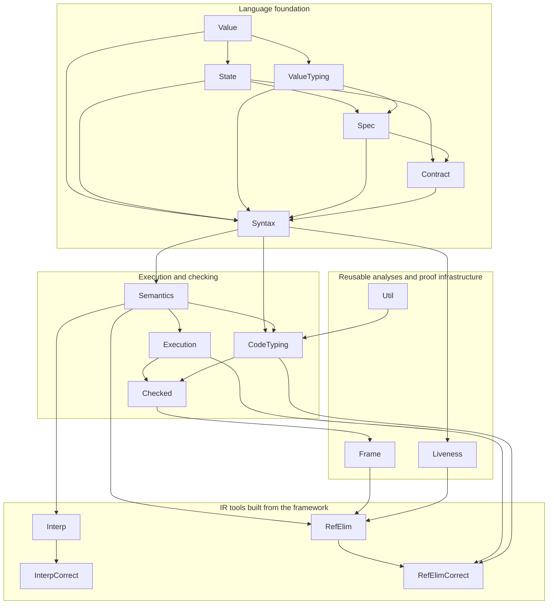
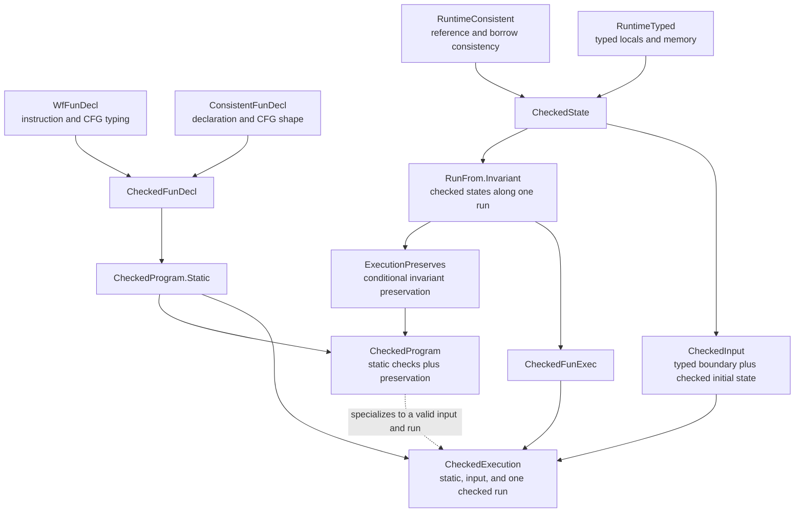

# Move IR framework

This directory is the Lean framework for working with Move stackless IR.  It
defines the language and provides reusable tools for executing, typing,
checking, analysing, transforming, and proving properties of IR programs.

The package deliberately does not contain the prover's intermediate
verification language (IVL).  IVL syntax, semantics, loop analysis, and
weakest-precondition theory live under `MoveModel/Prover/Ivl`; the translation from
Move IR to IVL lives under `MoveModel/Prover/Translate`.

## Module hierarchy

An arrow means that the module at the arrowhead builds on the module at its
tail.  The diagram is conceptual and omits redundant direct imports when a
transitive dependency already explains the layer.

## Module index

| Module | Purpose |
|---|---|
| [`Value.lean`](Value.lean) | Runtime and specification values, reference roots and targets, and structural value operations. |
| [`State.lean`](State.lean) | Frame-indexed locals, global memory, call/return state transitions, and reference reads and writes. |
| [`ValueTyping.lean`](ValueTyping.lean) | Semantic validity of runtime values at declared Move types. |
| [`Spec.lean`](Spec.lean) | Deep specification-expression language and its evaluation relation. |
| [`Contract.lean`](Contract.lean) | Function contracts and the environments in which contract clauses are interpreted. |
| [`Syntax.lean`](Syntax.lean) | Stackless instructions, terminators, CFGs, declarations, programs, and instruction use/definition queries. |
| [`Semantics.lean`](Semantics.lean) | Relational big-step semantics for instructions, CFGs, calls, returns, and aborts. |
| [`Execution.lean`](Execution.lean) | Reusable head-step judgments, straight-line and cross-block execution prefixes, invariant-decorated runs, and grouped execution induction. |
| [`CodeTyping.lean`](CodeTyping.lean) | Static IR typing judgments and runtime type-preservation lemmas. |
| [`Checked.lean`](Checked.lean) | Frontend-supplied declaration, input, state, execution, and whole-program checking certificates. |
| [`Frame.lean`](Frame.lean) | Pass-independent frame-safety predicates and stack-indexed relational infrastructure. |
| [`Liveness.lean`](Liveness.lean) | Backward may-liveness analysis and its transfer and stability lemmas. |
| [`Util.lean`](Util.lean) | Small pass-independent inversion lemmas used by IR proofs. |
| [`Mono/Transform.lean`](Mono/Transform.lean) | Finite given-type, runtime-tag-collision, and call-closure monomorphization. |
| [`Mono/Correctness/README.md`](Mono/Correctness/README.md) | Guide to the monomorphization correctness argument, proof dependencies, and remaining end-to-end obligations. |
| [`Mono/Correctness/Lookup.lean`](Mono/Correctness/Lookup.lean) | Bounded source lookup and generated declaration structure. |
| [`Mono/Correctness/Types.lean`](Mono/Correctness/Types.lean) | Runtime type-tag equality and specialization-key lookup. |
| [`Mono/Correctness/Plan.lean`](Mono/Correctness/Plan.lean) | Certified call closure and generated call targets. |
| [`Mono/Correctness/Rewrite.lean`](Mono/Correctness/Rewrite.lean) | Correctness facts for call-target and CFG rewriting. |
| [`Mono/Correctness/Semantics.lean`](Mono/Correctness/Semantics.lean) | Primitive-operation semantics under runtime-equivalent substitutions. |
| [`Mono/Correctness/Steps.lean`](Mono/Correctness/Steps.lean) | Continuing and aborting instruction-step transport across equivalent substitutions. |
| [`Mono/Correctness/CFG.lean`](Mono/Correctness/CFG.lean) | Source-block inversion and structural facts for instantiated CFGs. |
| [`Mono/Correctness/Instances.lean`](Mono/Correctness/Instances.lean) | Generated-instance materialization and arity preservation. |
| [`Mono/Correctness/Coverage.lean`](Mono/Correctness/Coverage.lean) | Runtime-tag interaction quotient and observed-memory relation. |
| [`Interp/Exec.lean`](Interp/Exec.lean) | Fuelled executable interpreter using finite representations of locals and memory. |
| [`Interp/Correctness.lean`](Interp/Correctness.lean) | Soundness of successful interpreter results with respect to the relational semantics. |
| [`RefElim/Transform.lean`](RefElim/Transform.lean) | Reference-elimination analyses and transformations. |
| [`RefElim/Correctness.lean`](RefElim/Correctness.lean) | Simulation infrastructure and correctness theorems for reference elimination. |

## Checking hierarchy

The operational semantics is intentionally untyped: malformed states can be
represented and may become stuck.  Frontend guarantees are therefore explicit
certificates consumed by proofs rather than premises built into execution.

`CheckedExecution` is the useful boundary for a transformation that is
simulating one concrete run.  `CheckedProgram` is stronger: it states static
checking and conditional preservation for every execution that begins from a
checked input.  Program-point proofs can project these certificates further
into analysis-specific predicates such as `FrameSafe`.

## Semantic conventions

- Execution is a partial-correctness relation.  Nontermination has no outcome,
  while ill-typed operands, invalid CFG targets, and undeclared callees are
  stuck.  Static and runtime checking certificates exclude those cases when a
  theorem needs type or borrow safety.
- Local reference roots are frame-qualified.  Calls pass references without
  changing their roots; borrow correctness guarantees that callee-local roots
  do not escape and that returned references derive from input references.
- Reference equality compares reference-free values of compatible erased
  runtime type shape at the targets.
  Reads, writes, freezes, aggregate construction, and global storage likewise
  enforce Move's prohibition on nested or stored references.
- Calls require exact argument arity, and operations require exactly the
  operand and result shapes described by their semantic cases.
- Concrete calls execute callee bodies.  Modular calls against contracts are a
  property of the [IR-to-IVL translation](../Prover/README.md), not of the IR
  execution relation.
- `aborts_if` has the production Prover's two state contexts: definition exits
  use exit memory, while opaque calls use entry memory.  Contract satisfaction
  establishes both views so verified definitions justify modular calls.

## Completeness and roadmap

| Area | Status |
|---|---|
| IR syntax, deep specifications, contracts, and relational execution | Implemented. |
| Static code typing, runtime validity, and frontend checking certificates | Implemented, with preservation facts consumed explicitly by proofs. |
| Reusable execution induction, frame relations, and liveness | Implemented. |
| Executable interpreter | Implemented; `interpFun_sound` proves every successful result denotes a relational `FunExec`. |
| Reference-elimination transformation | Implemented intra- and inter-procedurally and integrated with `masmElim%` and `moveElim%`. |
| Reference-elimination correctness | `elimImm_correct`, `elimCore_correct`, and their composition are proved under explicit frontend certificates; the package contains no admitted reference-elimination theorem. |

### Reference elimination

The pass models the reference-elimination stage of the Move Prover
(TACAS 2022, §3.1).  It includes:

- runtime reference semantics with frame-qualified local roots
  `(frame, local)` and paths through fields and vector elements;
- immutable-reference replacement, borrow-graph and liveness analyses,
  mutation values, dynamic parent dispatch, block and edge splitting, and
  loop-target extension;
- interprocedural borrow summaries and the value-in/finals-out convention for
  mutable-reference parameters;
- borrow-checker exclusivity checks, strong graph updates when reference
  locals are overwritten, and regression tests for rejected
  miscompilations; and
- whole-program frontend integration through `refElimProg`, `masmElim%`, and
  `moveElim%`.

The correctness theorem proves the isolated, summary-free `refElimFun`
pipeline for this conceptual IR model, not every feature of the Move language
or the production pass.  The frontend entry points (`MProgram.elim`,
`masmElim%`, and `moveElim%`) instead use the interprocedural `refElimProg`
pipeline with `computeSummaries`; that cross-call extension is executable and
covered by examples, but is not yet a consequence of `refElim_correct`.  The
proved boundary is intentionally explicit: `refElim_correct` assumes
`CheckedProgram` and `CheckedInput` certificates for both the source and the
post-immutable intermediate program, plus reference-free external arguments.
Its `ImmCheckedFacts` certificate exposes the type- and borrow-checker facts
needed at operations and call boundaries;
`CoreCheckedFacts` exposes entry-state validity, dynamic origin uniqueness,
coherent write-back of disjoint pending children, local instruction splices,
emitter containment, and the grouped call and terminator cases consumed by the
mutation layer.  It no longer contains the whole-block simulation conclusion.
Preservation of frontend checkedness by `elimImmRefs` is a separate obligation
from semantic simulation and is not hidden inside the reference-elimination
proof.  The theorem composes the two semantic layers through the checked
intermediate execution.
Normal outcomes agree on ordinary return values, with only the target's
internal mutable-parameter finals appended; abort outcomes agree on the code,
while their memories may differ because deferred write-backs are discarded on
abort.

The two layer theorems are complete at this explicit certificate boundary:

- [x] `elimImm_correct`: the grouped execution simulation covers instructions,
  calls, returns, aborts, and CFG edges, then transports the execution to
  `immProgram` under explicit frontend certificates.
- [x] `elimCore_correct`: the mutation-value layer installs the exact emitted
  entry block and transports its certified execution to the transformed
  program.  The structural certificate is now in place: `ElimCoreOutInv`
  retains analysis
  convergence, emitter output, densification, and split-block provenance;
  `CoreBlockTrace` projects the exact successful `rewriteBlock` transition
  for each declared source block, and `CoreInstrTrace` separates each source
  instruction rewrite from its following death/write-back phase.  The
  `CoreFrameRel` semantic invariant and the primitive mutation-operation
  splices are established.  Local-root, global-root, direct-parent, and
  recursive-parent write-backs now preserve both `CoreFrameRel` and
  `CoreWriteReady`; recursive updates are represented by the compact
  `PathUpdate` certificate.  `CoreDeathTrace` and `CoreWriteBackTrace`
  expose leaf selection and the empty, singleton, and guarded emitter cases
  without reopening the state monad; their append-only laws connect every
  recorded diamond to the final CFG, and their execution lemmas now discharge
  the complete death/write-back phase.  `CoreCheckedFacts` records ordinary
  instruction and death splices plus the grouped call and terminator cases;
  `coreSimAt` folds those local cases over `RunFrom.Invariant` and derives the
  whole-block closure used by `elimCore_correct`.  This is deliberately an
  explicit frontend certificate boundary rather than an implicit claim that
  the borrow checker has itself been formalized here.  Core output retains
  emitted instructions verbatim; the former
  fresh-local dead-store optimization was removed so the executable CFG and
  proof trace have exactly the same instruction boundary.

`refElim_correct` already expresses their final composition.  The reusable
parts of these proofs belong in `Execution.lean`, `Frame.lean`,
`Liveness.lean`, and `Checked.lean`; pass-specific relations remain in
`RefElim/Correctness.lean`. Executable agreement and rejection counterexamples
are covered by [`Tests/Interp/RefElimAgree.lean`](../Tests/Interp/RefElimAgree.lean).

Further work can derive more of the grouped call, terminator, and death fields
from narrower static borrow-checker facts.  The whole-block semantic conclusion
is already derived mechanically and is no longer a field of the certificate.

## Package boundaries

- Put core IR data, semantics, generic analyses, and reusable proof templates
  in this directory.
- Put a transformation here when it directly consumes and produces Move IR;
  keep generally reusable machinery separate from its correctness proof.
- Put executable frontend decoding and elaboration under `MoveModel/Frontend`.
- Put IVL and weakest-precondition theory under `MoveModel/Prover/Ivl`.
- Put the Move IR to IVL compiler and its adequacy proofs under
  `MoveModel/Prover/Translate`.

Every public declaration should have a concise documentation comment stating
what it represents or proves and which abstraction layer it belongs to.
