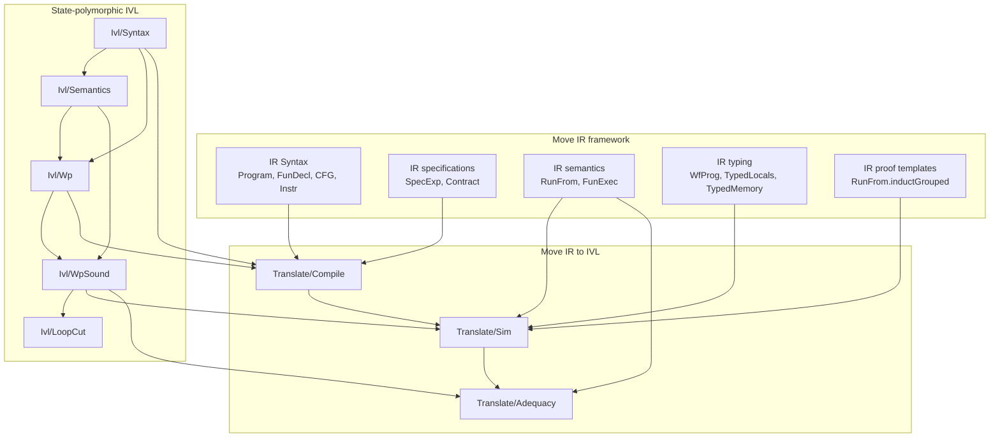
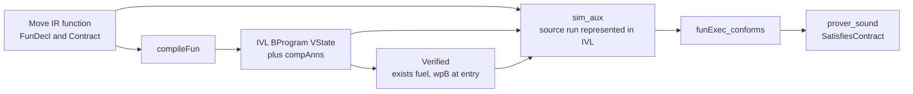

# Move Prover framework

This directory formalizes selected verification stages built on top of the
[Move IR framework](../IR/README.md).  It covers the modeled IR fragment, not
the full production Move Prover or every Move language feature.  It contains:

- a small, state-polymorphic intermediate verification language (IVL);
- its relational semantics and weakest-precondition calculus;
- loop cutting and the soundness theory for loop invariants; and
- the compiler from Move IR to IVL, its forward simulation, and end-to-end
  contract adequacy.

The Move IR remains a general framework for representing, executing,
analysing, and transforming code.  This package consumes its syntax and
semantics; it does not add prover-specific constructs to the IR itself.

The design follows these accounts of the production Move Prover:

- **TACAS 2022:** Dill, Grieskamp, Park, Qadeer, Xu, and Zhong,
  *Fast and Reliable Formal Verification of Smart Contracts with the Move
  Prover* ([arXiv:2110.08362](https://arxiv.org/abs/2110.08362)); and
- **FMCAD 2026:** Grieskamp, Zhang, Kashyap, and Silverman,
  *Formal Verification of Imperative First-Class Functions in Move*.

## Module hierarchy

An arrow means that the module at the arrowhead builds on the module at its
tail.  The cross-package nodes name the principal IR concepts used by the
prover rather than every direct Lean import.

## Verification flow

`compileFun` instantiates the generic IVL state with `VState`.  Besides the
current [`MoveState`](../IR/State.lean), `VState` carries entry arguments,
return values, saved memories, and the encoded abort flag.  Deep
[`SpecExp`](../IR/Spec.lean) expressions are interpreted as shallow Lean
predicates over that state.

## Design correspondence

- Move code remains a three-address CFG, while contracts and loop invariants
  use the deep `SpecExp` language.  Memory labels represent saved states such
  as the pre-state; the IVL compiler denotes those expressions as Lean
  predicates over `VState`.
- The IVL is state-polymorphic.  Its block structure is deep syntax, while
  guards, assignments, havoc relations, assertions, and assumptions are
  shallow functions or predicates over the chosen state.
- `wpB` implements the loop-invariant rule.  `loopCut` gives the corresponding
  explicit program transformation and proves that it produces an acyclic,
  weakest-precondition-equivalent graph.
- Move aborts become data flow in `VState`.  Compiled instructions update the
  abort flag and terminators route to distinct normal and abort exit blocks,
  where the contract checks are injected.
- Source calls execute concrete callee bodies.  Compiled calls instead use an
  opaque contract summary: assert the precondition, then havoc an aborting or
  normal result satisfying the callee contract and frame.
- Source block `b` maps to IVL block `b + 1`; the remaining labels are the
  entry stub and the two exit blocks.  This makes the simulation block-wise.

## Module index

### IVL

| Module | Purpose |
|---|---|
| [`Ivl/Syntax.lean`](Ivl/Syntax.lean) | Boogie-style commands, guarded CFG terminators, block programs, and loop annotations over an arbitrary state type. |
| [`Ivl/Semantics.lean`](Ivl/Semantics.lean) | Relational execution of command lists and IVL block graphs, including assertion failure. |
| [`Ivl/Wp.lean`](Ivl/Wp.lean) | Weakest preconditions for commands and block graphs, including the loop-invariant rule. |
| [`Ivl/WpSound.lean`](Ivl/WpSound.lean) | Soundness of IVL weakest preconditions with respect to IVL execution. |
| [`Ivl/LoopCut.lean`](Ivl/LoopCut.lean) | Loop-to-DAG transformation, WP equivalence, acyclicity, and WP completeness on acyclic programs. |

### Translation

| Module | Purpose |
|---|---|
| [`Translate/Compile.lean`](Translate/Compile.lean) | Compilation of Move IR instructions, CFGs, contracts, and loop specifications into IVL. |
| [`Translate/Sim.lean`](Translate/Sim.lean) | Forward simulation from relational Move IR executions to compiled IVL executions, fused with source type preservation and contract conformance. |
| [`Translate/Adequacy.lean`](Translate/Adequacy.lean) | End-to-end theorem turning verification of compiled functions into semantic satisfaction of their Move IR contracts. |

## IVL concepts

The IVL is independent of Move IR and parameterized by its state type `σ`.

- `BCmd σ` provides deterministic assignment, relational havoc, assumption,
  and assertion.
- `BProgram σ` is a labeled graph of straight-line command blocks.
- `LoopAnn σ` supplies an invariant, a loop-target relation, and loop
  membership.
- `wpB` calculates a block-graph weakest precondition with fuel bounding
  recursion along forward edges.
- `WfProgram G anns rank` certifies the IVL loop structure and completeness
  of its loop-target analysis.  It is not Move IR typing; the similarly named
  source property is [`WfProg`](../IR/CodeTyping.lean).
- `loopCut` realizes the invariant rule as a program transformation by
  inserting header havoc/assume commands and redirecting back edges to
  invariant-checking blocks.

## IR concepts consumed by translation

| IR concept | Role in the prover |
|---|---|
| [`Program`, `FunDecl`, `Cfg`, `Instr`](../IR/Syntax.lean) | Source program and control-flow graph compiled to IVL. |
| [`SpecExp`, `EvalSpec`, `Holds`](../IR/Spec.lean) | Deep specifications interpreted as IVL guards and assertions. |
| [`Contract`](../IR/Contract.lean) | Source of entry assumptions, call summaries, exit assertions, and modifies frames. |
| [`MoveState`, `Memory`](../IR/State.lean) | Runtime components embedded in the verification state. |
| [`RunFrom`, `FunExec`, `SatisfiesContract`](../IR/Semantics.lean) | Source execution and the semantic contract property established by adequacy. |
| [`RunFrom.inductGrouped`](../IR/Execution.lean) | Six-case execution induction used by the master simulation. |
| [`WfProg`, `TypedLocals`, `TypedMemory`](../IR/CodeTyping.lean) | Bytecode-verifier discipline and runtime typing carried by the simulation. |
| [`IsValid`, `IsValidList`](../IR/ValueTyping.lean) | Semantic well-formedness underlying typed entry, loop havoc, calls, and quantifiers. |

[`CheckedProgram`](../IR/Checked.lean) is the broader frontend certificate
used by IR transformation proofs.  The prover adequacy theorem currently
needs its narrower static projection `WfProg` together with typed boundary
values; it does not depend on borrow consistency.

Reference elimination is likewise an IR-to-IR preprocessing pass, documented
in the [IR module index](../IR/README.md) and implemented in
[`RefElim/Transform.lean`](../IR/RefElim/Transform.lean).  Direct translation deliberately maps
remaining reference instructions to failing assertions.

## Main theorem hierarchy

| Theorem | Meaning |
|---|---|
| `Ivl.wpB_sound` | An IVL state satisfying `wpB` cannot reach assertion failure, and every normal execution satisfies the postcondition. |
| `Ivl.wpB_safe`, `Ivl.wpB_post` | Safety-only and normal-postcondition projections of `wpB_sound`. |
| `Ivl.loopCut_wp` | The annotated loop rule and the explicit loop-cut program have the same weakest precondition. |
| `Ivl.loopCut_acyclic` | Every edge of the loop-cut program strictly increases its extended rank. |
| `Ivl.wpB_complete` | On acyclic annotation-free IVL programs, semantic safety implies `wpB`. |
| `Translate.sim_aux` | Master induction representing a source execution in IVL while carrying typing and contract facts. |
| `Translate.compile_simulates` | Public block-wise forward simulation theorem. |
| `Translate.contract_call_overapproximates` | The compiled opaque-call schema covers concrete executions of a contract-satisfying callee. |
| `Translate.funExec_conforms` | One well-typed source execution satisfying `requires` conforms to the declared contract. |
| `Translate.prover_sound` | If every compiled function verifies, every declared source function satisfies its semantic contract. |

All declarations under `Move/Prover` are proved without `sorry`.  Reference
elimination is also proved at the conceptual IR-model level under explicit
frontend certificates; its scope and remaining certificate-refinement work
are tracked in the [IR roadmap](../IR/README.md#completeness-and-roadmap).

## Semantic scope

- `SatisfiesContract` gives `aborts_if` its per-execution biconditional
  reading: normal executions require the condition to be false, and aborting
  executions require it to hold.  It establishes both production contexts:
  definition exits use exit memory, while opaque calls use entry memory.
  Omitting `aborts_if` makes no abort claim; writing `aborts_if false` forbids
  aborting.
- Specification evaluation is relational and partial.  Undefined operations,
  such as reading a missing resource or dividing by zero, have no evaluation;
  logical connectives short-circuit so guarded resource reads remain usable.
- The exchange checker rejects mutable-reference locals and results in specifications,
  non-literal or zero divisors, and `old(..)` of locals in loop invariants.
  These are conservative frontend restrictions until implicit
  mutable-reference dereference, nonzero proof obligations, and loop-entry
  local snapshots are represented by the Lean specification model.
- `Contract.modifies` is a mandatory complete footprint in this model.  An
  empty list asserts that global memory is unchanged; unlike the production
  prover, omission does not disable frame checking.
- The IR execution relation is intentionally untyped and malformed states can
  become stuck.  Prover soundness assumes `WfProg` and typed boundary values,
  corresponding to the bytecode verifier and the multisorted validity checks
  of the production encoding.
- Runtime aborts currently use one fixed code, and contracts do not constrain
  abort codes.
- Reference instructions execute in the IR but compile to failing assertions.
  Verification of reference-bearing input therefore first uses the IR
  reference-elimination pass.

## Proof status and roadmap

For the currently modeled IR, IVL, and translation definitions, the implemented
proof chain contains no `sorry`: IVL execution and weakest preconditions, WP
soundness, loop cutting and acyclic completeness, specification injection,
block-wise forward simulation, opaque-call over-approximation, contract
conformance, and the conditional end-to-end theorem `prover_sound` are proved.
The theorem assumes source typing, well-formed loop metadata, and verification
of each compiled function.  This does not establish correctness of unmodeled
Move features or of the complete production prover pipeline.

Examples exercise this path for arithmetic contracts, loops, global memory,
embedded masm and Move source, reference elimination, and cross-call contract
reasoning; see [`MoveModel/Examples`](../Examples.lean).  In particular,
[`MoveModel/Examples/Adequacy.lean`](../Examples/Adequacy.lean) constructs a
well-formed source program and compiled IVL certificate, proves `Verified`,
and applies `prover_sound` with every assumption instantiated.  This makes
changes that accidentally render the theorem unusable visible to the Lean
build.

Future prover work is deliberately tracked here rather than in the repository
README:

- [ ] Data and global invariants, including invariant suspension and
  access/modification analysis (TACAS 2022, §3.2).
- [ ] Higher-order function values: closures, parameter and field variants,
  behavioral predicates, and dynamic invocation (FMCAD 2026, §III).
- [ ] State labels with labeled one- and two-state predicates, existential
  intermediate states, and abort synthesis over label DAGs.
- [x] Finite verification monomorphization foundation: given-type roots,
  type-unification-based resource-tag collision instances, closure under
  combined effects and generic call sites, and binder-free function
  materialization (`MoveModel.IR.Mono.Transform`).
- [x] Feed every materialized given/collision/call-closure representative
  through the existing IVL adequacy theorem (`MonoVerification.specializedSound`).
- [x] Prove the structural monomorphization layer: generated-declaration
  lookup, binder and arity preservation, runtime-tag equality of type
  substitution, certified generated call targets, call-rewrite structure,
  primitive semantic congruence, and local instruction/path transport
  (the modules under `MoveModel.IR.Mono.Correctness`).
- [ ] Discharge `MonoPlan.Certificate.tagCoverage` from the discovery
  algorithm and prove the resource-key-renaming bridge from a covered closed
  source instantiation to its representative.  The certificate states
  explicitly the finite-instance coverage argument left informal in TACAS
  2022, §3.3.  `Mono.Correct.Coverage` now supplies the functional,
  injective observed-key relation and observed-memory relation needed by that
  bridge; the remaining theorem must lift it through CFG execution and
  generic calls.
- [ ] A formal WP-based specification-inference layer over the bytecode CFG.

## Package boundaries

- Put generic IVL syntax, semantics, and verification-condition theory under
  `MoveModel/Prover/Ivl`.
- Keep `Ivl` state-polymorphic; Move-specific state and specification
  interpretation belong in `MoveModel/Prover/Translate`.
- Put compilation and cross-language correctness under
  `MoveModel/Prover/Translate`.
- Put reusable Move IR concepts, analyses, execution templates, and IR-to-IR
  transformations under [`MoveModel/IR`](../IR/README.md).
- Put frontend decoding and source elaboration under `MoveModel/Frontend`.

Every public declaration should have a concise documentation comment stating
what it represents or proves and which abstraction layer it belongs to.
