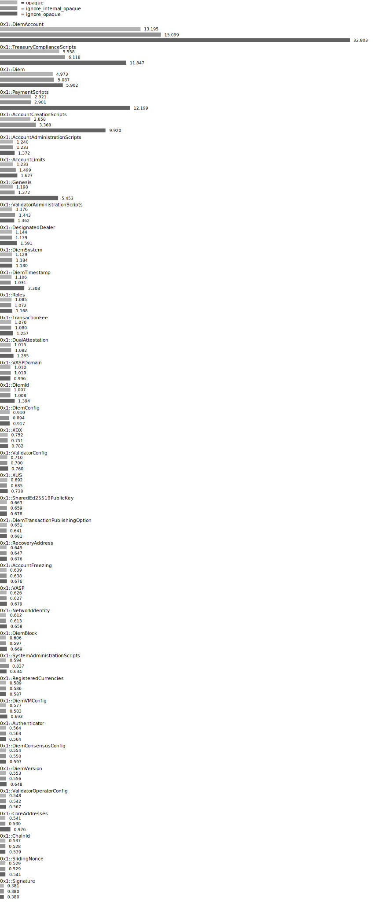

# Comparing opaque vs non-opaque verification times

This lab leverages options which allow to ignore the pragma opaque in function specifications. Without opaque
functions are inlined at caller site instead of just using the pre/post conditions, thereby putting additional
load on the prover. We are comparing:

- `opaque`: default behavior, keep opaque.
- `ignore_internal_opaque`: ignore opaque for internal functions.
- `ignore_opaque`: ignore opaque everywhere.

Opaque will be still respected if it is semantically required (e.g. functions with `concrete/abstract` specifications).

## Module Verification Time

## Function Verification Time

