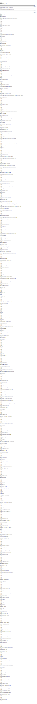

# Benchmarking ADT struct representation vs Vector struct representation

This lab compares the representation of structures on Boogie level as:

- Vectors of the universal `$Value` type. Values for all fields are represented in boxed ($Value) representation.
  Selecting and updating fields amounts to vector indexing. On select/update values need to be unboxed/boxed.
- Abstract data types. Values of fields are stored in unboxed representation unless their type is generic. Equality on
  universal values has to be implemented by a large case distinction of the multiple ADT variants. However, equality is
  extensional unless a struct contains a transient field of vector type, which breaks extensionality.

This lab results cannot reproduced at head. The commit hash it can be reproduced is
`222ef5b779c8b10c2575467541c1ff6139609a06`.

## Module Verification Time

## Function Verification Time

