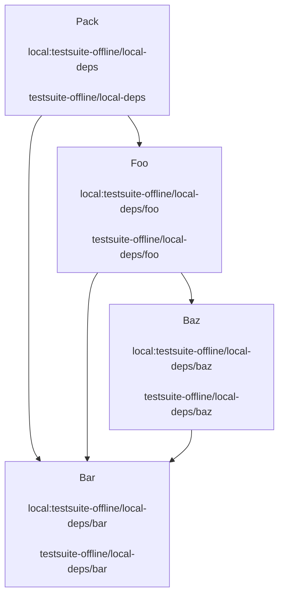

success

```mermaid
flowchart TD
    N0["Pack<br><br>local:testsuite-offline/local-deps<br><br>testsuite-offline/local-deps"]
    N1["Bar<br><br>local:testsuite-offline/local-deps/bar<br><br>testsuite-offline/local-deps/bar"]
    N2["Foo<br><br>local:testsuite-offline/local-deps/foo<br><br>testsuite-offline/local-deps/foo"]
    N3["Baz<br><br>local:testsuite-offline/local-deps/baz<br><br>testsuite-offline/local-deps/baz"]
    N0 --> N1
    N2 --> N1
    N3 --> N1
    N2 --> N3
    N0 --> N2

```
