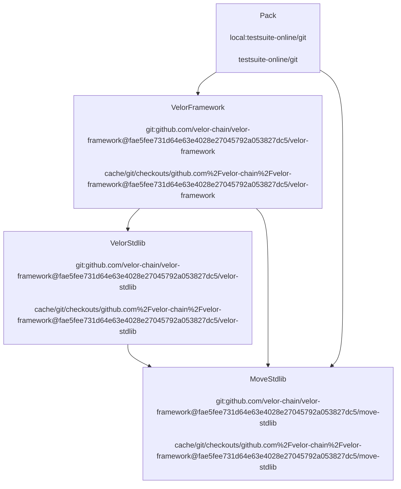

success

```mermaid
flowchart TD
    N0["Pack<br><br>local:testsuite-online/git<br><br>testsuite-online/git"]
    N1["VelorFramework<br><br>git:github.com/velor-chain/velor-framework@fae5fee731d64e63e4028e27045792a053827dc5/velor-framework<br><br>cache/git/checkouts/github.com%2Fvelor-chain%2Fvelor-framework@fae5fee731d64e63e4028e27045792a053827dc5/velor-framework"]
    N2["VelorStdlib<br><br>git:github.com/velor-chain/velor-framework@fae5fee731d64e63e4028e27045792a053827dc5/velor-stdlib<br><br>cache/git/checkouts/github.com%2Fvelor-chain%2Fvelor-framework@fae5fee731d64e63e4028e27045792a053827dc5/velor-stdlib"]
    N3["MoveStdlib<br><br>git:github.com/velor-chain/velor-framework@fae5fee731d64e63e4028e27045792a053827dc5/move-stdlib<br><br>cache/git/checkouts/github.com%2Fvelor-chain%2Fvelor-framework@fae5fee731d64e63e4028e27045792a053827dc5/move-stdlib"]
    N2 --> N3
    N1 --> N2
    N1 --> N3
    N0 --> N1
    N0 --> N3

```
