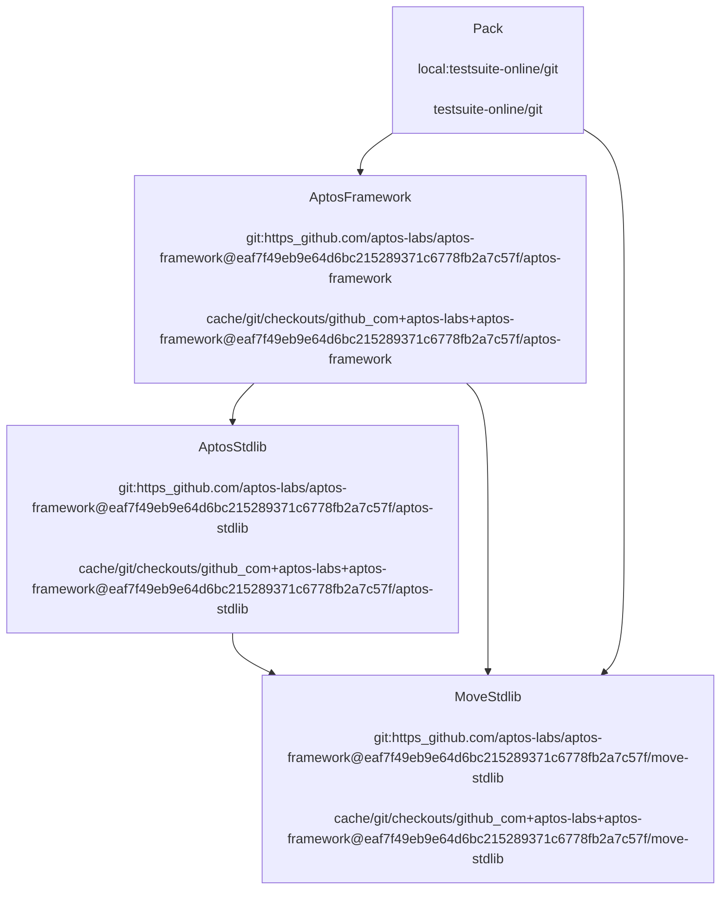

success

```mermaid
flowchart TD
    N0["Pack<br><br>local:testsuite-online/git<br><br>testsuite-online/git"]
    N1["AptosFramework<br><br>git:https_github.com/aptos-labs/aptos-framework@eaf7f49eb9e64d6bc215289371c6778fb2a7c57f/aptos-framework<br><br>cache/git/checkouts/github_com+aptos-labs+aptos-framework@eaf7f49eb9e64d6bc215289371c6778fb2a7c57f/aptos-framework"]
    N2["AptosStdlib<br><br>git:https_github.com/aptos-labs/aptos-framework@eaf7f49eb9e64d6bc215289371c6778fb2a7c57f/aptos-stdlib<br><br>cache/git/checkouts/github_com+aptos-labs+aptos-framework@eaf7f49eb9e64d6bc215289371c6778fb2a7c57f/aptos-stdlib"]
    N3["MoveStdlib<br><br>git:https_github.com/aptos-labs/aptos-framework@eaf7f49eb9e64d6bc215289371c6778fb2a7c57f/move-stdlib<br><br>cache/git/checkouts/github_com+aptos-labs+aptos-framework@eaf7f49eb9e64d6bc215289371c6778fb2a7c57f/move-stdlib"]
    N2 --> N3
    N1 --> N2
    N1 --> N3
    N0 --> N1
    N0 --> N3

```
