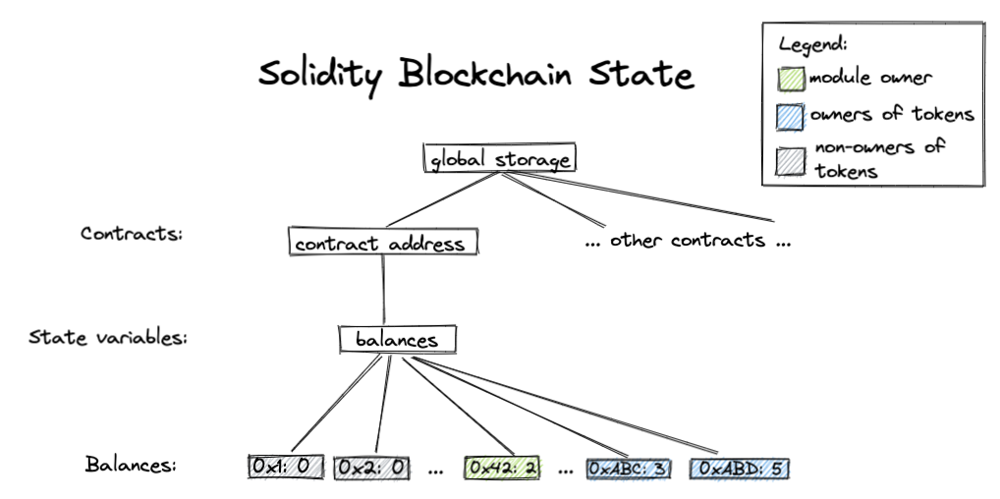

# Move Tutorial

Welcome to the Velor Move Tutorial! This is the original Move language and tools tutorial, independent of a particular network, adapted to use Velor tooling. Here you will learn basic usage of the Move language and tools for compiling, testing, and verifying Move.

This tutorial does not teach you how to use the existing [Velor Move frameworks](https://velor.dev/reference/move) or how to run code on the Velor network. See the [Velor developer documentation](https://velor.dev/tutorials/) for those instructions.

There are nine steps in total:

- [Step 0: Preparation](#step-0-preparation)
- [Step 1: Writing my first Move module](#step-1-writing-my-first-move-module)
- [Step 2: Adding unit tests to my first Move module](#step-2-adding-unit-tests-to-my-first-move-module)
- [Step 3: Designing my `basic_coin` module](#step-3-designing-my-basic_coin-module)
- [Step 4: Implementing my `basic_coin` module](#step-4-implementing-my-basic_coin-module)
- [Step 5: Adding and using unit tests with the `basic_coin` module](#step-5-adding-and-using-unit-tests-with-the-basic_coin-module)
- [Step 6: Making my `basic_coin` module generic](#step-6-making-my-basic_coin-module-generic)
- [Step 7: Use the Move prover](#step-7--use-the-move-prover)
- [Step 8: Writing formal specifications for the `basic_coin` module](#step-8-write-formal-specifications-for-the-basic_coin-module)

Each step is designed to be self-contained in the corresponding `step_x` directory. For example, if you would like to skip the contents in step 1 through 4, feel free to jump to step 5 since all the code we have written before step 5 will be in the `step_5` directory. At the end of some steps, we also include additional material on more advanced topics. 

Now let's get started!

## Step 0: Preparation

You should obtain a copy of the content of the directory in which this `README.md` resides. One way to achieve this is to clone [the Velor core repository](https://github.com/velor-chain/velor-core) and navigate to the [`velor-move/move-examples/move-tutorial`](..) directory. Subsequently, we assume you have a local copy of this directory and all paths are relative to this. To check that you have the right contents, run the `cd` and `ls` commands below to ensure the `move-tutorial` directory has the relevant subdirectories:

```shell
> cd move-tutorial
> ls
step_1 step_2 step_2_sol step_3 ...
```

You also need a recent version of the [Velor CLI](https://velor.dev/tools/velor-cli/install-cli/). This tutorial is written using the following version:

```shell
> velor --version
velor 1.0.7
```

If you want to use an IDE for working through the examples, we recommend CLion/IntelliJ, which has good support for Velor Move.


## Step 1: Writing my first Move module

Change directory into the [`step_1/basic_coin`](./step_1/basic_coin) directory.
You should see a directory called `sources` -- this is the place where all
the Move code for this package lives. You should also see a
`Move.toml` file. This file specifies dependencies and other information about
the package; if you're familiar with Rust and Cargo, the `Move.toml` file
is similar to the `Cargo.toml` file, and the `sources` directory is similar to
the `src` directory in Rust.

Let's take a look at some Move code! Open
[`sources/first_module.move`](./step_1/basic_coin/sources/first_module.move) in
your editor of choice. The first thing you'll see is this:

```
// sources/first_module.move
module 0xCAFE::basic_coin {
    ...
}
```

This is defining a Move
[module](https://velor.dev/move/book/modules-and-scripts/). Modules are the
building blocks of Move code, and are defined with a specific address -- the
address that the module can be published under. In this case, the `basic_coin`
module can be published only under `0xCAFE`.

Let's now take a look at the next part of this file where we define a
[struct](https://velor.dev/move/book/structs-and-resources)
to represent a `Coin` with a given `value`:

```
module 0xCAFE::basic_coin {
    struct Coin has key {
        value: u64,
    }
    ...
}
```

Looking at the rest of the file, we see a function definition that creates a `Coin` struct and stores it under an account:

```
module 0xCAFE::basic_coin {
    struct Coin has key {
        value: u64,
    }

    public fun mint(account: &signer, value: u64) {
        move_to(account, Coin { value })
    }
}
```

Let us take a look at this function and what it is saying:
* It takes a [`&signer`](https://velor.dev/move/book/signer) reference ('`&`') -- an
  unforgeable token that represents control over a particular address, and
  a `value` to mint.
* It creates a `Coin` with the given value and stores it under the
  `account` using the `move_to` operator.

Let us make sure it builds! This can be done with the `velor move compile` command from within the package directory ([`step_1/basic_coin`](./step_1/basic_coin/)):

```bash
velor move compile
```

<details>
<summary>Advanced concepts and references</summary>

* You can create an empty Move package by calling:
    ```bash
    velor move init --name <pkg_name>
    ```
* Move code can also live in a number of other places. See the [Move
  book](https://velor.dev/move/book/packages) for more information on the
  Move package system.
* More information on the `Move.toml` file can also be found in the [Package](https://velor.dev/move/book/packages#movetoml) section of the Move book.
* Move also supports the idea of [named
  addresses](https://velor.dev/move/book/address#named-addresses); Named
  addresses are a way to parameterize Move source code so that you can compile
  the module using different values for `named_addr` to get different bytecode
  that you can deploy, depending on what address(es) you control. They are used quite frequently, and can be defined in the `Move.toml` file in the `[addresses]` section, like so:
    ```
    [addresses]
    Somenamed_address = "0xC0FFEE"
    ```
* [Structures](https://velor.dev/move/book/structs-and-resources) in Move
  can be given different
  [abilities](https://velor.dev/move/book/abilities) that describe what
  can be done with that type. There are four different abilities:
    - `copy`: Allows values of types with this ability to be copied.
    - `drop`: Allows values of types with this ability to be popped/dropped.
    - `store`: Allows values of types with this ability to exist inside a struct in global storage.
    - `key`: Allows the type to serve as a key for global storage operations.

    So in the `basic_coin` module we are saying that the `Coin` struct can be used as a key
    in global storage and, because it has no other abilities, it cannot be
    copied, dropped, or stored as a non-key value in storage. So you can't copy
    coins, and you also can't lose coins by accident!
* [Functions](https://velor.dev/move/book/functions) are default
    private, and can also be `public`,
    [`public(friend)`](https://velor.dev/move/book/friends).
    A function marked as `entry` can be called as a transaction.
* `move_to` is one of the [five different global storage
  operators](https://velor.dev/move/book/global-storage-operators).
</details>

## Step 2: Adding unit tests to my first Move module<span id="Step2"><span>

Now that we've taken a look at our first Move module, we'll take a look at a
test to make sure minting works the way we expect it to by changing directory
to [`step_2/basic_coin`](./step_2/basic_coin).  Unit tests in Move are similar to
unit tests in Rust if you're familiar with them -- tests are annotated with
`#[test]` and written like normal Move functions.

You can run the tests with the `velor move test` command:

```bash
velor move test
```

Let's now take a look at the contents of the [`first_module.move`
file](./step_2/basic_coin/sources/first_module.move). You will
see this test:

```
module 0xCAFE::basic_coin {
    ...
    // Declare a unit test. It takes a signer called `account` with an
    // address value of `0xC0FFEE`.
    #[test(account = @0xC0FFEE)]
    fun test_mint_10(account: &signer) acquires Coin {
        let addr = 0x1::signer::address_of(account);
        mint(account, 10);
        // Make sure there is a `Coin` resource under `addr` with a value of `10`.
        // We can access this resource and its value since we are in the
        // same module that defined the `Coin` resource.
        assert!(borrow_global<Coin>(addr).value == 10, 0);
    }
}
```

This is declaring a unit test called `test_mint_10` that mints a `Coin` struct
under the `account` with a `value` of `10`. It is then checking that the minted
coin in storage has the value that is expected with the `assert!` call. If the
assertion fails the unit test will fail.

<details>
<summary>Advanced concepts and exercises</summary>

* There are a number of [test-related annotations](https://velor.dev/move/book/unit-testing#testing-annotations-their-meaning-and-usage) that are worth exploring.
  You'll see some of these used in Step 5.

#### Exercises
* Change the assertion to `11` so that the test fails. Find a flag that you can
  pass to the `velor move test` command that will dump the global state when
  the test fails. It should resemble:
  ```
  ┌── test_mint_10 ──────
  │ error[E11001]: test failure
  │    ┌─ ./sources/first_module.move:24:9
  │    │
  │ 18 │     fun test_mint_10(account: &signer) acquires Coin {
  │    │         ------------ In this function in 0xcafe::basic_coin
  │    ·
  │ 24 │         assert!(borrow_global<Coin>(addr).value == 11, 0);
  │    │         ^^^^^^^^^^^^^^^^^^^^^^^^^^^^^^^^^^^^^^^^^^^^^^^^^ Test was not expected to abort but it aborted with 0 here
  │
  │
  │ ────── Storage state at point of failure ──────
  │ 0xc0ffee:
  │       => key 0xcafe::basic_coin::Coin {
  │           value: 10
  │       }
  └──────────────────
  ```
* Find a flag that allows you to gather test coverage information, and
  then experiment with using the `velor move coverage` command to examine
  coverage statistics and source coverage.

</details>

## Step 3: Designing my `basic_coin` module<span id="Step3"><span>

In this section, we are going to design a module implementing a basic coin and balance interface, where coins can
be minted and transferred between balances held under different addresses. 

> NOTE: The coin and balance interfaces are for illustration of Move concepts only. Velor uses a different, richer [coin type](https://velor.dev/reference/move?branch=mainnet&page=velor-framework/doc/coin.md) contained in the Velor framework.

The signatures of the public Move function are the following:

```
/// Publish an empty balance resource under `account`'s address. This function must be called before
/// minting or transferring to the account.
public fun publish_balance(account: &signer) { ... }

/// Mint `amount` tokens to `mint_addr`. Mint must be approved by the module owner.
public fun mint(module_owner: &signer, mint_addr: address, amount: u64) acquires Balance { ... }

/// Returns the balance of `owner`.
public fun balance_of(owner: address): u64 acquires Balance { ... }

/// Transfers `amount` of tokens from `from` to `to`.
public fun transfer(from: &signer, to: address, amount: u64) acquires Balance { ... }
```

Next we look at the data structs we need for this module.

A Move module doesn't have its own storage. Instead, Move *global storage* (what we call our
blockchain state) is indexed by addresses. Under each address there are Move modules (code) and Move resources (values).

The global storage looks roughly like this in Rust syntax:

```rust
struct GlobalStorage {
    resources: Map<address, Map<ResourceType, ResourceValue>>
    modules: Map<address, Map<ModuleName, ModuleBytecode>>
}
```

The Move resource storage under each address is a map from types to values. (An observant reader might notice that
this means each address can have only one value of each type.) This conveniently provides us a native mapping indexed
by addresses, which is by constructionn type-safe. In our `basic_coin` module, we define the following `Balance` resource representing the number of coins
each address holds:

```
/// Struct representing the balance of each address.
struct Balance has key {
    coin: Coin // same Coin from Step 1
}
```

Roughly, the Move blockchain state should appear as:


#### Advanced topics:
<details>
<summary><code>public(script)</code> functions</summary>

Only functions with the `entry` qualifier can be invoked directly in transactions. So if you would like to call the `transfer`
method directly from a transaction, you'll want to change its signature to:
```
public entry fun transfer(from: signer, to: address, amount: u64) acquires Balance { ... }
```
Read more on Move function [visibilities](https://velor.dev/move/book/functions#visibility).
</details>
<details>
<summary>Comparison with Ethereum/Solidity</summary>

In most Ethereum [ERC-20](https://ethereum.org/en/developers/docs/standards/tokens/erc-20/) contracts, the balance of each address is stored in a _state variable_ of type
<code>mapping(address => uint256)</code>. This state variable is stored in the storage of a particular smart contract.

The Ethereum blockchain state might look like this:


</details>

## Step 4: Implementing my `basic_coin` module<span id="Step4"><span>

We have created a Move package for you in the directory `step_4` called `basic_coin`. The `sources` directory contains source code for
all your Move modules in the package, including `basic_coin.move`. In this section, we will take a closer look at the
implementation of the methods inside [`basic_coin.move`](./step_4/basic_coin/sources/basic_coin.move).

### Compiling our code

Let's first try building the code using this Move package by running the following command
in the [`step_4/basic_coin`](./step_4/basic_coin) directory:
```bash
velor move compile
```

### Implementation of methods
Now let's take a closer look at the implementation of the methods inside [`basic_coin.move`](./step_4/basic_coin/sources/basic_coin.move).

<details>
<summary>Method <code>publish_balance</code></summary>

This method publishes a `Balance` resource to a given address. Since this resource is needed to receive coins through
minting or transferring, the `publish_balance` method must be called by a user before they can receive money, including the
module owner.

This method uses a `move_to` operation to publish the resource:

```
let empty_coin = Coin { value: 0 };
move_to(account, Balance { coin:  empty_coin });
```
</details>
<details>
<summary>Method <code>mint</code></summary>

The `mint` method mints coins to a given account. Here we require that `mint` must be approved
by the module owner. We enforce this using the assert statement:
```
assert!(signer::address_of(&module_owner) == MODULE_OWNER, ENOT_MODULE_OWNER);
```
Assert statements in Move can be used in this way: `assert!(<predicate>, <abort_code>);`. This means that if the `<predicate>`
is false, then abort the transaction with `<abort_code>`. Here `MODULE_OWNER` and `ENOT_MODULE_OWNER` are both constants
defined at the beginning of the module. The standard library's [`error`] module also defines common error categories we can use.

It is important to note that Move is transactional in its execution -- so
if an [abort](https://velor.dev/move/book/abort-and-assert) is raised no unwinding of state
needs to be performed, as no changes from that transaction will be persisted to the blockchain.

[`error` module]: https://github.com/velor-chain/velor-core/blob/main/velor-move/framework/move-stdlib/sources/error.move

We then deposit a coin with value `amount` to the balance of `mint_addr`:
```
deposit(mint_addr, Coin { value: amount });
```
</details>

<details>
<summary>Method <code>balance_of</code></summary>

We use `borrow_global`, one of the global storage operators, to read from the global storage.
```
borrow_global<Balance>(owner).coin.value
                 |       |       \    /
        resource type  address  field names
```
</details>

<details>
<summary>Method <code>transfer</code></summary>

This function withdraws tokens from `from`'s balance and deposits the tokens into `to`s balance. Let us take a closer look
at the `withdraw` helper function:
```
fun withdraw(addr: address, amount: u64) : Coin acquires Balance {
    let balance = balance_of(addr);
    assert!(balance >= amount, EINSUFFICIENT_BALANCE);
    let balance_ref = &mut borrow_global_mut<Balance>(addr).coin.value;
    *balance_ref = balance - amount;
    Coin { value: amount }
}
```
At the beginning of the method, we assert that the withdrawing account has enough balance. We then use `borrow_global_mut`
to get a mutable reference to the global storage, and `&mut` is used to create a mutable [reference](https://velor.dev/move/book/references) to a field of a
struct. We then modify the balance through this mutable reference and return a new coin with the withdrawn amount.
</details>

### Exercises
There are two `TODO`s in our module, left as exercises for the reader:
- Finish implementing the `publish_balance` method.
- Implement the `deposit` method.

The solution to this exercise can be found in the [`step_4_sol`](./step_4_sol) directory.

**Bonus exercise**
- What would happen if we deposit too many tokens to a balance?

## Step 5: Adding and using unit tests with the `basic_coin` module<span id="Step5"><span>

In this step we're going to take a look at all the different unit tests
we've written to cover the code we wrote in step 4. We're also going to
take a look at some tools we can use to help us write tests.

To get started, run the `velor move test` command in the [`step_5/basic_coin`](./step_5/basic_coin) directory:

```bash
velor move test
```

You should see output resembling:

```
INCLUDING DEPENDENCY MoveStdlib
BUILDING basic_coin
Running Move unit tests
[ PASS    ] 0xcafe::basic_coin::can_withdraw_amount
[ PASS    ] 0xcafe::basic_coin::init_check_balance
[ PASS    ] 0xcafe::basic_coin::init_non_owner
[ PASS    ] 0xcafe::basic_coin::publish_balance_already_exists
[ PASS    ] 0xcafe::basic_coin::publish_balance_has_zero
[ PASS    ] 0xcafe::basic_coin::withdraw_dne
[ PASS    ] 0xcafe::basic_coin::withdraw_too_much
Test result: OK. Total tests: 7; passed: 7; failed: 0
```

Review the tests in the
[`basic_coin`](./step_5/basic_coin/sources/basic_coin.move) module; we've tried
to isolate each unit test to testing one particular behavior.

<details>
<summary>Exercise</summary>

After taking a look at the tests, try and write a unit test called
`balance_of_dne` in the `basic_coin` module that tests the case where a
`Balance` resource doesn't exist under the address that `balance_of` is being
called on. It should be only a couple of lines!

The solution to this exercise can be found in [`step_5_sol`](./step_5_sol).

</details>

## Step 6: Making my `basic_coin` module generic<span id="Step6"><span>

In Move, we can use
[generics](https://velor.dev/move/book/generics)
to define functions and structs over different input data types. Generics are a great
building block for library code. In this section, we are going to make our simple
`basic_coin` module generic so that it can serve as a library module to be used by
other user modules.

First, we add type parameters to our data structs:
```
struct Coin<phantom CoinType> has store {
    value: u64
}

struct Balance<phantom CoinType> has key {
    coin: Coin<CoinType>
}
```

We also add type parameters to our methods in the same manner. For example, `withdraw` becomes the following:
```
fun withdraw<CoinType>(addr: address, amount: u64) : Coin<CoinType> acquires Balance {
    let balance = balance_of<CoinType>(addr);
    assert!(balance >= amount, EINSUFFICIENT_BALANCE);
    let balance_ref = &mut borrow_global_mut<Balance<CoinType>>(addr).coin.value;
    *balance_ref = balance - amount;
    Coin<CoinType> { value: amount }
}
```
Take a look at [`step_6/basic_coin/sources/basic_coin.move`](./step_6/basic_coin/sources/basic_coin.move) to see the full implementation.

We provide a little module called [`my_odd_coin`](./step_6/basic_coin/sources/my_odd_coin.move) that instantiates
the `Coin` type and customizes its transfer policy: only odd numbers of coins can be transferred. We also include two tests in
[`my_odd_coin`](./step_6/basic_coin/sources/my_odd_coin.move) to test this behavior. You can use the commands you learned in step 2 and step 5 to run the tests.

#### Advanced topics
<details>
<summary><code>phantom</code> type parameters</summary>

In definitions of both `Coin` and `Balance`, we declare the type parameter `CoinType`
to be phantom because `CoinType` is not used in the struct definition or is only used as a phantom type
parameter.

Read more about [phantom type](https://velor.dev/move/book/generics#phantom-type-parameters) parameters in the Velor Move Book.
</details>

## Step 7:  Use the Move Prover
    
> NOTE: Before running the Move Prover, ensure that the [Move Prover](https://velor.dev/tools/velor-cli/install-cli/install-move-prover) and associated tools are installed.

Smart contracts deployed on the blockchain may manipulate high-value assets. As a technique that uses strict
mathematical methods to describe behavior and reason correctness of computer systems, formal verification
has been used in blockchains to prevent bugs in smart contracts. The
[Move Prover](https://velor.dev/move/prover/move-prover)
is an evolving formal verification tool for smart contracts written in the Move language. The user can employ the 
[Move Prover](https://github.com/move-language/move/blob/main/language/move-prover/doc/user/prover-guide.md) to specify
functional properties of smart contracts
using the [Move Specification Language (MSL)](https://github.com/move-language/move/blob/main/language/move-prover/doc/user/spec-lang.md)
and then use the prover to automatically check them statically.
To illustrate how the prover is used, we have added the following code snippet to
the [basic_coin.move](./step_7/basic_coin/sources/basic_coin.move):

```
    spec balance_of {
        pragma aborts_if_is_strict;
    }
```

Informally speaking, the block `spec balance_of {...}` contains the property specification of the method `balance_of`. Let's first run the prover using the following command inside the [`basic_coin`](./step_7/basic_coin/) directory:

```bash
velor move prove
```

This outputs the following error information:

```
error: abort not covered by any of the `aborts_if` clauses
   ┌─ ./sources/basic_coin.move:38:5
   │
35 │           borrow_global<Balance<CoinType>>(owner).coin.value
   │           ------------- abort happened here with execution failure
   ·
38 │ ╭     spec balance_of {
39 │ │         pragma aborts_if_is_strict;
40 │ │     }
   │ ╰─────^
   │
   =     at ./sources/basic_coin.move:34: balance_of
   =         owner = 0x29
   =     at ./sources/basic_coin.move:35: balance_of
   =         ABORTED

```

The Move Prover tells us we need to explicitly specify the condition under which the function `balance_of` will abort, which is caused by calling the function `borrow_global` when `owner` does not own the resource `Balance<CoinType>`. To remove this error information, we add an `aborts_if` condition as follows:

```
    spec balance_of {
        pragma aborts_if_is_strict;
        aborts_if !exists<Balance<CoinType>>(owner);
    }
```
After adding this condition, try running the `prove` command again to confirm that there are no verification errors:
```bash
velor move prove
```

## Step 8: Write formal specifications for the `basic_coin` module

Apart from the abort condition, we also want to define functional properties. In Step 8, we offer a more detailed introduction to the Move Prover by specifying properties for the methods defined in the `basic_coin` module.

<details>

<summary> Method withdraw </summary>

The signature of the method `withdraw` is given below:
```
fun withdraw<CoinType>(addr: address, amount: u64) : Coin<CoinType> acquires Balance
```

The method withdraws tokens with value `amount` from the address `addr` and returns a created Coin of value `amount`.  The method `withdraw` aborts when 1) `addr` does not have the resource `Balance<CoinType>` or 2) the number of tokens in `addr` is smaller than `amount`. We can define conditions like this:

```
    spec withdraw {
        let balance = global<Balance<CoinType>>(addr).coin.value;
        aborts_if !exists<Balance<CoinType>>(addr);
        aborts_if balance < amount;
    }
```

As we can see here, a spec block can contain let bindings that introduce names for expressions. `global<T>(address): T` is a built-in function that returns the resource value at `addr`. `balance` is the number of tokens owned by `addr`. `exists<T>(address): bool` is a built-in function that returns `true` if the resource T exists at address. Two `aborts_if` clauses correspond to the two conditions mentioned above.

In general, if a function has more than one `aborts_if` condition, those conditions are or-ed with each other. By default, if a user wants to specify aborts conditions, all possible conditions need to be listed. Otherwise, the Move Prover will generate a verification error. However, if `pragma aborts_if_is_partial` is defined in the spec block, the combined aborts condition (the or-ed individual conditions) only *imply* that the function aborts. 

Refer to the
[MSL](https://github.com/move-language/move/blob/main/language/move-prover/doc/user/spec-lang.md) document for more information.

The next step is to define functional properties, which are described in the two `ensures` clauses below. First, by using the `let post` binding, `balance_post` represents the balance of `addr` after the execution, which should be equal to `balance - amount`. Then, the return value (denoted as `result`) should be a coin with value `amount`.

```
    spec withdraw {
        let balance = global<Balance<CoinType>>(addr).coin.value;
        aborts_if !exists<Balance<CoinType>>(addr);
        aborts_if balance < amount;

        let post balance_post = global<Balance<CoinType>>(addr).coin.value;
        ensures balance_post == balance - amount;
        ensures result == Coin<CoinType> { value: amount };
    }
```
</details>

<details>
<summary> Method deposit </summary>


The signature of the method `deposit` is given below:

```
fun deposit<CoinType>(addr: address, check: Coin<CoinType>) acquires Balance
```

The method deposits the `check` into `addr`. The specification is defined below:

```
    spec deposit {
        let balance = global<Balance<CoinType>>(addr).coin.value;
        let check_value = check.value;

        aborts_if !exists<Balance<CoinType>>(addr);
        aborts_if balance + check_value > MAX_U64;

        let post balance_post = global<Balance<CoinType>>(addr).coin.value;
        ensures balance_post == balance + check_value;
    }
```

Here `balance` represents the number of tokens in `addr` before execution, and `check_value` represents the number of tokens to be deposited. The method would abort if 1) `addr` does not have the resource `Balance<CoinType>` or 2) the sum of `balance` and `check_value` is greater than the maxium value of the type `u64`. The functional property checks that the balance is correctly updated after the execution.

</details>

<details>

<summary> Method transfer </summary>


The signature of the method `transfer` is given below:

```
public fun transfer<CoinType: drop>(from: &signer, to: address, amount: u64, _witness: CoinType) acquires Balance
```

The method transfers the `amount` of coin from the account of `from` to the address `to`. The specification is given below:

```
    spec transfer {
        let addr_from = signer::address_of(from);

        let balance_from = global<Balance<CoinType>>(addr_from).coin.value;
        let balance_to = global<Balance<CoinType>>(to).coin.value;
        let post balance_from_post = global<Balance<CoinType>>(addr_from).coin.value;
        let post balance_to_post = global<Balance<CoinType>>(to).coin.value;

        ensures balance_from_post == balance_from - amount;
        ensures balance_to_post == balance_to + amount;
    }
```

Here `addr_from` is the address of `from`. Then the balances of `addr_from` and `to` before and after the execution are obtained.
The `ensures` clauses specify that the `amount` number of tokens is deducted from `addr_from` and added to `to`. However, the Move Prover will generate the following error information:

```
error: post-condition does not hold
   ┌─ ./sources/basic_coin.move:57:9
   │
62 │         ensures balance_from_post == balance_from - amount;
   │         ^^^^^^^^^^^^^^^^^^^^^^^^^^^^^^^^^^^^^^^^^^^^^^^^^^^
   │
   ...
```

The property is not held when `addr_from` is equal to `to`. As a result, we could add an assertion `assert!(from_addr != to)` in the method to make sure that `addr_from` is not equal to `to`.

</details>


<details>

<summary> Exercises </summary>

- Implement the `aborts_if` conditions for the `transfer` method.
- Implement the specification for the `mint` and `publish_balance` method.

The solution to this exercise can be found in [`step_8_sol`](./step_8_sol).
